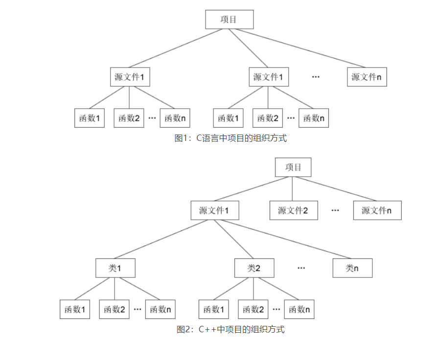
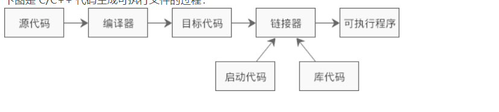

# 引言

## C和C++的关系

### **血缘关系**

> C++是在C的基础上增加面向对象的内容

### **三种编程方式：**

C++支持面向过程，面向对象，泛型编程，而C语言仅仅支持面向过程

1. 面向过程
2. 面向对象
3. 泛型编程

### 面向对象编程的由来

c语言的项目组织方式：

> 重复使用或具有某项功能的代码封装为一个函数，相关功能的函数聚集在一个源文件内，提供头文件后，就是一个模块。

C++的项目组织方式：

> 将相关联的函数和变量封装在一个类中，将一个类或者多个类封装在一个源文件中。
>
> 相比C语言，增加一层类的封装。

面向对象编程在**代码执行效率**上绝对没有任何优势，它的主要目的是方**便程序员组织和管理代码，快速梳理编程思路**，带来编程思想上的革新。



## C++中的类和对象

### c语言结构体

+ 结构体是一种构造类型(用户自定义的复杂数据类型)，可以包含若干成员变量，每个成员变量的类型可以不同；可以通过结构体来定义结构体变量，每个变量拥有相同的性质.

### C++对象

+ C++ 中的类也是一种构造类型(用户自定义的复杂数据类型)，源于C进行了一些扩展(**C结构体的升级版本**)，类的成员不但可以是变量，还可以是函数；通过类定义出来的变量也有特定的称呼，叫做“对象”

### C++类和对象的关系

1. 类是图纸，不占内存空间。
2. 对象的实际的产品，占用内存空间。

+ 通过类创造对象的过程称为**实例化**，因此对象是类的实例

+ 类是对象的抽象，对象是类的实例

### **c语言结构体，C++结构体，C++类的区别**：

1. c结构体：只能包含属性，不能包含函数
2. C++结构体：包含属性，包含函数，访问权限和继承方式默认公有，不可表示模板类型
3. C++类：包含属性，包含函数，访问权限和继承方式默认公有，可以表示模板类型

## C++程序的编译运行

### C或C++代码的编译运行过程



+ 源代码（.cpp或者.c文件）通过编译器编译成目标代码.o文件，通过链接器，链接到相关启动代码和库代码，最终生成可执行程序（.exe）文件。

### **常见的C++源文件**

| 编译器 | Microsoft Visual C++ | GCC（GNU C++）       | Borland C++ | UNIX       |
| ------ | -------------------- | -------------------- | ----------- | ---------- |
| 后缀   | cpp、cxx、cc         | cpp、cxx、cc、c++、C | cpp         | C、cc、cxx |

### 常见的g++命令

**1.gcc命令**

+ gcc编译链接c程序

  1. 编译单个源文件`gcc main.c`
  2. 编译多个源文件`gcc main.c module.c`

+ gcc编译链接C++程序

  **gcc默认链接c的库，只有添加了-lstdc++选项才会使用C++的库**

  1. gcc编译单个源文件`gcc main.cpp -|stdc++`
  2. gcc 编译多个源文件`gcc mian.cpp module,cpp -|stdc++`

**2.g++命令**

g++命令用于专门编译C++程序

+ 编译单个文件`g++ main.cpp`
+ 编译多个文件`g++ main.cpp module.cpp`
+ 指定输出可执行文件名称`g++ main.cpp -o demo`

## 头文件和命名空间

### 声明和定义

+ 声明：声明只是**声明这个符号的存在**，即告诉编译器，这个符号是在其他文件中定义的，我这里先用着，你链接的时候再到别的地方去找找看它到底是什么吧。只需要写出这个符号的原型。
+ 定义："定义"就是把**一个符号完完整整地描述出来**：它是变量还是函数，返回什么类型，需要什么参数等等。定义的时候要按 C++ 语法完整地定义一个符号（变量或者函数）。
+ **程序中，一个变量可以被声明多次，但是只能定义一次。**

### 头文件和源文件的关系

+ 源文件：(.cpp)文件，里面包含C++的源代码，需要被编译，
+ 头文件：(.h)文件，里面也是包含C++的源代码，包含所有函数的声明，且不需要被编译。cpp文件通过include命令直接将.h文件的内容合并到cpp文件中。当cpp文件 被编译时，h文件的内容发挥作用

### c和C++头文件的变化

+ c语言头文件（**保持c的兼容性，官方允许使用**）：stdio.h,stdlib.h,string.h。
+ 具有C库功能的c++头文件，cstdio,cstdlib,cstring.内容同c头文件，但是**在标准命名空间std中**。
+ 旧版C++头文件（**没有命名空间概念,官方反对使用**）：iostream.h  fstream.h  complex.h  头文件仍然以`.h`为后缀，它们所包含的类、函数、宏等都是全局范围
  + 头文件内容不在标准命名空间std中
+ 新版C++头文件（**拥有命名空间概念，官方标准**）:iostream,fsteam   计划重新编写库，将类、函数、宏等都统一纳入一个命名空间，这个命名空间的名字就是`std`。std 是 s[tan](http://c.biancheng.net/ref/tan.html)dard 的缩写，意思是“标准命名空间”。
  + 头文件内容在标准命名空间std中，相比旧版删除h，

### 命名空间

+ 命名空间（名字空间，名称空间），解决不同的人合作开发时，**命名冲突的问题**。

**语法格式**：包含（变量，函数，类，typedef，def）等内容

```c++
namespace name{
    //variables, functions, classes
}
```

**变量使用**

+ 析符，`Li::fp = fopen("one.txt", "r");  //使用小李定义的变量 fp`

+ 针对变量使用using关键字，using 声明以后的程序中如果出现了未指明命名空间的 fp，就使用 Li::fp；但是若要使用小韩定义的 fp，仍然需要 Han::fp。

  ```c++
  using Li::fp;
  fp = fopen("one.txt", "r");  //使用小李定义的变量 fp
  Han :: fp = fopen("two.txt", "rb+");  //使用小韩定义的变量 fp
  ```

+ **声明整个命名空间**:

  ```c++
  using namespace Li;
  fp = fopen("one.txt", "r");  //使用小李定义的变量 fp
  Han::fp = fopen("two.txt", "rb+");  //使用小韩定义的变量 fp
  ```

**作用范围**

+ 作用于func函数内部（**推荐，减少命名冲突）**

  ```c++
  #include <iostream>
  void func(){
      //必须重新声明
      using namespace std;
      cout<<"http://c.biancheng.net"<<endl;
  }
  ```

+ 作用于全局(**方便)**

  ```C++
  #include <iostream>
  void func(){
      //必须重新声明
      using namespace std;
      cout<<"http://c.biancheng.net"<<endl;
  }
  ```

## 输入和输出

+ c语言使用scanf 和 printf 带格式的输入输出
+ C++使用cin和cout进行输入和输出
  + cin和cout是C++的内置对象（**标准库开发者提前创建**），不是关键字，位于iostream头文件中
  + cout<<(左移运算符),cin>>(右移运算符),这两个运算符可以自行**分析所处理的数据类型**，因此无需像使用 scanf 和 printf 那样给出格式控制字符串。
  + 连续cin时，`cin>>a>>b`a和b的输入时使用**空格分离**。

## 变量定义位置

+ c89要求局部变量的位置必须在**函数的开头**
+ c99取消变量定义位置的限制，但VC\VS（某些编译器下不会支持）**下会编译报错**
+ C++要求变量在**使用前定义即可**，对定义位置没有要求。

## bool变量

+ c语言使用int类型，**0表示假，非0表示真**
+ C++使用专门的bool类型表示，占用1个字节，**true表示真(非0），false（0）表示假**
  + C++输出bool变量时，**结果为0或者1**，而不是true或者false，但是可以用true或者false显示对bool变量赋值

## new和delete

+ c语言动态内存分配

  ```c++
  动态分配内存用 malloc() 函数，释放内存用 free() 函数
  int *p = (int*) malloc( sizeof(int) * 10 );  //分配10个int型的内存空间
  free(p);  //释放内存
  ```

+ C++动态内存分配

  ```c++
  单个内存分配
  int *p = new int;  //分配1个int型的内存空间
  delete p;  //释放内存
  
  连续内存分配
  int *p = new int[10];  //分配10个int型的内存空间
  delete[] p;
  ```

  **new[] 分配的内存需要用 delete[] 释放**

+ C和C++的动态内存分配均是在**堆上进行**，且new和delete同时出现，malloc和free同时出现，**并且c和c++不要混用**

## 内联函数

**函数调用机制**：

+ C++程序的执行过程可以被当做多个函数的调用过程，从main函数开始，到main函数结束；然而函数的调用将会产生开销，因此短代码的函数开销不可忽略，而长函数的函数开销可以忽略。
  + 函数的调用开销：程序在执行一个函数之前需要做一些准备工作，要将**实参、局部变量、返回地址以及若干寄存器**都压入栈中，然后才能执行函数体中的代码；函数体中的代码执行完毕后还要清理现场，将之前压入栈中的数据都出栈，才能接着执行函数调用位置以后的代码

**内联函数**：为了消除函数调用的**时空开销**，C++ 提供一种提高效率的方法，即在编译时将函数调用处用函数体替换

```c++
#include <iostream>
using namespace std;
//内联函数，交换两个数的值
inline void swap(int *a, int *b){
    int temp;
    temp = *a;
    *a = *b;
    *b = temp;
}
int main(){
    int m, n;
    cin>>m>>n;
    cout<<m<<", "<<n<<endl;
    swap(&m, &n);
    cout<<m<<", "<<n<<endl;
    return 0;
}
```

+ 标识内联函数，使用inline关键字修饰
+ 内敛函数省略函数原型，直接将函数的整个定义放入提供函数原型的地方。(**声明时进行定义，不需要将声明的定义分离**)
+ 函数**定义时使用inline有效**，**声明inline编译器无视**
+ 编译器对是否内联有自己的想法，程序员仅仅是提供建议，最终是否内联还是取决于编译器

# 1  函数

**函数调用机制：**

1. 准备工作：将实参，局部变量，返回地址，若干寄存器，入栈
2. 执行代码
3. 清理现场
4. 将入栈变量出栈，

## 1.1 函数参数

### 1.1.1 默认参数

**注意事项：**

1. 参数可以是常量，也可以是表达式
2. 默认参数只可以放到形参列表后，而且一旦为某个形参指定了默认值，那么它后面的所有形参都必须有默认值
3. 函数声明有默认值，实现时不可以有默认值。**编译器禁止声明和定义时同时定义缺省参数值**

```cpp
#include<iostream>
using namespace std;

//常量默认参数
void func(int n, float b=1.2, char c='@'){
    cout<<n<<", "<<b<<", "<<c<<endl;
}
//表达式默认参数
float d = 10.8;
void func(int n, float b=d+2.9, char c='@'){
    cout<<n<<", "<<b<<", "<<c<<endl;
}

//2. 如果函数声明有默认值，函数实现的时候就不能有默认参数
int func2(int a = 10, int b = 10);
int func2(int a, int b) {
	return a + b;
}

int main(){
    //为所有参数传值
    func(10, 3.5, '#');
    //为n、b传值，相当于调用func(20, 9.8, '@')
    func(20, 9.8);
    //只为n传值，相当于调用func(30, 1.2, '@')
    func(30);

    return 0;
}
```

### 1.2.2 占位参数

C++中函数的形参列表里可以有占位参数，用来做占位，调用函数时必须填补该位置

**语法：** `返回值类型 函数名 (数据类型){}`

在现阶段函数的占位参数存在意义不大，但是后面的课程中会用到该技术

**示例：**

```cpp
//函数占位参数 ，占位参数也可以有默认参数
void func(int a, int) {
	cout << "this is func" << endl;
}

int main() {

	func(10,10); //占位参数必须填补

	system("pause");

	return 0;
}
```


## 1.2 函数重载

### 1.2.1 函数重载规则

**重载条件：**

1. 函数名称相同
2. 参数列表不同。参数列表不同包括参数的个数不同、类型不同或顺序不同。
3. 引用可以作为重载条件加上const；**可基于函数的引用形参是指向 const 对象还是指向非 const 对象**
4. const 修饰函数可实现重载，普通函数和常函数。

**注意事项：**

1. 参数名称不同不可以作为重载条件。
2. 返回值类型不可以作为重载条件。

**本质：**

​		**重载决议**：C++代码在编译时会根据参数列表对函数进行重命名，

​			例如`void Swap(int a, int b)`会被重命名为`_Swap_int_int`，`void Swap(float x, float y)`会被重命名为`_Swap_float_float`。当发生函数调用时，编译器会根据传入的实参去逐个匹配，以选择对应的函数，如果匹配失败，编译器就会报错。

> **本质**：函数重载仅仅是语法层面的，本质上它们还是不同的函数，占用不同的内存，入口地址也不一样。

### 1.2.2 重载的二义性

二义性是指在编译过程中无法找出最匹配的函数，或者说编译器在函数匹配过后还是有多个函数满足要求，无法确定该执行那一个引发的错误。

1.参数数目引发的二义性（默认参数问题）

```cpp
int get(){
    return 5;
}
int get(int a = 5){
    return a;
}
//调用get()
//不给参数和有默认参数会造成歧义。
```

2.参数隐式转换引发二义性

可以使用explict关键字禁用隐式转换

```cpp
int get(int m){
    return m;
}
 
long get(long m){
    return m;
}
//double d = 1.234;
//调用get(d);double既可以隐式转换未long，也可以是int,或者说一般的数值类型之间都可以进行隐式类型转换，故无法确定那一个更加匹配。
```

3.引用作为重载条件

```cpp
void func(int &a)
{
	cout << "func (int &a) 调用 " << endl;
}

void func(const int &a)
{
	cout << "func (const int &a) 调用 " << endl;
}
int a=10;
func(a);调用1 1.是变量可读可写   2.是可写  无二意性
func(10);调用2  1. int &a=10;语法错误，引用必须指向一个内存
    			2. const int a=10;合法，创建临时向量 存储10，然后引用指向。
```


## 1.3 内联函数

**背景：**当函数体代码比较多，函数调用机制时间可以被忽略

​			当函数体代码比较少，函数调用机制时间相对较长，不可忽略。

**解决方法：内联函数**

​		消除时空开销，提高效率。在函数编译时将内联函数调用处，直接用内联函数的代码替换。如此，便不需要函数调用。

**注意事项：**

1. 一般在函数定义处使用inline关键字。声明处inline关键字会被忽略。
2. 类中，头文件内实现的函数默认为内联函数。
3. 一般函数体小的函数声明为内联函数
4. 给函数加上inline只是对编译器的建议，编译器自身有机制判断是否内联。

**缺点：**

​		多次使用内联会使主函数函数体变大。

**优点：**

​		内联函数，没有函数调用，提高效率

```cpp
#include <iostream>
using namespace std;
//声明处inline关键字会被忽略
inline void swap(int*,int*);

//内联函数，交换两个数的值
inline void swap(int *a, int *b){
    int temp;
    temp = *a;
    *a = *b;
    *b = temp;
}

int main(){
    int m, n;
    cin>>m>>n;
    cout<<m<<", "<<n<<endl;
    swap(&m, &n);
    cout<<m<<", "<<n<<endl;

    return 0;
}
```

### 1.3.1 内联函数代替带参数的宏

**宏的调用机制**是字符串的替换，而不是按值传递。

当n = 9 时，`SQ(n) = 81`

`如果把SQ(n)`换成`SQ(n+1)却得不到100，因为`sq = n+1*n+1;

```cpp
#include <iostream>
using namespace std;
#define SQ(y) y*y
int main(){
    int n, sq;
    cin>>n;
    sq = SQ(n+1);
    cout<<sq<<endl;
    return 0;

}
```

使用内联函数时：

直接将结果计算，返回的是一个值，而不是表达式。不容易出错。

### 1.3.2 规范使用，内联本质

1. 内联函数不需要使用声明，直接定义在函数声明的地方。如类头文件中。

**内联函数和普通函数的区别**

内联函数虽然叫做函数，在定义和声明的语法上也和普通函数一样。

1. 函数是一段可以重复使用的代码，它位于虚拟地址空间中的代码区，也占用可执行文件的体积
2. **内联函数的代码在编译后就被消除**了，不存在于虚拟地址空间中，没法重复使用。

# 2 C++引用

## 2.1 引用定义和使用

**背景：**

 char、bool、int、float 等基本类型的数据，内存小，内存拷贝快速。

数组、结构体、对象是一系列数据的集合，《聚合类型》数据的数量没有限制，可能很少，也可能成千上万，对它们进行频繁的内存拷贝可能会消耗很多时间，拖慢程序的执行效率。

**定义：**引用就是变量的别名，和原来变量名一样。

**注意事项：**

1. 引用必须在定义时初始化，
2. 不能二次初始化，但可以再被赋值，类似常量。<引用指向必须从一而终，不能再引用其它数据>
3. 引用和被引用的对象地址相同，引用就是变量别名，没啥区别。

```cpp
#include <iostream>
using namespace std;

int main() {
    int a = 99;
    int b=88;
    int &r = a;
    int &r=b;//，引用无法再初始化
    r=b;//正确，r还是a的别名，但是相当于a=r=88;
    cout << a << ", " << r << endl;
    cout << &a << ", " << &r << endl;

    return 0;
}
运行结果：
99, 99
0x28ff44, 0x28ff44
```

**1.引用作为函数参数**

​		类似指针，可以修改实参。

​		通过引用参数产生的效果同按地址传递是一样的。引用的语法更清楚简单。

**2.引用作为参数返回值**

  		1. 作为左值
  			2. 不可以返回局部变量引用，因为局部变量已经被销毁。

## 2.2 常量引用

**作用：**常量引用主要用来修饰形参，防止误操作

**本质**： 

将常引用绑定到临时数据时，

```C++
const int &A;
```

**编译器会为临时数据创建一个新的、无名的临时变量，并将临时数据放入临时变量中，然后再将引用绑定到临时变量**。传参数时创建临时变量，里面通过引用的改变都是对临时变量的改变


**注意事项：**

1. 普通引用不能通过常量初始化。引用需要一个合法的内容空间，然后打上别名。
2. 常量引用可以通过常量初始化。编译器创建临时变量

```cpp
//引用使用的场景，通常用来修饰形参
void showValue(const int& v) {
	//v += 10;
	cout << v << endl;
}
int main() {

	//int& ref = 10;  不合法；引用本身需要一个合法的内存空间，因此这行错误
	//加入const就可以了，编译器优化代码创建临时变量，int temp = 10; const int& ref = temp;
	const int& ref = 10;

	//ref = 100;  //加入const后不可以修改变量
	cout << ref << endl;

	//函数中利用常量引用防止误操作修改实参
	int a = 10;
	showValue(a);

	system("pause");

	return 0;
}
```

## 2.3 引用本质

​		从概念上讲。指针从本质上讲就是存放变量地址的一个变量，在逻辑上是独立的，它可以被改变，包括其所指向的地址的改变和其指向的地址中所存放的数据的改变。

​		而引用是一个别名，它在逻辑上不是独立的，它的存在具有依附性，所以引用必须在一开始就被初始化，而且其引用的对象在其整个生命周期中是不能被改变的（自始至终只能依附于同一个变量）

+ 指针参数传递本质上是值传递，它所传递的是一个地址值。函数内对指针的任何操作都是基于地址值，假如地址值改变，则实参无影响。
+  引用参数传递过程中，被调函数的形式参数也作为局部变量在栈中开辟了内存空间，但是这时存放的是由主调函数放进来的实参变量的地址。被调函数对形参（本体）的任何操作都被处理成间接寻址。

区别：

| 指针 | 变量，独立于变量，可变，可空，替身，无类型检查 |
| ---- | ---------------------------------------------- |
| 引用 | 别名，依赖于变量，不变，非空，本体，有类型检查 |

## 2.4 引用重载

可基于函数的引用形参是指向 const 对象还是指向非 const 对象

```cpp
class D
{
public:
void f(int &i) { std::cout<<“3”;}; //函数3;
void f(const int &i){ std::cout<<“4” ;};//函数4
};
int main()
{
    const int a=0;
    f(a)//调用const
    int a=0;
    f(a)//调用非const
}
```


# 3 类和对象

## 3.1 类的定义和对象的创建

**类的声明和成员函数的定义都是类定义的一部分。**

在实际开发中，我们通常将类的声明放在头文件中，而将成员函数的定义放在源文件中。

```cpp
类的声明
class Student{
public:
    //成员变量
    char *name;
    int age;
    float score;
    //成员函数
    void say(){
        cout<<name<<"的年龄是"<<age<<"，成绩是"<<score<<endl;
    }
};
//函数定义
void Student::say(){
    cout<<name<<"的年龄是"<<age<<"，成绩是"<<score<<endl;
}
```

> 类只是一个模板（Template），**编译后不占用内存空间，所以在定义类时不能对成员变量进行初始化**，因为没有地方存储数据。只有在创建对象以后才会给成员变量分配内存，这个时候就可以赋值了。

**对象创建和使用：**

1.在栈上创建对象：栈内存由程序自动管理

```cpp
Student stu;
stu.成员变量;
stu.成员函数（）
```

使用一般的创建对象方法都是在栈上创建对象。

在栈上创建出来的对象都有一个名字，比如 stu，使用指针指向它不是必须的。

2.在堆上创建对象：堆上的内存由程序员手动管理

```cpp
Student *pstu=new Student;
pstu—>成员变量;
pstu->成员函数（）
```

使用 new 在堆上创建出来的对象是匿名的，没法直接使用，必须要用一个指针指向它，再借助指针来访问它的成员变量或成员函数。

### 3.1.1 常对象

**常对象：**

一旦将对象定义为常对象之后，就只能调用类的 const 成员（包括 const 成员变量和 const 成员函数）了。

常对象：

```cpp
const  class  object(params);
class const object(params);

```

常对象指针(指针指向的是一个常对象)

```cpp
const class *p = new class(params);
class const *p = new class(params);
```


## 3.2 成员变量和成员函数讲解

**1.类成员变量和普通变量的区别：**

类成员变量在定义后不占内存，普通变量定义后占内存空间

> 成员变量一般以m_开头

**2.类成员函数和普通函数的区别：**

类成员函数依赖于类，作用域为类内

普通函数是独立的，作用域为全局。

**3.域解析符：：**

用来连接类名和函数名，指明当前函数属于哪个类

### 3.2.1 类内定义成员函数和类外定义成员函数的区别（内联函数）

```cpp
class Student{
public:
    char *name;
    int age;
    float score;

    void say();  //内联函数声明，可以增加 inline 关键字，但编译器会忽略
};

//函数定义
inline void Student::say(){
    cout<<name<<"的年龄是"<<age<<"，成绩是"<<score<<endl;
}
```

注意：

1. **类体内的定义成员函数默认为内联函数**。
2. 类内和类外同时加上inline，但是类内的inline会被忽略。

**使用技巧：**

1. 普通函数类内声明，类外定义。
2. 内联函数，直接定义在类内部。

### 3.2.2 static静态成员变量详解

**定义：**

静态成员变量是一种特殊的成员变量，它被关键字`static`修饰。

**作用：**

对象之间数据共享时用到，用于多个成员之间共享数据。

```cpp
class Student{
public:
    Student(char *name, int age, float score);
    void show();
public:
    static int m_total;  //静态成员变量声明
private:
    char *m_name;
    int m_age;
    float m_score;
};
int Student::m_total = 0;//类外初始化定义
```

内存：位于全局区，编译时并类外初始化后分配内存

static 成员变量的内存既不是在声明类时分配，也不是在创建对象时分配，而是在（类外）初始化《应该在编译阶段》时分配。反过来说，没有在类外初始化的 static 成员变量不能使用。

**注意事项：**

1. 静态变量和普通成员变量的区别static变量和对象的创建无关。
2. 静态成员变量必须初始化，而且初始化只能在类外进行。
3. 初始化可以赋初值，也可以不赋初值，默认初值为0；全局数据区的默认初值为0，动态数据区（堆区和栈区）的变量的默认值不确定。
4. 静态成员变量既可以通过对象名访问，也可以通过类名访问，但要遵循 private、protected 和 public 关键字的访问权限限制。当通过对象名访问时，对于不同的对象，访问的是同一份内存。
5. 声明时要加 static，在定义时不能加 static

### 3.23 static静态成员函数讲解

内存：位于代码区

根本区别：

普通成员函数：普通成员函数有 this 指针，可以访问所有成员（成员变量和成员函数）

静态成员函数：静态成员函数没有 this 指针，只能访问静态成员（静态成员变量和静态成员函数）

**本质：**

编译器在编译一个普通成员函数时，会隐式地增加一个形参 this，并把当前对象的地址赋值给 this，

而静态成员函数可以通过类来直接调用，编译器不会为它增加形参 this，它不需要当前对象的地址。

**注意事项：**

1. 声明时要加 static，在定义时不能加 static

### 3.2.4 const成员变量和常成员函数

**初始化：**

初始化 const 成员变量只有一种方法，就是通过构造函数的初始化列表。

**const常成员函数：**

const 成员函数可以使用类中的所有成员变量，但是**不能修改它们的值**，这种措施主要还是为了保护数据而设置的。

一般get函数就会作为常成员函数

```cpp
class Student{
public:
    Student(char *name, int age, float score);
    void show();
    //声明常成员函数
    char *getname() const;
    int getage() const;
    float getscore() const;
private:
    char *m_name;
    int m_age;
    float m_score;
};
//定义常成员函数
char * Student::getname() const{
    return m_name;
}
int Student::getage() const{
    return m_age;
}
float Student::getscore() const{
    return m_score;
}
```

**const的位置区分**

- 函数开头的 const 用来修饰函数的返回值，表示返回值是 const 类型，也就是不能被修改，例如`const char * getname()`。
- 函数头部的结尾加上 const 表示常成员函数，这种函数只能读取成员变量的值，而不能修改成员变量的值，例如`char * getname() const`。

注意事项：**

需要强调的是，必须在成员函数的声明和定义处同时加上 const 关键字。

`char *getname() const`和`char *getname()`是两个不同的函数原型。

## 3.3 类的封装

封装是C++面向对象三大特性之一

封装的意义：

* 将属性和行为作为一个整体，表现生活中的事物
* 将属性和行为加以权限控制

**三权限：**

| 类别              | -类内        | 类外-          | -继承          |
| :---------------- | ------------ | -------------- | -------------- |
| public公共权限    | 类内可以访问 | 类外可以访问   | 子类可以访问   |
| protected保护权限 | 类内可以访问 | 类外不可以访问 | 子类可以访问   |
| private私有权限   | 类内可以访问 | 类外不可以访问 | 子类不可以访问 |

**类内不指明权限的话，默认权限为private。**

在类的内部（定义类的代码内部），无论成员被声明为 public、protected 还是 private，都是可以互相访问的，没有访问权限的限制。

在类的外部（定义类的代码之外），只能通过对象访问成员，并且通过对象只能访问 public 属性的成员，不能访问 private、protected 属性的成员。

```cpp
#include <iostream>
using namespace std;

//类的声明
class Student{
private:  //私有的
    char *m_name;
    int m_age;
    float m_score;

public:  //共有的
    void setname(char *name);
    void setage(int age);
    void setscore(float score);
    void show();
};

//成员函数的定义
void Student::setname(char *name){
    m_name = name;
}
void Student::setage(int age){
    m_age = age;
}
void Student::setscore(float score){
    m_score = score;
}
void Student::show(){
    cout<<m_name<<"的年龄是"<<m_age<<"，成绩是"<<m_score<<endl;
}

int main(){
    //在栈上创建对象
    Student stu;
    stu.setname("小明");
    stu.setage(15);
    stu.setscore(92.5f);
    stu.show();

    //在堆上创建对象
    Student *pstu = new Student;
    pstu -> setname("李华");
    pstu -> setage(16);
    pstu -> setscore(96);
    pstu -> show();

    return 0;
}
```

**注意事项：**

## 3.4 C++ 对象内存模型


编译器会将成员变量和成员函数分开存储：分别为每个对象的成员变量分配内存，但是所有对象都共享同一段函数代码。

对象位置：（主要存储非静态成员变量）堆区或者栈区

​			内存：空对象占用一个内存（主要为了区分不同的空对象）

​						普通对象根据内部非静态变量计算内存。

函数位置：代码区

C++在程序执行时，将内存大方向分为4个区域

+ 代码区：存放函数体的二进制代码，由操作系统进行管理
+ 全局区：存放**全局变量**和**静态变量**和常量(字符串常量和全局常量)
+ 栈区：有编译器自动分配释放，存放函数的参数值和局部变量(还包括局部常量)
+ 堆区：由程序员分配和释放，若程序员不释放，则程序运行结束由操作系统回收。


**内存四区的意义**

不同的区域有不同的生命周期

**1.1程序运行前**

​	在程序编译后，生成.exe的可执行程序，未执行该程序前分为两个区域

​	代码区：

​		存放CPU执行的机器指令

​		代码区共享：频繁执行的程序只需要保存一份代码即可

​		代码区只读：指令无法修改

​	全局区：（包括静态区和常量区）

​		**静态区**：存放全局变量和静态变量

​		**常量区**：字符串常量和其他常量。

​		该区域数据在程序结束后由操作系统释放。

**1.2程序运行时**

**栈区**

​	由操作系统管理，由编译器分配释放，主要包括：**函数的参数值，返回值和局部变量**。

​	函数运行结束后，系统统一收回分配的栈内存。

> **函数返回时避免返回局部变量的地址和局部变量的引用**


**堆区**

​	堆是由malloc/new分配的内存块，使用free/delete来释放内存，**堆的申请释放工作由程序员控制**，容易产生内存泄漏 .


## 3.5 C++函数编译原理和成员函数实现

**C语言编译：**C语言中的函数在编译时名字不变，或者只是简单的加一个下划线`_`

**C++函数编译：**C++中的函数在编译时会根据命名空间、类、参数签名等信息进行重新命名，形成新的函数名。这个重命名的过程是通过一个特殊的算法来实现的，称为名字编码

```cpp
    void Demo::display(){
        cout<<a<<endl;
        cout<<b<<endl;
    }
    void new_function_name(const Demo *this){
        //通过指针p来访问a、b
        cout<<this->a<<endl;
        cout<<this->b<<endl;
    }
```

成员函数最终被编译成与对象无关的普通函数，如果函数体中没有成员变量，那问题就很简单，不用对函数做任何处理，直接调用即可。

编译成员函数时要额外添加一个参数（this指针，默认参数），把当前对象的指针传递进去，通过指针来访问成员变量。

## 3.6 构造函数

对象的**初始化和清理**也是两个非常重要的安全问题

​	一个对象或者变量没有初始状态，对其使用后果是未知

​	同样的使用完一个对象或变量，没有及时清理，也会造成一定的安全问题


c++利用了**构造函数**和**析构函数**解决上述问题，这两个函数将会被编译器自动调用，完成对象初始化和清理工作。

对象的初始化和清理工作是编译器强制要我们做的事情，因此如果**我们不提供构造和析构，编译器会提供**

**编译器提供的构造函数和析构函数是空实现。**


* 构造函数：主要作用在于创建对象时为对象的成员属性赋值，构造函数由编译器自动调用，无须手动调用。
* 析构函数：主要作用在于对象**销毁前**系统自动调用，执行一些清理工作。


### 3.6.1 构造函数的重载

重载构造函数和重载普通函数类似。

1. 提供构造函数后编译器将不会自动提供空构造的构造函数

### 3.6.2 默认构造函数

不提供构造函数，编译器将提供一个默认的空构造函数

最后需要注意的一点是，调用没有参数的构造函数也可以省略括号。

在栈上创建对象可以写作`Student stu()`或`Student stu`，

在堆上创建对象可以写作`Student *pstu = new Student()`或`Student *pstu = new Student`，它们都会调用构造函数 Student()。

### 3.6.3 初始化列表

```cpp
#include <iostream>
using namespace std;
class Demo{
private:
    int m_a;
    int m_b;
public:
    Demo(int b);
    void show();
};
Demo::Demo(int b): m_b(b), m_a(m_b){ }
void Demo::show(){ cout<<m_a<<", "<<m_b<<endl; }
int main(){
    Demo obj(100);
    obj.show();
    return 0;
}
```

构造函数运行分为两个部分：

1. 运行初始化列表
2. 运行函数体内部。

成员变量的初始化顺序与初始化列表中列出的变量的顺序无关，它只与成员变量在类中声明的顺序有关。

即：声明时顺序为m_a，m_b。则初始化的顺序就是先m_a赋值，然后m_b赋值，无论他们在初始化列表里的先后顺序是啥。

**初始化const变量**

初始化 const 成员变量的唯一方法就是使用初始化列表。

```cpp
class VLA{
private:
    const int m_len;
    int *m_arr;
public:
    VLA(int len);
};
//必须使用初始化列表来初始化 m_len
VLA::VLA(int len): m_len(len){
    m_arr = new int[len];
}
```

### 3.6.4 成员对象和封闭类，封闭类初始化顺序

**成员对象**：一类的成员变量是另一个类的对象
**封闭类**：包含成员对象的类

定义封闭类的构造函数时，添加初始化列表：
类名：：构造函数（参数表）：成员变量1（参数表），成员变量2（参数表）{ …….}
成员对象初始化列表中的参数：

```cpp
#include<stdio.h>
#include<iostream>
using namespace std;
class ctype{
    private :
        int radius;
        int width;
    public :
        ctyre(int r,int w):radius(r),width(w){}

};
class cengine{

};
class ccar{
    private:
        int price;
        ctype tpre;
        cengine engine;
    public:
        ccar(int p,int tr,int w):price(p),tyre(tr,w){

        }
};

```

- 当封闭类对象生成时
  - 首先，执行所有成员对象的构造函数
  - 然后，执行封闭类的构造函数
- 成员对象的构造函数调用顺序
  - 和成员对象在类中的说明顺序一致
  - 与在成员初始化列表中出现的顺序无关
- 当封闭类的对象消亡时
  - 先执行封闭类的析构函数
  - 然后执行成员对象的析构函数

**注意：**

​		倘若，ccar使用默认的构造函数，那么出现编译错误。

原因：

​		car.type()将无法初始化，因为cartype重载了构造函数，但是car没有参数，无法调用。

car.engine()使用默认的构造函数可以正常调用。

### 3.6.5 this指针

**定义：**

this 是 [C++](http://c.biancheng.net/cplus/) 中的一个关键字，也是一个 const [指针](http://c.biancheng.net/c/80/)，它指向当前对象，通过它可以访问当前对象的所有成员。


```cpp
void show(this,int a)//this 是默认参数，不需要指定
{
}
```

this 实际上是成员函数的一个形参，在调用成员函数时将对象的地址作为实参传递给 this。不过 this 这个形参是隐式的，它并不出现在代码中，而是在编译阶段由编译器默默地将它添加到参数列表中。

this，它是成员函数和成员变量关联的桥梁。通过this指针，来访问当前对象的成员变量。

**注意事项：**

- this 是 const 指针，它的值是不能被修改的，一切企图修改该指针的操作，如赋值、递增、递减等都是不允许的。
- this 只能在成员函数内部使用，用在其他地方没有意义，也是非法的。
- 只有当对象被创建后 this 才有意义，因此不能在 static 成员函数中使用（后续会讲到 static 成员）。

## 3.7 析构函数

析构函数（Destructor）也是一种特殊的成员函数，没有返回值，不需要程序员显式调用（程序员也没法显式调用），而是在销毁对象时自动执行。构造函数的名字和类名相同，而析构函数的名字是在类名前面加一个`~`符号。

```cpp
#include <iostream>
using namespace std;
class VLA{
public:
    VLA(int len);  //构造函数
    ~VLA();  //析构函数
public:
    void input();  //从控制台输入数组元素
    void show();  //显示数组元素
private:
    int *at(int i);  //获取第i个元素的指针
private:
    const int m_len;  //数组长度
    int *m_arr; //数组指针
    int *m_p;  //指向数组第i个元素的指针
};
VLA::~VLA(){
    delete[] m_arr;  //释放内存
}
```

**析构函数调用的时机：**

析构函数在对象被销毁时调用，而对象的销毁时机与它所在的内存区域有关。

1. 在所有函数之外创建的对象是全局对象，它和全局变量类似，位于内存分区中的全局数据区，程序在结束执行时会调用这些对象的析构函数。

2. 在函数内部创建的对象是局部对象，它和局部变量类似，位于栈区，函数执行结束时会调用这些对象的析构函数。

3. new 创建的对象位于堆区，通过 delete 删除时才会调用析构函数；如果没有 delete，析构函数就不会被执行。

## 3.8 友元函数

**背景：**

在 [C++](http://c.biancheng.net/cplus/) 中，一个类中可以有 public、protected、private 三种属性的成员，通过对象可以访问 public 成员，只有本类中的函数可以访问本类的 private 成员。

借助友元（friend），可以使得其他类中的成员函数以及全局范围内的函数访问当前类的 private 成员。

使用方法：类内声明加上friend，类外定义。

友元函数可以访问当前类中的所有成员，包括 public、protected、private 属性的。

### 3.8.1 非成员函数声明友元（全局函数）

友元函数不同于类的成员函数，在友元函数中不能直接访问类的成员，必须要借助对象

```cpp
#include <iostream>
using namespace std;
class Student{
public:
    Student(char *name, int age, float score);
public:
    friend void show(Student *pstu);  //将show()声明为友元函数
private:
    char *m_name;
    int m_age;
    float m_score;
};
Student::Student(char *name, int age, float score): m_name(name), m_age(age), m_score(score){ }
//非成员函数
void show(Student *pstu){
    cout<<pstu->m_name<<"的年龄是 "<<pstu->m_age<<"，成绩是 "<<pstu->m_score<<endl;
}
```

### 3.8.2 将其他类的成员函数声明为友元

```cpp
#include <iostream>
using namespace std;
class Address;  //提前声明Address类
//声明Student类
class Student{
public:
    Student(char *name, int age, float score);
public:
    void show(Address *addr);
private:
    char *m_name;
    int m_age;
    float m_score;
};
//声明Address类
class Address{
private:
    char *m_province;  //省份
    char *m_city;  //城市
    char *m_district;  //区（市区）
public:
    Address(char *province, char *city, char *district);
    //将Student类中的成员函数show()声明为友元函数
    friend void Student::show(Address *addr);
};
```

**提前声明**：

一般情况下，类必须在正式声明之后才能使用；但是某些情况下（如上例所示），只要做好提前声明，也可以先使用。

**类的提前声明的使用范围是有限的，不可以直接使用提前声明定义对象。**

> 如果在上面程序的第4行之后增加如下所示的一条语句，编译器就会报错：
>
> Address addr; //企图使用不完整的类来创建对象
>
> 因为创建对象时要为对象分配内存，在正式声明类之前，编译器无法确定应该为对象分配多大的内存。编译器只有在“见到”类的正式声明后（其实是见到成员变量），才能确定应该为对象预留多大的内存。在对一个类作了提前声明后，可以用该类的名字去定义指向该类型对象的指针变量（本例就定义了 Address 类的指针变量）或引用变量（后续会介绍引用），因为指针变量和引用变量本身的大小是固定的，与它所指向的数据的大小无关。

### 3.8.3 友元类

将类 B 声明为类 A 的友元类，那么类 B 中的所有成员函数都是类 A 的友元函数，可以访问类 A 的所有成员，包括 public、protected、private 属性的。

```cpp
#include <iostream>
using namespace std;
class Address;  //提前声明Address类
//声明Student类
class Student{
public:
    Student(char *name, int age, float score);
public:
    void show(Address *addr);
private:
    char *m_name;
    int m_age;
    float m_score;
};
//声明Address类
class Address{
public:
    Address(char *province, char *city, char *district);
public:
    //将Student类声明为Address类的友元类
    friend class Student;
private:
    char *m_province;  //省份
    char *m_city;  //城市
    char *m_district;  //区（市区）
};
```

**注意事项：**

1. 友元的关系是单向的而不是双向的。如果声明了类 B 是类 A 的友元类，不等于类 A 是类 B 的友元类，类 A 中的成员函数不能访问类 B 中的 private 成员。
2. 友元的关系不能传递。如果类 B 是类 A 的友元类，类 C 是类 B 的友元类，不等于类 C 是类 A 的友元类。

**总结：**

一班没必要将整个类申明为友元类，直接申明友元函数比较安全。

## 3.9 C++类的作用域

一个类就是一个独立的作用域，这也是为什么在类外定义函数或静态变量需要加上类名和作用域符号(类似`void Complex::get() {}`)。

### 3.9.1作用域中重定义类型

在一个作用域内是可以自己去重定义一些类型的，比如下面这样：

```cpp
for (int i = 0; i < 3; i++) {
    typedef double D;
    for (int j = 0; j < 3; j++) {
        typedef char C;
    }
}
```

**类中重定义类型**
那么，类作为一个独立的作用域也就可以在类中定义一些自己的类型。

```cp
struct Node {
    typedef int Height;
    typedef int Width;
};

typename Node::Height h = 3;

```

### 3.9.2 类的编译顺序

- 从上到下依次编译变量，类型别名，函数声明及其返回值和形参；（**顺序编译**）
- 当上一步完成时，再编译成员函数的函数体。

因此：

1. 这也就解释了为什么**成员函数可以访问成员变量，即使这个变量是放在类的最末尾**(后于这个成员函数定义)。原因就是编译器先编译整个类(除成员函数的函数体)，然后再编译成员函数体。
2. 这还解释了为什么在**类中重命名一些类型尽量放到类的最开始处**。因为类中的除成员函数体之外都是顺序编译的，如果不把类型重命名放到使用该重命名的类型之前，那么编译器就不会认识这个重命名的类型。


### 3.9.3 成员函数变量名的查找顺序

```cpp
typedef int Height;

Height h = 5;

struct Node {
    void func(Height h) {
        h = 3;          // 1. 成员函数func 中的形参 h = 3
        this->h = 3;    // 2. 成员变量 h = 3
        Node::h = 3;    // 3. 成员变量 h = 3
        ::h = 3;        // 4. 全局范围中 h = 3
    }
private:
    Height h;
};
```

变量名的查找都是先到包含它最小的作用域查找，如果找不到，再到上一层的作用域查找，最后直到找到全局作用域。

**查找顺序：**

- 成员函数中的局部变量
- 类的成员变量（this指针，或者类作用域符号）
- 全局变量（全局作用域符号）

# 4 String的详解

## 4.1 初始化

```cpp
#include <iostream>
#include <string>
using namespace std;

int main(){
    string s1;
    string s2 = "c plus plus";
    string s3 = s2;
    string s4 (5, 's');
    return 0;
}
```

变量 s1 只是定义但没有初始化，编译器会将默认值赋给 s1，默认值是`""`，也即空字符串。

1. 与C风格的字符串不同，string 的结尾没有结束标志`'\0'`。

2. 与C风格的字符串不同，当我们需要知道字符串长度时，可以调用 string 类提供的 length() 函数

   ```cpp
   string s = "http://c.biancheng.net";
   int len = s.length();
   cout<<len<<endl;
   ```

   输出结果为`22`。由于 string 的末尾没有`'\0'`字符，所以 length() 返回的是字符串的真实长度，而不是长度 +1。

## 4.2 字符串的操作

### 4.2.1 转换为c风格的字符串

**c风格的字符串：**最后以\0 结尾。

 C++ 提供了 string 类来替代C语言中的字符串，但是在实际编程中，有时候必须要使用C风格的字符串（例如打开文件时的路径）我们提供了一个转换函数 c_str()，**该函数能够将 string 字符串转换为C风格的字符串，并返回该字符串的 const 指针（const char*）**

```cpp
string path = "D:\\demo.txt";
FILE *fp = fopen(path.c_str(), "rt");
```

### 4.2.2 输入输出

```cpp
int main(){
    string s;
    cin>>s;  //输入字符串
    cout<<s<<endl;  //输出字符串
    return 0;
}
运行结果：
http://c.biancheng.net  http://vip.biancheng.net↙
http://c.biancheng.net
```

虽然我们输入了两个由空格隔开的网址，但是只输出了一个，这是**因为输入运算符`>>`默认会忽略空格**，遇到空格就认为输入结束，所以最后输入的`http://vip.biancheng.net`没有被存储到变量 s。

### 4.2.3 访问[]

string 字符串也可以像C风格的字符串一样按照下标来访问其中的每一个字符。

1. string 字符串的起始下标仍是从 0 开始。
2. []的下标访问，可读可写。

```cpp
#include <iostream>
#include <string>
using namespace std;
int main(){
    string s = "1234567890";
    for(int i=0,len=s.length(); i<len; i++){
        cout<<s[i]<<" ";
    }
    cout<<endl;
    s[5] = '5';
    cout<<s<<endl;
    return 0;
}
```

### 4.2.4 字符串拼接

有了 string 类，我们可以使用`+`或`+=`运算符来直接拼接字符串，非常方便

+使用时：可以string+C风格，string+字符数组，string+单独字符

```cpp
#include <iostream>
#include <string>
using namespace std;

int main(){
    string s1 = "first ";
    string s2 = "second ";
    const char *s3 = "third ";
    char s4[] = "fourth ";
    char ch = '@';

    string s5 = s1 + s2;
    string s6 = s1 + s3;
    string s7 = s1 + s4;
    string s8 = s1 + ch;
    
    cout<<s5<<endl<<s6<<endl<<s7<<endl<<s8<<endl;

    return 0;
}
```

### 4.2.5 字符串的增删改查

#### **1.插入**

insert() 函数可以在 string 字符串中指定的位置插入另一个字符串，它的一种原型为：

`string& insert (size_t pos, const string& str);`

pos 表示要插入的位置，也就是下标；str 表示要插入的字符串，它可以是 string 字符串，也可以是C风格的字符串。

注意：insert() 函数的第一个参数有越界的可能，如果越界，则会产生运行时异常

```cpp
#include <iostream>
#include <string>
using namespace std;

int main(){
    string s1, s2, s3;
    s1 = s2 = "1234567890";
    s3 = "aaa";
    s1.insert(5, s3);
    cout<< s1 <<endl;
    s2.insert(5, "bbb");
    cout<< s2 <<endl;
    return 0;
}
运行结果：
12345aaa67890
12345bbb67890
```

#### **2.删除**

erase() 函数可以删除 string 中的一个子字符串。它的一种原型为：

`string& erase (size_t pos = 0, size_t len = npos);`

pos 表示要删除的子字符串的起始下标，len 表示要删除子字符串的长度。如果不指明 len 的话，那么直接删除从 pos 到字符串结束处的所有字符（此时 len = str.length - pos）。

注意：在 pos 参数没有越界的情况下， len 参数也可能会导致要删除的子字符串越界。但实际上这种情况不会发生，erase() 函数会从以下两个值中取出最小的一个作为待删除子字符串的长度：

- **len 的值；**
- **字符串长度减去 pos 的值**


```cpp
#include <iostream>
#include <string>
using namespace std;

int main(){
    string s1, s2, s3;
    s1 = s2 = s3 = "1234567890";
    s2.erase(5);
    s3.erase(5, 3);
    cout<< s1 <<endl;
    cout<< s2 <<endl;
    cout<< s3 <<endl;
    return 0;
}
运行结果：
1234567890
12345
1234590
```

#### **3.提取字符串**

substr() 函数用于从 string 字符串中提取子字符串，它的原型为：

`string substr (size_t pos = 0, size_t len = npos) const;`

pos 为要提取的子字符串的起始下标，len 为要提取的子字符串的长度。

**注意：**

系统对 substr() 参数的处理和 erase() 类似：

- 如果 pos 越界，会抛出异常；
- 如果 len 越界，会提取从 pos 到字符串结尾处的所有字符。

```cpp
#include <iostream>
#include <string>
using namespace std;

int main(){
    string s1 = "first second third";
    string s2;
    s2 = s1.substr(6, 6);
    cout<< s1 <<endl;
    cout<< s2 <<endl;
    return 0;
}
运行结果：
first second third
second
```

#### 4 字符串查找

##### 1 find函数

find() 函数用于在 string 字符串中查找子字符串出现的位置，它其中的两种原型为：

`size_t find (const string& str, size_t pos = 0) const;`
`size_t find (const char* s, size_t pos = 0) const;`

从pos位置开始向后找

第一个参数为待查找的子字符串，它可以是 string 字符串，也可以是C风格的字符串。第二个参数为开始查找的位置（下标）；如果不指明，**则从第0个字符开始查找**。

```cpp
#include <iostream>
#include <string>
using namespace std;

int main(){
    string s1 = "first second third";
    string s2 = "second";
    int index = s1.find(s2,5);
    if(index < s1.length())
        cout<<"Found at index : "<< index <<endl;
    else
        cout<<"Not found"<<endl;
    return 0;
}
运行结果：
Found at index : 6
```

找到：返回第一个出现的下标

没找到：返回无穷大值4294967295，即-1.string::npos

#### 2 rfind

rfind() 和 find() 很类似，同样是在字符串中查找子字符串，不同的是 find() 函数**从第二个参数开始往后查找**，而 rfind() 函数则从第二参数开始反向查找，如果到了第二个参数所指定的下标还没有找到子字符串，则返回一个无穷大值4294967295。string::npos

```cpp
#include <iostream>
#include <string>
using namespace std;
int main(){
    string s1 = "first second third";
    string s2 = "second";
    int index = s1.rfind(s2,6);
    if(index < s1.length())
        cout<<"Found at index : "<< index <<endl;
    else
        cout<<"Not found"<<endl;
    return 0;
}
运行结果：
Found at index : 6
```

#### 3 find_first_of()

find_first_of() 函数用于查找子字符串和字符串共同具有的字符在字符串中首次出现的位置

```cpp
#include <iostream>
#include <string>
using namespace std;

int main(){
    string s1 = "first second second third";
    string s2 = "asecond";
    int index = s1.find_first_of(s2);
    if(index < s1.length())
        cout<<"Found at index : "<< index <<endl;
    else
        cout<<"Not found"<<endl;
    return 0;
}
运行结果：
Found at index : 3
```

s1 和 s2 共同具有的字符是 ’s’，该字符在 s1 中首次出现的下标是3，故查找结果返回3。

## 4.3 string的内部实现

```cpp
#pragma once
#ifndef _String_
#define _String_
#include<iostream>
using namespace std;

class String
{
public:
	String(const char* str=NULL);  //普通构造函数
	String(const String &str);    //拷贝构造函数（深拷贝）
	~String();                  //析构函数

	String  operator+ (const String &str)const;//重载+
	String& operator=(const String &str);  //拷贝赋值函数
	String& operator+=(const String &str);  //重载+=
	bool operator==(const String &str)const; //重载==
	char& operator[](int n);                  //重载[]

    //声明为内联函数
	size_t size()const;                      //获取长度
	const char* c_str()const;                  //获取C字符串

	friend istream& operator>>(istream &is, String &str);  //友元输入
	friend ostream& operator<<(ostream &os, String &str);  //友元输出

private:
	char* m_data;       //字符串
	size_t m_length;    //长度
};
#endif // !_String_
```

```cpp
#include"string实现.h"

//普通构造
String::String(const char* str)
{
	if (str == NULL)//主要由于strlen()调用空指针会有内存错误
	{
		m_length = 0;
		m_data = new char[1];
		*m_data = '\0';
	}
	else
	{
		m_length = strlen(str);
		m_data = new char[m_length + 1];
		strcpy(m_data, str);
	}
}
//拷贝构造
String::String(const String &str)
{
	this->m_length = str.m_length;
	this->m_data = new char[m_length + 1];
	strcpy(this->m_data, str.c_str());
}
//析构函数
String::~String()
{
	delete[] m_data; //还有疑问！
	m_length = 0;
}


//返回字符串长度
inline size_t String::size()const
{
	return this->m_length;
}
//获取C字符串：主要是便于c函数的操作
inline const char* String::c_str()const 
{
	return m_data;
}


//重载字符连接符+
String String::operator+ (const String &str)const
{
	String newString;
	newString.m_length = this->m_length + str.m_length;
	newString.m_data = new char[newString.m_length + 1];
	strcpy(newString.m_data, this->m_data);
	strcat(newString.m_data, str.m_data);
	return newString;
}
//重载赋值运算符
String& String::operator=(const String &str)
{
    //1 如果参数是本身的话，先做判断能减少时间
    //2 删除后 str的内存将被释放，无法进行67
	if (this == &str)
	{
		return *this;
	}
	delete[] this;
	this->m_length = str.size();
	this->m_data = new char[this->m_length + 1];
	strcpy(this->m_data, str.c_str());
}
//重载+=操作
String& String::operator+=(const String& str)
{
	this->m_length += str.m_length;
	char* newdata = new char[this->m_length + 1];
	strcpy(newdata, this->m_data);
	strcat(newdata, str.m_data);
	delete[] m_data;
	this->m_data = newdata;
	return *this;
}
//重载关系运算符==
inline bool String::operator==(const String &str)const
{
	if (this->m_length != str.m_length)
		return false;
	return strcmp(this->m_data, str.m_data);
}
//重载 字符串索引运算符
inline char& String::operator[](const int n)
{
	if (n > this->m_length)
		return  m_data[this->m_length - 1];
	else
	{
		return this->m_data[n];
	}
}


//重载输入操作符
istream& operator>>(istream& is, String &str)
{
    //网上很多直接is>>str.data的方法是错误的，因为不能确定str.data的大小和即将输入的字符串的大小关系。
	char temp[1000];
	is >> temp;
	str.m_length = strlen(temp);
	str.m_data = new char[str.m_length + 1];
	strcpy(str.m_data, temp);
	return is;
}
//重载输出操作符
ostream& operator<<(ostream& os, String &str)
{
	os << str.m_data;
	return os;
}

void testStirng()
{
	const char *c1 ="hello world";
	char c2[] = "hello world";
	String s1(c1);
	String s2(c2);
	String s3(s1);
	cout <<"s1   "<< s1 << endl;
	cout << "s2  "<<s2 << endl;
	String s5 =String(s1 + s2);
	cout <<"s5  "<<s5<< endl;
	//cout<< String(s1 + s2) << endl;无法实现
	cout <<"s1+=s2  "<< (s1+=s2)<< endl;
	cin >> s5;
	cout << s5 << endl;
	if (s1 == s2)
	{
		cout << "s1==s2" << endl;
	}

}

int main()
{
	testStirng();
	system("pause");
}

```


### 4.3.1整体框架

1.私有属性

​		字符指针 m_data

​		字符串长度 m_length

2.构造函数和析构函数

​		默认值为null的普通构造。（可以是一个参数构造，也可以是无参构造）

​		拷贝构造

​		删除开辟在堆区内存的析构函数。

3. 拷贝赋值函数，重载=号。
4. 成员函数重载 +，+=，==，
5. 私有变量的获取
   1. size
   2. m_data
6. 输入输出的非成员函数的运算符的重载
   1. 输出
   2. 输入


**存在问题：**

**1 . 析构函数删除delete[]的问题。**

**2 .对于cout<<s1+s2<<endl,重载+号配合cout无法实现。**

# 5 C++运算符重载

## 5.1 定义和使用

**1. 成员函数，运算符重载**

单目运算符作为类成员函数重载时没有型参（除了后置自增（自减）有一个整型参数：

双目运算符作为类成员函数重载时只有一个型参，作为运算符的右操作数，其左操作数就是本对象自己，也就是this。

**2.友元函数，运算符重载**

友元函数（友元函数则是指某些虽然不是类成员却能够访问类的所有成员的函数）进行重载，那么它就不存在this指针了，所以需要定义两个参数来运算（对于双目运算符），

而友元函数的实现可以在外面定义，但必须在类内部声明。

**声明为友元函数的好处**：

1.和普通函数重载相比，它能够访问非公有成员。

2.将双目运算符重载为友元函数，这样就可以使用交换律。

**弊端**：

 友元可以像类成员一样访问类的成员和函数，但是使用不慎会造成破坏类的封装性。

运算符重载的格式为：

```cpp
返回值类型 operator 运算符名称 (形参表列){
  //TODO:
}
```

运算符重载其实就是定义一个函数，在函数体内实现想要的功能，当用到该运算符时，编译器会自动调用这个函数。也就是说，运算符重载是通过函数实现的，**它本质上是函数重载**。

**1.普通成员函数重载**

```cpp
#include <iostream>
using namespace std;
class complex{
public:
    complex();
    complex(double real, double imag);
public:
    //声明运算符重载
    complex operator+(const complex &A) const;
    void display() const;
private:
    double m_real;  //实部
    double m_imag;  //虚部
};
complex::complex(): m_real(0.0), m_imag(0.0){ }
complex::complex(double real, double imag): m_real(real), m_imag(imag){ }
//实现运算符重载
complex complex::operator+(const complex &A) const{
    complex B;
    B.m_real = this->m_real + A.m_real;
    B.m_imag = this->m_imag + A.m_imag;
    return B;
}
//同理，使用匿名对象
complex complex::operator+(const complex &A)const{
    return complex(this->m_real + A.m_real, this->m_imag + A.m_imag);
}

```

本质：当执行`c3 = c1 + c2;`语句时，编译器检测到`+`号左边（`+`号具有左结合性，所以先检测左边）是一个 complex 对象，就会调用成员函数`operator+()`

`c3 = c1.operator+(c2);`

**2.非成员函数重载**:使用友元函数

```cpp
//在全局范围内重载+
complex operator+(const complex &A, const complex &B){
    complex C;
    C.m_real = A.m_real + B.m_real;
    C.m_imag = A.m_imag + B.m_imag;
    return C;
}
```

当执行`c3 = c1 + c2;`语句时，编译器检测到`+`号两边都是 complex 对象，就会转换为类似下面的函数调用：

`c3 = operator+(c1, c2);`

## 5.2 重载的注意事项

1. 只能重载已有的运算符，并且有的运算符能重载，有的运算符不能重载
2. 重载不能改变运算符的优先级和结合性还有用法习惯
3. 运算符重载函数不能有默认的参数
4. 重载的运算符不能改变运算符原操作数个数

### 5.2.1 重载的运算符

**1.能够重载**

\+ - * / % ^ & | ~ ! = < > += -= *= /= %= ^= &= |=  << >> <<= >>= == != <= >= && || ++ -- , ->* -> () []  new new[] delete delete[]

**2.不能重载**

长度运算符`sizeof`

条件运算符`: ?`

成员选择符`.`

域解析运算符`::`不能被重载。

### 5.2.2 重载不能改变运算符的优先级和结合性

```cpp
c4 = c1 + c2 * c3;
//等价于
c4 = c1 + ( c2 * c3 );
//乘法的优先级仍然高于加法，并且它们仍然是二元运算符。
```

### 5.2.3运算符重载函数不能有默认的参数

运算符重载函数不能有默认的参数，否则就改变了运算符操作数的个数，这显然是错误的

### 5.2.4 运算符重载函数既可以作为类的成员函数，也可以作为全局函数

**1.运算符重载函数作为类的成员函数时**

二元运算符的参数只有一个，一元运算符不需要参数。之所以少一个参数，是因为这个参数是隐含的。缺少的就是默认的this参数

**2.将运算符重载函数作为全局函数时**

二元操作符就需要两个参数，一元操作符需要一个参数，而且其中必须有一个参数是对象，好让编译器区分这是程序员自定义的运算符，防止程序员修改用于内置类型的运算符的性质。

**注意事项：**

**一般都需要在类中将该函数声明为友元函数。**

### 5.2.5 只能以成员函数重载的运算符

箭头运算符`->`、下标运算符`[ ]`、函数调用运算符`( )`、赋值运算符`=`只能以成员函数的形式重载。

### 5.3 C++重载属性运算符

1. 四则运算符（+、-、*、/、+=、-=、*=、/=）
2. 关系运算符（>、<、<=、>=、==、!=）

**复数改写**

```cpp
#pragma once
#ifndef _Complex_
#define _Complex_
#include<iostream>
#include<cmath>
using namespace std;
class Complex
{
public:
	Complex(double real=0.0, double imag=0.0) :m_real(real), m_imag(imag) {}
	~Complex(){}

	//全局函数重载运算符
	friend Complex operator+(const Complex &com1, const Complex &com2);
	friend Complex operator-(const Complex &com1, const Complex &com2);
	friend Complex operator*(const Complex &com1, const Complex &com2);
	friend Complex operator/(const Complex &com1, const Complex &com2);
	friend bool operator==(const Complex &com1, const Complex &com2);
	friend bool operator!=(const Complex &com1, const Complex &com2);

	//成员函数形式重载
	Complex& operator+=(const Complex &com1);
	Complex& operator-=(const Complex &com1);
	Complex& operator*=(const Complex &com1);
	Complex& operator/=(const Complex &com1);

	//成员函数
	double getReal()const {return this->m_real;}
	double getImag()const { return this->m_imag; }

private:
	double m_real;
	double m_imag;
};

#endif // !_Complex_
```

```cpp
#include "Complex.h"

//重载+运算符
Complex operator+(const Complex &com1, const Complex &com2)
{
	return Complex(com1.m_real + com2.m_real, com1.m_imag + com1.m_imag);
}

//重载-运算符
Complex operator-(const Complex &com1, const Complex &com2)
{
	return Complex(com1.m_real - com2.m_real, com1.m_imag - com1.m_imag);
}

//重载*运算符 (a+bi) * (c+di) = (ac-bd) + (bc+ad)i
Complex operator*(const Complex &com1, const Complex &com2)
{
	Complex c;
	c.m_real = com1.m_real*com2.m_real - com1.m_imag*com1.m_imag;
	c.m_imag = com1.m_imag*com2.m_real + com1.m_real*com2.m_imag;
	return c;
}

//重载/运算符  (a+bi) / (c+di) = [(ac+bd) / (c²+d²)] + [(bc-ad) / (c²+d²)]i
Complex operator/(const Complex &com1, const Complex &com2)
{
	Complex c;
	c.m_real = (com1.m_real*com2.m_real + com1.m_imag*com1.m_imag)/(pow(com2.m_imag,2)+pow(com2.m_real,2));
	c.m_imag = (com1.m_imag*com2.m_real - com1.m_real*com2.m_imag) / (pow(com2.m_imag, 2) + pow(com2.m_real, 2));
	return c;
}
//重载== 符号
bool operator==(const Complex &com1, const Complex &com2)
{
	return (com1.m_real == com2.m_real) && (com1.m_imag == com2.m_imag);
}


//重载！=符号
bool operator!=(const Complex &com1, const Complex &com2)
{
	return !((com1.m_real == com2.m_real) && (com1.m_imag == com2.m_imag));
}

//重载+=符号
Complex& Complex::operator+=(const Complex &com1) 
{
	this->m_real += com1.m_real;
	this->m_imag += com1.m_imag;
	return *this;
}
//重载-=符号
Complex& Complex::operator-=(const Complex &com1)
{
	this->m_real -= com1.m_real;
	this->m_imag -= com1.m_imag;
	return *this;
}
//重载*=符号
Complex& Complex::operator*=(const Complex &com1)
{
	this->m_real = this->m_real*com1.m_real - this->m_imag*com1.m_imag;
	this->m_imag = this->m_imag*com1.m_real - this->m_real*com1.m_imag;
	return *this;
}
//重载/=符号
Complex& Complex::operator/=(const Complex &com1)
{
	this->m_real = (this->m_real*com1.m_real + this->m_imag*com1.m_imag) / (pow(com1.m_real, 2) + pow(com1.m_imag, 2));
	this->m_imag = (this->m_imag*com1.m_real - this->m_real*com1.m_imag) / (pow(com1.m_real, 2) + pow(com1.m_imag, 2));
	return *this;
}

```


## 5.3 成员函数和全局函数的选择

1. 双目运算符，将它重载为友元运算符比重载为成员运算符便于使用
2. 单目运算符，则选择成员运算符较好
3. **如果运算符所需的操作数（尤其是第一个操作数）希望有隐式类型转换，则运算符重载必须用友元函数**

- 对于运算符“=、()、[ ]、->” 只能作为成员函数。
- 对于运算符“+=、-=、/=、*=、&=、!=、~=、%=、<<=、>>=”，建议重载为成员函数。
- 对于其他运算符，建议重载为友元函数。

## 5.4 重载输入输出运算符>>,<<

### 5.4.1 重载输入运算符>>

```cpp
//重载输入运算符
istream& operator>>(iostream &in, Complex &com1)
{
	in >> com1.m_real >> com1.m_imag;
	return in;
}
//重载输出操作符
ostream& operator<<(ostream &out, Complex &com1)
{
	out << com1.m_real << "+" << com1.m_imag << "+";
	return out;
}
cout <<"c1 and c2"<< c1 << c2 << endl;
```

本质分析：

1. 返回引用原因
   + c++中输入输出cin和cout只有一份，不可以被多次初始化
   + 返回引用后能作为左值
   + 希望能连续重载如例子。链式法则。多次连续重载。
   + 提高效率


## 5.5 重载()和[]和=和-> 只能作为成员函数重载

### 1 重载 []

**下标运算符`[ ]`必须以成员函数的形式进行重载**

申明一：可访问，可修改

`返回值类型 & operator[ ] (参数);`

申明二：只访问，不修改。（为了适应const对象）

`const 返回值类型 & operator[ ] (参数) const;`

在实际开发中，我们应该同时提供以上两种形式因为[通过 const 对象只能调用 const 成员函数](http://c.biancheng.net/view/2232.html)，如果不提供第二种形式，那么将无法访问 const 对象的任何元素。

```cpp
#include <iostream>
using namespace std;
class Array{
public:
    Array(int length = 0);
    ~Array();
public:
    int & operator[](int i);
    const int & operator[](int i) const;
public:
    int length() const { return m_length; }
    void display() const;
private:
    int m_length;  //数组长度
    int *m_p;  //指向数组内存的指针
};
Array::Array(int length): m_length(length){
    if(length == 0){
        m_p = NULL;
    }else{
        m_p = new int[length];
    }
}
Array::~Array(){
    delete[] m_p;
}
int& Array::operator[](int i){
    return m_p[i];
}
const int & Array::operator[](int i) const{
    return m_p[i];
}
void Array::display() const{
    for(int i = 0; i < m_length; i++){
        if(i == m_length - 1){
            cout<<m_p[i]<<endl;
        }else{
            cout<<m_p[i]<<", ";
        }
    }
}
int main(){
    int n;
    cin>>n;
    Array A(n);
    for(int i = 0, len = A.length(); i < len; i++){
        A[i] = i * 5;
    }
    A.display();
   
    const Array B(n);
    cout<<B[n-1]<<endl;  //访问最后一个元素
   
    return 0;
}
```

若没有const版本的[]函数，那么52行中const对象B访问元素时将调用非const的重载[]，程序将会报错。

### 2 重载（）运算符，类型强制转换运算符

类型强制转换运算符是单目运算符，也可以被重载，但只能重载为成员函数，不能重载为全局函数。

经过适当重载后，`(类型名)对象`这个对对象进行强制类型转换的表达式就等价于`对象.operator 类型名()`，

```cpp
#include <iostream>
using namespace std;
class Complex
{
    double real, imag;
public:
    Complex(double r = 0, double i = 0) :real(r), imag(i) {};
    operator double() { return real; }  //重载强制类型转换运算符 double
};
int main()
{
    Complex c(1.2, 3.4);
    cout << (double)c << endl;  //输出 1.2
    double n = 2 + c;  //等价于 double n = 2 + c. operator double()
    cout << n;  //输出 3.2
}
```

1. 强制转换的运算符不需要返回值的类型，因为返回类型的值是已知的。

2. 重载强制类型转换符后，编译器会自动在需要类型转换的地方判断是否能够隐式转换。

   如例子中，编译器在+号后面会自动判断是否有double类型的转换函数。

## 5.6 C++重载++和-- 详解，自增和自减

一般用于成员函数的重载

```cpp
#include <iostream>
#include <iomanip>
using namespace std;
//秒表类
class stopwatch{
public:
    stopwatch(): m_min(0), m_sec(0){ }
public:
    void setzero(){ m_min = 0; m_sec = 0; }
    stopwatch run();  // 运行
    stopwatch operator++();  //++i，前置形式
    stopwatch operator++(int);  //i++，后置形式
    friend ostream & operator<<( ostream &, const stopwatch &);
private:
    int m_min;  //分钟
    int m_sec;  //秒钟
};
stopwatch stopwatch::run(){
    ++m_sec;
    if(m_sec == 60){
        m_min++;
        m_sec = 0;
    }
    return *this;
}
//前置递增
stopwatch stopwatch::operator++(){
    return run();
}
//后置
stopwatch stopwatch::operator++(int n){
    stopwatch s = *this;
    run();
    return s;
}
```

**注意：**

1. 前置重载++，使用无参的重载
2. 后置重载，使用占位参数int，其功能主要是区别前置重载。

## 5.7 C++重载new和delete

内存管理运算符 new、new[]、delete 和 delete[] 也可以进行重载，其重载形式既可以是类的成员函数，也可以是全局函数。

般情况下，内建的内存管理运算符就够用了，只有在需要自己管理内存时才会重载。

### 1 new运算符的重载

以**成员函数重载**

```cpp
void * className::operator new( size_t size ){
    //TODO:
}
```

以**全局函数重载**

```cpp
void * operator new( size_t size ){
    //TODO:
}
```

>  size_t  在头文件 <cstdio> 中被定义为`typedef unsigned int size_t;`，也就是无符号整型。

在重载 new 或 new[] 时，无论是作为成员函数还是作为全局函数，它的**第一个参数必须是 size_t 类型**。

size_t 表示的是要分配空间的大小，对于 new[] 的重载函数而言，size_t 则表示所需要分配的所有空间的总和。

### 2 delete 运算符的重载

**以成员函数重载**

```cpp
void className::operator delete( void *ptr){
    //TODO:
}
```

**以全局函数重载**

```cpp
void operator delete( void *ptr){
    //TODO:
}
```

ptr为需要删除的指针。


