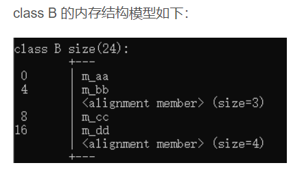
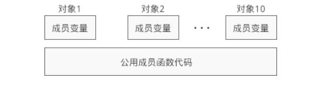
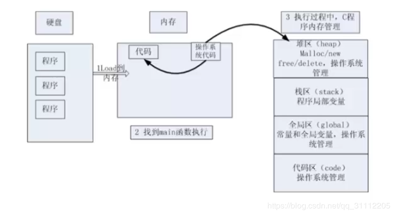
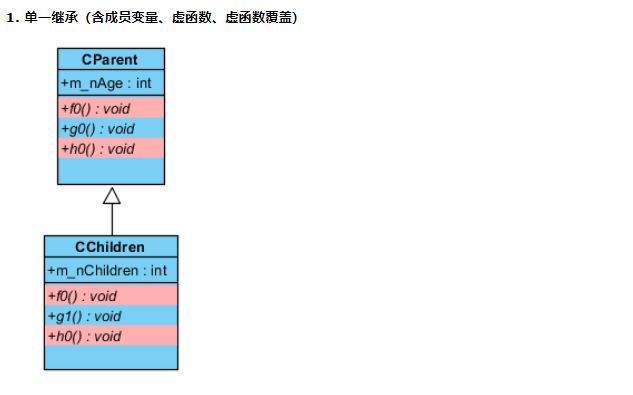
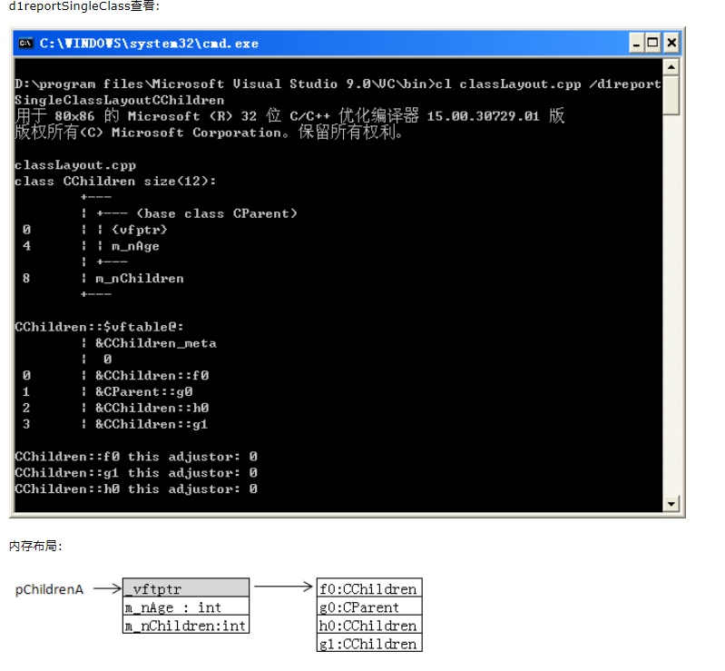
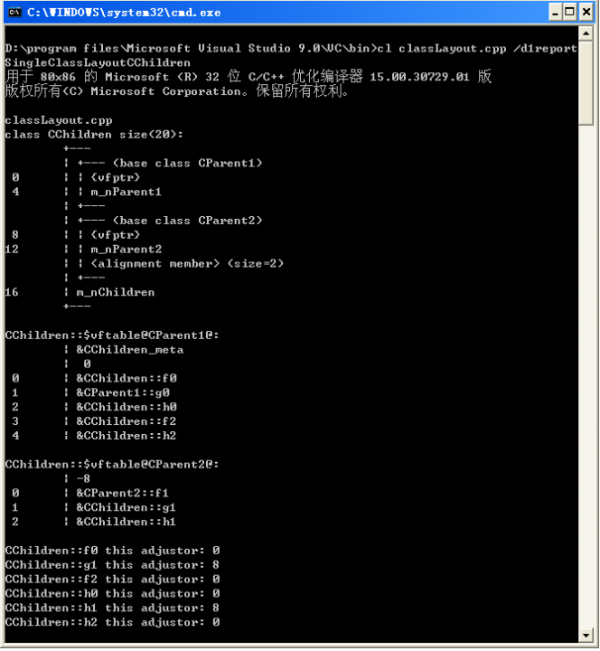
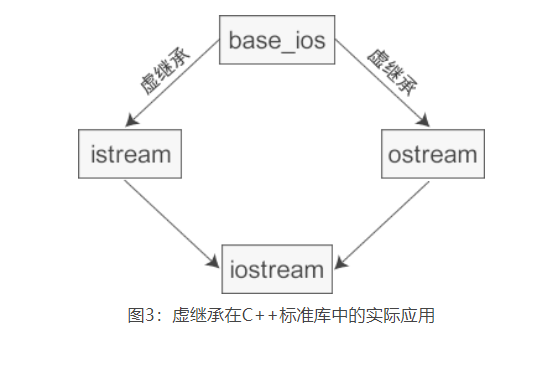
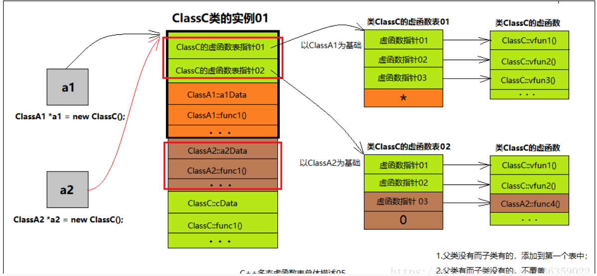

# 目录

[TOC]


# 1重要概念总结

## 1.1 C++同名函数--重载，隐藏，覆盖

**三者关系：**

**函数重载：**发生在同一个作用域(**同一个类中**)中，函数名称相同，参数不同（**参数的个数、类型、顺序**），(无法通过返回类型判断)

**函数隐藏（函数重定义）：**发生在基类和派生类之间，只要函数名称相同，函数没有被定义成虚函数。

+ 隐藏：函数存在，但是普通方法无法访问。需要加上域作用符进行访问

**函数覆盖（函数重写）：**由基类中定义虚函数引发的多态现象。某基类中声明为 virtual 并在一个或多个派生类中被重新定义的成员函数，实现多态性，通过指向派生类的基类指针或引用，访问派生类中同名覆盖成员函数。

**背景：**

+ 子类中是否可以定义父类中出现的同名成员

  可以：命名空间不同，实现函数隐藏（重定义）

+ 子类中是否可以重载父类同名函数‘

  不可以，函数重载发生在同一个作用域中

### 1.1.1 函数重载

背景：

**在同一个作用域内，使用同一个函数名 命名一组功能相似的函数，这样做减少了函数名的数量**，避免了程序员因给函数名命名所带来的烦恼，从而提高程序的开发的效率。

**规则：**

+ 同一个作用域，相同的范围（在同一个类中）
+ 函数名相同
+ 参数不同
+ 返回值无所谓，可同可不同。
+ virtual关键字可有可无
+ **const属性相同**

**参数匹配规则**

+ 找出所有同名函数
+ 根据参数匹配
  + 精确匹配实参
  + 根据默认参数匹配
  + 没有找到严格匹配，可有隐式转换，找到适合的重载函数。

+ 匹配失败
  + 函数不唯一出现二义性
  + 函数没找到，没定义

**函数重载原理本质：**c++编译器对同名函数进行重命名

C和C++对函数的编译方式不同：

+ C编译器，简单在函数名前加上下划线（因此C语言无法实现函数重载）

+ C++编译器对重载函数的命名规则为：作用域+返回类型+函数名+参数列表

```c++
比如：
void print(int i)                    -->            _ZN4test5printEi
void print(char c)               -->            _ZN4test5printEc
注意返回值类型不作为条件。
```

**重要结论：**

+ **函数重载本质**：C++编译器对同名函数进行重命名

+ 命名方式：函数名和参数列表是唯一标识

+ 编译器决定符号表中函数名被编译后的最终目标名；

  c++ 编译器 将函数名和参数列表编译成目标名；

  c 编译器将函数名编译成目标名；

+ 函数重载是一种静态多态

  + 多态（同一种事物的不同形态）
  + 静态多态（编译时的多态），动态多态（运行时的多态）

+ **函数重载不能和默认参数同时使用，会出现二义性**


### 1.1.2函数隐藏

**定义**：派生类函数屏蔽**同名**的基类函数（看似无，实际有）

**函数隐藏的本质**：C++名字的解析过程

在继承机制下，派生类的类域被嵌套在基类的类域中。派生类的名字解析过程如下：

+ 首先，在派生类中查找名字
+ 果第一步中没有成功查找到该名字，即在派生类的类域中无法对该名字进行解析，则编译器在外围基类类域对查找该名字的定义

**隐藏的规则**

+ 不同作用域，有继承关系
+ 返回值可以不同
+ **函数同名不同参**，不管是否基类虚函数
+ **派生类函数与基类函数同名同参**，基类需要是非虚函数。

**访问被隐藏成员**

+ **用using关键字，将函数隐藏变为函数重载**：自定义命名空间一节提到using可将一个作用域中的名字引入另一个作用域中；它的另一个用法是”using Base::fun”，这样派生类中如果定义同名但不同参的函数，基类函数将不会被隐藏，两个函数并存在派生类域中形成新的重载，
+ 使用类名加上域限制符：：。

```cpp

class Base
{
public: 
  void fun1(int a){ cout<<"Base fun1(int a)"<endl; } 
};
class Drv:publicBase
{ 
public: 
  using Base::fun1;   //这句使基类中名为fun1的系列函数不再被株连（只可能被隐藏同名同参的一个）
  void fun1(char *x){cout<<"Drv fun1(char *x) !"<<endl; }
}; 
void main(){
  Drv dr;
  dr.fun(1);
}
```


### 1.1.3 覆盖（重写）（发生虚表中，看似无，实际无）

**函数重写：也叫做覆盖**。子类重新定义父类中有**相同返回值、名称**和**参数**的虚函数。函数特征相同。但是具体实现不同，主要是在继承关系中出现的 。

**目的**：实现多态调用；

**背景**：在面向对象的继承关系中，父类提供方法无法满足子类需求，需要重新定义父类方法。

**规则：**

+ 不同范围（派生类和基类）
+ 函数名相同
+ 参数相同
+ 基类有virtual关键字，派生类可有可无。不能有static

```cpp
class Base
{
public:
	Base(int a) :ma(a){}
	~Base(){}
 
	virtual void Show()
	{
		cout << "Base::Show()" << endl;
	}
	virtual void Show(int flag)
	{
		cout << "Base::Show(int)" << endl;
	}
	
public:
	int ma;
};
class Derive :public Base
{
public:
	Derive(int b = 0) :mb(b), Base(b){}
	~Derive(){}
	void Show()
	{
		cout << "Derive::Show()" << endl;
	}
public:
	int mb;
};
int main()
{
	Derive* pd = new Derive(10);
	Base* pbase2 = pd;
	pbase2->Show();
 
	return 0;
}

```


# 6 继承和派生

## 6.1定义和作用

**背景：**提高代码的复用性，减少代码量。

**定义：**

**继承（Inheri[tan](http://c.biancheng.net/ref/tan.html)ce）：**可以理解为一个类从另一个类获取成员变量和成员函数的过程。

+ 被继承的类称为父类或基类，继承的类称为子类或派生类

**派生：(Derive)**：继承时子类继承父类，派生是父类传承给子类

**使用场景：**

1. **创建功能类似的新类**。

   创建类似类时，增加成员变量和成员函数，使用继承，减少代码量

2. **创建多个功能类似的类，提取出抽象类**。

   当你需要创建多个类，它们拥有很多相似的成员变量或成员函数时，也可以使用继承。可以将这些类的共同成员提取出来，定义为基类，然后从基类继承，既可以节省代码，也方便后续修改成员

语法：

```cpp
class 派生类名:［继承方式］ 基类名{
    派生类新增加的成员
};
class Student: public People{
public:
    void setscore(float score);
    float getscore();
private:
    float m_score;
};
```

**注意事项：**

继承方式：是一个可选项目，**默认为private**。

三种继承方式，私有，公有，保护。


## 6.2 C++三种继承方式

| 类别              | -public继承 | protected继承 | private继承 |
| :---------------- | ----------- | ------------- | ----------- |
| public公共权限    | public      | protected     | private     |
| protected保护权限 | protected   | protected     | private     |
| private私有权限   | private     | private       | private     |


**注意：**

1. 继承方式中的 public、protected、private 是用来指明基类成员在派生类中的最高访问权限的。

2. **private不可访问的原因：private成员变量被继承但不可见**

   基类的 private 成员不能在派生类中使用，并没有说基类的 private 成员不能被继承。实际上，**基类的 private 成员是能够被继承的，并且（成员变量）会占用派生类对象的内存，它只是在派生类中不可见**，导致无法使用罢了。private 成员的这种特性，能够很好的对派生类隐藏基类的实现，以体现面向对象的封装性。

3. 子类非要访问父类私有变量

   在派生类中访问基类 private 成员的唯一方法就是借助基类的**非 private 成员函数**，如果基类没有非 private 成员函数，那么该成员在派生类中将无法访问
   
4. 由于 private 和 protected 继承方式会改变基类成员在派生类中的访问权限，导致继承关系复杂，所以实际开发中我们一般使用 public。


### 6.2.1 修改访问权限

using 关键字可以改变**基类成员在派生类中的访问权限。**

+ 方法：例如将 public 改为 private、将 protected 改为 public。

+ 注意：using 只能改变基类中 public 和 protected 成员的访问权限，不能改变 private 成员的访问权限，

​			因为基类中 private 成员在派生类中是不可见的，根本不能使用，所以基类中的 private 成员在派生类中无论如何都不能访问。

```cpp
#include<iostream>
using namespace std;

//基类People
class People {
public:
    void show();
protected:
    char *m_name;
    int m_age;
};
void People::show() {
    cout << m_name << "的年龄是" << m_age << endl;
}

//派生类Student
class Student : public People {
public:
    void learning();
public:
    using People::m_name;  //将protected改为public  提高访问权限
    using People::m_age;  //将protected改为public
    float m_score;
private:
    using People::show;  //将public改为private  降低访问权限
};
void Student::learning() {
    cout << "我是" << m_name << "，今年" << m_age << "岁，这次考了" << m_score << "分！" << endl;
}

int main() {
    Student stu;
    stu.m_name = "小明";
    stu.m_age = 16;
    stu.m_score = 99.5f;
    stu.show();  //compile error
    stu.learning();

    return 0;
}
```

### 6.2.2使用指针突破访问权限限制

**背景：**无法通过对象访问，protected和private变量，但是只要知道变量地址还是可以借助指针访问

+ 注意：获取对象的地址时需要注意内存对齐
+ 对象的地址，是第一个成员变量的地址



```C++
class B 
{
public:
	B(int aa, char bb, double cc,int dd);
private:
	int m_aa;
	char m_bb;
	double m_cc;
	int m_dd;
};
B::B(int aa, char bb, double cc,int dd) : m_aa(aa), m_bb(bb), m_cc(cc),m_dd(dd) { }
 
void test02()
{
	B objb(11, 'C', 99.999,66);
	int x = *(int*)(int)&objb;//访问第一个变量
	char y = *((char*)((int)&objb + sizeof(int)));//访问第二个变量
	double z = *((double*)((int)&objb + sizeof(int) + sizeof(int)));//访问第三个变量 注意： char 占sizeof（int）4个字节--内存对齐
	int xz = *(int*)((int)&objb + sizeof(int) + sizeof(int) + sizeof(double));//访问第四个变量
	cout << x << endl;
	cout << y << endl;
	cout << z << endl;
	cout << xz << endl;
 
	cout << endl;
}
```

访问方式：

+ 取对象的地址便是第一个变量的地址
+ `*(int*)(int)&objb`将变量的地址取出，先转为int类型，然后根据变量的类型转为相应的指针类型，最后取出数据


## 6.3 继承中的名字屏蔽的问题（同名变量，函数重写）

**名字遮蔽**

+ 派生类中的成员（包括**成员变量和成员函数**）和基类中的**成员重名**，那么就会遮蔽从基类继承过来的成员。

  **遮蔽：**，派生类声明同名成员（函数，变量），使用同名变量时，使用的是派生类的成员，不是基类成员

**函数重写：**基类成员和派生类成员**名字一样时会造成遮蔽**

+ 成员变量：如上，简单造成遮蔽
+ 成员函数**（函数重写）**：不管参数是否一样，**只要函数名字一样**，便形成遮蔽

​		函数重写后无法访问父类的成员，如果要访问父类的同名成员或者函数，那么需要加上类名和域解析符

**无法函数重载：**

+ 基类base的两个func（）函数重载
+ 派生类，Derived两个func()函数重载，但是这四个函数无法同时构成函数重载。

```cpp
#include<iostream>
using namespace std;
//基类Base
class Base{
public:
    void func();
    void func(int);
};
void Base::func(){ cout<<"Base::func()"<<endl; }
void Base::func(int a){ cout<<"Base::func(int)"<<endl; }
//派生类Derived
class Derived: public Base{
public:
    void func(char *);
    void func(bool);
};
void Derived::func(char *str){ cout<<"Derived::func(char *)"<<endl; }
void Derived::func(bool is){ cout<<"Derived::func(bool)"<<endl; }
int main(){
    Derived d;
    d.func("c.biancheng.net");//函数重写
    d.func(true);//函数重写
    d.func();  //compile error
    d.func(10);  //compile error
    d.Base::func();
    d.Base::func(100);
    return 0;
}
```

## 6.4 C++类继承时的作用域嵌套

**成员变量：**

同名的成员变量会直接隐藏。

**隐藏：**派生类的函数屏蔽了与其同名的基类函数，规则如下

+ 如果派生类的函数与基类的函数同名，但是参数不同。此时，不论有无virtual关键字，基类的函数将被隐藏（注意别与重载混淆）。
+ 如果派生类的函数与基类的函数同名，并且参数也相同，但是基类函数没有virtual 关键字。此时，基类的函数被隐藏（注意别与覆盖混淆）

+ 如果派生类的函数与基类的函数同名，并且参数也相同，若有virtual，此时为覆盖，返回类型应该相同，除非返回类型是所在类类型.

**函数的重载：**

​		**局部作用域中声明的函数不会重载全局作用域中定义的函数，同样，派生类中定义的函数也不会重载基类中定义的成员。**通过派生类对象调用函数时，实参必须与派生类中定义的版本相匹配，只有在派生类中根本没有定义该函数时，才考虑基类函数。


**【关键概念：名字查找与继承】**

理解 C++中继承层次的关键在于理解如何确定函数调用。确定函数调用遵循以下四个步骤：

+ 首先确定进行函数调用的对象、引用或指针的静态类型

+ 在该类中查找函数，如果找不到，就在直接基类中查找，如此循着类的继承链往上找，直到找到该函数或者查找完最后一个类。如果不能在类或其相关基类中找到该名字，则调用是错误的。

+ 一旦找到了该名字,就进行常规类型检查,查看如果给定找到的定义,该函数调用是否合法。

+ 假定函数调用合法,编译器就生成代码。如果函数是虚函数且通过引用或指针调用,则编译器生成代码以确定根据对象的动态类型运行哪个函数版本,否则,编译器生成代码直接调用函数。


## 6.5 C++的内存模型

### 6.5.1 C++ 对象内存模型




编译器会将成员变量和成员函数**分开存储**：分别为每个对象的成员变量分配内存，但是所有对象都**共享同一段函数代码**。

**对象位置**：（主要存储非静态成员变量）堆区或者栈区

+ 空对象占用一个内存（主要为了区分不同的空对象）

+ 普通对象根据内部非静态变量计算内存。

**函数位置**：代码区

C++在程序执行时，将内存大方向分为4个区域

+ 代码区：存放函数体的二进制代码，由操作系统进行管理
+ 全局区：存放**全局变量**和**静态变量**和常量(字符串常量和全局常量)
+ 栈区：有编译器自动分配释放，存放函数的参数值和局部变量(还包括局部常量)
+ 堆区：由程序员分配和释放，若程序员不释放，则程序运行结束由操作系统回收。



### 6.5.2 内存四区

**内存四区有着不同的生命周期**

**程序运行前**：在程序编译后，生成.exe的可执行程序，未执行该程序前分为两个区域

+ 代码区：
  + 存放CPU执行的机器指令
  + 代码区共享：频繁执行的程序只需要保存一份代码即可
  + 代码区只读：指令无法修改
+ 全局区：（包括静态区和常量区）
  + **静态区**：存放全局变量和静态变量
  + **常量区**：字符串常量和其他常量

​		该区域数据在程序结束后由操作系统释放。

**程序运行时**

+ **栈区**
  + 由操作系统管理，由编译器分配释放，主要包括：**函数的参数值，返回值和局部变量**。
  + 函数运行结束后，系统统一收回分配的栈内存。**函数返回时避免返回局部变量的地址和局部变量的引用**

+ **堆区**
  + 堆是由malloc/new分配的内存块，使用free/delete来释放内存，**堆的申请释放工作由程序员控制**，容易产生内存泄漏 .

**普通类的对象模型：**

+ 普通成员变量，存储在栈区或者堆区（使用new创建对象时）
+ 静态成员变量，存储在全局区
+ 普通成员函数和静态成员函数，存储在代码区

### 6.5.3 单一继承时对象模型（无虚继承，虚函数）

**关键性质：**

+ 所有的**成员函数在代码区，由对象共享**
+ 派生类的内存**是由基类成员加上新增的成员变量的总和。派生类将基类的成员复制一份**，注意内存对齐。

```cpp
class A{
    protected:
        char a;
        int b;
    public:
        A(char a, int b): a(a), b(b){}
        void display(){}  
    };
    class B: public A{
    private:
        int c;
    public:
        B(char a, int b, int c): A(a,b), c(c){ }
        void display(){
        }
    };
```

A派生B，


B派生C

```cpp
    class C: public B{
    private:
        int d;
    public:
        C(char a, int b, int c, int d): B(a,b,c), d(d){ }
    };
```


#### 成员变量的遮蔽内存

```cpp
    class C: public B{
    private:
        int b;  //遮蔽A类的变量
        int c;  //遮蔽B类的变量
        int d;  //新增变量
    public:
        C(char a, int b, int c, int d): B(a,b,c), b(b), c(c), d(d){ }
        void display(){
            printf("A::a=%c, A::b=%d, B::c=%d\n", a, A::b, B::c);
            printf("C::b=%d, C::c=%d, C::d=%d\n", b, c, d);
        }
    };
 
    C obj_c('@', 23, 95, 2000);
```


### 6.5.4 多继承内存模型

#### 1 单一继承（成员变量，虚函数）

+ 斜体均为虚函数

特征：






#### 2 多继承 虚函数 虚函数覆盖

<https://www.cnblogs.com/haoyul/p/7287719.html>




#### 菱形继承（成员变量，虚函数覆盖）

+ 基类和派生类出现的成员变量，二义性
+ 派生类继承多个直接父类的虚函数指针，几个直接父类就有几个虚函数

#### 单一虚继承（成员变量，虚函数，虚继承）

+ 虚函数指针的数量等于，虚继承体系下所有类数量
+ 虚基表指针，虚基类指针数量等于，虚继承体系下，所有直接或者间接父类数量

#### 菱形继承（成员变量，虚函数，虚继承）

+ 虚基类的虚函数指针得到保留
+ 虚继承体系下有多少个

### 6.5.5 虚继承内存模型

背景：为了解决C++多重继承中存在的问题，C++提出虚继承进行相应的改变

+ 二义性
+ 存储空间的浪费

**实现方式：**

+ 虚继承底层实现原理与编译器相关，一般通过虚基类指针和虚基类表实现，（需要强调的是，虚基类依旧会在子类里面存在拷贝，只是仅仅最多存在一份而已，并不是不在子类里面了）。
+ **虚基类指针（vbptr）：**虚继承的子类含有一个虚基类指针，该指针指向了一个虚基类表
  + 当虚继承的子类被当做父类继承时，虚基类指针也会被继承
+ 虚基类表（vb），，虚表中记录了虚基类与本类的偏移地址；通过偏移地址，这样就找到了虚基类成员，而虚继承也不用像普通多继承那样维持着公共基类（虚基类）的两份同样的拷贝，节省了存储空间。

https://www.dazhuanlan.com/2020/01/18/5e22ae4dd3b9c/

**针对上链接总结**：

**1 普通继承**

+ 基类对象始终位于派生类对象前面，（也即基类成员变量始终在派生类成员变量的前面），**而且不管继承层次有多深，它相对于派生类对象顶部的偏移量是固定的。**（可以通过计算位移从而存取变量）

**2 虚继承**

+ **大部分编译器会把基类成员变量放在派生类成员变量的后面**，这样随着继承层级的增加，**基类成员变量的偏移就会改变**，就得通过其他方案来计算偏移量。
+ **不管是虚基类的直接派生类还是间接派生类，虚基类的子对象始终位于派生类对象的最后面**

**派生类成员变量分类：**

- 固定部分：不带阴影的一部分偏移量固定，不会随着继承层次的增加而改变，称为固定部分；
- 共享部分：带有阴影的一部分是虚基类的子对象，偏移量会随着继承层次的增加而改变，称为共享部分

### 6.5.6 虚继承解决方案

背景：

+ 共享部分的偏移会随着继承层次的增加而改变，这就需要设计一种方案，在偏移不断变化的过程中准确地计算偏移。各个编译器正是在设计这一方案时出现了分歧，不同的编译器设计了不同的方案来计算共享部分的偏移。

**1 cfront解决方案**

+  早期的 `cfront` 编译器会在派生类对象中安插一些指针，每个指针指向一个虚基类的子对象，要存取继承来的成员变量，可以使用指针间接完成。

  + **指针**：指向虚基类 起始位置，并且这个指针的偏移是固定的，不会随着继承层次的增加而改变

  基类成员寻找方式：

  B虚继承A,C虚继承B，用c的对象虚基类指针找到b的虚基类指针然后找到a对象变量

**缺点：**

+ **当有多个虚基类时，派生类要为每个虚基类都安插一个指针，会增加对象的体积**。
+ 随着虚继承层次的增加，访问顶层基类需要的间接转换会越来越多，效率越来越低。

**2 VC解决方案**

**解决**引入了**虚基类表**，如果某个派生类有一个或多个虚基类，编译器就会在派生类对象中安插一个指针，指向虚基类表。

+ 虚基类表其实就是一个数组，数组中的元素存放的是各个虚基类的偏移。
+ 虚继承表中保存的是所有虚基类（包括直接继承和间接继承到的）相对于当前对象的偏移，这样通过派生类指针访问虚基类的成员变量时，不管继承层次都多深，只需要一次间接转换就可以。


## 6.6 C++基类和派生类的构造函数和析构函数

### 6.6.1 构造函数

背景：

1. **基类的成员函数可以被继承**，可以通过派生类的对象访问，但这仅仅指的是普通的成员函数，

   **类的构造函数和析构函数不能被继承**。派生类无法访问。

2. **变量的初始化工作**

   **父类普通成员变量的初始化工作**也要由派生类的构造函数完成。

   **private 属性的成员变量**，它们在派生类中无法访问，更不能使用派生类的构造函数来初始化。

**解决思路：**

+ 在派生类的构造函数中的**初始化列表中**调用基类的构造函数。

事例

```cpp
#include<iostream>
using namespace std;

//基类People
class People{
protected:
    char *m_name;
    int m_age;
public:
    People(char*, int);
};
People::People(char *name, int age): m_name(name), m_age(age){}

//派生类Student
class Student: public People{
private:
    float m_score;
public:
    Student(char *name, int age, float score);
    void display();
};
//People(name, age)就是调用基类的构造函数
Student::Student(char *name, int age, float score): People(name, age), m_score(score){ }
void Student::display(){
    cout<<m_name<<"的年龄是"<<m_age<<"，成绩是"<<m_score<<"。"<<endl;
}

int main(){
    Student stu("小明", 16, 90.5);
    stu.display();

    return 0;
}
```

**使用：**

`Student::Student(char *name, int age, float score): People(name, age), m_score(score)`

People(name, age)`就是调用基类的构造函数，并将 name 和 age 作为实参传递给它。

**派生类的构造函数内部处理顺序**

+ 派生类构造函数总是先调用基类构造函数再执行其他代码（包括参数初始化表以及函数体中的代码）

**构造函数的调用顺序：**

+ 单一继承，A派生B，B包含C
  + 对基类成员A初始化。
  + 对子类对象C初始化。
  + 对派生类成员B初始化。
+  单一连续继承，A派生B，B派生C。
  + A类构造函数 --> B类构造函数 --> C类构造函数，**按照继承的顺序，自顶向下调用。**

**构造函数的调用规则**

+ 派生类构造函数**只能调用直接基类，不能调用间接基类。**

  C 是最终的派生类，B 就是 C 的直接基类，A 就是 C 的间接基类。即，B能调用A，C能调用B，但是C不能调用A。

+ 派生类创建对象时必须要**调用基类的构造函数**，**但是不能直接调用（构造函数不能被继承），只能通过初始化列表。**

  定义派生类构造函数时最好指明基类构造函数；**如果不指明，就调用基类的默认构造函数（不带参数的构造函数）**；

  如果没有默认构造函数，那么编译失败。请看下面的例子：

```cpp
#include <iostream>
using namespace std;

//基类People
class People{
public:
    People();  //基类默认构造函数
    People(char *name, int age);
protected:
    char *m_name;
    int m_age;
};
People::People(): m_name("xxx"), m_age(0){ }
People::People(char *name, int age): m_name(name), m_age(age){}

//派生类Student
class Student: public People{
public:
    Student();
    Student(char*, int, float);
public:
    void display();
private:
    float m_score;
};
Student::Student(): m_score(0.0){ }  //派生类默认构造函数
Student::Student(char *name, int age, float score): People(name, age), m_score(score){ }
void Student::display(){
    cout<<m_name<<"的年龄是"<<m_age<<"，成绩是"<<m_score<<"。"<<endl;
}

int main(){
    Student stu1;
    stu1.display();

    Student stu2("小明", 16, 90.5);
    stu2.display();

    return 0;
}
```

**注意：**

+ 如果将类 People 中不带参数的构造函数删除，那么会发生编译错误，因为创建对象 stu1 时需要调用 People 类的默认构造函数， 而 People 类中已经显式定义了构造函数，编译器不会再生成默认的构造函数。


### 6.6.2 析构函数

**构造和析构的异同：**

+ 相同：**析构函数同样无法被继承。**

+ 不同：自动调用析构函数，在派生类的析构函数中不用显式地调用基类的析构函数，**因为每个类只有一个析构函数，编译器知道如何选择，无需程序员干涉。**

**析构函数的执行顺序和构造函数的执行顺序也刚好相反**

- **构造由内而外**：创建派生类对象时，构造函数的执行顺序和继承顺序相同，即先执行基类构造函数，再执行派生类构造函数。
- **析构由外而内**：销毁派生类对象时，析构函数的执行顺序和继承顺序相反，即先执行派生类析构函数，再执行基类析构函数。


## 6.7 多继承详解

### 6.7.1 多继承

**多继承：**一个派生类有两个以上的基类。

+ **多继承容易让代码逻辑复杂、思路混乱，一直备受争议**，中小型项目中较少使用，后来的 [Java](http://c.biancheng.net/java/)、[C#](http://c.biancheng.net/csharp/)、[PHP](http://c.biancheng.net/php/) 等干脆取消了多继承。

多继承的语法也很简单，将多个基类用逗号隔开即可。例如已声明了类A、类B和类C，那么可以这样来声明派生类D：

```cpp
class D: public A, private B, protected C{
  //类D新增加的成员
}
```

```cpp
D(形参列表): B(实参列表), C(实参列表), A(实参列表){
    //其他操作
}
```

```cpp
#include <iostream>
using namespace std;

//基类
class BaseA{
public:
    BaseA(int a, int b);
    ~BaseA();
protected:
    int m_a;
    int m_b;
};
BaseA::BaseA(int a, int b): m_a(a), m_b(b){
    cout<<"BaseA constructor"<<endl;
}
BaseA::~BaseA(){
    cout<<"BaseA destructor"<<endl;
}

//基类
class BaseB{
public:
    BaseB(int c, int d);
    ~BaseB();
protected:
    int m_c;
    int m_d;
};
BaseB::BaseB(int c, int d): m_c(c), m_d(d){
    cout<<"BaseB constructor"<<endl;
}
BaseB::~BaseB(){
    cout<<"BaseB destructor"<<endl;
}

//派生类
class Derived: public BaseA, public BaseB{
public:
    Derived(int a, int b, int c, int d, int e);
    ~Derived();
public:
    void show();
private:
    int m_e;
};
Derived::Derived(int a, int b, int c, int d, int e): BaseA(a, b), BaseB(c, d), m_e(e){
    cout<<"Derived constructor"<<endl;
}
Derived::~Derived(){
    cout<<"Derived destructor"<<endl;
}
void Derived::show(){
    cout<<m_a<<", "<<m_b<<", "<<m_c<<", "<<m_d<<", "<<m_e<<endl;
}

int main(){
    Derived obj(1, 2, 3, 4, 5);
    obj.show();
    return 0;
}
```

### 6.7.2构造函数的调用顺序

+ 基类构造函数的调用顺序和和它们在派生类**构造函数列表中出现的顺序无关**，而是和声明派生类时基类出现的顺序相同

  ```c++
  //声明
  class D: public A, private B, protected C{
      //类D新增加的成员
  }
  //构造函数1
  D(形参列表): A(实参列表), B(实参列表), C(实参列表){
      //其他操作
  }
  //构造函数2
  D(形参列表): B(实参列表), C(实参列表), A(实参列表){
      //其他操作
  }
  ```
  
  无论是构造函数1还是构造函数2，最终调用构造函数的顺序是：A,B,C,D
  
  析构时，DCBA

​	**注意：**析构函数的执行顺序刚好和构造函数的顺序相反。

### 6.7.3 命名冲突

+ 当两个或多个基类中有同名的成员时，如果直接访问该成员，就会产生命名冲突，编译器不知道使用哪个基类的成员。

  同名成员变量不会覆盖。

  **解决：**这个时候需要在成员名字前面加上类名和域解析符`::`，以显式地指明到底使用哪个类的成员，消除二义性。

```cpp
#include <iostream>
using namespace std;

//基类
class BaseA{
public:
    BaseA(int a, int b);
    ~BaseA();
public:
    void show();
protected:
    int m_a;
    int m_b;
};
BaseA::BaseA(int a, int b): m_a(a), m_b(b){
    cout<<"BaseA constructor"<<endl;
}
BaseA::~BaseA(){
    cout<<"BaseA destructor"<<endl;
}
void BaseA::show(){
    cout<<"m_a = "<<m_a<<endl;
    cout<<"m_b = "<<m_b<<endl;
}

//基类
class BaseB{
public:
    BaseB(int c, int d);
    ~BaseB();
    void show();
protected:
    int m_c;
    int m_d;
};
BaseB::BaseB(int c, int d): m_c(c), m_d(d){
    cout<<"BaseB constructor"<<endl;
}
BaseB::~BaseB(){
    cout<<"BaseB destructor"<<endl;
}
void BaseB::show(){
    cout<<"m_c = "<<m_c<<endl;
    cout<<"m_d = "<<m_d<<endl;
}

//派生类
class Derived: public BaseA, public BaseB{
public:
    Derived(int a, int b, int c, int d, int e);
    ~Derived();
public:
    void display();
private:
    int m_e;
};
Derived::Derived(int a, int b, int c, int d, int e): BaseA(a, b), BaseB(c, d), m_e(e){
    cout<<"Derived constructor"<<endl;
}
Derived::~Derived(){
    cout<<"Derived destructor"<<endl;
}
void Derived::display(){
    BaseA::show();  //调用BaseA类的show()函数
    BaseB::show();  //调用BaseB类的show()函数
    cout<<"m_e = "<<m_e<<endl;
}

int main(){
    Derived obj(1, 2, 3, 4, 5);
    obj.display();
    return 0;
}
```


## 6.8虚继承和虚基类详解

**背景：**

+ 多继承（Multiple Inheri[tan](http://c.biancheng.net/ref/tan.html)ce）是指从多个直接基类中产生派生类的能力，多继承的派生类继承了所有父类的成员。

+ 多继承时很容易产生命名冲突，即使我们很小心地将所有类中的成员变量和成员函数都命名为不同的名字，命名冲突依然有可能发生，比如典型的是菱形继承，如下图所示：


### 6.8.0菱形继承

**出现问题：**

1. D中含有两份**间接基类的数据**，这两份数据将会产生二义性，或者命名冲突。
   + 解决：使用类名加上域作用符加以区分
2. 其实D中只需要一份A中的数据便可，多余的数据将产生冗余。
   + 解决：使用虚继承。将A变为虚基类。

菱形继承：

+ 类 A 派生出类 B 和类 C，类 D 继承自类 B 和类 C，这个时候类 A 中的成员变量和成员函数继承到类 D 中变成了两份，一份来自 A-->B-->D 这条路径，另一份来自 A-->C-->D 这条路径。

+ 在派生类中保留了多份间接基类的同名成员，因为保留多份成员变量**不仅占用较多的存储空间，还容易产生命名冲突**。假如类 A 有一个成员变量 a，那么在类 D 中直接访问 a 就会产生歧义，编译器不知道它究竟来自 A -->B-->D 这条路径，还是来自 A-->C-->D 这条路径。下面是菱形继承的具体实现：

```cpp
//间接基类A
class A{
protected:
    int m_a;
};

//直接基类B
class B: public A{
protected:
    int m_b;
};

//直接基类C
class C: public A{
protected:
    int m_c;
};

//派生类D
class D: public B, public C{
public:
    void seta(int a){ m_a = a; }  //命名冲突
    void setb(int b){ m_b = b; }  //正确
    void setc(int c){ m_c = c; }  //正确
    void setd(int d){ m_d = d; }  //正确
private:
    int m_d;
};

int main(){
    D d;
    return 0;
}
```

为了消除歧义，我们可以在 m_a 的前面指明它具体来自哪个类：

```cpp
void seta(int a){ B::m_a = a; }
或者：
void seta(int a){ C::m_a = a; }
```

### 6.8.1 虚继承

背景：为了解决多继承时的**命名冲突和冗余数据**问题，[C++](http://c.biancheng.net/cplus/) 提出了虚继承，使得在派生类中只保留一份间接基类的成员。

**虚基类：**虚继承的目的是让某个类做出声明，承诺愿意共享它的基类。其中，这个被共享的基类就称为虚基类（Virtual Base Class），本例中的 A 是B的一个虚基类。在这种机制下，**不论虚基类在继承体系中出现了多少次，在派生类中都只包含一份虚基类的成员**。

**注意：**

1. 虚基类不是声明基类时声明的，而是在**声明派生类的时候指定继承方式是声明的**。

2. 最终类的**所有直接基类都声明虚继承时**，虚继承成功。

   A派生BCD，BCD派生E，当BCD都声明其父类A是虚基类时，E虚继承成功。有一个不是，虚继承不成功。

3. 虚继承的目的是让某个类做出声明，承诺愿意共享它的基类。

4. 虚派生只影响从指定了虚基类的派生类中进一步派生出来的类，它不会影响派生类本身。

   BCD不会受到影响，E才受到影响。

5. 不能说A就是虚基类，因为虚基类必须是在虚继承的体系中才能称为虚基类

```cpp
//间接基类A
class A{
protected:
    int m_a;
};

//直接基类B
class B: virtual public A{  //虚继承
protected:
    int m_b;
};

//直接基类C
class C: virtual public A{  //虚继承
protected:
    int m_c;
};

//派生类D
class D: public B, public C{
public:
    void seta(int a){ m_a = a; }  //正确
    void setb(int b){ m_b = b; }  //正确
    void setc(int c){ m_c = c; }  //正确
    void setd(int d){ m_d = d; }  //正确
private:
    int m_d;
};

int man(){
    D d;
    return 0;
}
```


**C++标准库中的iostream**

+ C++标准库中的 iostream 类就是一个虚继承的实际应用案例。iostream 从 istream 和 ostream 直接继承而来，而 istream 和 ostream 又都继承自一个共同的名为 base_ios 的类，是典型的菱形继承。此时 istream 和 ostream 必须采用虚继承，否则将导致 iostream 类中保留两份 base_ios 类的成员。



### 6.8.2 虚继承的实现原理

背景：为了解决C++多重继承中存在的问题，C++提出虚继承进行相应的改变

+ 二义性
+ 存储空间的浪费

**实现方式：**

+ 虚继承底层实现原理与编译器相关，一般通过虚基类指针和虚基类表实现，（需要强调的是，虚基类依旧会在子类里面存在拷贝，只是仅仅最多存在一份而已，并不是不在子类里面了）。
+ **虚基类指针（vbptr）：**虚继承的子类含有一个虚基类指针，该指针指向了一个虚基类表
  + 当虚继承的子类被当做父类继承时，虚基类指针也会被继承
+ 虚基类表（vb），，虚表中记录了虚基类与本类的偏移地址；通过偏移地址，这样就找到了虚基类成员，而虚继承也不用像普通多继承那样维持着公共基类（虚基类）的两份同样的拷贝，节省了存储空间。

### 6.8.3虚继承的内存模型

**羊驼例子**

```cpp
#include<iostream>
using namespace std;
class Animal
{
public:
	int m_age;

};//通过用virtual 关键字来表示是虚继承
//公共的Animal被称为虚基类
class Sheep :virtual public Animal{};
class Tuo :virtual public Animal{};
class SheepTuo :public Sheep,public Tuo {};
void test()
{
	SheepTuo st;
	st.Sheep::m_age = 100;
	st.Tuo::m_age = 200;
	cout << "st.sheep::m_age=" << st.Sheep::m_age << endl;
	cout << "st.Tuo::m_age" << st.Tuo::m_age << endl;
	cout << st.m_age << endl;
}
int main()
{
	test();
	system("pause");
}
```


类中保存的是一个vbptr 虚基类指针，指向虚基类表，表中的是实际成员的偏移量。


### 6.8.4 虚继承的构造函数

**注意：**

1. 普通继承中，派生类构造函数中只能调用直接基类的构造函数，不能调用间接基类。
2. 虚继承中，最终派生类的构造函数必须要调用虚基类的构造函数

```cpp
#include <iostream>
using namespace std;

//虚基类A
class A{
public:
    A(int a);
protected:
    int m_a;
};
A::A(int a): m_a(a){ }

//直接派生类B
class B: virtual public A{
public:
    B(int a, int b);
public:
    void display();
protected:
    int m_b;
};
B::B(int a, int b): A(a), m_b(b){ }
void B::display(){
    cout<<"m_a="<<m_a<<", m_b="<<m_b<<endl;
}

//直接派生类C
class C: virtual public A{
public:
    C(int a, int c);
public:
    void display();
protected:
    int m_c;
};
C::C(int a, int c): A(a), m_c(c){ }
void C::display(){
    cout<<"m_a="<<m_a<<", m_c="<<m_c<<endl;
}

//间接派生类D
class D: public B, public C{
public:
    D(int a, int b, int c, int d);
public:
    void display();
private:
    int m_d;
};
D::D(int a, int b, int c, int d): A(a), B(90, b), C(100, c), m_d(d){ }
void D::display(){
    cout<<"m_a="<<m_a<<", m_b="<<m_b<<", m_c="<<m_c<<", m_d="<<m_d<<endl;
}

int main(){
    B b(10, 20);
    b.display();
   
    C c(30, 40);
    c.display();

    D d(50, 60, 70, 80);
    d.display();
    return 0;
}
运行结果
m_a=10, m_b=20
m_a=30, m_c=40
m_a=50, m_b=60, m_c=70, m_d=80
```

**解释：**

+ 注意第五十行代码，派生类 D 的构造函数中，除了调用 B 和 C 的构造函数，还调用了 A 的构造函数，这说明 D 不但要负责初始化直接基类 B 和 C，还要负责初始化间接基类 A。

+ 普通继承中，用户尝试调用间接基类的构造函数将导致错误。

**原因：**

+ **虚继承，虚基类 A 在最终派生类 D 中只保留了一份成员变量 m_a，如果由 B 和 C 初始化 m_a，那么 B 和 C 在调用 A 的构造函数时很有可能给出不同的实参，这个时候编译器就会犯迷糊，不知道使用哪个实参初始化 m_a。**

**解决：**

+ **C++干脆规定必须由最终的派生类 D 来初始化虚基类 A，直接派生类 B 和 C 对 A 的构造函数的调用是无效的**。在第 50 行代码中，调用 B 的构造函数时试图将 m_a 初始化为 90，调用 C 的构造函数时试图将 m_a 初始化为 100，但是输出结果有力地证明了这些都是无效的，m_a 最终被初始化为 50，这正是在 D 中直接调用 A 的构造函数的结果。

**构造函数的顺序问题：**

+ 在最终派生类的构造函数调用列表中，不管各个构造函数出现的顺序如何，**编译器总是先调用虚基类的构造函数**，再按照出现的定义顺序调用其他的构造函数；

```cpp
//声明D
class D: public B, public C{
}
D::D(int a, int b, int c, int d): A(a), B(90, b), C(100, c), m_d(d){ }//构造1
D::D(int a, int b, int c, int d): B(90, b), C(100, c), A(a), m_d(d){ }//构造2

```

无论构造函数如何，最终的构造顺序都是ABC。和构造函数的列表无关。


## 6.9 C++将派生类赋值给基类（向上转型）

数据类型的转换，如int转换为float，float转换为int

```cpp
int a=10.9;自动删除小数部分
结果a为10
float b=10;自动添加小数部分
结果b为10.000000
```

**向上转型：**

类其实也是一种数据类型，也可以发生数据类型转换，不过这种转换只有在基类和派生类之间才有意义，并且**只能将派生类赋值给基类**，

1. 将派生类对象赋值给基类对象

2. 将派生类[指针](http://c.biancheng.net/c/80/)赋值给基类指针
3. 将派生类引用赋值给基类引用，

**向下转型：**

将基类赋值给派生类称为向下转型（Downcasting）。

**注意**

+ 向上转型非常安全，可以由编译器自动完成；向下转型有风险，需要程序员手动干预。

### 6.9.1 将派生类对象赋值给基类对象

```cpp
#include <iostream>
using namespace std;

//基类
class A{
public:
    A(int a);
public:
    void display();
public:
    int m_a;
};
A::A(int a): m_a(a){ }
void A::display(){
    cout<<"Class A: m_a="<<m_a<<endl;
}

//派生类
class B: public A{
public:
    B(int a, int b);
public:
    void display();
public:
    int m_b;
};
B::B(int a, int b): A(a), m_b(b){ }
void B::display(){
    cout<<"Class B: m_a="<<m_a<<", m_b="<<m_b<<endl;
}


int main(){
    A a(10);
    B b(66, 99);
    //赋值前
    a.display();
    b.display();
    cout<<"--------------"<<endl;
    //赋值后
    a = b;
    a.display();
    b.display();

    return 0;
}
```

运行结果：
Class A: m_a=10
Class B: m_a=66, m_b=99
\----------------------------
Class A: m_a=66
Class B: m_a=66, m_b=99

**性质：**

+ 属性访问：只能访问从基类继承的成员，不能访问子类的成员

+ 函数访问：只能调用基类的函数。不能调用派生类的函数

**注意：**

+ 对象之间的赋值是成员变量的赋值，成员函数不存在赋值问题

**赋值的本质：**

+ **赋值的本质是将现有的数据写入已分配好的内存中（对象间成员变量拷贝）**，对象的内存只包含了成员变量，所以对**象之间的赋值是成员变量的赋值，成员函数不存在赋值问题**。

  运行结果也有力地证明了这一点，虽然有`a=b;`这样的赋值过程，但是 a.display() 始终调用的都是 A 类的 display() 函数。换句话说，**对象之间的赋值不会影响成员函数，也不会影响 this 指针。**


+ 只能用派生类对象给基类对象赋值，而不能用基类对象给派生类对象赋值。

  理由很简单，基类不包含派生类的成员变量，无法对派生类的成员变量赋值。同理，同一基类的不同派生类对象之间也不能赋值。

  本质：赋值实际上是向内存填充数据，当数据较多时很好处理，舍弃即可。但当数据较少时，问题就很棘手，编译器不知道如何填充剩下的内存；

+ 基类对象：只能访问从基类继承的成员，不能访问子类的成员

### 6.9.2 派生类指针赋值给基类指针


**注意：**

+ **父类指针指向子类对象时;**与对象变量之间的赋值不同的是，对象指针之间的赋值并没有拷贝对象的成员，也没有修改对象本身的数据，仅仅是改变了指针的指向。

+ **指针指向哪个对象就使用哪个对象的数据；**只能访问从基类继承的成员，不能访问新增的成员。

+ **编译器通过指针的类型来访问成员函数，指针属于哪个类的类型就使用哪个类的函数。**

```cpp
#include <iostream>
using namespace std;

//基类A
class A{
public:
    A(int a);
public:
    void display();
protected:
    int m_a;
};
A::A(int a): m_a(a){ }
void A::display(){
    cout<<"Class A: m_a="<<m_a<<endl;
}

//中间派生类B
class B: public A{
public:
    B(int a, int b);
public:
    void display();
protected:
    int m_b;
};
B::B(int a, int b): A(a), m_b(b){ }
void B::display(){
    cout<<"Class B: m_a="<<m_a<<", m_b="<<m_b<<endl;
}

//基类C
class C{
public:
    C(int c);
public:
    void display();
protected:
    int m_c;
};
C::C(int c): m_c(c){ }
void C::display(){
    cout<<"Class C: m_c="<<m_c<<endl;
}

//最终派生类D
class D: public B, public C{
public:
    D(int a, int b, int c, int d);
public:
    void display();
private:
    int m_d;
};
D::D(int a, int b, int c, int d): B(a, b), C(c), m_d(d){ }
void D::display(){
    cout<<"Class D: m_a="<<m_a<<", m_b="<<m_b<<", m_c="<<m_c<<", m_d="<<m_d<<endl;
}


int main(){
    A *pa = new A(1);
    B *pb = new B(2, 20);
    C *pc = new C(3);
    D *pd = new D(4, 40, 400, 4000);

    pa = pd;
    pa -> display();

    pb = pd;
    pb -> display();

    pc = pd;
    pc -> display();

    cout<<"-----------------------"<<endl;
    cout<<"pa="<<pa<<endl;
    cout<<"pb="<<pb<<endl;
    cout<<"pc="<<pc<<endl;
    cout<<"pd="<<pd<<endl;

    return 0;
}
运行结果：
Class A: m_a=4
Class B: m_a=4, m_b=40
Class C: m_c=400
\-----------------------
pa=0x9b17f8
pb=0x9b17f8
pc=0x9b1800
pd=0x9b17f8
```


（1）通过基类指针访问派生类成员

+ **基类的指针只可以访问从基类继承的成员（成员变量和成员函数），不能访问新增的成员**

+ **成员变量**：pd赋值给基类指针pa，使得pa的this指针发生变化，指向pd的对象，因此最终使用的是pd的成员变量。
+ **成员函数：**编译器通过指针指向的对象来访问成员变量，通过指针的类型来访问成员函数。对于 pa，它的类型是 A，不管它指向哪个对象，使用的都是 A 类的成员函数，具体原因已在《[C++函数编译原理和成员函数的实现](http://c.biancheng.net/view/vip_2220.html)》中做了详细讲解。

（2）赋值后值不一致的情况

### 6.9.3 将派生类引用赋值给基类引用

**背景：**

+ 引用（**等同指针常量**）在本质上是通过指针的方式实现的，

+ 引用和指针的表现之所以如此类似，是因为引用和指针并没有本质上的区别，引用仅仅是对指针进行了简单封装。

```cpp
A a;
B b;
A &r=b;
B继承A。
```

**r与b中的基类部分共享一份内存。**

**总结**：

最后需要注意的是，向上转型后通过基类的对象、指针、引用只能访问从基类继承过去的成员（包括成员变量和成员函数），不能访问派生类新增的成员。


# 7 多态

## 7.1 多态和虚函数

### 7.1.1指针实现多态

**多态：**同一种事物的不同形态，即同一名字的事物可以完成不同的功能。

**分类**：

1. 编译时的多态（**静态多态**）：函数和运算符的重载。
   + 对重载函数的调用，在编译时就能根据实参确定应该调用哪个函数，因此叫编译时的多态；
2. 运行时的多态（**动态多态**）：和继承和虚函数有关。
3. 静态关联和动态关联
   + 静态关联（将对象和函数绑定，使用对象名调用虚函数）
   + 动态关联（将对象和函数绑定，使用指针或引用调用虚函数）

**背景：**

+ 在继承中，通过基类指针只能访问派生类的成员变量，但是不能访问派生类的成员函数.

**解决：**虚函数

+ 函数声明前面增加 virtual 关键字。使得函数变成虚函数。基类指针能够访问派生类的成员函数

```cpp
#include <iostream>
using namespace std;
//基类People
class People{
public:
    People(char *name, int age);
    virtual void display();  //声明为虚函数
protected:
    char *m_name;
    int m_age;
};
People::People(char *name, int age): m_name(name), m_age(age){}
void People::display(){
    cout<<m_name<<"今年"<<m_age<<"岁了，是个无业游民。"<<endl;
}

//派生类Teacher
class Teacher: public People{
public:
    Teacher(char *name, int age, int salary);
    virtual void display();  //声明为虚函数
private:
    int m_salary;
};
Teacher::Teacher(char *name, int age, int salary): People(name, age), m_salary(salary){}
void Teacher::display(){
    cout<<m_name<<"今年"<<m_age<<"岁了，是一名教师，每月有"<<m_salary<<"元的收入。"<<endl;
}

int main(){
    People *p = new People("王志刚", 23);
    p -> display();
    p = new Teacher("赵宏佳", 45, 8200);
    p -> display();
    return 0;
}
运行结果：
王志刚今年23岁了，是个无业游民。
赵宏佳今年45岁了，是一名教师，每月有8200元的收入
```

**虚函数的意义：**

+ 在基类中声明的函数是虚拟的，并不是实际存在的函数，然后在派生类中正式定义该函数。
+ 虚函数的唯一作用就是实现多态

**虚函数作用：**

​		允许在派生类中重新定义与基类同名的函数，通过基类指针或引用访问基类和派生类中的同名函数。

**多态的实际含义：**

+ 基类指针指向基类对象时就使用基类的成员（包括成员函数和成员变量），指向派生类对象时就使用派生类的成员。**换句话说，基类指针可以按照基类的方式来做事，也可以按照派生类的方式来做事，它有多种形态，简称多态。**

**C++提供多态的目的：**

​		可以通过基类指针对所有派生类（包括直接派生和间接派生）**的成员变量和成员函数进行“全方位”的访问**，尤其是成员函数。如果没有多态，我们只能访问成员变量。

### 7.1.2 引用实现多态

+ 引用（指针常量）,既然可以通过指针实现多态，那么也可以通过引用实现多态

```cpp
int main(){
    People p("王志刚", 23);
    Teacher t("赵宏佳", 45, 8200);
   
    People &rp = p;
    People &rt = t;
   
    rp.display();
    rt.display();

    return 0;
}
运行结果：
王志刚今年23岁了，是个无业游民。
赵宏佳今年45岁了，是一名教师，每月有8200元的收入。
```

+ **引用不像指针灵活，指针可以随时改变指向，而引用只能指代固定的对象**，在多态性方面缺乏表现力，所以以后我们再谈及多态时一般是说指针。本例的主要目的是让读者知道，除了指针，引用也可以实现多态。

## 7.2 C++虚函数注意事项以及构成多态的条件

### 7.2.1 虚函数的注意事项

1. 虚函数的声明处加上 virtual 关键字，函数定义处可以加也可以不加
2. 基类中的函数声明为虚函数，这样所有派生类中具有**遮蔽关系的同名函数**都将自动成为虚函数
3. 当在基类中定义了虚函数时，如果派生类没有定义新的函数来遮蔽此函数，那么将使用基类的虚函数。
4. 只有派生类的虚函数覆盖基类的虚函数（函数原型相同，函数名，函数类型，参数个数，参数类型相同 ）才能构成多态（通过基类[指针](http://c.biancheng.net/c/80/)访问派生类函数）
5. **构造函数不能是虚函数**。
6. **析构函数可以声明为虚函数，而且有时候必须要声明为虚函数，**

### 7.2.2 多态的条件

+ 存在继承关系
+ 继承中必须有同名的虚函数，并且是覆盖关系。
+ 存在基类的指针（引用）指向子类的对象。

```cpp
#include <iostream>
using namespace std;

//基类Base
class Base{
public:
    virtual void func();
    virtual void func(int);
};
void Base::func(){
    cout<<"void Base::func()"<<endl;
}
void Base::func(int n){
    cout<<"void Base::func(int)"<<endl;
}

//派生类Derived
class Derived: public Base{
public:
    void func();
    void func(char *);
};
void Derived::func(){
    cout<<"void Derived::func()"<<endl;
}
void Derived::func(char *str){
    cout<<"void Derived::func(char *)"<<endl;
}

int main(){
    Base *p = new Derived();
    p -> func();  //输出void Derived::func()
    p -> func(10);  //输出void Base::func(int)
    p -> func("http://c.biancheng.net");  //compile error

    return 0;
}
```

语句`p -> func();`调用的是派生类的虚函数，构成了多态。

语句`p -> func(10);`调用的是基类的虚函数，因为派生类中没有函数覆盖它。

语句`p -> func("http://c.biancheng.net");`出现编译错误，因为通过基类的指针只能访问从基类继承过去的成员，不能访问派生类新增的成员。

### 7.2.3 虚函数的应用情况

+ 基类的成员函数被继承后希望更改功能。声明为虚函数
+ 成员函数继承后功能不需要更改，或者派生类应用不到该函数。不需要声明为虚函数。

## 7.3 虚析构函数的必要性

### 7.3.1 虚析构函数

```cpp
 #include<iostream>
 using namespace std;
 class Base
 {
 public:
     Base() {}
    virtual ~Base();
};

class Subclass :public Base
{
public:
    Subclass() {}
    ~Subclass();
};
 Base::~Base()
 {
     cout << "Base destructor is called." << endl;
 }

 Subclass::~Subclass()
 {
    cout << "Subclass destructor is called." << endl;
 }
 
 int main()
 {
     Base *b = new Subclass;
     delete b;
    return 0;
 }
输出结果:  

Subclass destructor is called.
Base destructor is called.
这个很简单，非常好理解。
但是，如果把类Base析构函数前的virtual去掉，那输出结果就是下面的样子了：
Base destructor is called.
```

**例子原因分析：**

+ 析构函数没有定义为**虚函数**：使用基类指针删除派生类对象时，仅仅调用基类的析构函数，没有调用派生类的析构函数
+ 析构函数定义为虚函数：使用基类指针删除派生类对象时，派生类的析构函数也被调用了。
  + 原因是当基类析构函数定义为虚函数后，删除对象时会直接调用派生类的析构函数，**由于子类析构时会先调用父类的析构函数所以就把子类和继承的父类都析构了。**

**虚析构函数的本质：**

+ 基类的析构函数为虚函数时，尽管派生类的析构函数名字不同，派生类的析构函数也将自动变为虚函数。

+ 当使用父类指针指向子类对象时：
  + 删除父类指针时，系统采用动态关联，自动调用派生类类的清理工作。

### 7.3.2 构造函数为何不能是虚函数

1. 从vptr角度解释

   虚函数的调用是通过虚函数表来查找的，而虚函数表由类的实例化对象的vptr指针(vptr可以参考[C++的虚函数表指针vptr](https://blog.csdn.net/qq_28584889/article/details/88748923))指向，该指针存放在对象的内部空间中，需要调用构造函数完成初始化。如果构造函数是虚函数，那么调用构造函数就需要去找vptr，但此时vptr还没有初始化！

2. 从多态角度解释

   构造函数的作用是提供初始化，在对象生命期仅仅运行一次，不是对象的动态行为，没有必要成为虚函数。

   构造函数是在创建对象时自己主动调用的，不可能通过父类的指针或者引用去调用。那使用虚函数也没有实际意义。，。，。【；


## 7.4 C++纯虚函数和抽象类

**纯虚函数的语法格式**

+ `virtual 返回值类型 函数名 (函数参数) = 0;`

+ **纯虚函数没有函数体，只有函数声明**，最后的`=0`并不表示函数返回值为0，它只起形式上的作用，告诉编译系统“这是纯虚函数”。

**抽象类：**

+ 包含纯虚函数的类称为抽象类（Abstract Class）。**之所以说它抽象，是因为它无法实例化，也就是无法创建对象。**原因很明显，纯虚函数没有函数体，不是完整的函数，无法调用，也无法为其分配内存空间。

**性质**

+ 抽象类通常是作为基类，让派生类去实现纯虚函数。**派生类必须实现纯虚函数才能被实例化。**不然纯虚函数会被派生类继承，那么派生类仍然是个抽象类。
+ 一个纯虚函数就可以使类成为抽象基类，但是抽象基类中除了包含纯虚函数外，还可以包含其它的成员函数（虚函数或普通函数）和成员变量。
+ 只有类中的虚函数才能被声明为纯虚函数，**普通成员函数和顶层函数均不能声明为纯虚函数**。

**虚函数和纯虚函数选择**

+ 基类某个成员方法，**可由子类个性化实现，也可由基类缺省实现**，此时函数定义为虚函数
+ 基类某个成员方法，**必须由子类个性化实现，此时定义为纯虚函数**。

```cpp
#include <iostream>
using namespace std;

//线
class Line{
public:
    Line(float len);
    virtual float area() = 0;
    virtual float volume() = 0;
protected:
    float m_len;
};
Line::Line(float len): m_len(len){ }

//矩形
class Rec: public Line{
public:
    Rec(float len, float width);
    float area();
protected:
    float m_width;
};
Rec::Rec(float len, float width): Line(len), m_width(width){ }
float Rec::area(){ return m_len * m_width; }

//长方体
class Cuboid: public Rec{
public:
    Cuboid(float len, float width, float height);
    float area();
    float volume();
protected:
    float m_height;
};
Cuboid::Cuboid(float len, float width, float height): Rec(len, width), m_height(height){ }
float Cuboid::area(){ return 2 * ( m_len*m_width + m_len*m_height + m_width*m_height); }
float Cuboid::volume(){ return m_len * m_width * m_height; }

//正方体
class Cube: public Cuboid{
public:
    Cube(float len);
    float area();
    float volume();
};
Cube::Cube(float len): Cuboid(len, len, len){ }
float Cube::area(){ return 6 * m_len * m_len; }
float Cube::volume(){ return m_len * m_len * m_len; }

int main(){
    Line *p = new Cuboid(10, 20, 30);
    cout<<"The area of Cuboid is "<<p->area()<<endl;
    cout<<"The volume of Cuboid is "<<p->volume()<<endl;
  
    p = new Cube(15);
    cout<<"The area of Cube is "<<p->area()<<endl;
    cout<<"The volume of Cube is "<<p->volume()<<endl;

    return 0;
}
运行结果：
The area of Cuboid is 2200
The volume of Cuboid is 6000
The area of Cube is 1350
The volume of Cube is 3375
分析：

它们的继承关系为：Line --> Rec --> Cuboid --> Cube。
Line 抽象类，最顶层的基类，定义了两个纯虚函数 area() 和 volume()。
Rec 类中，实现了 area() 函数，有实现继承来的 volume() 函数，volume() 仍然是纯虚函数，所以 Rec 也仍然是抽象类。
```


## 7.5 typeid和typeinfo

### 7.5.1 typeinfo（类型信息）

+ 基本类型信息（int float)，类型信息比较简单，主要指数据的类型
+ 类类型对象信息。类型信息是指所属的类，所包含的成员，和继承关系。

**类型信息实质：**

+ 类型信息是创建数据的模板，数据占用多大内存、能进行什么样的操作、该如何操作等，这些都由它的类型信息决定。

### 7.5.2 typeid 

typeid,返回typeinfo对象引用，用于获得一个**表达式**的类型信息，用于描述数据的各种属性

**操作对象：**

+ 普通变量，常量，对象，类，结构体，普通类型，表达式。

**操作方式：**数据类型，表达式

+ typeid(datatype)
+ typeid(expression)

**判断普通数据类型是否相等**

```cpp
char *str;
int a = 2;
int b = 10;
float f;
```


**判断类的类型信息**

+ 对象中含有至少一个虚函数，返回动态类型，需要在运行中计算
+ 不含有虚函数，返回静态类型，编译时可以计算

```cpp
//普通类继承
class Base{};
class Derived: public Base{};
base * p = new derived;   
```

+ 则：p是base*类型，*p是Base类型

```c++
//带虚函数的类继承
class base
{
public :
    virtual void m(){cout<<"base"<<endl;}
};
class derived : public base
{
public:
    void m(){cout<<"derived"<<endl;}
};
base * p = new derived;
```

+ 则：**p是base*类型，但因为base类具有多态性，则`*p`表示的是其实际的数据类型 derived类型。**

## 7.6 C++中的RTTI机制解析

**背景：**

+ 和很多其他语言一样，**C++是一种静态类型语言。其数据类型是在编译期就确定的，不能在运行时更改**。然而由于面向对象程序设计中**多态性**的要求，C++中的指针或引用(Reference)本身的类型，可能与它实际代表(指向或引用)的类型并不一致。有时我们需要将一个多态指针转换为其实际指向对象的类型，就需要知道运行时的类型信息，这就产生了运行时类型识别的要求。

**RTTI(Run Time Type Identification)：**

+ 即通过运行时类型识别，程序能够使用基类的指针或引用来检查着这些指针或引用所指的对象的实际派生类型。

**两种操作符**

+ typeid操作符，返回指针和引用所指的实际类型；
+ dynamic_cast**（类型强制转换操作符）**，将**指向派生类的基类指针或引用**安全地转换为**其派生类类型的指针或引用**。

### 7.6.1 dynamic_cast 类型强制转换符

**背景：**

+ 为什么需要类型的强制转换，

  根本原因：基类的指针无法访问派生类中除（基类成员的函数和变量），如果需要访问需要使用。需要将指针的类型强制转换为派生类的类型。`dynamic_cast<D*>(pb)->g()`,该表达式同时不会影响pb的原类型

**性质：**

+ 该转换符用于将一个指向派生类的基类指针或引用转换为派生类的指针或引用
+ 注意dynamic_cast转换符只能用于含有**虚函数的类**

## 7.7 深入理解C++函数的动态绑定和静态绑定

**总结：**

+ **只有虚函数才使用的是动态绑定，其他的全部是静态绑定**
  + 普通函数，静态绑定，根据静态类型选择调用编译时确定的函数
  + 覆盖虚函数，符合多态条件，动态绑定，根据动态类型选择运行时的函数

**对象的静态类型和动态类型：**

+ 对象的静态类型：对象在**声明时采用的类型。是在编译期确定的**。
+ 对象的动态类型：目前所指对象的类型。是在**运行期决定的**。对象的动态类型可以更改，但是静态类型无法更改。

### 7.7.1 无法通过对象实现多态，只能通过指针或者引用

+ **指针和引用的动态类型和静态类型可能会不一致，但是对象的动态类型和静态类型是一致的。因此无法直接通过对象实现多态。**

```cpp
class B
{
}
class C : public B
{
}
class D : public B
{
}
D* pD = new D();//pD的静态类型是它声明的类型D*，动态类型也是D*
B* pB = pD;//pB的静态类型是它声明的类型B*，动态类型是pB所指向的对象pD的类型D*
C* pC = new C();
pB = pC;//pB的动态类型是可以更改的，现在它的动态类型是C*
D d=D()//d的静态类型D，动态类型D
B b=B(d)//b的静态类型B，动态类型是D
```

**函数静态绑定和动态绑定**

+ 静态绑定：绑定的是对象的静态类型，某特性（比如函数）**依赖于对象的静态类型**，发生在编译期。
+ 动态绑定：绑定的是对象的动态类型，某特性（比如函数）**依赖于对象的动态类型**，发生在运行期。

```cpp
lass B
{
    void DoSomething();
    virtual void vfun();
}
class C : public B
{
    void DoSomething();//首先说明一下，这个子类重新定义了父类的no-virtual函数，这是一个不好的设计，会导致名称遮掩；这里只是为了说明动态绑定和静态绑定才这样使用。
    virtual void vfun();
}
class D : public B
{
    void DoSomething();
    virtual void vfun();
}
D* pD = new D();
B* pB = pD;

pD和pB都指向同一个对象。因为函数DoSomething是一个no-virtual函数，它是静态绑定的，也就是编译器会在编译期根据对象的静态类型来选择函数。pD的静态类型是D*，那么编译器在处理pD->DoSomething()的时候会将它指向D::DoSomething()。同理，pB的静态类型是B*，那pB->DoSomething()调用的就是B::DoSomething()。

    pD->vfun()和pB->vfun()调用的是同一个函数吗？
是的。因为vfun是一个虚函数，它动态绑定的，也就是说它绑定的是对象的动态类型，pB和pD虽然静态类型不同，但是他们同时指向一个对象，他们的动态类型是相同的，都是D*，所以，他们的调用的是同一个函数：D::vfun()。
上面都是针对对象指针的情况，对于引用（reference）的情况同样适用。 
```

### 7.7.2 默认参数时静态绑定

+ 虚函数是动态绑定的，

+ 缺省参数是静态绑定的。但是为了执行效率，

```c++
class B
{
 virtual void vfun(int i = 10);
}
class D : public B
{
 virtual void vfun(int i = 20);
}
D* pD = new D();
B* pB = pD;
pD->vfun();
pB->vfun();
缺省参数是静态绑定的，pD->vfun()时，pD的静态类型是D*，所以它的缺省参数应该是20；同理，pB->vfun()的缺省参数应该是10
```

**注意：**

+ 绝不重新定义继承而来的缺省参数（Never redefine function’s inherited default parameters value.）

## 7.8 虚函数指针 和虚函数表（多态的实现机制）


**基本知识：**

+ 空类占用一个字节（用于标识类对象）
+ 虚函数占用4个字节（类中包含一个vfptr）**虚函数指针**（32位系统）。
+ **普通函数，和类静态绑定，没有函数表**，执行速度较快。

**虚函数表**（vtbl）（属于类）：

+ 当一个类中有虚函数时, **编译期间, 就会为这个类分配一片连续的内存 (这就是虚表vftable), 来存放虚函数的地址**。 (VS中虚表内存分配在代码段)，虚表被同个类的对象共享。 
+ 在有虚函数的类(有虚表的类)被继承后,  虚表也会被拷贝给派生类. 注意, **编译器会给派生类新分配一片空间来拷贝基类的虚表**, 将这个虚表的指针给派生类, 而并不是沿用基类的虚表, **在发生虚函数的重写时, 重写的是派生类为了拷贝基类虚表新创建的这虚表中的虚函数地址**
+ 虚表本质**：上是一个在编译时就已经确定好了的**`void*` 类型的指针数组 .
+ 虚表为所有这个类的对象所共享.  注意, 是通过给每个对象一个虚表指针_vfptr共享到的虚表**.

**虚函数指针**（vptr）（属于类实例）

+ 对象内存中只保存着指向虚表的指针 (也就是虚函数表指针vfptr)  , (虚函数其实和普通函数一样, 存放在代码段) , 当这个类实例出对象时, 每个对象都会有一个虚函数表指针vfptr 


### 7.8.1 单继承中的虚表

+ 单继承未重写虚函数

  父类虚表拷贝一份，将新的虚表地址赋予派生类作为虚函数指针

  如果派生类中新增了虚函数, 则会加继承的虚表后面

+ 单继承重写虚函数: 继承的虚表中被重写的虚函数地址会在继承虚表时被修改为派生类函数的地址(如下面例子中把A::func()修改成了B::func()的地址)
  (注意: 此时基类的虚表并没有被修改, 修改的是派生类自己的虚表)

**函数重写本质**：**虚函数表内函数地址的重写**

+ 实际上就是在继承基类虚表时, 把基类的虚函数地址修改为派生类虚函数的地址

```cpp
#include<iostream>
using namespace std;
class A {
	int m_a;
public:
	virtual void func(){}
	virtual int func1() {}
};
class B :public A {
public:
	virtual void func() {}
	virtual void func2() {}
};
int main() {
        A a1;
        A a2;
	B b;
	system("pause");
	return 0;
}
```


### 7.8.2 多继承中的虚表

+ **多继承不重写虚函数:** **继承的多个基类中有多张虚表, 派生类会全部拷贝下来, 成为派生类的多张虚表**, 如果派生类有新的虚函数, 会加在派生类拷贝的第一张虚表的后面(拷贝的第一张虚表是继承的第一个有虚函数(或虚表)的基类的)
  + 所有的虚函数指针放到对象最前面

+ **多继承重写虚函数** : 规则与不重写虚函数相同, 
  + 但需要注意的是, 如果多个基类中含有相同的虚函数, 所有含有这个函数的基类虚表都会被重写 (改的是派生类自己拷贝的基类虚表, 并不是基类自己的虚表)

```c++
//ClassA1是第一个基类，拥有普通函数func1()，虚函数vfunc1() vfunc2()。
//ClassA2是第二个基类，拥有普通函数func1()，虚函数vfunc1() vfunc2()，vfunc4()。
//ClassC依次继承ClassA1、ClassA2。普通函数func1(),虚函数vfunc1() vfunc2() vfunc3()。
```



**多态的原理**
我们回忆一下多态的两个构成条件

1. 通过指向派生类对象的基类的指针或引用调用虚函数

2. 被调用的函数必须是被派生类重写过的虚函数

**多态实现本质：**

+ 基类指针或基类引用指向子类对象，调用虚函数时，通过vfptr和vftable去找到子类对象的虚函数，通过函数重写，不同子类虚函数的实现不同。实现多态。

**小结**

+ 同一类对象共享虚表：一个有虚函数的类,它实例出的所有对象通过虚表指针vfptr共享类的虚表
+ 对象中存放的是虚函数(表)指针vfptr, 不是虚表. vfptr是虚表的首地址, 指向虚表

+ 虚表中存放的时虚函数地址, 不是虚函数, 虚函数和普通函数一样, 存放在代码段

+ 虚表是在编译阶段生成的, 一般分配在在代码段(常量区), 例如VS中

**派生类的虚表生成:**

+ 先将基类中的虚表内容拷贝一份到派生类虚表中
+ 如果派生类重写了基类中某个虚函数，**用派生类自己的虚函数覆盖虚表中基类的虚函数**
+ 派生类自己新增加的虚函数按其在派生类中的声明次序增加到派生类虚表的最后。
+ 如是多继承, 则派生类新增加的虚函数地址最后一个虚函数地址后面