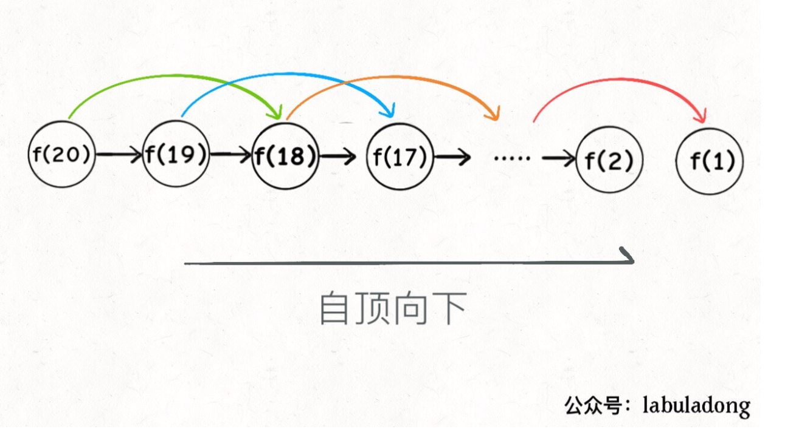

# 链表

## 链表递归思维训练

### 递归翻转链表

#### 1 翻转整个链表

反转一个单链表。

##### 1 递归翻转

算法：

+ 边界条件，只有一个节点，返回该节点
+ 先将n-1个节点翻转
+ 然后将头结点接入到翻转的链表中

**示例:**

```
输入: 1->2->3->4->5->NULL
输出: 5->4->3->2->1->NULL
```

```C++
ListNode reverse(ListNode head) {
    if (head.next == null) return head;
    ListNode last = reverse(head.next);
    head.next.next = head;
    head.next = null;
    return last;
}
```

##### 2 非递归翻转

+ 使用pre，cur，nxt三指针同时遍历，依次修改每个cur的指针。

```C++
class Solution {
public:
    ListNode* reverseList(ListNode* head) {
        if(head==nullptr||head->next==nullptr)
            return head;
        ListNode* fast=head;
        ListNode* slow=nullptr;
        while(fast!=nullptr)
        {
            ListNode* temp=fast->next;
            fast->next=slow;
            slow=fast;
            fast=temp;
        }
        return slow;
    }
};
```


#### 2 递归翻转链表前n个节点

算法：

+ 寻找第n个节点的后继节点
+ 翻转除头结点的n-1个节点
+ 将头头结点插入到n-1的链表中

注意：需要寻找第n个节点的后继节点

```C++
ListNode* successor=null;
ListNode reverseN(ListNode* head,int n)
{
    if(n==1){
        successor=head->next;
        return head;
    }
    ListNod* last=reverseN(head->next,n-1);
    head-<next->next=head;
    head->next=successor;
    return last;
}
```

#### 3 翻转链表的一部分

给你单链表的头指针 head 和两个整数 left 和 right ，其中 left <= right 。请你反转从位置 left 到位置 right 的链表节点，返回 反转后的链表 。

```
输入：head = [1,2,3,4,5], left = 2, right = 4
输出：[1,4,3,2,5]
```

##### 递归实现

算法：

+ 当起始点为1时，直接翻转链表的前right个元素
+ 当起始点不为1时，翻转链表除head节点后的right-1元素。

```C++
class Solution {
private:
    ListNode* successor=nullptr;
public:
    ListNode* reverseBetween(ListNode* head, int left, int right) {
        if(left==1)
        {
            return reverseN(head,right);
        }
        head->next=reverseBetween(head->next,left-1,right-1);
        return head;
    }

    //翻转链表的前n个元素
    ListNode* reverseN(ListNode* head,int n)
    {
        if(n==1)
        {
            successor=head->next;
            return head;
        }
        ListNode* last=reverseN(head->next,n-1);
        head->next->next=head;
        head->next=successor;
        
        return last;
    }
};
```

##### 非递归实现

+ 截断翻转法（两次遍历实现，双指针+穿针引线）：
  + 为了不考虑头结点，直接插入一个虚拟节点
  + 寻找截断链表的两端节点和边缘节点
  + 将链表截断
  + 翻转链表
  + 将边缘节点和截断链表重新组合
+ 头插法+穿针引线：（一次遍历实现）
  + 使用三个指针，pre，cur，nxt进行遍历。
  + 使用头插法。

```C++
//头插法+船政引线
class Solution {
private:
    ListNode* successor=nullptr;
public:
    ListNode* reverseBetween(ListNode* head, int left, int right) {

        //添加头结点
        ListNode* vir_node=new ListNode(-1);
        vir_node->next=head;
        ListNode* pre_node=vir_node;
        //寻找first结点
        for(int i=0;i<left-1;i++)
            pre_node=pre_node->next;
        
        //穿针引线
        ListNode* cur=pre_node->next;
        for(int i=left;i<right;i++)
        {
            ListNode* nxt=cur->next;
            cur->next=nxt->next;
            nxt->next=pre_node->next;
            pre_node->next=nxt;
        }
        return vir_node->next;  
    }
};
```


```C++
//截断翻转法
class Solution {
private:
    ListNode* successor=nullptr;
public:
    ListNode* reverseBetween(ListNode* head, int left, int right) {

        //添加头结点为头节点有可能发生变化，使用虚拟头节点可以避免复杂的分类讨论
        ListNode* vir_node=new ListNode(-1);
        vir_node->next=head;
        ListNode* first=vir_node;
        //寻找first结点
        for(int i=0;i<left-1;i++)
            first=first->next;
        ListNode* left_node=first->next;
        //寻找last结点
        ListNode* right_node=first;
        for(int i=left-1;i<right;i++)
        {
            right_node=right_node->next;
        }
        ListNode* last=right_node->next;
        //截断left到right之间的结点
        right_node->next=NULL;  
        
        //翻转left到right之间结点
        ListNode* new_head=reverseLink(left_node);
        //将first和last和链表重新连接
       first->next=right_node;
       left_node->next=last;
       return vir_node->next;
    }

    //翻转整个链表
    ListNode* reverseLink(ListNode* head)
    {
        ListNode *pre=nullptr;
        ListNode* cur=head;
        while(cur!=NULL)
        {
            ListNode* nxt=cur->next;
            cur->next=pre;
            pre=cur;
            cur=nxt;    
        }
        return pre;
    }
};
```


#### 总结：

+ 链表的递归操作的时间复杂度和迭代算法相同O(N)，
+ 但是其空间复杂度由于需要栈的参与，所以复杂度较高为O(N)

### 回文链表

#### 1 验证回文串

+ 从两边向中心扩展
+ 首尾指针遍历

```C++
class Solution {
public:
    bool isPalindrome(string s) {
        if(s.size()==0)
            return false;
        if(s.size()==1)
            return true;
        int l=0,r=s.size()-1;
        while(l<r)
        {
            if(!isalnum(s[l]))
            {
                l++;
                continue;
            }
            if(!isalnum(s[r]))
            {
                r--;
                continue;
            }
            if(tolower(s[l])==tolower(s[r]))
            {
                l++;
                r--;
                continue;
            }
            return false;          
        }
        return true;
    }
};
```

#### 2 寻找回文串

+ 从中心向两边扩展
+ 要区分奇数和偶数

```C++
string palindromw(string &s,int l,int r)
{
    while(l>=0&&r<size()&&s[l]==s[r]){
        l--;
        r++;
    }
    return s.substr(l+1,r-l-1);
}
```

#### 判断回文链表

##### 递归

算法思想：

+ 借助链表的后序遍历，回归时，进行判断。

```C++
class Solution {
public:
    ListNode* left=nullptr;
    bool isPalindrome(ListNode* head) {
        left=head;
        return traverse(head);
    }
    //链表遍历
    bool traverse(ListNode* right)
    {
        if(right==nullptr)
            return true;
        bool res=traverse(right->next);
        res=res&&(right->val==left->val);
        left=left->next;
        return res;
    }
};
```

##### 非递归

背景：递归需要使用递归栈，此时优化空间复杂度。

方法：

+ 通过快慢指针找到链表的中点：分奇数和偶数
+ 翻转后半段链表
+ 遍历新链表，判断是否回文链表。

```C++
/**
 * Definition for singly-linked list.
 * struct ListNode {
 *     int val;
 *     ListNode *next;
 *     ListNode() : val(0), next(nullptr) {}
 *     ListNode(int x) : val(x), next(nullptr) {}
 *     ListNode(int x, ListNode *next) : val(x), next(next) {}
 * };
 */
class Solution {
public:
    bool isPalindrome(ListNode* head) {
        if(head==nullptr||head->next==nullptr)
            return true;

        //快慢指针寻找中点
        ListNode* fast=head,*slow=head;
        while(fast!=nullptr&&fast->next!=nullptr)
        {
            fast=fast->next->next;
            slow=slow->next;
        }
        //区分奇数偶数
        if(fast!=nullptr)
            slow=slow->next;

        //链表反转
        ListNode* right=reverse(slow);
        //遍历判断是否回文
        ListNode* left=head;
        while(right!=nullptr)
        {
            if(right->val!=left->val)
            {
                return false;
            }
            left=left->next;
            right=right->next;        
        }
        return true;
    }
    ListNode* reverse(ListNode* head)
    {
        if(head==nullptr||head->next==nullptr)
            return head;
        ListNode* pre=nullptr;
        ListNode* cur=head;
        while(cur!=nullptr)
        {
            ListNode* nxt=cur->next;
            cur->next=pre;
            pre=cur;
            cur=nxt;
        }
        return pre;
    }   
};
```


# 动态规划

> [https://github.com/labuladong/fucking-algorithm/blob/master/%E5%8A%A8%E6%80%81%E8%A7%84%E5%88%92%E7%B3%BB%E5%88%97/%E5%8A%A8%E6%80%81%E8%A7%84%E5%88%92%E8%AF%A6%E8%A7%A3%E8%BF%9B%E9%98%B6.md](https://github.com/labuladong/fucking-algorithm/blob/master/动态规划系列/动态规划详解进阶.md)

## **定义**

> 动态规划问题：最优化问题（==最值问题==），如最长递增子序列，最小编辑距离

+ 将一个复杂的问题分解成若干子问题，综合子问题的最优解来得到原问题的最优解。（最优子结构）
+ 通过备忘录或者dp表对算法进行优化，加快问题求解速度。（重叠子问题）

**核心思想：**穷举，将所有的可行答案穷举，然后从中找到最值

### 两种方法，递推和递归

+ 递归解法（自顶向下）：将大问题不断分解成小问题，直到边界，通过小问题的解，回归（归并）到最终的解。
+ 递推解法（自底向上）：从边界出发，不断求解子问题，最终求解最终问题。

**三要素：**

> + ==重叠子问题==：一个问题能够分解为若干子问题，且这些子问题会重复出现
>
>   > 动态规划的关键：减少计算重叠子问题。降低算法的复杂度
>
> + 最优子结构：一个问题的最优解可以通过其子问题的最优解不断构造出来，且子问题之间独立
>
> + 状态转移方程：（核心）
>
>   > 定义的状态需要有无后效性：当前状态记录了历史信息，一旦当前状态确定，就不会改变。历史信息只能通过已有的状态去影响未来的决策。
>
>   

### 最优子结构

定义：一个问题的最优解可以通过其子问题的最优解不断构造出来，且子问题之间独立

> + 最优子结构：已知10个班中，每个班的最高成绩，求十个班中成绩最高的人。
>
> + 非最优子结构：已知10个班中，每个班的最大分差，求十个班中最大分差。
>
>   > 不相互独立，可能分数差在两个班的人之间，如3班和5班

**特点：**最值问题一般都具有最优子结构，一般可使用动态规划求解

### 动态规划和贪心算法和分治算法的区别

+ 动态规划，分治算法

  > 分治法：将大问题分解为子问题，通过对子问题进行合并，如归并排序和快速排序。
  >
  > + 分治法不存在重叠子问题：分治法中出现的子问题均不重叠，子问题不会重复出现
  > + 分治法解决问题不一定是最优化问题，动态规划解决的是最优化问题

+ 动态规划、贪心算法

  > 贪心算法：贪心法自顶向下，但是不等所有子问题解决完综合考虑，而是根据某种策略选择一个子问题求解，没有选择的子问题直接抛弃，==总是在上一个选择后进行下一个选择，整个过程是“单链的”.==
  >
  > 贪心算法是一种更特殊的动态规划，可以进一步降低算法的复杂度。
  >
  > 暴力：O(z^n)  动态规划：多项式时间复杂度    贪心算法：线性时间复杂度
  >
  > + 贪心和动态规划均要有最优子结构
  >   + 贪心算法（壮士断腕）不一定会得到最优解，，动态规划（综合考虑）总能得到最优解。

### dp数组的遍历方向

+ 正向遍历
+ 反向遍历
+ 斜向遍历

核心：

​	**1、遍历的过程中，所需的状态必须是已经计算出来的**。

​	**2、遍历的终点必须是存储结果的那个位置**。


### **状态压缩**

> 使用滚动数组，或者变量保存需要的状态，不要将所有的状态保存

## 基本例子

### 斐波那契数列

**1 暴力递归**

```C++
int fib(int N) {
    if (N == 1 || N == 2) return 1;
    return fib(N - 1) + fib(N - 2);
}
```

大量重叠子问题，比如计算F(20)时，F(18)被多次计算。

==时间复杂度：O(2^n)==

解决方法：使用备忘录，或者dp表记录结果

**2 递归解法**

```C++
int helper(vector<int>& memo, int n) {
    // base case 
    if (n == 1 || n == 2) return 1;
    // 已经计算过
    if (memo[n] != 0) return memo[n];
    memo[n] = helper(memo, n - 1) + helper(memo, n - 2);
    return memo[n];
}
```

使用do表存储所有子问题的答案，给递归树剪枝

==时间复杂度：O(n)==

> 比如计算F(10)时，已知F(9)和F(8)，那么将不需要重复计算。

**3 dp 迭代解法**（动态规划）

```C++
int fib(int N) {
    if (N == 0) return 0;
    if (N == 1) return 1;
    vector<int> dp(N + 1, 0);
    // base case
    dp[1] = dp[2] = 1;
    for (int i = 3; i <= N; i++)
        dp[i] = dp[i - 1] + dp[i - 2];
    return dp[N];
}
```

**递归树**


**备忘录优化：**



**递归方程**：


### 凑零钱问题

> 先看下题目：给你 `k` 种面值的硬币，面值分别为 `c1, c2 ... ck`，每种硬币的数量无限，再给一个总金额 `amount`，问你**最少**需要几枚硬币凑出这个金额，如果不可能凑出，算法返回 -1 。

**最优子结构**

比如你想求 `amount = 11` 时的最少硬币数（原问题），如果你知道凑出 `amount = 10` 的最少硬币数（子问题），你只需要把子问题的答案加一（再选一枚面值为 1 的硬币）就是原问题的答案。因为硬币的数量是没有限制的，所以子问题之间没有相互制，是互相独立的。

解法：

+ **明确dp函数定义**：

  `dp(n)` 的定义：输入一个目标金额 `n`，返回凑出目标金额 `n` 的最少硬币数量。 

+ 状态转移方程


**带备忘录递归**

```C++
def coinChange(coins: List[int], amount: int):
    # 备忘录
    memo = dict()
    def dp(n):
        # 查备忘录，避免重复计算
        if n in memo: return memo[n]
        # base case
        if n == 0: return 0
        if n < 0: return -1
        res = float('INF')
        for coin in coins:
            subproblem = dp(n - coin)
            if subproblem == -1: continue
            res = min(res, 1 + subproblem)
        
        # 记入备忘录
        memo[n] = res if res != float('INF') else -1
        return memo[n]
    
    return dp(amount)
```


**dp 迭代**

```C++
int coinChange(vector<int>& coins, int amount) {
    // 数组大小为 amount + 1，初始值也为 amount + 1
    vector<int> dp(amount + 1, amount + 1);
    // base case
    dp[0] = 0;
    // 外层 for 循环在遍历所有状态的所有取值
    for (int i = 0; i < dp.size(); i++) {
        // 内层 for 循环在求所有选择的最小值
        for (int coin : coins) {
            // 子问题无解，跳过
            if (i - coin < 0) continue;
            dp[i] = min(dp[i], 1 + dp[i - coin]);
        }
    }
    return (dp[amount] == amount + 1) ? -1 : dp[amount];
}
```

## 子序列问题

### 53 最大字序和问题

数组有

### 最长上升子序列问题

常见题目：

题解：https://leetcode-cn.com/problems/non-overlapping-intervals/solution/chuan-shang-yi-fu-wo-jiu-bu-ren-shi-ni-liao-lai-2/

300最长上升子序列：https://leetcode-cn.com/problems/longest-increasing-subsequence

435 无重叠区间 https://leetcode-cn.com/problems/non-overlapping-intervals/  

646 最长数对链 https://leetcode-cn.com/problems/maximum-length-of-pair-chain/

452 用最少的剑射爆气球  https://leetcode-cn.com/problems/minimum-number-of-arrows-to-burst-balloons/

646 最长数对链 https://leetcode-cn.com/problems/maximum-length-of-pair-chain/

#### 300最长上升子序列

找到一个最长的上升子序列

定义：dp[i]:表示以i结尾的最长上升子序列长度，必须包含i

**定义分析：**

> 假设定义：dp[i]：表示nums[0:i]的最大子序和：（可以不包含i)
>
> 该方法不行.无法通过dp[i-1]推导到dp[i]，因为无法保证dp[i-1]的子序列和元素i相邻。


状态转移方程：；dp[i]=max(1,dp[j]+1)(j from 1 to i-1  and a[]]<a[i])

```C++
class Solution {
public:
    int findNumberOfLIS(vector<int>& nums) {
        if(nums.size()==0)
            return 0;
        vector<int> dp(nums.size(),1);//将数组初始化为1
        int ans=0;
        for(int i=0;i<nums.size();i++)
        {
            for(int j=0;j<i;j++)
                if(nums[j]<=nums[i]&&dp[j]+1>dp[i])
                    dp[i]=dp[j]+1;
            ans=max(ans,dp[i]);
        }
        return ans;
    }
};
```

#### [646. 最长数对链](https://leetcode-cn.com/problems/maximum-length-of-pair-chain/)


### [1143. 最长公共子序列](https://leetcode-cn.com/problems/longest-common-subsequence/)

[1143.最长公共子序列](https://leetcode-cn.com/problems/longest-common-subsequence)

[583. 两个字符串的删除操作](https://leetcode-cn.com/problems/delete-operation-for-two-strings/)

[712.两个字符串的最小ASCII删除和](https://leetcode-cn.com/problems/minimum-ascii-delete-sum-for-two-strings)

`dp[i][j]`:text1中i前和text2中j前的最长公共子序列长度（可以不包含i和j）。

递推公式：
$$
dp[i][j]=
\left\{
\begin{array}{**lr**}
dp[i-1][j-1]+1,&a[i]=b[j]\\
max\{dp[i-1][j],dp[i][j-1]\},&a[i]!=b[j]

\end{array}

\right.
$$

```C++
class Solution {
public:
    int longestCommonSubsequence(string text1, string text2) {
        if(text1.size()==0||text2.size()==0)
            return 0;
        int dp[text1.size()+1][text2.size()+1];
        for(int i=0;i<text1.size()+1;i++)
            dp[i][0]=0;
        for(int j=0;j<text2.size()+1;j++)
            dp[0][j]=0;
        int ans=0;
        for(int i=1;i<=text1.size();i++)
        {
            for(int j=1;j<=text2.size();j++)
            {
                if(text1[i-1]==text2[j-1])
                    dp[i][j]=dp[i-1][j-1]+1;
                else
                {
                    dp[i][j]=max(dp[i-1][j],dp[i][j-1]);
                }
            }
        }
        return dp[text1.size()][text2.size()];
    }
};
```

### [5. 最长回文子串](https://leetcode-cn.com/problems/longest-palindromic-substring/)

> 给定一个字符串 s，找到 s 中最长的回文子串。你可以假设 s 的最大长度为 1000。
>
> 示例 1：
>
> 输入: "babad"
> 输出: "bab"
> 注意: "aba" 也是一个有效答案。

解法：动态规划

定义：`dp[i][j]`：表示判断i到j之间的子串是不是回文子串，是赋值1，不是赋值0；

状态转移方程：
$$
dp[i][j]=
\left\{
\begin{array}{**lr**}
dp[i-1][j-1],&a[i]=b[j]\\
0,&a[i]!=b[j]

\end{array}

\right.
$$
注意：为保证递推关系式正常运行，应该斜向下遍历。

```C++
class Solution {
public:
    string longestPalindrome(string s) {
        if(s.size()<=0)
            return {};
        int bp[s.size()][s.size()];
        int ans[2]={0,0};
        for(int i=0;i<s.size();i++)
        {
            for(int j=0;j<s.size();j++)
            {
                if(j==i)
                    bp[i][j]=1;
                else if(j==i+1&&s[i]==s[j])
                {
                    bp[i][j]=1;
                    ans[0]=i;
                    ans[1]=j;
                }     
                else
                    bp[i][j]=0;
            }
        }
        for(int l=3;l<=s.size();l++)
        {
            for(int i=0;i<=s.size()-l;i++)
            {
                int j=i+l-1;
                if(s[i]==s[j])
                    bp[i][j]=bp[i+1][j-1];
                else
                    bp[i][j]=0;
                if(bp[i][j]==1)
                {
                    ans[0]=i;
                    ans[1]=j;
                }
            }
        }
        return s.substr(ans[0],ans[1]-ans[0]+1);
    }
};
```

### 编辑距离

### 信封嵌套问题

354.俄罗斯套娃信封问题

**动态规划**

分析，最长递增子序列变种，关键如何在二维数组中寻找最长递增子序列。

+ 对原二维数组先按照宽度排序，宽度相同按照高度从大到小排序，

  > 高度从大到小是保证相同宽度的情况下能够选择一个高度较大的信封。

+ 然后根据高度进行最长递增子序列求解，求解答案便是问题的解

核心：排序+最长递增子序列

## 背包问题

### 01 背包问题

问题描述：

> 给你一个可装载重量为 `W` 的背包和 `N` 个物品，每个物品有重量和价值两个属性。其中第 `i` 个物品的重量为 `wt[i]`，价值为 `val[i]`，现在让你用这个背包装物品，最多能装的价值是多少

分析

+ 每个物品只有装和不装两种状态，因此状态0或者1，被称为01背包问题。
+ 物品选择情况有是2^n数量级。

dp数组定义：

> `dp[i][w]`：对于前i个物品，当前背包的容量为w时，这时候可以装的最大

边界条件：

> 没有物品，或者没有空间时，最大价值0

## 打家劫舍问题

### [198. 打家劫舍](https://leetcode-cn.com/problems/house-robber/)

感想：

一维序列问题，状态的定义关键（注意选择）

+ 从i开始到结束
+ 从0开始到i结束
+ 是否包括i

**自顶向下**

状态：dp[i]:从第i个房子(i不一定包含）开始偷，得到的最大金额：

做出选择：选择分成两部分：

+ 偷i，接下来只能从i+2开始
+ 不偷i，可以从i+1开始

$$
dp[i]=
\left\{
\begin{array}{**lr**}
0,&i>=n\\
max\{dp[i+1],dp[i+2]+nums[i]\},&i<n

\end{array}

\right.
$$


```C++
class Solution {
public:
    int rob(vector<int>& nums) {
        if(nums.size()==0)
            return 0;
        vector<int> memo(nums.size(),-1);
        return dp(nums,memo,0);
    }
    int dp(vector<int> &nums,vector<int> &memo,int pos)
    {
        if(pos>=nums.size())
            return 0;
        if(memo[pos]!=-1)//初始化为一个不可能的值（做判断）排除全0输入
            return memo[pos];
        int result= max(dp(nums,memo,pos+1),dp(nums,memo,pos+2)+nums[pos]);
        memo[pos]=result;//更新备忘录
        return result;
    }
};
```

**自底向上**

**i后定义：**

dp[i]:从第i个房子(i不一定包含）开始偷，得到的最大金额：

选择分成两部分：

+ 偷i，接下来只能从i+2开始
+ 不偷i，可以从i+1开始

$$
dp[i]=
\left\{
\begin{array}{**lr**}
0,&i>=n\\
max\{dp[i+1],dp[i+2]+nums[i]\},&i<n

\end{array}

\right.
$$

```C++
class Solution {
public:
    int rob(vector<int>& nums) {
        if(nums.size()==0)
            return 0;
        vector<int> memo(nums.size()+2,0);//初始化为0（作为加法）
        for(int i=nums.size()-1;i>=0;i--)
        {
            memo[i]=max(memo[i+1],memo[i+2]+nums[i]);
        }
        return memo[0];
    }
};
//状态压缩，保留I+1和i+2两个状态
class Solution {
public:
    int rob(vector<int>& nums) {
        if(nums.size()==0)
            return 0;
        int i_1=0,i_2=0,cur=0;
        for(int i=nums.size()-1;i>=0;i--)
        {
            cur=max(i_1,i_2+nums[i]);
            i_2=i_1;
            i_1=cur;
        }
        return cur;
    }
};
```

**i前定义：**

dp[i]：从0开始偷，偷到i的最大价值。不一定包含i；

==定义不同遍历的方向不一样。==
$$
dp[i]=
\left\{
\begin{array}{**lr**}
0,&i<=0\\
max\{dp[i-1],dp[i-2]+nums[i]\},&i>=0

\end{array}

\right.
$$


```C++
class Solution {
public:
    int rob(vector<int>& nums) {
        if(nums.size()==0)
            return 0;
        if(nums.size()==1)
            return nums[0];
        if(nums.size()==2)
            return max(nums[0],nums[1]);
        int i_1=max(nums[1],nums[0]),i_2=nums[0],cur=0;
        for(int i=2;i<nums.size();i++)//从2开始遍历到结尾
        {
            cur=max(i_1,i_2+nums[i]);
            i_2=i_1;
            i_1=cur;
        }
        return cur;
    }
};
```

### [213. 打家劫舍 II](https://leetcode-cn.com/problems/house-robber-ii/)

数组围成一个环，要求第一个元素和最后一个元素不能同时选。

**分析：**首尾不能同时选，那么最终的结果由下面三种情况产生

+ 首选，尾不选
+ 首不选，尾选
+ 首尾都不选。

最后的结果由着三者中的较大者产生，最终其实只要比较前两者就行，第三种包含在前两种之间。

定义一个下标范围的dp函数

$f(n)=max\{[0,..n-2],[1...,n-1]\}$

```C++
class Solution {
public:
    int rob(vector<int>& nums) {
        if(nums.size()==0)
            return 0;
        if(nums.size()==1)
            return nums[0];
        if(nums.size()==2)
            return max(nums[0],nums[1]);
        return max(dp(nums,0,nums.size()-2),dp(nums,1,nums.size()-1));
    }

    int dp(vector<int>& nums,int start,int last)
    {
        if(start+1==last)
            return max(nums[start],nums[last]);
        int i_1=0,i_2=0,cur=0;
        for(int i=last;i>=start;i--)
        {
            cur=max(i_1,i_2+nums[i]);
            i_2=i_1;
            i_1=cur;
        }
        return cur;
    }
};
```

### [337. 打家劫舍 III](https://leetcode-cn.com/problems/house-robber-iii/)

> 在上次打劫完一条街道之后和一圈房屋后，小偷又发现了一个新的可行窃的地区。这个地区只有一个入口，我们称之为“根”。 除了“根”之外，每栋房子有且只有一个“父“房子与之相连。一番侦察之后，聪明的小偷意识到“这个地方的所有房屋的排列类似于一棵二叉树”。 如果两个直接相连的房子在同一天晚上被打劫，房屋将自动报警。
>
> 计算在不触动警报的情况下，小偷一晚能够盗取的最高金额。
>
> 示例 1:
>
> 输入: [3,2,3,null,3,null,1]
>
>      3
>     / \
>    2   3
>     \   \ 
>      3   1
>
> 输出: 7 
> 解释: 小偷一晚能够盗取的最高金额 = 3 + 3 + 1 = 7.

==分析：==

+ 结构为树，一般可能需要用递归，使用自顶向下的动态规划

dp[root]:以root为根的树，偷的最大值。可能包含root；

选择情况：

+ 选择root，那么最大值是root->l->l+ l->l->r +l->r->l+ r->r->r;的和(其中注意r的左右子树是否存在)
+ 不选择root，那么是root->l +root->r;


```C++
/**
 * Definition for a binary tree node.
 * struct TreeNode {
 *     int val;
 *     TreeNode *left;
 *     TreeNode *right;
 *     TreeNode(int x) : val(x), left(NULL), right(NULL) {}
 * };
 */
class Solution {
public:
    map<TreeNode*,int> mp;
    int rob(TreeNode* root) {
        if(root==NULL) 
            return 0;
        if(mp.find(root)!=mp.end())
            return mp[root];
        //主要r的左右子树是否存在
        int do_it=root->val+(root->left==NULL?0:rob(root->left->left)+rob(root->left->right))+
        (root->right==NULL?0:rob(root->right->right)+rob(root->right->left));
        
        int not_do=rob(root->left)+rob(root->right);

        int res=max(do_it,not_do);
        mp.insert(make_pair(root,res));
        return res;
    }
};
```


# 贪心算法

定义：求解最优化问题，总是考虑当前状态下的局部最优，最终达到全局最优，

特点：贪心算法求解的问题满足最优子结构，同时可以通过严谨的数学归纳法推导。

## 区间贪心


+ 区间贪心问题

  > 在已知的封闭区间中，找出最多数量的不相交区间。

+ 区间选点问题

  > 在已知的封闭区间中，给出最少数量的点，能够覆盖所有区间。

区别：

+ 区间贪心中，[a,b],[b,c]不是相交区间。
+ 区间选点中，[a,b],[b,c]，点b同时覆盖两个区间。

总结：==最多数量的不相交区间==便是==最少数量的点==。这是同一个问题。

两种思路：

+ 依次删除左端点最大的区间。
+ 依次删除右端点最小的区间。

### [435. 无重叠区间](https://leetcode-cn.com/problems/non-overlapping-intervals/)

**左端点贪心解法**

方法：依次删除左端点大的区间

+ 将区间按照左端点降序排序
+ 从区间中 选择开始时间晚的。
+ 将该区间删除
+ 重复前两个工作

理解：越晚开始的活动有利于空出剩余的时间开展其他活动，保证最多数量的区间

```C++
class Solution {
public:
    bool static compare(vector<int> a,vector<int> b)
    {
        return a[0]>b[0];
    }
    int eraseOverlapIntervals(vector<vector<int>>& intervals) {
        if(intervals.size()==0||intervals.size()==1)
            return 0;
        sort(intervals.begin(),intervals.end(),compare);
        int count=1;
        int start=intervals[0][0];
        for(int i=0;i<intervals.size();i++)
        {
            int end=intervals[i][1];
            if(start>=end)
            {
                count++;
                start=intervals[i][0];
            }
        }
        return intervals.size()-count;  
    }
    
};
```

**右端点贪心解法**:排序+最长上升子序列

方法：删除右端点最小的区间

+ 将每个区间按照结束时间(end)时间升序排序。
+ 从区间集合中选择一个结束时间最小的。
+ 将该区间的所有相交区间删除。
+ 重复前两个工作。

理解：越早开始的活动，越有利于空出剩余的时间去做其他活动。

**由于我们事先排了序**，不难发现所有与 x 相交的区间必然会与 x 的 `end` 相交；如果一个区间不想与 x 的 `end` 相交，它的 `start` 必须要大于（或等于）x 的 `end`：

```C++
class Solution {
public:
    bool static compare(vector<int> a,vector<int> b)
    {
        return a[1]<b[1];
    }
    int eraseOverlapIntervals(vector<vector<int>>& intervals) {
        if(intervals.size()==0||intervals.size()==1)
            return 0;
        sort(intervals.begin(),intervals.end(),compare);
        int count=1;//优先将第一个节点计算在内
        int end=intervals[0][1];
        for(int i=0;i<intervals.size();i++)
        {
            int start=intervals[i][0];
            if(start>=end)
            {
                count++;
                end=intervals[i][1];
            }
        }
        return intervals.size()-count;  
    }
    
};
```

**左端点动态规划**

分析：删除重叠子区间后，剩下的区间成为上升子序列

+ 左端点升序排序
+ 按照最长上升子序列的解法，判断pre.end()和cur.start()做比较。进行动态规划
+ dp[i]，前i个任务中（包括i）的最长上升序列的个数

$$
dp[i]=
\left\{
\begin{array}{**lr**}
1,&a[i]=b[j]\\
max\{dp[j]+1,\}&,j\in{0,...j-1}
\end{array}
\right.
$$

**右端点动态规划**


### [452.用最少数量的箭引爆气球](https://leetcode-cn.com/problems/minimum-number-of-arrows-to-burst-balloons)

**右端点贪心**

==无重叠区间的数量=最小数量的气球==

区别：`[a,b],[b,c]`不是重叠区间，在区间选点中`[a,b][b,c]`是重叠区间

```C++
class Solution {
public:
    bool static compare(vector<int> a,vector<int> b)
    {
        return a[1]<b[1];
    }
    int findMinArrowShots(vector<vector<int>>& points) {
        if(points.size()==0||points.size()==1)
            return points.size();
        
        int count=1;//优先将第一个端点计算在内
        sort(points.begin(),points.end(),compare);
        int end=points[0][1];
        for(int i=0;i<points.size();i++)
        {
            int start=points[i][0];
            if(end<start)
            {
                count++;
                end=points[i][1];
            }
        }
        return points.size()-count;
    }
};
```

动态规划

同解。

## [55. 跳跃游戏](https://leetcode-cn.com/problems/jump-game/)

> 给定一个非负整数数组，你最初位于数组的第一个位置。
>
> 数组中的每个元素代表你在该位置可以跳跃的最大长度。
>
> 判断你是否能够到达最后一个位置。
>
> 示例 1:
>
> 输入: [2,3,1,1,4]
> 输出: true
> 解释: 我们可以先跳 1 步，从位置 0 到达 位置 1, 然后再从位置 1 跳 3 步到达最后一个位置

**贪心算法**

题目含义：通过题目的跳跃规则，最多能够跳多远。

贪心：

从每一个状态，计算该状态能够达到的最远距离，记录最远距离。

和全局最优解对比，通过进一步求解，更新全局最优解。判断全局最优解是否能够达到当前位置。

```C++
class Solution {
public:
    bool canJump(vector<int>& nums) {
        if(nums.size()==0)
            return false;
        int max_length=0;
        for(int i=0;i<nums.size()-1;i++)
        {
            max_length=max(max_length,i+nums[i]);
            if(max_length<=i)//当前位置，遇到0跳不动了，
                return false;
        }
        return true;
    }
};
```

时间复杂度：O(n)

空间复杂度：O(1)

**动态规划**

dp[i]:节点i是否可达；

转移：从后向前遍历每一个状态，如果j状态可达，且能够从j到i，那么i状态可达。
$$
dp[i]=
\left\{
\begin{array}{**lr**}
0,&else\\
1&,dp[j]==1 and dp[j]+nums[j]>=i \quad j\in{0,...j-1} 
\end{array}
\right.
$$


```C++
class Solution {
public:
    bool canJump(vector<int>& nums) {
        if(nums.size()==0)
            return false;
        int max_length=0;
        vector<int> dp(nums.size(),0);
        dp[0]=1;
        for(int i=1;i<nums.size();i++)
        {
            for(int j=i-1;j>=0;j--)
                if(dp[j]==1&&j+nums[j]>=i)//
                {
                    dp[i]=1;
                    break;
                }
        }
        if(dp[nums.size()-1])
            return true;
        else
            return false;
    }
};
```

时间复杂度：O(n^2)

空间复杂度：O(n)

## [45. 跳跃游戏 II](https://leetcode-cn.com/problems/jump-game-ii/)

> 给定一个非负整数数组，你最初位于数组的第一个位置。
>
> 数组中的每个元素代表你在该位置可以跳跃的最大长度。
>
> 你的目标是使用最少的跳跃次数到达数组的最后一个位置。
>
> 示例:
>
> 输入: [2,3,1,1,4]
> 输出: 2
> 解释: 跳到最后一个位置的最小跳跃数是 2。
>      从下标为 0 跳到下标为 1 的位置，跳 1 步，然后跳 3 步到达数组的最后一个位置。

### 动态规划

自顶向下的动态规划求解

dp[i]：从下标i开始，到达最后节点需要的最小step；
$$
dp[i]=
\left\{
\begin{array}{**lr**}
0,&i>=n-1\\
min\{dp[j]+1\}&,i<n-1 \quad j\in \{i,..i+nums[i]\} 
\end{array}
\right.
$$
时间复杂度：O(n^2)

空间复杂度：O(n)

优化：不需要循环计算子问题，选择最优的子问题求解。

### 贪心算法

==寻找最优子问题求解==：

https://labuladong.gitbook.io/algo/dong-tai-gui-hua-xi-lie/1.4-tan-xin-lei-xing-wen-ti/tiao-yue-you-xi

​	区间[i,end]是当前子问题的范围，farth是当前子问题的最优解。

```C++
class Solution {
public:
    int jump(vector<int>& nums) {
        if(nums.size()==0)
            return 0;
        vector<int> memo(nums.size(),nums.size());
        int end=0,fasth_length=0;
        int step=0;
        for(int i=0;i<nums.size()-1;i++)//注意是n-1
        {
            fasth_length=max(fasth_length,i+nums[i]);
            if(i==end)
            {
                step++;
                end=fasth_length;
            }
        }
        return step;
    }
};
```


# 二分法总结

参考资料：

https://leetcode-cn.com/problems/search-insert-position/solution/te-bie-hao-yong-de-er-fen-cha-fa-fa-mo-ban-python-/

### 搜索单个节点

#### **左闭右开**

```C++
int binarySearch(int[] nums, int target) {
    int left = 0; 
    int right = nums.length; // 注意

    while(left < right) {
        int mid = left + (right - left) / 2;
        if(nums[mid] == target)
            return mid; 
        else if (nums[mid] < target)
            left = mid + 1; // 注意
        else if (nums[mid] > target)
            right = mid; // 注意
    }
    return -1;
}
```

特点：

+ 搜索空间：[left,right），左闭右开区间

+ 退出循环条件：while(left<right)

  > 对于[left,right）的空间
  >
  > + while(left<right),退出循环条件是，left==right，此时搜索空间为[left,left)，此时搜索空间已经为空，不用继续搜索

+ 搜索空间缩小：

  > left=mid+1;right=mid;
  >
  > 此时搜索闭空间，因此把数组分为三个部分，`[left,mid）[mid][mid+1,right）`

#### **左闭右闭**

```C++
int binarySearch(int[] nums, int target) {
    int left = 0; 
    int right = nums.length - 1; // 注意

    while(left <= right) {
        int mid = left + (right - left) / 2;
        if(nums[mid] == target)
            return mid; 
        else if (nums[mid] < target)
            left = mid + 1; // 注意
        else if (nums[mid] > target)
            right = mid - 1; // 注意
    }
    return -1;
}
```

特点：

+ 搜索空间：[left,right-1]，左闭右闭区间

+ 退出循环条件：while(left<=right)

  > 对于[left,right-1]的封闭空间
  >
  > + while(left<right),退出循环条件是，left==right，此时搜索空间为[left,left]，left这个元素并没有搜索
  > + while(left<=right)，退出循环的条件是，left=right+1,此时搜索空间是[a+1,a],此时区间为空，元素全部搜索

+ 搜索空间缩小：

  > left=mid+1;right=mid-1;
  >
  > 此时搜索闭空间，因此把数组分为三个部分，`[left,mid-1][mid][mid+1,right]`

**缺点：**

+ 只能搜索单个元素，无法搜索边界。

  > num=[1,2,2,2,3],target=2。运用此算法只能搜索到index=2，无法搜索到左边界1和右边界3.

**总结**

+ 不要使用else，每个条件全用elseif理出来
+ 搜索空间(左闭右开还是左开右闭)的选择，决定while中`<和<=`的选择，最终决定缩小空间时的区间分割。
  + 其中是进行空间搜小的时候不要漏掉元素

### 搜索左端点

#### 左闭右开

```C++
int left_bound(int[] nums, int target) {
    if (nums.length == 0) return -1;
    int left = 0;
    int right = nums.length; // 注意，开闭区间

    while (left < right) { // 注意
        int mid = (left + right) / 2;
        if (nums[mid] == target) {
            right = mid;//注意：不断缩小右边界
        } else if (nums[mid] < target) {
            left = mid + 1;
        } else if (nums[mid] > target) {
            right = mid; // 注意
        }
    }
    // target 比所有数都大,此时left越界
	if (left == nums.length) return -1;
	// 类似之前算法的处理方式
	return nums[left] == target ? left : -1;
}
```

特点：

+ 搜索空间：[left,right)，左闭右开区间

+ 退出循环条件：while(left<right)

+ 搜索空间缩小：

  > + 不相等时：left=mid+1;right=mid;
  >
  >   此时搜索闭空间，因此把数组分为三个部分，`[left,mid)[mid][mid+1,right)`
  >
  > + 相等时：right=mid,不断缩小右边界。

+ 搜索左边界范围：

  > 对于数组num=[2,3,5,7],target==1,或者2算法返回0.含义是：num中小于1的元素有0个
  >
  > 对于数组num=[2,3,5,7]，target==8 算法返回4，含义是num中小于8的元素有4个；
  >
  > **因此：left的取值范围是：[0,num.length]**

+ **index判定：**判定出界，判断target存在

  > num=[2,3,4,5]，left的下标实际上：**target插入到原数组的下标。**
  >
  > + left=0-3：
  >   + target应该置于left，判断left元素是否等于target。
  > + left=4:
  >   + 满足target>7的所有目标都将插入到下标length中。

+ 为什么返回left

  + 退出时left=right，因此返回left和返回right是一样的。

#### 左闭右闭

```C++
int left_bound(int[] nums, int target) {
    int left = 0, right = nums.length - 1;
    // 搜索区间为 [left, right]
    while (left <= right) {
        int mid = left + (right - left) / 2;
        if (nums[mid] < target) {
            // 搜索区间变为 [mid+1, right]
            left = mid + 1;
        } else if (nums[mid] > target) {
            // 搜索区间变为 [left, mid-1]
            right = mid - 1;
        } else if (nums[mid] == target) {
            // 收缩右侧边界
            right = mid - 1;
        }
    }
    // 检查出界情况
    if (left >= nums.length || nums[left] != target)
        return -1;
    return left;
}
```

+ 搜索空间：[left,right]，左闭右闭区间

+ 退出循环条件：while(left<=right)

  > 退出条件为：left=right+1,即退出的搜索空间为[a+1,a]。

+ 搜索空间缩小：

  > + 不相等时：left=mid+1;right=mid-1;
  >
  >   此时搜索闭空间，因此把数组分为三个部分，`[left,mid-1][mid][mid+1,right]`
  >
  > + 相等时：right=mid-1,不断缩小右边界。**mid已经搜索过了，由于闭空间，right需要减1.**

+ 搜索左边界范围：

  > 对于数组num=[2,3,5,7],target==1,或者2算法返回0.含义是：num中小于1的元素有0个
  >
  > 对于数组num=[2,3,5,7]，target==8 算法返回4，含义是num中小于8的元素有4个；
  >
  > **因此：left的取值范围是：[0,num.length]**

+ 为什么返回left

  > 根据条件：代码13-14行，mid相等的条件判断，此时mid=right+1。所以返回的元素应该是right+1;
  >
  > **由于退出循环，left=right+1,因此，可直接返回left**

+ **index判定**：出界判定，target存在判定

  > left范围[0,length]，
  >
  > + left==0那么插入位置下标0，此时target<=num[0]
  > + left==length，此时插入位置为下标length，此时target>num[length-1]

#### 总结

+ 最后均是返回left，left便是元素插入位置
+ 寻找左端点，均是不断压缩右边界。最终在退出条件上寻找插入位置
+ 要检查数组越界，和target不存在的情况

### 搜索右端点

#### 左闭右开

```C++
int right_bound(int[] nums, int target) {
    if (nums.length == 0) return -1;
    int left = 0, right = nums.length;

    while (left < right) {
        int mid = (left + right) / 2;
        if (nums[mid] == target) {
            left = mid + 1; // 注意此处
        } else if (nums[mid] < target) {
            left = mid + 1;
        } else if (nums[mid] > target) {
            right = mid;
        }
    }
    if (right == 0) return -1;
	return nums[right-1] == target ? (right-1) : -1;
}
```

+ 搜索空间：[left,right)左闭右开

+ 退出循环while(left<right)

  + 退出条件left=right

+ 缩小搜索空间

  > + 将分为三个部分[left,mid)[mid,mid+1)[mid+1,right)

+ 寻找有边界，不断缩小左边界

  > 第8行，令left不断加1，不断压缩左边界，从而寻找右边界

+ 返回left-1的原因，其实退出left==right，这里也可以换成right

  > left[0,length]
  >
  > + left=0：left-1将越界，target<所有元素
  > + left=length,此时target>=num[length-1]：
  >   + 要么length-1是右边界，
  >   + 要么target大于所有元素

#### 左闭右闭

```C++
int right_bound(int[] nums, int target) {
    int left = 0, right = nums.length - 1;
    while (left <= right) {
        int mid = left + (right - left) / 2;
        if (nums[mid] < target) {
            left = mid + 1;
        } else if (nums[mid] > target) {
            right = mid - 1;
        } else if (nums[mid] == target) {
            // 这里改成收缩左侧边界即可
            left = mid + 1;
        }
    }
    // 这里改为检查 right 越界的情况，见下图
    if (right < 0 || nums[right] != target)
        return -1;
    return right;
}
```

+ 返回right原因

  > 根据11行，此时mid=left-1.然而退出条件是left=right+1，所以mid=right。所以最终返回right
  >
  > right范围：[-1,length-1]
  >
  > 因此最后要防止越界。

### 总结：

综合以上三种情况，将所有情况变成左闭右闭情况

```C++
int binary_search(int[] nums, int target) {
    int left = 0, right = nums.length - 1; 
    while(left <= right) {
        int mid = left + (right - left) / 2;
        if (nums[mid] < target) {
            left = mid + 1;
        } else if (nums[mid] > target) {
            right = mid - 1; 
        } else if(nums[mid] == target) {
            // 直接返回
            return mid;
        }
    }
    // 直接返回
    return -1;
}

int left_bound(int[] nums, int target) {
    int left = 0, right = nums.length - 1;
    while (left <= right) {
        int mid = left + (right - left) / 2;
        if (nums[mid] < target) {
            left = mid + 1;
        } else if (nums[mid] > target) {
            right = mid - 1;
        } else if (nums[mid] == target) {
            // 别返回，锁定左侧边界
            right = mid - 1;
        }
    }
    // 最后要检查 left 越界的情况
    if (left >= nums.length || nums[left] != target)
        return -1;
    return left;
}


int right_bound(int[] nums, int target) {
    int left = 0, right = nums.length - 1;
    while (left <= right) {
        int mid = left + (right - left) / 2;
        if (nums[mid] < target) {
            left = mid + 1;
        } else if (nums[mid] > target) {
            right = mid - 1;
        } else if (nums[mid] == target) {
            // 别返回，锁定右侧边界
            left = mid + 1;
        }
    }
    // 最后要检查 right 越界的情况
    if (right < 0 || nums[right] != target)
        return -1;
    return right;
}
```

关键点：

+ 相等时，压缩左边界，和压缩右边界的处理。
  + 寻找左边界，压缩有边界
  + 寻找有边界压缩左边界
+ 返回值的处理
  + 寻找左边界，返回左值，范围[0,length]
  + 寻找右边界，返回右值：范围[-1,length-1]

**总结**

+ 如需定义左闭右开的「搜索区间」搜索左右边界，只要在 `nums[mid] == target` 时做修改即可，搜索右侧时需要减一。

+ 如果将「搜索区间」全都统一成两端都闭，好记，只要稍改 `nums[mid] == target` 条件处的代码和返回的逻辑即可

+ **寻找一个数的插入位置，建议使用左端点搜索。因为left返回为[0,length]，均为插入位置**

# 回溯算法

定义：**回溯算法就是DFS算法**

**回溯问题：决策树的遍历过程**

+ 路径：已经做出的选择
+ 选择列表：还可以做的选择
+ 结束条件：到达决策树底层，无法选择

## 核心框架：

```C++
result = []
def backtrack(路径, 选择列表):
    if 满足结束条件:
        result.add(路径)
        return

    for 选择 in 选择列表:
		//排除不合法选择
		if(！vilid())
            continue;
        做选择
        backtrack(路径, 选择列表)
        撤销选择
```


**循环内部：**

```C++
for 选择 in 选择列表:
	//排除不合法选择
	if(不合法)
        continue;

    //做选择
    (将该选择从选择列表移除)
    路径.add(选择)
    backtrack(路径, 选择列表)
    //撤销选择
    路径.remove(选择)
    (将该选择再加入选择列表)
```

+ **我们只要在递归之前做出选择，在递归之后撤销刚才的选择**，就能正确得到每个节点的选择列表和路径。
+ **前序遍历**的代码在进入某一个节点之前的那个时间点执行，**后序遍历**代码在离开某个节点之后的那个时间点执行

## 全排列问题

复杂度分析：

+ O(N!)：回溯框架的时间复杂度均不低于O(N！)

```C++
class Solution {
private:
    //记录所有路径
    vector<vector<int>> all_path;
public:
    vector<vector<int>> permute(vector<int>& nums) {
        if(nums.size()==0)
            return all_path;
        vector<int> track;
        dfs(nums,track,nums.size());
        return all_path;
    }
    //nums选择列表，track路径
    void dfs(vector<int> &nums,vector<int> &track,int n)
    {
        //触发结束条件
        if(track.size()==n)
        {
            all_path.push_back(track);
            return;
        }
		//进行选择
        for(int i=0;i<nums.size();i++)
        {
            //选择列表移除，添加路径
            int temp=nums[i];
            track.push_back(nums[i]);
            nums.erase(nums.begin()+i);
            
            dfs(nums,track,n);
            
            //删除路径，恢复选择列表
            track.pop_back();
            nums.insert(nums.begin()+i,temp);
        }
    }
};
```

## N皇后问题

**分析：找出N皇后的所有全排列**

+ 8皇后问题可类比全排列问题
  + 在棋盘上有8行，每一行有8种选择，构建决策树

使用回溯+剪枝；

+ 对所有情况进行回溯
+ 对不符合要求的情况进行剪枝

复杂度分析：

+ 时间复杂度：$O(N！)$
+ 空间复杂度：O(N)

```C++
class Solution {
private:
    vector<vector<string>> all_path;
public:
    vector<vector<string>> solveNQueens(int n) {
        vector<string> track(n,string(n,'.'));
        dfs(track,0);
        return all_path;
    }
    void dfs(vector<string> &track,int row)
    {
        //结束退出判断
        if(row==track.size())
        {
            all_path.push_back(track);
            return ;
        }
        int n=track[row].size();
        for(int i=0;i<n;i++)
        {
            //无效进行剪枝
            if(!isValid(track,row,i))
                continue;
            track[row][i]='Q';
            dfs(track,row+1);
            track[row][i]='.';
        }
    }
    //排除无效元素，剪枝
    bool isValid(const vector<string> &track,int row,int col)
    {
        //判断同一列
        int m=track.size(),n=track[0].size();
        for(int i=0;i<m;i++)
        {
            if(track[i][col]=='Q')
                return false;
        }
        //判断(row,col)的左上角
        for(int i=row-1,j=col-1;i>=0&&j>=0;i--,j--)
        {
            if(track[i][j]=='Q')
                return false;
        }
        //判断(row,col)的右下角
        for(int i=row-1,j=col+1;i>=0&&j<n;i--,j++)
        {
            if(track[i][j]=='Q')
                return false;
        }
        return true;
    }
};
```

**找出N皇后的一个全排列**

+ 直接在适当的位置返回Ture即可

```C++
// 函数找到一个答案后就返回 true
bool backtrack(vector<string>& board, int row) {
    // 触发结束条件
    if (row == board.size()) {
        res.push_back(board);
        return true;
    }
    ...
    for (int col = 0; col < n; col++) {
        ...
        board[row][col] = 'Q';

        if (backtrack(board, row + 1))
            return true;

        board[row][col] = '.';
    }

    return false;
}
```

## [341. 扁平化嵌套列表迭代器](https://leetcode-cn.com/problems/flatten-nested-list-iterator/)

难度中等319

给你一个嵌套的整型列表。请你设计一个迭代器，使其能够遍历这个整型列表中的所有整数。

列表中的每一项或者为一个整数，或者是另一个列表。其中列表的元素也可能是整数或是其他列表。


分析：

+ 通过dfs不断遍历，回溯。

```C++
/**
 * // This is the interface that allows for creating nested lists.
 * // You should not implement it, or speculate about its implementation
 * class NestedInteger {
 *   public:
 *     // Return true if this NestedInteger holds a single integer, rather than a nested list.
 *     bool isInteger() const;
 *
 *     // Return the single integer that this NestedInteger holds, if it holds a single integer
 *     // The result is undefined if this NestedInteger holds a nested list
 *     int getInteger() const;
 *
 *     // Return the nested list that this NestedInteger holds, if it holds a nested list
 *     // The result is undefined if this NestedInteger holds a single integer
 *     const vector<NestedInteger> &getList() const;
 * };
 */

class NestedIterator {
private:
    vector<int> res;
    vector<int>::iterator cur;
public:
    NestedIterator(vector<NestedInteger> &nestedList) {
        dfs(nestedList);
        cur=res.begin();
    }
    void dfs(vector<NestedInteger>&nestedList)
    {
        for(int i=0;i<nestedList.size();i++)
        {
            if(nestedList[i].isInteger())
                res.push_back(nestedList[i].getInteger());
            else
                dfs(nestedList[i].getList());
        }
    }
    
    int next() {
        return *(cur++);
    }
    
    bool hasNext() {
        return cur!=res.end();
    }
};

/**
 * Your NestedIterator object will be instantiated and called as such:
 * NestedIterator i(nestedList);
 * while (i.hasNext()) cout << i.next();
 */
```


# BFS 算法解题套路框架

**BFS：**

+ 宽度优先搜索算法，目的是决策树中找出两点间的最短路径。
+ **问题的本质就是让你在一幅「图」中找到从起点** **`start`** **到终点** **`target`** **的最近距离**

BFS和DFS的优缺点：

+ BFS可以快速找出最短距离，但是需要的空间复杂度高(队列可能变得很大)
+ DFS找出最短距离需要遍历过所有的结点。

### 框架

```C++
// 计算从起点 start 到终点 target 的最近距离
int BFS(Node start, Node target) {
    queue<Node> q; // 核心数据结构
    unordered_map<Node,int> visited; // 哈希表存储已访问元素

    q.push(start); // 将起点加入队列
    visited[start]=1;
    int step = 0; // 记录扩散的步数

    while (q not empty) {
        int sz = q.size();//<一定要先记录步数
        //遍历队列中的所有节点
        for (int i = 0; i < sz; i++) {
            Node cur = q.pop();
            //（对当前结点进行分析）判断是否到达终点
            if (cur is target)
                return step;
            /* 将 cur 的相邻节点加入队列 */
            for (Node x : cur.adj())
                if (visited.count(x)==0) {
                    q.push(x);
                    visited[x]=1;
                }
        }
        /* 划重点：更新步数在这里 */
        step++;
    }
}
```

**核心算法：**

+ 定义队列和哈希表
+ 头结点入队列，记录层数
+ 队列不为空，进入循环
  + 遍历队列中存在的元素
    + 队列头结点出队列
    + 对队列头进行分析。(是否到达目标结点，是否到达有误位置)
    + 循环将队列头的临接点，放入队列（需要判断是否被访问）
  + 更新步数


注意：

+ **11行：**一定要先记录队列内元素数量，因为队列的进出会改变队列的长度，
+ **哈希表存储已经访问的元素不是固定需要**：如果仅仅是二叉树的话，不需要存储已经访问的结点信息。

#### [111. 二叉树的最小深度](https://leetcode-cn.com/problems/minimum-depth-of-binary-tree/)

给定一个二叉树，找出其最小深度。

最小深度是从根节点到最近叶子节点的最短路径上的节点数量。

**说明：**叶子节点是指没有子节点的节点。

##### BFS解法

**分析：**

+ 使用bfs直接找出到叶子结点的最小路径

复杂度分析：

+ 时间复杂度：O(N)，对每一个节点访问一次
+ 空间复杂度：O(N)，取决于队列的开销，队列开销最大为结点个数

```C++
/**
 * Definition for a binary tree node.
 * struct TreeNode {
 *     int val;
 *     TreeNode *left;
 *     TreeNode *right;
 *     TreeNode() : val(0), left(nullptr), right(nullptr) {}
 *     TreeNode(int x) : val(x), left(nullptr), right(nullptr) {}
 *     TreeNode(int x, TreeNode *left, TreeNode *right) : val(x), left(left), right(right) {}
 * };
 */
class Solution {
public:
    int minDepth(TreeNode* root) {
        if(root==nullptr)
            return 0;
        return bfs(root);
    }

    int bfs(TreeNode* root)
    {
        queue<TreeNode*> q;
        q.push(root);
        int depth=1;
        //队列循环
        while(!q.empty())
        {
            int n=q.size();
            for(int i=0;i<n;i++)
            {
                TreeNode *cur=q.front();
                q.pop();
                if(cur->left==nullptr&&cur->right==nullptr)
                    return depth;
                if(cur->left!=nullptr)
                    q.push(cur->left);
                if(cur->right!=nullptr)
                    q.push(cur->right);
            }
            depth++;
        }
        return depth;
    }
};
```

##### DFS解法

分析：对树使用深度优先搜索，遍历整棵树，记录最小深度

+ 使用递归，知道每一颗子树的深度

复杂度分析：

+ 时间复杂度：O(N)；每一个节点访问一次
+ 空间复杂度：O(H)
  + 最坏情况：O(N)，链路呈现链状
  + 最好情况：树的高度和树呈现正相关，空间复杂度为O(logn)

```C++
/**
 * Definition for a binary tree node.
 * struct TreeNode {
 *     int val;
 *     TreeNode *left;
 *     TreeNode *right;
 *     TreeNode() : val(0), left(nullptr), right(nullptr) {}
 *     TreeNode(int x) : val(x), left(nullptr), right(nullptr) {}
 *     TreeNode(int x, TreeNode *left, TreeNode *right) : val(x), left(left), right(right) {}
 * };
 */
class Solution {
public:
    int minDepth(TreeNode* root) {
        if(root==nullptr)
            return 0;
        return dfs(root);
    }

    int dfs(TreeNode* root)
    {
        if(root==nullptr)
            return 0;
        if(root->left==nullptr&&root->right==nullptr)
            return 1;
        
        int MIN=INT_MAX;
        if(root->left!=nullptr)
            MIN=min(dfs(root->left),MIN);
        if(root->right!=nullptr)
            MIN=min(dfs(root->right),MIN);
        return MIN+1;
    }
};
```

#### [752. 打开转盘锁](https://leetcode-cn.com/problems/open-the-lock/)

你有一个带有四个圆形拨轮的转盘锁。每个拨轮都有10个数字： '0', '1', '2', '3', '4', '5', '6', '7', '8', '9' 。每个拨轮可以自由旋转：例如把 '9' 变为  '0'，'0' 变为 '9' 。每次旋转都只能旋转一个拨轮的一位数字。

锁的初始数字为 '0000' ，一个代表四个拨轮的数字的字符串。

列表 deadends 包含了一组死亡数字，一旦拨轮的数字和列表里的任何一个元素相同，这个锁将会被永久锁定，无法再被旋转。

**分析：**

+ 分析决策选择，每一个字符串“0000”一共有8种状态转换的方式。
+ 使用哈希表存储有问题的结点，遇到有问题结点不能继续遍历以下结点

综上：将整个决策树看为每个节点都有8个子节点的树。

复杂度分析：

+ 时间复杂度：$O(N*A^N)$

  + N表示状态个数，A^N代表所有节点

+ 空间复杂度：

  $A^N$为所有节点的个数

```C++
class Solution {
public:
    int openLock(vector<string>& deadends, string target) {
        if(target.size()==0)
            return -1;
        return bfs(deadends,target);
    }

    //BFS遍历决策树，找到最短路径
    int bfs(vector<string>& deadends,string target)
    {
        queue<string> q_str;
        unordered_map<string,int> visit_hash;
        unordered_map<string,int> dead_hash;
        for(int i=0;i<deadends.size();i++)
        {
            dead_hash[deadends[i]]=1;
        }

        q_str.push("0000");
        visit_hash["0000"]=1;
        int length=0;
        while(!q_str.empty())
        {
            int n_queue=q_str.size();
            for(int i=0;i<n_queue;i++)
            {
                string cur=q_str.front();
                q_str.pop();
                if(cur==target)
                    return length;
                if(dead_hash.count(cur)==1)
                    continue;

                for(int j=0;j<4;j++)
                {
                    string str_up=lock_up(cur,j);
                    if(visit_hash.count(str_up)==0)
                    {
                        q_str.push(str_up);
                        visit_hash[str_up]=1;
                    }
                    string str_down=lock_down(cur,j);
                    if(visit_hash.count(str_down)==0)
                    {
                        q_str.push(str_down);
                        visit_hash[str_down]=1;
                    }
                }
            }
            length++;
        }
        return -1;

    }
    //改变字符串，向上，向下拨动锁
    string lock_up(string lock_str,int index)
    {
        if(lock_str[index]<'9')
            lock_str[index]+=1;
        else
            lock_str[index]='0';
        return lock_str;
    }
    string lock_down(string lock_str,int index)
    {
        if(lock_str[index]>'0')
            lock_str[index]-=1;
        else
            lock_str[index]='9';
        return lock_str;
    }

};
```

# 双指针

### 快慢指针

#### [141. 环形链表](https://leetcode-cn.com/problems/linked-list-cycle/)

思想：龟兔赛跑，当有环时总会相遇

**快慢指针：**

+ 快指针由于走两步，判断是否为空需要注意指针是否存在
+ 循环，先走后判断

复杂度分析：

+ 时间复杂度：O(N)
+ 空间复杂度：O(1)

```C++
class Solution {
public:
    bool hasCycle(ListNode *head) {
        if(head==NULL)
            return false;
        ListNode *fast=head,*last=head;
        while(fast!=NULL&&fast->next!=NULL)
        {
            fast=fast->next->next;
            last=last->next;
            if(fast==last)
                return true;
        }
        return false;
    }
};
```

#### [142. 环形链表 II](https://leetcode-cn.com/problems/linked-list-cycle-ii/)

分析：

+ 相遇时，慢指针走K步，那么快指针一定走了2K步，假设李环点m步，那么快指针和慢指针同时走k-m步即可到达。
+ k-m的计算可通过再次相遇求得。

解法：**快慢指针，二次相遇**

复杂度分析：

+ 时间复杂度：O(N)
+ 空间复杂度：O(1)

算法：

+ 寻找一次相遇点
+ 环判断
+ 寻找二次相遇点

```C++
class Solution {
public:
    ListNode *detectCycle(ListNode *head) {
        if(head==NULL)
            return NULL;
        //寻找相遇点
        ListNode* fast=head,*slow=head;
        while(fast!=NULL&&fast->next!=NULL)
        {
            fast=fast->next->next;
            slow=slow->next;
            if(fast==slow)
                break;   
        }
        //判断是否有环
        if(fast==NULL||fast->next==NULL)
            return NULL;
        slow=head;
        //寻找二次相遇点
        while(fast!=slow)
        {
            fast=fast->next;
            slow=slow->next;
        }
        return slow;
    }
};
```

#### [876. 链表的中间结点](https://leetcode-cn.com/problems/middle-of-the-linked-list/)

分析：

+ 使用快慢指针，最后fast将位于null，或者最后一个元素。
  + 当链表为奇数时，slow位于mid位置
  + 链表为偶数时，slow'位于右mid元素

复杂度分析：

+ 时间复杂度：O(N)
+ 空间复杂度：O(1)

```C++
class Solution {
public:
    ListNode* middleNode(ListNode* head) {
        if(head==NULL)
            return NULL;
        ListNode* fast=head,*slow=head;
        while(fast!=NULL&&fast->next!=NULL)
        {
            fast=fast->next->next;
            slow=slow->next;
        }
        return slow;
    }
};
```

#### [19. 删除链表的倒数第 N 个结点](https://leetcode-cn.com/problems/remove-nth-node-from-end-of-list/)

分析：

+ 快慢指针；快指针先走n步，然后快慢指针同时走，最后慢指针指向倒数第n节点

算法：

+ 快指针先走n步
+ 判断是否到n
+ 判断快指针是否为空，为空直接删除第一个节点
+ 快慢指针同时走，直到快指针为最后一个节点。此时慢指针为倒数n+1个节点。删除慢指针后一个元素

复杂度分析：

+ 时间复杂度：O(N)
+ 空间复杂度：O(1)

```C++
/**
 * Definition for singly-linked list.
 * struct ListNode {
 *     int val;
 *     ListNode *next;
 *     ListNode() : val(0), next(nullptr) {}
 *     ListNode(int x) : val(x), next(nullptr) {}
 *     ListNode(int x, ListNode *next) : val(x), next(next) {}
 * };
 */
class Solution {
public:
    ListNode* removeNthFromEnd(ListNode* head, int n) {
        if(head==nullptr)
            return nullptr;
        ListNode* fast=head,*slow=head;
        int i=1;
        //快指针先跑N步
        while(fast!=nullptr&&i<=n)
        {
            fast=fast->next;
            i++;
        }
        if(i!=n+1)
            return nullptr;
        //判断是否删除头结点
        if(fast==nullptr&&i==n+1)
        {
            ListNode* p=head;
            head=head->next;
            delete p;
            p=nullptr;
            return head;
        }
        //快慢指针同时走，找到倒数N+i个元素
        while(fast->next!=nullptr)
        {
            fast=fast->next;
            slow=slow->next;
        }
        //删除N+1个元素
        ListNode* p=slow->next;
        slow->next=p->next;
        delete p;
        p=nullptr;
        return head;
    }
};
```

### 首尾指针

#### [167. 两数之和 II - 输入有序数组](https://leetcode-cn.com/problems/two-sum-ii-input-array-is-sorted/)

分析：

+ 有序数组，两数之和，使用二分

复杂度分析：

+ 时间复杂度：O(N)
+ 空间复杂度：O(1)

# 滑动窗口

### 模板总结

分析：

+ 通过维持一个滑动窗口，获得最优解

算法：

+ 初始化：need，window哈希表，valid值，left=right=0.构建一个左闭右开空间[left,right)

  + need:目标哈希
  + window，窗口哈希

+ 遍历right（right<s.size()）

  + 扩大窗口，更新窗口哈希和valid值

  + 循环：是否缩小窗口
    + 判断是否满足目标
    + 缩小窗口，更新窗口条件和valid值

要点：

+ window窗口是左闭右开[left,right)。
+ 缩小窗口的条件 
+ 目标的判断
+ 窗口值的更新

```C++
/* 滑动窗口算法框架 */
void slidingWindow(string s, string t) {
    unordered_map<char, int> need, window;
   //构建条件哈希
    for (char c : t) need[c]++;

    int left = 0, right = 0;
    int valid = 0; //存储满足条件个数
    while (right < s.size()) {
        // 右移窗口
        char c = s[right];
        right++;
        
        // 进行窗口内数据的一系列更新
        ...

        /*** debug 输出的位置 ***/
        printf("window: [%d, %d)\n", left, right);
        /********************/

        // 判断左侧窗口是否要收缩
        while (window needs shrink) {
            // 左移窗口
            char d = s[left];
            left++;
            // 进行窗口内数据的一系列更新
            ...
        }
    }
}
```

### [76. 最小覆盖子串](https://leetcode-cn.com/problems/minimum-window-substring/)

给你一个字符串 s 、一个字符串 t 。返回 s 中涵盖 t 所有字符的最小子串。如果 s 中不存在涵盖 t 所有字符的子串，则返回空字符串 "" 。

**示例 1：**

```
输入：s = "ADOBECODEBANC", t = "ABC"
输出："BANC"
```

分析：

+ 使用滑动窗口进行算法解决

**复杂度分析：**

+ 时间复杂度：O(S+T)
  + 有端点遍历S次，左端点遍历最多S-T次
+ 空间复杂度：O(|T|)

**核心：**

+ 扩大window窗口的代码，和缩小window窗口的代码是相反的。
  + 扩大窗口：先扩大窗口，然后判断是否符合条件。
  + 缩小窗口：先判断是否符合条件，然后缩小窗口。

```C++
class Solution {
public:
    string minWindow(string s, string t) {
        if(s.size()==0||t.size()==0)
            return "";
        if(s.size()<t.size())
            return "";
        int left=0,right=0;
        int len=INT_MAX;
        int valid=0;
        int start=0;
        //need哈希添加
        unordered_map<char,int> need,window;
        for(int i=0;i<t.size();i++)
        {
            need[t[i]]++;
        }
        //右端点遍历
        while(right<s.size())
        {
            //window扩大
            char r=s[right];
            right++;
            //更新window窗口
            if(need.count(r)!=0)
            {
                window[r]++;
                if(window[r]==need[r])
                    valid++;
            }
			
            //符合条件时，window收缩
            while(valid==need.size())
            {
                //更新可行解
                if(right-left<len)
                {
                    start=left;
                    len=right-left;
                }
                //window缩小
                char l=s[left];
                left++;
                //更新window内数据
                if(need.count(l)!=0)
                {
                    if(window[l]==need[l])
                        valid--;
                    window[l]--;
                }
            }
        }
        if(len==INT_MAX)
            return "";
        return s.substr(start,len);
    }
};
```

### [567. 字符串的排列](https://leetcode-cn.com/problems/permutation-in-string/)

给定两个字符串 s1 和 s2，写一个函数来判断 s2 是否包含 s1 的排列。

换句话说，第一个字符串的排列之一是第二个字符串的 子串 。

示例 1：

输入: s1 = "ab" s2 = "eidbaooo"
输出: True
解释: s2 包含 s1 的排列之一 ("ba").

**分析：**

+ 使用滑动窗口

复杂度分析：

+ 时间复杂度：O(S+T)
+ 空间复杂度：O(T+C)

```C++
class Solution {
public:
    bool checkInclusion(string s1, string s2) {
        if(s1.size()==0||s2.size()==0)
            return false;
        
        unordered_map<char,int> need,window;
        int left=0,right=0;
        int valid=0;
		//建立need哈希表
        for(int i=0;i<s1.size();i++)
        {
            need[s1[i]]++;
        }
        //遍历right
        while(right<s2.size())
        {
            //扩大窗口
            char r=s2[right];
            right++;
            //更新窗口数据
            if(need.count(r)!=0)
            {
                window[r]++;
                if(window[r]==need[r])
                    valid+=1;
            }
            //左窗口缩小条件
            while(right-left==s1.size())
            {
                //目标判断
                if(valid==need.size())
                    return true;
                //缩小左窗口
                char l=s2[left];
                left++;
                //更新窗口数据
                if(need.count(l)!=0)
                {
                    if(window[l]==need[l])
                        valid--;
                    window[l]--;
                }
            }
        }
        return false;
    }
};
```

### [438. 找到字符串中所有字母异位词](https://leetcode-cn.com/problems/find-all-anagrams-in-a-string/)

```C++
给定一个字符串 s 和一个非空字符串 p，找到 s 中所有是 p 的字母异位词的子串，返回这些子串的起始索引。
字符串只包含小写英文字母，并且字符串 s 和 p 的长度都不超过 20100。
说明：
字母异位词指字母相同，但排列不同的字符串。
不考虑答案输出的顺序。
示例 1:
输入:
s: "cbaebabacd" p: "abc"
输出:
[0, 6]
解释:
起始索引等于 0 的子串是 "cba", 它是 "abc" 的字母异位词。
起始索引等于 6 的子串是 "bac", 它是 "abc" 的字母异位词。
```

分析：

+ 核心找出所有目标子串
+ 套用模板，判断时将结果添加进数组

```C++
class Solution {
public:
    vector<int> findAnagrams(string s, string p) {
        if(s.size()==0&p.size()==0)
            return vector<int>();
        if(s.size()<p.size())
            return vector<int>();

        unordered_map<char,int> need,window;
        vector<int> res;
        for(int i=0;i<p.size();i++)
        {
            need[p[i]]++;
        }
        int left=0,right=0;
        int valid=0;
        while(right<s.size())
        {
            char r=s[right];
            right++;
            if(need.count(r)!=0)
            {
                window[r]++;
                if(window[r]==need[r])
                    valid++;
            }
            while(right-left>=p.size())
            {
                if(valid==need.size())
                    res.push_back(left);
                
                char l=s[left];
                left++;
                if(need.count(l)!=0)
                {
                    if(window[l]==need[l])
                        valid--;
                    window[l]--;
                }
            }
        }
        return res;
    }
};
```

### [3. 无重复字符的最长子串](https://leetcode-cn.com/problems/longest-substring-without-repeating-characters/)

给定一个字符串，请你找出其中不含有重复字符的 最长子串 的长度。

输入: s = "abcabcbb"
输出: 3 
解释: 因为无重复字符的最长子串是 "abc"，所以其长度为 3。

分析：

+ 使用滑动窗口，注意左边缩小条件

```C++
class Solution {
public:
    int lengthOfLongestSubstring(string s) {
        if(s.size()==0)
            return 0;
        unordered_map<char,int> window;

        int left=0,right=0;
        int len=0;
        while(right<s.size())
        {
            //增大窗口，更新窗口
            char r=s[right];
            right++;
            window[r]++;
            //判断是否缩小窗口
            while(window[r]>1)
            {
                //缩小窗口，更新窗口。
                char l=s[left];
                left++;
                window[l]--;
            }
            len=max(len,right-left);
        }
        return len;

    }
};
```

# 区间相关问题

### 区间覆盖问题

#### 1 排序+遍历

分析：

+ 将二维数组排序，排序方式为：
  + 第一个元素从小到大，
  + 第一个元素相同，第二个元素从大到小。**不排序会漏区间**
+ 遍历所有区间，根据以下三种情况删除空间
  + 相交，则合并区间
  + 相隔，则更新区间
  + 重叠，删除区间。

复杂度分析：

+ 时间复杂度：O(NlogN)
+ 空间复杂度：O(1)

```C++
class Solution {
public:
    int removeCoveredIntervals(vector<vector<int>>& intervals) {
        if(intervals.size()==0||intervals.size()==1)
            return intervals.size();
        //排序。
        sort(begin(intervals), end(intervals),[](const vector<int> &o1, const vector<int> &o2){
            return o1[0] == o2[0] ? o2[1] < o1[1] : o1[0] < o2[0];});
        int left=intervals[0][0];
        int right=intervals[0][1];
        int overlap=0;
        for(int i=1;i<intervals.size();)
        {
            //重叠
            if(intervals[i][0]>=left&&intervals[i][1]<=right)
            {
                overlap++;
                intervals.erase(intervals.begin()+i);
                continue;
            }
            //相交
            if(intervals[i][0]<=right&&intervals[i][1]>=right)
            {
                right=intervals[i][1];
                i++;
            }
            //相邻
            if(intervals[i][0]>right)
            {
                left=intervals[i][0];
                right=intervals[i][1];
                i++;
            }
        }
        return intervals.size();
    }
};
```

#### 贪心算法

核心思想：每一步都得到最优解

核心：覆盖条件：

+ 新增区间右端点，小于等于存在区间的右端点

+ 将区间按照start从小到大排序。
  + end1<end2:相交
  + end1>=end2:重叠
+ start相等时，将区间按照end从大到小排序
  + 对于end1<end2.此时end1区间重叠，但是无法分辨
  + end1>end2,可以快速判断重叠

复杂度分析：

+ 时间复杂度：O(NlogN)
+ 空间复杂度：O(1)

```C++
class Solution {
public:
    int removeCoveredIntervals(vector<vector<int>>& intervals) {
        if(intervals.size()==0||intervals.size()==1)
            return intervals.size();
        
        sort(begin(intervals), end(intervals),[](const vector<int> &o1, const vector<int> &o2){
            return o1[0] == o2[0] ? o2[1] < o1[1] : o1[0] < o2[0];});
        int end=0;
        int pre_end=0;
        int len=0;
        for(int i=0;i<intervals.size();i++)
        {
            end=intervals[i][1];
            if(end>pre_end)
            {
                len++;
                pre_end=intervals[i][1];
            }
        }
        return len;
    }
};
```

### 区间合并问题

算法：贪心思想（排序+遍历）

核心：根据新增区间的左端点和合并区间右端点的大小关系，判断是否合并

复杂度分析：

+ 时间复杂度：O(NLogN)：需要排序
+ 空间复杂度：O(1)

```C++
class Solution {
public:
    vector<vector<int>> merge(vector<vector<int>>& intervals) {
        if(intervals.size()==0)
            return {};

        //按照左端点排序
         sort(begin(intervals), end(intervals),[](const vector<int> &o1, const vector<int> &o2){
            return o1[0] == o2[0] ? o2[1] < o1[1] : o1[0] < o2[0];});
        
        vector<vector<int>> new_vec;
        new_vec.push_back(intervals[0]);
        for(int j=1;j<intervals.size();j++)
        {
            int len=new_vec.size();
            int L=intervals[j][0],R=intervals[j][1];
            if(new_vec[len-1][1]>=L)
            {
                int t=max(new_vec[len-1][1],R);
                new_vec[len-1][1]=t;
            }
            else
            {
                new_vec.push_back(intervals[j]);
            }
                
        }
        return new_vec;
    }
};
```

### 区间交集问题

#### [986. 区间列表的交集](https://leetcode-cn.com/problems/interval-list-intersections/)

难度中等141

给定两个由一些 **闭区间** 组成的列表，`firstList` 和 `secondList` ，其中 `firstList[i] = [starti, endi]` 而 `secondList[j] = [startj, endj]` 。每个区间列表都是成对 **不相交** 的，并且 **已经排序** 。

返回这 **两个区间列表的交集** 。

形式上，**闭区间** `[a, b]`（其中 `a <= b`）表示实数 `x` 的集合，而 `a <= x <= b` 。

两个闭区间的 **交集** 是一组实数，要么为空集，要么为闭区间。例如，`[1, 3]` 和 `[2, 4]` 的交集为 `[2, 3]` 。

输入：firstList = [[0,2],[5,10],[13,23],[24,25]], secondList = [[1,5],[8,12],[15,24],[25,26]]
输出：[[1,2],[5,5],[8,10],[15,23],[24,24],[25,25]]


分析：双指针同时遍历两个数组

算法：

+ 如何求交集

  > 无交集情况：A[1]<B[0] || A[0]>B[1]
  >
  > 无交集取反，便是有交集, A[1]>=B[0] && A[0]<=B[1]，相当于两者不断向两边拉
  >
  > 发现规律：交集[c1,c2]  c1=max[a0,b0] ,c2=min[a1,b1]

+ 如何遍历

  > i，j两个指针同时遍历，谁右端点小，谁++

```C++
class Solution {
public:
    vector<vector<int>> intervalIntersection(vector<vector<int>>& firstList, vector<vector<int>>& secondList) {
        if(firstList.size()==0||secondList.size()==0)
            return vector<vector<int>>();
        
        vector<vector<int>> ans;
        for(int i=0,j=0;i<firstList.size()&&j<secondList.size();)
        {
            //交集判断
            if(firstList[i][0]<=secondList[j][1]&&firstList[i][1]>=secondList[j][0])
            {
                int max_n=min(firstList[i][1],secondList[j][1]);
                int min_n=max(firstList[i][0],secondList[j][0]);
                vector<int> temp_vec={min_n,max_n};
                ans.push_back(temp_vec);
            }
            //指针增加
            if(firstList[i][1]<=secondList[j][1])
                i++;
            else
                j++;
        }
        return ans;

    }
};
```

### 总结：

+ 区间覆盖问题

  > 算法：贪心
  >
  > 排序：先要对区间按照左端点进行升序。**注意：右端点降序**
  >
  > 覆盖条件：B[1]<=A[1],   由于情况，A[0]=B[0],A[1]<B[1] 此时也为覆盖，因此要对右端点排序，删除该情况

+ 区间合并问题

  > 算法：贪心
  >
  > 排序：左端点升序，右端点可用可不用
  >
  > 合并条件：B[0]<=A[1], 有交集

+ 区间交集问题

  > 算法：贪心
  >
  > 排序：两端区按照大小排序
  >
  > 合并条件： 
  >
  > + 有交集，A[1]>=B[0] && A[0]<=B[1] 

# 一个函数秒杀 2Sum 3Sum 4Sum 问题

## 2 sum

找出数组中所有和为target的元素，不能包含重复元素

方法：

+ 排序+首尾双指针
+ 遍历+哈希表

### **排序+双指针**

将元素排序，通过双指针遍历数组，遍历同时记得跳过重复元素。

复杂度分析：

+ 时间复杂度：O(NlogN)
+ 空间复杂度：O(N)

```C++
class Solution {
public:
    vector<int> twoSum(vector<int>& nums, int target) {
        if(nums.size()<=1)
            return vector<int>();
        vector<vector<int>> res;
        //排序
        sort(nums.begin(),nums.end());
        int left=0,right=nums.size()-1;
        while(left<right)
        {
            int l_val=nums[left],r_val=nums[right];
            //使用元素把当前左端点值和右端点值存储
            if(nums[left]+nums[right]<target)
            {
                while(left<right && l_val==nums[left])
                    left++;
            }
            else if(nums[left]+nums[right]>target)
            {
                while(left<right && r_val==nums[right])
                    right--;
            }
            else if(nums[left]+nums[right]==target)
            {
                vector<int> temp={nums[left],nums[right]}
                res.push_back(temp);
                //去除相同的元素
                while(left<right && l_val==nums[left])
                    left++;
                while(left<right && r_val==nums[right])
                    right--;
            }   
        }
        return res;
    }
};
```

### 哈希表

分析：遍历元素，使用哈希表存储已经访问元素和下标

复杂度分析：

+ 时间复杂度：O(n)
+ 空间复杂度O(n)

```C++
class Solution {
public:
    vector<int> twoSum(vector<int>& nums, int target) {
        if(nums.size()<=1)
            return vector<int>();
        vector<int> res;
        unordered_map<int,int> hash;
        for(int i=0;i<nums.size();i++)
        {
            int temp=target-nums[i];
            if(hash.count(temp)!=0)
            {
                res.push_back(i);
                res.push_back(hash[temp]);
                break;
            }
            hash[nums[i]]=i;
        }
        return res;
    }
};
```

## 3 sum问题

分析：3 sum问题可以转换为：遍历+2sum和问题

算法：

+ 对nums进行排序
+ 遍历数组
  + 求剩下元素的twosum和
  + 跳过数组中重复元素

复杂度分析：

+ 时间复杂度：O(N^2+NlogN)

  > 排序需要O(NlogN），然后两层遍历需要O(N^2)

+ 空间复杂度：O(N)

```C++
class Solution {
public:
    vector<vector<int>> threeSum(vector<int>& nums) {
        if(nums.size()<3)
            return vector<vector<int>>();
       	//排序
        sort(nums.begin(),nums.end());
        return three_sum_target(nums,0);
    }
	//twosum和
    vector<vector<int>> two_sum(vector<int>& nums,int start,int target)
    {
        int l=start,r=nums.size()-1;
        vector<vector<int>> res;
        while(l<r)
        {
            int l_val=nums[l],r_val=nums[r];
            int sum_val=l_val+r_val;
            if(sum_val<target)
            {
                while(l<r&&l_val==nums[l])
                    l++;
            }
            else if(sum_val>target)
            {
                while(l<r&&r_val==nums[r])
                    r--;
            }
            else if(sum_val==target)
            {
                vector<int> temp;
                temp.push_back(l_val);
                temp.push_back(r_val);
                res.push_back(temp);
                while(l<r&&l_val==nums[l])
                    l++;
                while(l<r&&r_val==nums[r])
                    r--;
            }
        }
        return res;
    }
	//三sum和
    vector<vector<int>> three_sum_target(vector<int>& nums,int target)
    {
        vector<vector<int>> res;
        for(int i=0;i<nums.size();i++)
        {
            int temp_target=target-nums[i];
            vector<vector<int>> two_res=two_sum(nums,i+1,temp_target);
            for(int j=0;j<two_res.size();j++)
            {
                if(two_res[j].size()==2)
                {
                    two_res[j].push_back(nums[i]);
                }
                res.push_back(two_res[j]);
            } 
            while(i<nums.size()-1&&nums[i]==nums[i+1])
                i++;
        }
        return res;
    }
};
```

## 4 sum和问题

分析：

+ 使用2sum 和 3sum 的经验，使用递归，编写Nsum的程序

算法：

+ 先对整个数组进行排序
+ 排除n<2和n>len的情况。直接返回空res
+ 计算n=2情况；
+ 计算n>2 情况，使用递归

```C++
class Solution {
public:
    vector<vector<int>> threeSum(vector<int>& nums) {
        if(nums.size()<3)
            return vector<vector<int>>();
        sort(nums.begin(),nums.end());
        return n_sum(nums,3,0,0);
    }

    vector<vector<int>> n_sum(vector<int>& nums, int n,int start,int target)
    {
        vector<vector<int>> res;
        int len=nums.size();
        if(n<2||len<n)
            return res;
        if(n==2)
        {
            int l=start,r=nums.size()-1;
            while(l<r)
            {
                int l_val=nums[l],r_val=nums[r];
                int sum_val=l_val+r_val;
                if(sum_val<target)
                {
                    while(l<r&&l_val==nums[l])
                        l++;
                }
                else if(sum_val>target)
                {
                    while(l<r&&r_val==nums[r])
                        r--;
                }
                else if(sum_val==target)
                {
                    vector<int> temp;
                    temp.push_back(l_val);
                    temp.push_back(r_val);
                    res.push_back(temp);
                    while(l<r&&l_val==nums[l])
                        l++;
                    while(l<r&&r_val==nums[r])
                        r--;        
                }
            }
        }
        else
        {
            for(int i=start;i<len-1;i++)
            {
                int temp_target=target-nums[i];
                vector<vector<int>> n_1_res=n_sum(nums,n-1,i+1,temp_target);
                for(int j=0;j<n_1_res.size();j++)
                {
                    n_1_res[j].push_back(nums[i]);
                    res.push_back(n_1_res[j]);
                }
                while(i<len-2&&nums[i]==nums[i+1])
                    i++;
            }
        }
        return res;
    }
};
```

# 二叉树总结

## 遍历方式

### 先序遍历

+ 非递归1（特殊）：先序遍历的特殊解法，简单，使用栈保持左右节点之间关系
+ 非递归2（通用）：观察先序遍历的规则，将树看成多条左斜线。一层一层遍历

**非递归遍历1**

思想：通过栈维持结点的左右关系

算法：

+ 将根节点入栈
+ 栈非空进行循环
  + 访问栈顶节点，节点出栈，
  + 将右节点入栈
  + 将左节点入栈

```C++
class Solution {
public:
    vector<int> preorderTraversal(TreeNode* root) {
        vector<int> res;
        if(root==nullptr)
            return res;
        stack<TreeNode*> stk;
        stk.push(root);
        while(!stk.empty())
        {
            //访问当前结点
            TreeNode* p=stk.top();
            res.push_back(p->val);
            stk.pop();

            //右子树左子树进栈
            if(p->right!=nullptr)
                stk.push(p->right);
            if(p->left!=nullptr)
                stk.push(p->left);
        }
        return res;
    }
};
```

**非递归2（通用）**

分析：

+ 将二叉树看成多条左斜线
+ 二叉树的先序遍历就是先自上而下访问左侧链上的节点,再自下而上访问左侧链上的节点的右子树。

算法：

+ 维护一个栈（存储未访问右节点的元素），栈未空或者节点未空继续遍历
  + 访问所有左节点，所有左节点入栈
  + 弹出栈顶，将栈顶右节点入栈。

```C++
class Solution {
public:
    vector<int> preorderTraversal(TreeNode* root) {
        vector<int> res;
        if(root==nullptr)
            return res;
        stack<TreeNode*> stk;
        TreeNode* p=root;
        while(!stk.empty()||p!=nullptr)
        {
            //一直遍历节点的左节点，同时节点入栈
            while(p!=nullptr)
            {
                //访问元素
                res.push_back(p->val);
                stk.push(p);
                p=p->left;
            }
            //取出元素，遍历右节点
            p=stk.top();
            stk.pop();
            p=p->right;
        }
        return res;
    }
};
```


### 中序遍历

**非递归**

分析：

+ 类似先序遍历，先将二叉树看成左斜线，自上而下栈，然后将右节点自下而上进栈
+ 节点的访问顺序不同，先序遍历（入栈时访问），中序遍历（出栈时访问）。

算法：

+ 栈非空，节点非空循环继续
  + 依次将左节点入栈
  + 栈顶出栈，访问该节点，将该节点右节点入栈。

```C++
class Solution {
public:
    vector<int> res;
    vector<int> inorderTraversal(TreeNode* root) {
        
        if(root==nullptr)
            return res;
        stack<TreeNode*> stk;
        TreeNode* p=root;
        while(p!=nullptr||!stk.empty())
        {
            //遍历左子树
            while(p!=nullptr)
            {
                stk.push(p);
                p=p->left;
            }
            //访问栈顶节点，转到右节点
            p=stk.top();
            res.push_back(p->val);
            stk.pop();
            p=p->right;
        }
        return res;

    }
};
```

### 后序遍历

分析：

+ 类似前序遍历，斜线访问，区别是，后序遍历需要先将左子树和右子树访问完，才可以访问cur，此时需要判断是从左子树返回还是从右子树返回。
+ 使用已访问指针记录前一个访问位置，如果，有右子树，并且没访问，则进入右子树访问。

```C++
class Solution {
public:
    vector<int> postorderTraversal(TreeNode* root) {
        vector<int> res;
        if(root==nullptr)
            return res;
        stack<TreeNode*> stk;
        TreeNode* pre_node=nullptr;
        TreeNode* cur=root;
        while(cur!=nullptr||!stk.empty())
        {
            while(cur!=nullptr)
            {
                stk.push(cur);
                cur=cur->left;
            }
            TreeNode* temp=stk.top();
            //从左节点返回
            if(temp->right!=nullptr&&temp->right!=pre_node)
            {
                cur=temp->right;
            }
            else//从右节点返回
            {
                res.push_back(temp->val);
                pre_node=temp;
                stk.pop();
            }
        }
        return res;
    }
};
```

### 层次遍历

```C++
class Solution {
public:
    vector<vector<int>> levelOrder(TreeNode* root) {\
    vector<vector<int>> res;
        if(root==nullptr)
            return res;
        queue<TreeNode*> que;
        que.push(root);
        while(!que.empty())
        {
            int len=que.size();
            vector<int> temp;
            for(int i=0;i<len;i++)
            {
                TreeNode* node=que.front();
                que.pop();
                temp.push_back(node->val);
                if(node->left)
                    que.push(node->left);
                if(node->right)
                    que.push(node->right);
            }
            res.push_back(temp);
        }
        return res;
    }
};
```


## 总结

快速排序和归并排序

+ 快速排序：类似先序遍历，排好基准点然后，分别递归左边和右边
+ 归并排序：类似树的后序遍历，先左边排序，然后右边排序，最后归并。

## 226 翻转二叉树

分析：

+ 树的先序遍历：将当前结点翻转然后遍历左子树，和遍历右子树
+ 树的后序遍历：将左子树翻转，有子树翻转，然后将当前结点翻转。

```C++
class Solution {
public:
    TreeNode* invertTree(TreeNode* root) {
        if(root==nullptr)
            return root;
        
        //当前结点左子树和右子树换位置
        TreeNode* temp=root->left;
        root->left=root->right;
        root->right=temp;
		//左子树和右子树
        invertTree(root->left);
        invertTree(root->right);
        return root;
    }
};
```


## 116. 填充每个节点的下一个右侧节点指针

分析：

+ 方法1：使用递归，类似先序遍历
+ 方法2：使用队列，层次遍历

### 方法1 递归

分析：类似先序遍历。

**为什么选双结点作为递归参数**

+ 单结点递归，只能将是同一个父节点的孩子结点之间相互连接，无法满足不是同一个结点的孩子结点的相互连接
+ 双结点递归：我们的做法就是增加函数参数，一个节点做不到，我们就给他安排两个节点，「将每一层二叉树节点连接起来」可以细化成「将每两个相邻节点都连接起来」：

算法：

+ 递归出界条件
+ 两节点连接
+ 连接左子树节点
+ 连接右子树节点
+ 将左子树和右子树连接

```C++
class Solution {
public:
    Node* connect(Node* root) {
        if (root==NULL)
            return NULL;
        connect_node(root->left,root->right);
        return root;
    }
    void connect_node(Node* node1,Node* node2)
    {
        if(node1==NULL||node2==NULL)
            return;
        node1->next=node2;

        connect_node(node1->left,node1->right);
        connect_node(node2->left,node2->right);
        connect_node(node1->right,node2->left);
    }
};
```

### 2 层次遍历

分析：二叉树的层次遍历，使用队列，层次遍历，依次将元素连接。

```C++
class Solution {
public:
    Node* connect(Node* root) {
        if (root==NULL)
            return NULL;
        queue<Node*> que;
        que.push(root);
        while(!que.empty())
        {
            int q_size=que.size();
            Node* pre=que.front();
            for(int i=0;i<q_size;i++)
            {
                Node* cur=que.front();
                que.pop();

                if(cur!=pre)
                {
                    pre->next=cur;
                    pre=cur;
                }

                if(cur->left)
                    que.push(cur->left);
                if(cur->right)
                    que.push(cur->right);    
            }
        }
        return root;
    }
    
};
```

## [114. 二叉树展开为链表](https://leetcode-cn.com/problems/flatten-binary-tree-to-linked-list/)

给你二叉树的根结点 root ，请你将它展开为一个单链表：

+ 展开后的单链表应该同样使用 TreeNode ，其中 right 子指针指向链表中下一个结点，而左子指针始终为 null 。
+ 展开后的单链表应该与二叉树 先序遍历 顺序相同。

算法：

+ 前序遍历（递归）+数组
+ 先序遍历（非递归）+栈
+ 后序遍历（递归）
+ 原地解法

### 递归，后序遍历

分析：

+ 类似后序遍历（分治法），递归进行展开

算法：

+ 左子树展开
+ 右子树展开
+ 将左子树放置于右子树

复杂度分析：

+ 时间复杂度：O(N)
+ 空间复杂度：O(N)

```C++
class Solution {
public:
    void flatten(TreeNode* root) {
        if(root==NULL)
            return;
        //左子树和右子树分别展开
        flatten(root->left);
        flatten(root->right);
        
		//将左子树放置于右子树
        TreeNode* left_tree=root->left;
        TreeNode* right_tree=root->right;
        root->left=NULL;
        root->right=left_tree;
        TreeNode *p=root;
        while(p->right!=NULL)
            p=p->right;
        p->right=right_tree;
        return ;

    }
};
```

### 原地解法

算法：

+ 遍历树的每一个右节点
  + 左端点不为空，进行如下操作
    + 寻找左端点的最右端点
    + 右子树，放置于最右端点
    + 左子树放置到右子树
    + 左子树为空。

复杂度分析：

+ 时间复杂度：O(N)
+ 空间复杂度：O(1)

```C++
class Solution {
public:
    void flatten(TreeNode* root) {
        if(root==NULL)
            return;
        
        TreeNode* p=root;
        while(p)
        {
            if(p->left!=NULL)
            {
                TreeNode* most_right=p->left;
                while(most_right->right!=NULL)
                    most_right=most_right->right;
                most_right->right=p->right;
                p->right=p->left;
                p->left=NULL;
            }
            p=p->right;
        }
    return ;
    }
};
```

## [654. 最大二叉树](https://leetcode-cn.com/problems/maximum-binary-tree/)

难度中等264

给定一个不含重复元素的整数数组 `nums` 。一个以此数组直接递归构建的 **最大二叉树** 定义如下：

1. 二叉树的根是数组 `nums` 中的最大元素。
2. 左子树是通过数组中 **最大值左边部分** 递归构造出的最大二叉树。
3. 右子树是通过数组中 **最大值右边部分** 递归构造出的最大二叉树。

返回有给定数组 `nums` 构建的 **最大二叉树** 。

分析：

+ 二叉树的构建，使用递归构建

算法：（类似先序遍历）

+ 对于每一个数组
  + 判断数组是否可构建
  + 找出数组最大值，构建节点
  + 构建左节点
  + 构建右节点
  + 返回树的根

```C++
class Solution {
public:
    TreeNode* constructMaximumBinaryTree(vector<int>& nums) {
        if(nums.size()==0)
            return nullptr;
        return most_binary_tree(nums,0,nums.size()-1);

    }
    TreeNode* most_binary_tree(vector<int>& nums,int l,int r)
    {
        if(l>r)
            return nullptr;
        int max_num=nums[l];
        int index=l;
        //找出最大元素
        for(int i=l;i<=r;i++)
        {
            if(nums[i]>max_num)
            {
                max_num=nums[i];
                index=i;
            }       
        }
        //建立节点
        TreeNode* root=new TreeNode(max_num);
		//建立左子树和右子树
        root->left=most_binary_tree(nums,l,index-1);
        root->right=most_binary_tree(nums,index+1,r);
        return root;
    }
};
```

## [105 从前序与中序遍历序列构造二叉树](https://leetcode-cn.com/problems/construct-binary-tree-from-preorder-and-inorder-traversal/)

分析：递归实现(类似先序遍历)

算法：

+ 找出根节点在中序遍历中的 位置
+ 构建根节点
+ 构建左子树
+ 构建右子树

```C++
class Solution {
public:
    TreeNode* buildTree(vector<int>& preorder, vector<int>& inorder) {
        if(preorder.size()==0)
            return nullptr;
        return recur_build(preorder,0,preorder.size()-1,inorder,0,inorder.size()-1);
    }
    TreeNode* recur_build(vector<int>& preorder,int pre_l,int pre_r,vector<int>& inorder,int in_l,int in_r)
    {
        //边界条件
        if(pre_l>pre_r)
            return nullptr;
        
        //找出节点下标
        int root_val=preorder[pre_l];
        int index=in_l;
        for(int i=in_l;i<=in_r;i++)
        {
            if(inorder[i]==root_val)
            {
                index=i;
                break;
            }
        }
        
        //构建根节点
        int left_len=index-in_l;
        TreeNode* root=new TreeNode(root_val);

        //递归构建左右子树
        root->left=recur_build(preorder,pre_l+1,pre_l+left_len,inorder,in_l,index-1);
        root->right=recur_build(preorder,pre_l+left_len+1,pre_r,inorder,index+1,in_r);
        return root;
    }
};
```

## [106. 从中序与后序遍历序列构造二叉树](https://leetcode-cn.com/problems/construct-binary-tree-from-inorder-and-postorder-traversal/)

分析：类似先序遍历递归

```C++
class Solution {
public:
    TreeNode* buildTree(vector<int>& inorder, vector<int>& postorder) {
        if(inorder.size()==0)
            return nullptr;
        return recur_bulid(inorder,0,inorder.size()-1,postorder,0,postorder.size()-1);
    }
    TreeNode* recur_bulid(vector<int>& inorder,int in_l,int in_r,vector<int>& postorder,int post_l,int post_r)
    {
        if(in_l>in_r)
            return nullptr;
        
        //找出根节点位置
        int root_val=postorder[post_r];
        int index=in_l;
        for(int i=in_l;i<=in_r;i++)
        {
            if(root_val==inorder[i])
            {
                index=i;
                break;
            }
        }
        
        TreeNode* root=new TreeNode(root_val);
        int left_len=index-in_l;
        
        root->left=recur_bulid(inorder,in_l,index-1,postorder,post_l,post_l+left_len-1);
        root->right=recur_bulid(inorder,index+1,in_r,postorder,post_l+left_len,post_r-1);

        return root;

        //递归建立子树和右子树
    }
};
```

## [652. 寻找重复的子树](https://leetcode-cn.com/problems/find-duplicate-subtrees/)

难度中等255

给定一棵二叉树，返回所有重复的子树。对于同一类的重复子树，你只需要返回其中任意**一棵**的根结点即可。

两棵树重复是指它们具有相同的结构以及相同的结点值。


分析：根据题意，重复的子树，关键在两个问题

+ 当前以改根为结点的树涨啥样

  > **树的序列化**，记录树的形状，使用#表示空节点，节点之间使用，分离

+ 如何判断重复

  > 使用哈希表存储序列树

算法：

+ 递归获取左右子树
+ 获得树的序列化
+ 将树加入哈希表
+ 判断树是否存在过。

```C++
class Solution {
private:
    vector<TreeNode*> res;
    unordered_map<string,int> hash_map;
public:
    vector<TreeNode*> findDuplicateSubtrees(TreeNode* root) {
        if(root==nullptr)
            return vector<TreeNode*>();
        traverse(root);
        return res;
    }
    string traverse(TreeNode* root)
    {
        //退出条件
        if(root==nullptr)
            return "#";

        //获取左右子树
        string left_tree=traverse(root->left);
        string right_tree=traverse(root->right);
        //序列化当前树
        string cur_tree=left_tree+','+right_tree+' '+to_string(root->val);

        //判断左右子树是否加入结果列表和哈希记录表
        if(hash_map.count(cur_tree)==0)
        {
            hash_map[cur_tree]=1;
            return cur_tree;
        }    
        if(hash_map[cur_tree]==1)
        {
            res.push_back(root);
            hash_map[cur_tree]++;
        }    
        return cur_tree;
    }
};
```

## BST

### [230. 二叉搜索树中第K小的元素](https://leetcode-cn.com/problems/kth-smallest-element-in-a-bst/)

分析：二叉搜索树（BST）的中序遍历是有序排列，通过此来找BST中第k个元素。

使用二叉树的中序遍历.

```C++
class Solution {
public:
    int kthSmallest(TreeNode* root, int k) {
        if(root==nullptr)
            return 0;
        int index=0;
        int res=root->val;
        treaver(root,k,index,res);
        return res;

    }
    //index:当前访问的点，
    void treaver(TreeNode* root,int k,int &index,int &res)
    {
        if(root==nullptr)
            return ;
        
        treaver(root->left,k,index,res);
        
        index++;
        if(index==k)
        {
            res=root->val;
            return;
        }
        treaver(root->right,k,index,res);
    }
};
```

### [538. 把二叉搜索树转换为累加树](https://leetcode-cn.com/problems/convert-bst-to-greater-tree/)

难度中等503

给出二叉 **搜索** 树的根节点，该树的节点值各不相同，请你将其转换为累加树（Greater Sum Tree），使每个节点 `node` 的新值等于原树中大于或等于 `node.val` 的值之和。

提醒一下，二叉搜索树满足下列约束条件：

- 节点的左子树仅包含键 **小于** 节点键的节点。
- 节点的右子树仅包含键 **大于** 节点键的节点。
- 左右子树也必须是二叉搜索树。

#### 二叉树 中序反递归（右，根，左）

```C++
class Solution {
private:
    int sum=0;
public:
    TreeNode* convertBST(TreeNode* root) {
        if(root==nullptr)
            return nullptr;
        traverBST(root);
        return root;
    }

    void traverBST(TreeNode* root)
    {
        if(root==nullptr)
            return;
        traverBST(root->right);
        sum+=root->val;
        root->val=sum;
        traverBST(root->left);
    }
};
```

#### 中序遍历，非递归(反序列)

分析：

+ 直接使用中序（反）遍历，访问节点，改变节点值

```C++
class Solution {
private:
    int sum=0;
public:
    TreeNode* convertBST(TreeNode* root) {
        if(root==nullptr)
            return nullptr;
        TreeNode* cur=root;
        stack<TreeNode*> stk;
        int sum=0;
        while(!stk.empty()||cur!=nullptr)
        {
            while(cur)
            {
                stk.push(cur);
                cur=cur->right;
            }
            cur=stk.top();
            sum+=cur->val;
            cur->val=sum;
            stk.pop();
            
            cur=cur->left;
        }
        return root;
    }
};
```

### [98. 验证二叉搜索树](https://leetcode-cn.com/problems/validate-binary-search-tree/)

难度中等1004

给定一个二叉树，判断其是否是一个有效的二叉搜索树。

假设一个二叉搜索树具有如下特征：

- 节点的左子树只包含**小于**当前节点的数。
- 节点的右子树只包含**大于**当前节点的数。
- 所有左子树和右子树自身必须也是二叉搜索树。


分析：

+ 递归+先序遍历思想。对当前结点的左右节点判断，会出现错误


算法：递归+先序遍历

+ 保证当前结点为小于树的最大值，大于树的最小值，同时对子树进行判断。

```C++
class Solution {
public:
    bool isValidBST(TreeNode* root) {
        if(root==nullptr)
            return true;
        return isValidBST(root,nullptr,nullptr);

    }
    bool isValidBST(TreeNode* root,TreeNode* max,TreeNode* min)
    {
        if(root==nullptr)
            return true;
        
        //判断当前树是否合法
        if(max!=nullptr&&root->val>=max->val) return false;
        if(min!=nullptr&&root->val<=min->val) return false;

        return isValidBST(root->left,root,min)&&isValidBST(root->right,max,root);

        //判断子树是否合法
    }
};
```


### [700. 二叉搜索树中的搜索](https://leetcode-cn.com/problems/search-in-a-binary-search-tree/)

难度简单122

给定二叉搜索树（BST）的根节点和一个值。 你需要在BST中找到节点值等于给定值的节点。 返回以该节点为根的子树。 如果节点不存在，则返回 NULL。

分析：

+ 使用递归，类似二分搜索。
+ 非递归，使用迭代。

```C++
//递归解法
class Solution {
public:
    TreeNode* searchBST(TreeNode* root, int val) {
        if(root==nullptr)
            return nullptr;
        
        //判断当前结点
        if(root->val==val)
            return root;
        else if(root->val>val)//判断左边
            return searchBST(root->left,val);
        else if(root->val<val)//判断右边
            return searchBST(root->right,val);
        return root;
    }
};
```

```C++
//迭代实现
class Solution {
public:
    TreeNode* searchBST(TreeNode* root, int val) {
        if(root==nullptr)
            return nullptr;
        
        //二分法遍历二叉搜索树
        while(root&&root->val!=val)
        {
            if(root->val<val)   root=root->right;
            else if(root->val>val) root=root->left;
        }
        return root;
    }
};
```

### [701. 二叉搜索树中的插入操作](https://leetcode-cn.com/problems/insert-into-a-binary-search-tree/)

难度中等171

给定二叉搜索树（BST）的根节点和要插入树中的值，将值插入二叉搜索树。 返回插入后二叉搜索树的根节点。 输入数据 **保证** ，新值和原始二叉搜索树中的任意节点值都不同。

**注意**，可能存在多种有效的插入方式，只要树在插入后仍保持为二叉搜索树即可。 你可以返回 **任意有效的结果** 


分析：搜索+插入

+ 先找到目标元素，然后插入目标元素

算法：

+ 递归
+ 迭代

```C++
//迭代
class Solution {
public:
    TreeNode* insertIntoBST(TreeNode* root, int val) {
        
        //到达最低端
        if(root==nullptr)
            return new TreeNode(val);
        TreeNode* p=root;
        TreeNode* pre=nullptr;
        while(p)
        {
            pre=p;
                if(val<p->val)
                    p=p->left;
                else if(val>p->val)
                    p=p->right;
        }
        //插入
        if(val<pre->val)
            pre->left=new TreeNode(val);
        else
            pre->right=new TreeNode(val);
        return root;
    }
};
```

```C++
//递归
class Solution {
public:
    TreeNode* insertIntoBST(TreeNode* root, int val) {
        
        //到达最低端
        if(root==nullptr)
            return new TreeNode(val);

        //左端点寻找
        if(val<root->val)
            root->left=insertIntoBST(root->left,val);
        //右端点选择
        else if(val>root->val)
            root->right=insertIntoBST(root->right,val);
        return root;
    }
};
```

### [450. 删除二叉搜索树中的节点](https://leetcode-cn.com/problems/delete-node-in-a-bst/)

> 难度中等424
>
> 给定一个二叉搜索树的根节点 **root** 和一个值 **key**，删除二叉搜索树中的 **key** 对应的节点，并保证二叉搜索树的性质不变。返回二叉搜索树（有可能被更新）的根节点的引用。
>
> 一般来说，删除节点可分为两个步骤：
>
> 1. 首先找到需要删除的节点；
> 2. 如果找到了，删除它。

分析：删除和插入差不多，先寻找，然后删除。

算法：

+ 找到目标结点
  + 目标结点为叶子结点
  + 目标结点只有一个子节点：子节点代替当前结点
  + 目标节点有两个节点：使用右子树的最小节点代替当前结点
+ 向左寻找
+ 向右寻找

```C++
class Solution {
public:
    TreeNode* deleteNode(TreeNode* root, int key) {
        if(root==nullptr)
            return nullptr;
        //寻找目标结点
        //找到目标结点
        if(root->val==key)
        {
            //叶子结点//一个子节点
            if(root->left==nullptr)
                return root->right;
            if(root->right==nullptr)
                return root->left;
            //两个子节点
            TreeNode* min=min_node(root->right);
            root->val=min->val;
            root->right=deleteNode(root->right,min->val);
        }
        //向左寻找
        else if(key<root->val)
        {
            root->left=deleteNode(root->left,key);
        }
        //向右寻找
        else if (key>root->val)
        {
            root->right=deleteNode(root->right,key);
        }
        return root;
    }
	//寻找最小节点
    TreeNode* min_node(TreeNode* root)
    {
        while(root->left)
            root=root->left;
        return root;
    }
};
```

## 二叉树序列化

### 层次遍历

+ 为了实现反序列化，需要记录空指针null。即。叶子结点必须是null


```C++
class Codec {
public:
    // Encodes a tree to a single string.
    string serialize(TreeNode* root) {
        if(root==nullptr)
            return "[]";
        
        string str="[";
        queue<TreeNode*> que;
        que.push(root);
        while(!que.empty())
        {
            int len=que.size();
            for(int i=0;i<len;i++)
            {
                TreeNode* cur=que.front();
                que.pop();
                if(cur!=NULL)
                    str+=(to_string(cur->val)+',');
                else if(cur==NULL)
                {
                    str+="null,";
                    continue;//注意需要continue
                }
                    
                que.push(cur->left);
                que.push(cur->right);
            }
        }
        int str_len=str.size();
        str[str_len-1]=']';
        return str;
    }

    // Decodes your encoded data to tree.
    TreeNode* deserialize(string data) {
        if(data=="[]")
            return nullptr;

        //将字符串传入数组
        vector<string> str_vec;
        string new_str=data.substr(1,data.size()-2);
        istringstream iss(new_str);
        string temp;
        while(getline(iss,temp,','))
            str_vec.push_back(temp);
        
        //层次遍历构建二叉树
        queue<TreeNode*> que;
        TreeNode* root=new TreeNode(stoi(str_vec[0]));
        que.push(root);
        for(int i=1;i<str_vec.size();)
        {
            TreeNode* parent=que.front();
            que.pop();

            string left_node=str_vec[i++];
            if(left_node!="null")
            {
                parent->left=new TreeNode(stoi(left_node));
                que.push(parent->left);
            }
            else
                parent->left=nullptr;
                      
            string right_node=str_vec[i++];
            if(right_node!="null")
            {
                parent->right=new TreeNode(stoi(right_node)); 
                que.push(parent->right);
            }
            else
                parent->right=nullptr;
                
        }
        return root;
        
    }

```

## [236. 二叉树的最近公共祖先](https://leetcode-cn.com/problems/lowest-common-ancestor-of-a-binary-tree/)

难度中等1058

给定一个二叉树, 找到该树中两个指定节点的最近公共祖先。

[百度百科](https://baike.baidu.com/item/最近公共祖先/8918834?fr=aladdin)中最近公共祖先的定义为：“对于有根树 T 的两个节点 p、q，最近公共祖先表示为一个节点 x，满足 x 是 p、q 的祖先且 x 的深度尽可能大（**一个节点也可以是它自己的祖先**）。”

 

分析：

+ 函数含义：

  > 给一个节点root，p，q，返回一个节点
  >
  > + 如果p，q不在root为根的子树中，返回null
  > + 如果在，root为根的子树中，返回最近节点
  > + 其中一个在，返回在那个节点

+ 边界条件：

  + root为空，返回null
  + root为某个节点，返回那个节点。

+ 算法

  + 对根进行考虑
  + 对左右子树进行考虑


```C++
class Solution {
public:
    //判断最近公共祖先
    TreeNode* lowestCommonAncestor(TreeNode* root, TreeNode* p, TreeNode* q) {
        //考虑根
        if(root==NULL)
            return nullptr;
        if(root==p||root==q)
            return root;

        TreeNode* left_node=lowestCommonAncestor(root->left,p,q);
        TreeNode* right_node=lowestCommonAncestor(root->right,p,q);

        //两个节点没有在左右子树中
        if(left_node==nullptr&&right_node==nullptr)
            return nullptr;
        
        //两个节点分别在左右子树中
        if(left_node!=nullptr&&right_node!=nullptr)
            return root;
        //只有其中一个节点在子树中
        if(left_node!=nullptr)
            return left_node;
        return right_node;
    }
};
```

## [222. 完全二叉树的节点个数](https://leetcode-cn.com/problems/count-complete-tree-nodes/)

难度中等463

给你一棵 **完全二叉树** 的根节点 `root` ，求出该树的节点个数。

[完全二叉树](https://baike.baidu.com/item/完全二叉树/7773232?fr=aladdin) 的定义如下：在完全二叉树中，除了最底层节点可能没填满外，其余每层节点数都达到最大值，并且最下面一层的节点都集中在该层最左边的若干位置。若最底层为第 `h` 层，则该层包含 `1~ 2h` 个节点。

分析：

+ 递归二叉树遍历+剪枝
+ **完全二叉树性质，左右子树必有一个是满二叉树**

算法

+ 对二叉树进行满二叉树判断，是直接计算结果，剪枝
+ 对左右子树进行递归

算法复杂度：

+ 时间复杂度：O($logN*logN$)

  > 寻找满二叉树，O(lonN)
  >
  > 递归：O(logN)。

```C++
class Solution {
public:
    int countNodes(TreeNode* root) {
        if(root==nullptr)
            return 0;
        
        //对二叉树进行剪枝
        TreeNode* p_left=root,*p_right=root;
        int l_high=0;
        int r_high=0;
        while(p_left)
        {
            p_left=p_left->left;
            l_high++;
        }
        while(p_right)
        {
            p_right=p_right->right;
            r_high++;
        }
        if(l_high==r_high)
            return pow(2,l_high)-1;

        return countNodes(root->left)+countNodes(root->right)+1;
    }
};
```

# 设计数据结构

## 并查集

## LRU 算法、LFC算法

 L缓存淘汰策略：east Recently Used（LRU）最近最少使用


## [295. 数据流的中位数](https://leetcode-cn.com/problems/find-median-from-data-stream/)

难度困难399

中位数是有序列表中间的数。如果列表长度是偶数，中位数则是中间两个数的平均值。

例如，

[2,3,4] 的中位数是 3

[2,3] 的中位数是 (2 + 3) / 2 = 2.5

算法分析：

+ 大顶堆存小元素，小顶堆存放大元素。
+ 插入元素
  + 保证大顶堆元素全小于小顶堆元素
    + 放入大顶堆，先放入小顶堆，小顶堆堆顶放入大顶堆
    + 放入小顶堆，先放入大顶堆，大顶堆堆顶放入小顶堆。
  + 保证大顶堆和小顶堆元素相差1。
    + 大顶堆元素少，放入大顶堆
    + 小顶堆元素少，放入小顶堆
    + 元素数量相等，入小顶堆

复杂度分析：

+ add：O(logN)
+ find：O(1)

```C++
class MedianFinder {
private:
    //small大顶堆，large 小顶堆
    priority_queue<int,vector<int>,less<int> > small;
    priority_queue<int,vector<int>,greater<int> > large;
public:
    /** initialize your data structure here. */
    MedianFinder() {
    }
    
    void addNum(int num) {
        if(small.size()<=large.size())
        {
            large.push(num);
            int temp=large.top();
            small.push(temp);
            large.pop();
        }
        else if(small.size()>large.size())
        {
            small.push(num);
            int temp=small.top();
            large.push(temp);
            small.pop();
        }
    }
    
    double findMedian() {
        if(small.size()>large.size())
            return small.top();
        else if(small.size()<large.size())
            return large.top();
        return (small.top()+large.top())/2.0;
    }
};
```

## 单调栈

```C++
#include<iostream>

using namespace std;

typedef long long ll;

const ll maxn = 1e18 + 1;
ll pri[10010];
ll sumx[10010];
ll index = 0;
void getpri(ll m)//分解质因数 
{
	for (ll i = 2; i * i <= m; i++)
	{
		while (m % i == 0)
		{
			pri[index] = i;
			sumx[index]++;
			m /= i;
		}
		if (sumx[index]) 
			index++;
	}
	if (m > 1) 
		pri[index] = m, sumx[index++] = 1;
}

ll getsumX(ll n, ll p)//n！能分解出sumX个p 
{
	ll sumX = 0;
	while (n > 0)
	{
		sumX += n / p;
		n /= p;
	}
	return sumX;
}

int main()
{
	ll n, m, ans = maxn;
	cin >> n >> m;
	getpri(m);
	for (ll i = 0; i < index; i++) 
		ans = min(ans, getsumX(n, pri[i]) / sumx[i]);
	cout << ans << endl;
}
```

