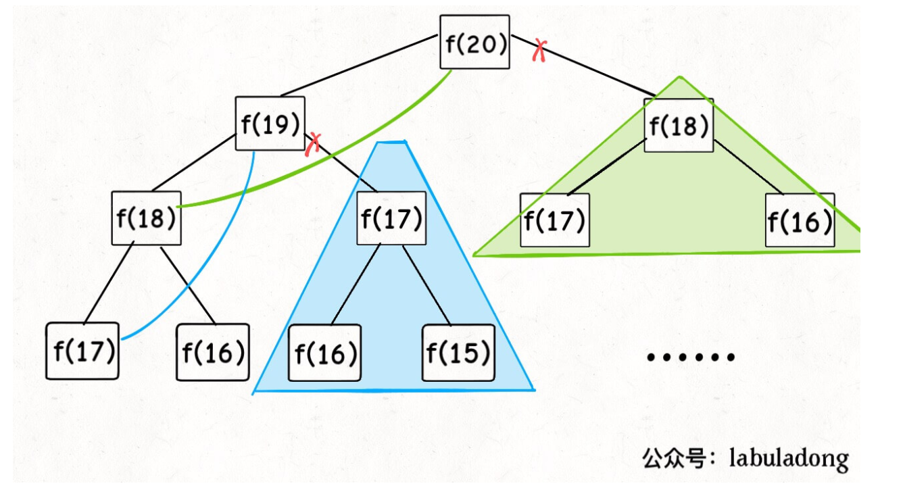
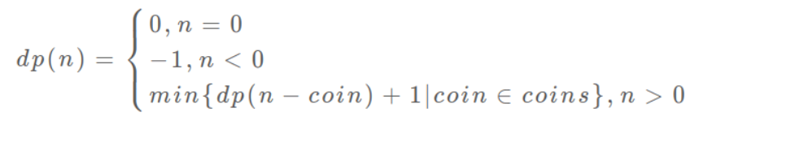

# 链表

## 707构建链表

### 1.单链表

没有头结点，结点的下标从0开始

+ 初始化链表：ListNode可以定义一个构造函数用于结构体的初始化
+ 获取下标为index的结点：i和p必须同步
+ 尾插法：需要判断head是否指向空
+ 插入下标index：需要先将index==0插入，然后寻找index的前驱结点
+ 删除下标index结点：需要先将index=0情况排除，然后寻找index的前驱结点·

```C++
class MyLinkedList {
private:
    typedef struct ListNode
    {
        int val;
        ListNode *next;
        ListNode(int x):val(x),next(nullptr){}
    }ListNode;
    ListNode *head;
public:
    /** Initialize your data structure here. */
    MyLinkedList():head(nullptr){    
    }
    
    /** Get the value of the index-th node in the linked list. If the index is invalid, return -1. */
    int get(int index) {
        //index从0开始，同时i和指针p需要同步
        int i=0;
        ListNode *p=head;
        while (p&&i<index)
        {
            p=p->next;
            i++;
        }
        if (p) return p->val;
        else return -1;
    }
    
    /** Add a node of value val before the first element of the linked list. After the insertion, the new node will be the first node of the linked list. */
    void addAtHead(int val) {
        ListNode *p=new ListNode(val);
        p->next=head;
        head=p;
    }
    
    /** Append a node of value val to the last element of the linked list. */
    void addAtTail(int val) {
        ListNode *temp=new ListNode(val);
        ListNode *p=head;
        if (head==nullptr)
        {
            head=temp;
            return;
        }
        while(p->next!=nullptr)
            p=p->next;
        p->next=temp;
    }
    
    /** Add a node of value val before the index-th node in the linked list. If index equals to the length of linked list, the node will be appended to the end of linked list. If index is greater than the length, the node will not be inserted. */
    void addAtIndex(int index, int val) {
        ListNode *temp=new ListNode(val);
        //index==0的情况
        if(index<=0)
        {
            temp->next=head;
            head=temp;
            return;
        }
        //寻找index-1结点
        int i=0;
        ListNode *p=head;
        while(p &&i<index-1)
        {
            p=p->next;
            i++;
        }
        //判断是否找到
        if (p)
        {
            temp->next=p->next;
            p->next=temp;
        }


    }
    
    /** Delete the index-th node in the linked list, if the index is valid. */
    void deleteAtIndex(int index) {
        if (head==nullptr|| index<0)
            return;
        //index==0的情况排除
        if(index==0)
        {
            head=head->next;
        }
        //寻找index-1的结点
        int i=0;
        ListNode *p=head;
        while(p && i<index-1)
        {
            p=p->next;
            i++;
        }
        //没找到直接删除
        if (!p) return;
        //找到判断是否有index结点
        if(p->next)
        {
            ListNode *del=p->next;
            p->next=del->next;
            delete del;
        }

    }
    
    int length()
    {
        int i=0;
        ListNode *p=head;
        while(p)
        {
            p=p->next;
            i++
        }
        return i;
    }
};

/**
 * Your MyLinkedList object will be instantiated and called as such:
 * MyLinkedList* obj = new MyLinkedList();
 * int param_1 = obj->get(index);
 * obj->addAtHead(val);
 * obj->addAtTail(val);
 * obj->addAtIndex(index,val);
 * obj->deleteAtIndex(index);
 */
```

### 2循环链表

```C++
class MyLinkedList {
private:
    typedef struct ListNode{
        int val;
        ListNode *next,*prev;
        ListNode(int val):val(val),next(nullptr),prev(nullptr){}
    }ListNode;
    ListNode *head;
    ListNode *tail;
    int size=0;
public:
    /** Initialize your data structure here. */
    MyLinkedList():size(0),head(nullptr),tail(nullptr){
    }
    
    /** Get the value of the index-th node in the linked list. If the index is invalid, return -1. */
    int get(int index) {
        if (index<0)
            return -1;
        int i=0;
        ListNode *p=head;
        while (p && i<index)
        {
            p=p->next;
            i++;
        }
        if(p)
            return p->val;
        return -1;
    }
    
    /** Add a node of value val before the first element of the linked list. After the insertion, the new node will be the first node of the linked list. */
    void addAtHead(int val) {
        ListNode *temp=new ListNode(val);
        if(head==nullptr)
        {
            head=temp;
            tail=temp;
            size++;
            return;
        }
        temp->next=head;
        head->prev=temp;
        head=temp;
        size++;

    }
    
    /** Append a node of value val to the last element of the linked list. */
    void addAtTail(int val) {
        if (head==nullptr)
        {
            ListNode *temp=new ListNode(val);
            head=temp;
            tail=temp;
            size++;
            return;
        }
        ListNode *temp=new ListNode(val);
        tail->next=temp;
        temp->prev=tail;
        size++;
    }
    
    /** Add a node of value val before the index-th node in the linked list. If index equals to the length of linked list, the node will be appended to the end of linked list. If index is greater than the length, the node will not be inserted. */
    void addAtIndex(int index, int val) {
        if(index<=0)
        {
            addAtHead(val);
            size++;
            return;
        }
       if(index==size)
       {
           addAtTail(val);
           size++;
           return;
       }
       if(index>size) return;
       ListNode *p=head;
       int i=0;
       while(p &&i<index-1)
       {
           p=p->next;
           i++;
       }
       if (p==nullptr) return;
       ListNode *temp=new ListNode(val);
       temp->next=p->next;
       temp->prev=p;
       p->next->prev=temp;
       p->next=temp;
       size++;
        
    }
    
    /** Delete the index-th node in the linked list, if the index is valid. */
    void deleteAtIndex(int index) {
        if(head==nullptr||index<0)
            return;
        if (index==0)
        {
            if(size==1)
            {
                ListNode *del=head;
                head=nullptr;
                tail=head;
                delete del;
                size--;
                return;
            }
            ListNode *del=head;
            head=head->next;
            head->prev=nullptr;
            delete del;
            size--;
        }
        if (index==size-1)
        {
            ListNode *temp=tail;
            temp->prev->next=nullptr;
            delete tail;
            size--;
            return;
        }
        int i=0;
        ListNode *p=head;
        while(p &&i<index-1)
        {
            p=p->next;
            i++;
        }
        if(p==nullptr) return;
        ListNode *temp=p->next;
        p->next=temp->next;
        temp->next->prev=p;
        delete temp;
        size--;
    }
    int length()
    {
        return size;
    }
};

/**
 * Your MyLinkedList object will be instantiated and called as such:
 * MyLinkedList* obj = new MyLinkedList();
 * int param_1 = obj->get(index);
 * obj->addAtHead(val);
 * obj->addAtTail(val);
 * obj->addAtIndex(index,val);
 * obj->deleteAtIndex(index);
 */
```


## 21 合并两个有序链表

### 1.迭代实现

类似归并排序中的合并：

**关键点：**

定义一个新的链表，带头结点（方便结点操作）

```C++
class Solution {
public:
    ListNode* mergeTwoLists(ListNode* l1, ListNode* l2) {
        ListNode* head = new ListNode(1);//结构体的初始化方法
        ListNode* ret = head;
        
        while (l1 != NULL && l2 != NULL) {
            if (l1->val < l2->val) {
                head->next = l1;
                l1 = l1->next;
            } else {
                head->next = l2;
                l2 = l2->next;
            }
            head = head->next;
        }
        head->next = l1 == NULL ? l2 : l1;
        return ret->next;
    }
};

```

### 2.递归实现

关键点：

+ 函数功能：返回 l1*l*1 指向的结点和 l2*l*2 指向的结点中，值较小的结点指针，并将下级函数的返回值链接到当前结点上
+ 函数返回值：返回结点指针
+ 函数结束条件：当 l1*l*1 为空，或 l2*l*2 为空，函数结束

```C++
/**
 * Definition for singly-linked list.
 * struct ListNode {
 *     int val;
 *     ListNode *next;
 *     ListNode(int x) : val(x), next(NULL) {}
 * };
 */
class Solution {
public:
    //递归实现有序链表合并
    ListNode* mergeTwoLists(ListNode* l1, ListNode* l2) {
        if(l1==NULL)
            return l2;
        if (l2==NULL)
            return l1;
        if(l1->val<l2->val)
        {
            l1->next=mergeTwoLists(l1->next,l2);
            return l1;
        }
        else
        {
            l2->next=mergeTwoLists(l2->next,l1);
            return l2;
        }
    }
};
```

## 206 翻转链表

### 1.迭代实现

注意点：

1. 前后指针单向遍历，附加一个临时指针

```C++
/**
 * Definition for singly-linked list.
 * struct ListNode {
 *     int val;
 *     ListNode *next;
 *     ListNode(int x) : val(x), next(NULL) {}
 * };
 */
class Solution {
public:
    ListNode* reverseList(ListNode* head) {
        ListNode* pre=NULL,* cur=head;
        while(cur!=NULL)
        {
            ListNode* temp=cur->next;
            cur->next=pre;
            pre=cur;
            cur=temp;
        }
        return pre;
    }
};
```

### 2.递归实现

+ 退出条件：一个结点或者没有结点退出
+ 返回值：返回新翻转链表的头结点
+ 当前函数功能：将头结点插入到新翻转链表中

```C++
/**
 * Definition for singly-linked list.
 * struct ListNode {
 *     int val;
 *     ListNode *next;
 *     ListNode(int x) : val(x), next(NULL) {}
 * };
 */
class Solution {
public:
    ListNode* reverseList(ListNode* head) {
        if(head==NULL || head->next==NULL)
            return head;
        ListNode* newhead=reverseList(head->next);
        head->next->next=head;
        head->next=NULL;
        return newhead;
    }
};
```

## 2两数相加

+ 创建新链表存储结果（带头结点）
+ 使用一个carry数保存进位信息
+ 双指针遍历双链表，对应位置元素相加，没有元素时补上加0

```C++
/**
 * Definition for singly-linked list.
 * struct ListNode {
 *     int val;
 *     ListNode *next;
 *     ListNode(int x) : val(x), next(NULL) {}
 * };
 */
class Solution {
public:
    ListNode* addTwoNumbers(ListNode* l1, ListNode* l2) {
        ListNode *p=l1;
        ListNode *q=l2;
        ListNode *newlist=new ListNode(-1);
        ListNode *cur=newlist;
        int carry=0;
        while(p!=NULL || q!=NULL)
        {
            //空元素加0
            int x=(p==NULL)?0:p->val;
            int y=(q==NULL)?0:q->val;
            int sum=x+y+carry;
            int result=sum%10;
            carry=sum/10;
            cur->next=new ListNode(result);
            cur=cur->next;
            if(p!=NULL) p=p->next;
            if(q!=NULL) q=q->next;
        }
        if (carry>0)
            cur->next=new ListNode(carry);
        return newlist->next;
    }
};
```

## 19 删除倒数第n个结点

> 给定一个链表，删除链表的倒数第 n 个节点，并且返回链表的头结点。
>
> 示例：
>
> 给定一个链表: 1->2->3->4->5, 和 n = 2.
>
> 当删除了倒数第二个节点后，链表变为 1->2->3->5.
> 说明：
>
> 给定的 n 保证是有效的。
>
> 进阶：能尝试使用一趟扫描实现吗？
>
> 

### 方法一：两次遍历

思路：

+ 第一次遍历求链表的长度Length
+ 第二次遍历删除第length-n+1个结点，即寻找删除结点前一个结点length-n

注意：为了有效删除，防止一些特殊情况，链表上添加头结点辅助（删除第一个结点，或者链表中只有一个结点）

```C++
/**
 * Definition for singly-linked list.
 * struct ListNode {
 *     int val;
 *     ListNode *next;
 *     ListNode(int x) : val(x), next(NULL) {}
 * };
 */
class Solution {
public:
    ListNode* removeNthFromEnd(ListNode* head, int n) {
        ListNode* dummy=new ListNode(-1);
        dummy->next=head;
        int length=0;
        ListNode *p=dummy->next;
        while(p!=NULL)
        {
            p=p->next;
            length++;
        }

        int find_index=length-n;
        int j=0;
        p=dummy;
        while(j<find_index)
        {
            p=p->next;
            j++;
        }
        //ListNode *temp=p->next;
        p->next=p->next->next;
        //delete temp;
        return dummy->next;
    }
};
```

### 方法二：一次遍历

+ 使用n间隔快慢双指针，当前指针遍历到结尾时，后指针+1即为第n个结点。

```C++
/**
 * Definition for singly-linked list.
 * struct ListNode {
 *     int val;
 *     ListNode *next;
 *     ListNode(int x) : val(x), next(NULL) {}
 * };
 */
class Solution {
public:
    ListNode* removeNthFromEnd(ListNode* head, int n) {
        ListNode* dummy=new ListNode(-1);
        dummy->next=head;
        ListNode *p=head;
        ListNode *q=dummy;
        //pq间隔n个结点
        for(int i=1;i<=n;i++)
            p=p->next;
        
        //p=NULL时，q为倒数第i个结点前一个结点
        while (p!=NULL)
        {
            p=p->next;
            q=q->next;
        }
        ListNode *temp=q->next;
        q->next=q->next->next;
        delete temp;
        return dummy->next;
    }
};
```

### 方法三：递归调用

+ 递归=递推+回溯，利用回溯时，对target进行判断，删除结点，
+ target使用引用，才可以进行target递减
+ 需要添加一个头结点，不然有些情况不能统一处理

```C++
/**
 * Definition for singly-linked list.
 * struct ListNode {
 *     int val;
 *     ListNode *next;
 *     ListNode(int x) : val(x), next(NULL) {}
 * };
 */

class Solution {
public:
    ListNode* removeNthFromEnd(ListNode* head, int n) {
        ListNode* auxil=new ListNode(0);
        auxil->next=head;  //如果删除的是头结点，不能用递归统一处理，就人为加一个prior便于处理
        removeNthFromEnd_Solition(auxil,n);
        return auxil->next;
    }
    void removeNthFromEnd_Solition(ListNode*& p,int& target){
        if(p==NULL)
            return ；
        removeNthFromEnd_Solition(p->next,target); // 递归到顶
        if(--target==-1)        // 递归后回溯，target==0的节点是要删除的节点
        p->next=p->next->next;  // 因此target==-1时的节点是待删除节点的prior
        }
    }
};

```

## 24 两两交换链表结点

> 给定一个链表，两两交换其中相邻的节点，并返回交换后的链表。
>
> 你不能只是单纯的改变节点内部的值，而是需要实际的进行节点交换。
>
>  
>
> 示例:
>
> 给定 1->2->3->4, 你应该返回 2->1->4->3.
>
> 

关键，其实是讲奇数项和偶数项交换即可。

### 1.迭代：三指针遍历

pre，first，second三指针 

pre 记录first前结点，first和second是交换结点

关键：

+ 需要添加一个头结点来保证有第一个结点有pre
+ 不能同时使用快慢双指针遍历，因为指针的步长不是1，而是2.同时遍历会越界。此时使用单指针遍历，同时加上&&，作为判断。当左边为空时不进行判断右边。

```C++
/**
 * Definition for singly-linked list.
 * struct ListNode {
 *     int val;
 *     ListNode *next;
 *     ListNode(int x) : val(x), next(NULL) {}
 * };
 */
class Solution {
public:
    ListNode* swapPairs(ListNode* head) {
        //建立空结点，使得有前驱结点pre（第一次交换不失普遍性）
        ListNode *dummy=new ListNode(-1);
        dummy->next=head;
        ListNode *pre=dummy;
        ListNode *p=head;
    	
        //关键点使用单指针遍历的原因，条件与的左边判断失败则不进行右边判断
        while(p!=NULL && p->next!=NULL)
        {
            //指针赋值
            ListNode *firstnode=p;
            ListNode *secondnode=p->next;
			//指针交换
            firstnode->next=secondnode->next;
            secondnode->next=firstnode;
            pre->next=secondnode;
			
            //再次初始化pre和p
            pre=firstnode;
            p=firstnode->next;
        }

        return dummy->next;
    }
};
```


### 2.递归写法

+ 退出条件：head=NULL或者head->next=NULL。
+ 返回值，返回当前链表头结点，其实就是secondNode
+ 函数功能：交换当前两个结点

```C++
/**
 * Definition for singly-linked list.
 * struct ListNode {
 *     int val;
 *     ListNode *next;
 *     ListNode(int x) : val(x), next(NULL) {}
 * };
 */
class Solution {
public:
    ListNode* swapPairs(ListNode* head) {
        if(head==NULL || head->next==NULL)
            return head;
        //初始化结点
        ListNode *firstNode=head;
        ListNode *secondNode=head->next;
		//swap结点
        firstNode->next=swapPairs(secondNode->next);
        secondNode->next=firstNode;
		
        //返回当前链表头结点
        return secondNode;
    }
};
```

## 83 删除排序链表中重复元素

### 1.普通双指针法

```C++
/**
 * Definition for singly-linked list.
 * struct ListNode {
 *     int val;
 *     ListNode *next;
 *     ListNode(int x) : val(x), next(NULL) {}
 * };
 */
class Solution {
public:
    ListNode* deleteDuplicates(ListNode* head) {
        if (head==NULL|| head->next==NULL)
            return head;

        ListNode *p=head->next;
        ListNode *q=head;
        while (p!=NULL)
        {
            if (p->val==q->val)
            {
                ListNode *tem=p;
                q->next=p->next;
                //delete tem;
            }    
            else
                q=q->next;
            p=p->next;
   
        }
        return head;
    }
};
```

### 2.cur和cur->next 模拟双指针

```C++
/**
 * Definition for singly-linked list.
 * struct ListNode {
 *     int val;
 *     ListNode *next;
 *     ListNode(int x) : val(x), next(NULL) {}
 * };
 */
class Solution {
public:
    ListNode* deleteDuplicates(ListNode* head) {
        ListNode *cur=head;
        while (cur!=NULL && cur->next!=NULL)
        {
            if(cur->val==cur->next->val)
            {
                ListNode *temp=cur->next;
                cur->next=cur->next->next;
                delete temp;
            }
            else
            {
                cur=cur->next;
            }         
        }
        return head;
    }
};
```

## 82 删除链表中重复元素

> #### [82. 删除排序链表中的重复元素 II](https://leetcode-cn.com/problems/remove-duplicates-from-sorted-list-ii/)
>
> 难度中等256
>
> 给定一个排序链表，删除所有含有重复数字的节点，只保留原始链表中 *没有重复出现* 的数字。
>
> **示例 1:**
>
> ```
> 输入: 1->2->3->3->4->4->5
> 输出: 1->2->5
> ```
>
> **示例 2:**
>
> ```
> 输入: 1->1->1->2->3
> 输出: 2->3
> ```

**思路：**
三指针维护一个滑动窗口。

### **1.三指针维护**

注意事项：

+ 添加头结点：可能删除第一个结点
+ 添加标记，判断是否删除滑动窗口元素
+ 删除时判断是否提前结束

```C++
/**
 * Definition for singly-linked list.
 * struct ListNode {
 *     int val;
 *     ListNode *next;
 *     ListNode(int x) : val(x), next(NULL) {}
 * };
 */
class Solution {
public:
    ListNode* deleteDuplicates(ListNode* head) {
        //无结点或者一个结点时直接退出
        if(head==NULL || head->next==NULL)
            return head;
        ListNode *dummy=new ListNode(-1);
        dummy->next=head;
        ListNode *pre=dummy;
        ListNode *cur=head;
        ListNode *post=head->next;
        //维护一个标志判断是否需要删除结点
        bool flag=false;
        while(post)
        {
            while(post && cur->val==post->val)
            {
                cur=cur->next;
                post=post->next;
                flag=true;
            }
            if(flag)
            {//判断post是否最后一个，此时可以直接结束，不然后面代码报错
                pre->next=post;
                if (post==NULL)
                    break;
                cur=post;
                post=post->next;
                flag=false;
            }
            else
            {
                pre=cur;
                cur=post;
                post=post->next;
            }
        }
        head=dummy->next;
        delete dummy;
        return head;
    }
};
```

### 2.快慢双指针

+ 一：快指针寻找相同元素，慢指针保持已经完成的元素
+ 最后元素的处理：结束后快慢指针一定相邻，如果没有相邻的，还需要删除元素

```CPP
/**
 * Definition for singly-linked list.
 * struct ListNode {
 *     int val;
 *     ListNode *next;
 *     ListNode(int x) : val(x), next(NULL) {}
 * };
 */
class Solution {
public:
    ListNode* deleteDuplicates(ListNode* head) {
        ListNode *dumpy=new ListNode(-1);
        dumpy->next=head;
        ListNode *fast=head,*slow=dumpy;
        while(fast!=NULL &&fast->next!=NULL)//快指针用于查找相同元素
        {
            if(fast->val!=fast->next->val)
            {
                if (slow->next==fast)//快指针先前没查找到相同数
                    slow=fast;
                else
                    slow->next=fast->next;////先前查找到相同数，将出现相同数的前一个数连接到相同数后第一个不同数
            }
            fast=fast->next;
        }
        //处理fast->next==null的情况，然后最后还剩下元素没有删除的情况
        if(slow->next!=fast)  // 针对类似[1,1]的情况
            slow->next=fast->next;
        return dumpy->next;
    }
};
```

## 61 旋转链表

> 给定一个链表，旋转链表，将链表每个节点向右移动 k 个位置，其中 k 是非负数。
>
> 示例 1:
>
> 输入: 1->2->3->4->5->NULL, k = 2
> 输出: 4->5->1->2->3->NULL
> 解释:
> 向右旋转 1 步: 5->1->2->3->4->NULL
> 向右旋转 2 步: 4->5->1->2->3->NULL
>
> 

关键点：一般移动r=k%length 位置。

1. 旋转链表后的头结点在倒数第r个位置。（前后指针法，求倒数r+1位置（尾指针位置））
2. 将链表变为环
3. 断开链表，形成新链表

```C++
/**
 * Definition for singly-linked list.
 * struct ListNode {
 *     int val;
 *     ListNode *next;
 *     ListNode(int x) : val(x), next(NULL) {}
 * };
 */
class Solution {
public:
    ListNode* rotateRight(ListNode* head, int k) {
        //排除情况
        if (head==NULL || head->next==NULL)
            return head;
        
        //求链表长度
        int length=0;
        ListNode *p=head;
        while (p!=NULL)
        {
            p=p->next;
            length++;
        }
        
        //k步取余
        int remain=k%length;
        if (remain==0)
            return head;
         ListNode *pre=head;
         ListNode *cur=head;
         
         //寻找倒数第remian+1个元素
         int i=1;
         while (cur && i<remain+1)
         {
             cur=cur->next;
             i++;
         }
         while(cur->next!=NULL)
         {
             pre=pre->next;
             cur=cur->next;
         }
        
         //建立环
         p=head;
         while(p->next)
            p=p->next;
        p->next=head;
		
        //头结点重新取值
        head=pre->next;
        pre->next=NULL;
        return head;


    }
};
```

## 160 相交链表

最推荐双指针法；

暴力比较容易 实现

哈希表法：根本上减少了匹配查找的时间，但是增加了空间

1. 暴力法，直接匹配ab两个链表

   时间复杂度：O(mn)

   空间：O(1)

```C++
class Solution {
public:
    ListNode *getIntersectionNode(ListNode *headA, ListNode *headB) {
        if(headB==NULL || headA==NULL)
            return NULL;
        ListNode *pa=headA;
        
        while(pa)
        {
            ListNode *pb=headB;//注意
            while(pb)
            {
                if(pa!=pb)
                    pb=pb->next;
                else
                    return pa;
            }
            pa=pa->next;
        }
        return NULL;
        
    }
};
```

2.双指针法

遍历a，a为空，a=headb

遍历b，b为空，b=heada

循环两次后，两者一定同时到达null，或者提前到达相等位置。

时间复杂度：O（n）

空间复杂度：O（1）

```C++
/**
 * Definition for singly-linked list.
 * struct ListNode {
 *     int val;
 *     ListNode *next;
 *     ListNode(int x) : val(x), next(NULL) {}
 * };
 */
class Solution {
public:
    ListNode *getIntersectionNode(ListNode *headA, ListNode *headB) {
        if(headB==NULL || headA==NULL)
            return NULL;
        ListNode *pa=headA;
        ListNode *pb=headB;
        while(pa!=pb)
        {
            pa=(pa==nullptr? headB: pa->next);
            pb=(pb==nullptr? headA: pb->next);
        }
        return pa;


        
    }
};
```

3.哈希表法

使用一个hash set  遍历一个链表，set中存放其所有指针， 遍历另一个链表，去set中找相同指针
时间复杂度O(m + n)    空间复杂度O(m) 或 O(n)

> 使用哈希set的原因，查找和删除添加快

```C++
/**
 * Definition for singly-linked list.
 * struct ListNode {
 *     int val;
 *     ListNode *next;
 *     ListNode(int x) : val(x), next(NULL) {}
 * };
 */
class Solution {
public:
    ListNode *getIntersectionNode(ListNode *headA, ListNode *headB) {
        if(headA==NULL || headB==NULL)
            return NULL;
        std::unordered_set<ListNode *> pset;
        ListNode *pa=headA;
        ListNode *pb=headB;
        while(pa)
        {
            pset.insert(pa);
            pa=pa->next;
        }
        while(pb)
        {
            if (pset.find(pb)!=pset.end())
                return pb;
            pb=pb->next;
        }
        return NULL;
    }
};
```

## 141 环形链表

1. 快慢双指针法

   快指针一次两步，

   慢指针一次一步。

注意：退出条件判断，需要first和first->next

​			先让快指针走一步，避免开始一样。

```C++
/**
 * Definition for singly-linked list.
 * struct ListNode {
 *     int val;
 *     ListNode *next;
 *     ListNode(int x) : val(x), next(NULL) {}
 * };
 */
class Solution {
public:
    bool hasCycle(ListNode *head) {
        if(head==nullptr ||head->next==nullptr)
            return false;
        ListNode *first=head->next;
        ListNode *second=head;
        while (first && first->next)
        {   
            if(first==second)
                return true;
            first=first->next->next;
            second=second->next;
            
        }
        return false;
        
    }
};
```

2.哈希表法

使用unorder_set保存遍历过的结点，提高查找效率

> 哈希表的查找，删除，增加，都是O(1)时间复杂度

```C++
/**
 * Definition for singly-linked list.
 * struct ListNode {
 *     int val;
 *     ListNode *next;
 *     ListNode(int x) : val(x), next(NULL) {}
 * };
 */
class Solution {
public:
    bool hasCycle(ListNode *head) {
        if (head==NULL|| head->next==NULL)
            return false;
        unordered_set<ListNode *> pset;
        ListNode *p=head;
        while(p)
        {
            if(pset.find(p)!=pset.end())
                return true;
            pset.insert(p);
            p=p->next;
        }
        return false;
    }
};
```

## 203 移除元素

> 删除链表中等于给定值 ***val\*** 的所有节点。
>
> **示例:**
>
> ```
> 输入: 1->2->6->3->4->5->6, val = 6
> 输出: 1->2->3->4->5
> 
> ```

### 1.双指针法。

注意：

1. 使用dummy头结点，可以要删除第一个元素。
2. 前指针遍历，后指针记录前一个位置，同时遍历。

```C++
/**
 * Definition for singly-linked list.
 * struct ListNode {
 *     int val;
 *     ListNode *next;
 *     ListNode(int x) : val(x), next(NULL) {}
 * };
 */
class Solution {
public:
    ListNode* removeElements(ListNode* head, int val) {
        if(head==NULL)
            return head;
        ListNode *dummy=new ListNode(-1);
        dummy->next=head;
        ListNode *pre=dummy;
        ListNode *cur=head;

        while(cur)
        {
            if(cur->val==val)
            {
                ListNode *temp=cur;
                cur=cur->next;
                pre->next=cur;
                delete temp;
                continue;
            }
            cur=cur->next;
            pre=pre->next;
        }

        head=dummy->next;
        return head;
    }
};
```

### 2.递归

> 1. 返回条件
> 2. 返回值
> 3. 当前函数需要做的事情。

step1: 如果传入链表为空，直接返回空值即可
step2: 假设removeElements已经实现，则只需将头结点与删除元素后的链表相连即可
step3: 判断头结点是否为要删除的元素，如果是返回head->next; 否则返回head；

```C++
/**
 * Definition for singly-linked list.
 * struct ListNode {
 *     int val;
 *     ListNode *next;
 *     ListNode(int x) : val(x), next(NULL) {}
 * };
 */
class Solution {
public:
    ListNode* removeElements(ListNode* head, int val) {
        if (head==NULL)
            return NULL;
        head->next=removeElements(head->next,val);
        return head->val==val?head->next:head;
    }
};
```

## 234回文链表

> 请判断一个链表是否为回文链表。
>
> **示例 1:**
>
> ```
> 输入: 1->2
> 输出: false
> ```
>
> **示例 2:**
>
> ```
> 输入: 1->2->2->
> ```


### 1. 使用vector辅助

> //使用reverse_copy函数将v倒置到v1.
>
>  reverse_copy(v.begin(),v.end(),v1.begin());

```C++
/**
 * Definition for singly-linked list.
 * struct ListNode {
 *     int val;
 *     ListNode *next;
 *     ListNode(int x) : val(x), next(NULL) {}
 * };
 */
 #include<vector>
 #include<algorithm>
class Solution {
public:
    bool isPalindrome(ListNode* head) {
        if(head==NULL)
            return true;
        std::vector<int> v;
        ListNode *p=head;
        while(p)
        {
            v.push_back(p->val);
            p=p->next;
        }
        //1.方法1 使用algorithm的方法
        vector<int> v1=v;
        //使用reverse_copy函数将v倒置到v1.
        reverse_copy(v.begin(),v.end(),v1.begin());
        if(v1==v)
            return true;
        return false;   
        
        //2.使用下标直接判断
        for(int i=0;i<v.size()/2;i++)
        {
            if(v[i]!=v[v.size()-1-i])
            {
                return false;
            }
        }
        return true;
    }
};
```

### 2.使用翻转链表判断

+ 快慢指针找中点（不用区分偶奇 ）可以观察图像
+ 翻转后半部分链表（双指针加临时指针）
+ 比较两个链表

[参考](https://leetcode-cn.com/problems/palindrome-linked-list/solution/c-shi-yong-shu-zu-fan-zhuan-lian-biao-by-zuo-10/)

```C++
/**
 * Definition for singly-linked list.
 * struct ListNode {
 *     int val;
 *     ListNode *next;
 *     ListNode(int x) : val(x), next(NULL) {}
 * };
 */
class Solution {
public:
    bool isPalindrome(ListNode* head) {
        if(head==NULL || head->next==NULL)
            return true;
        
        //快慢双指针找中点
        ListNode *fast=head;
        ListNode *slow=head;
        while(fast && fast->next)
        {
            fast=fast->next->next;
            slow=slow->next;
        }
        //链表翻转
        ListNode *pre=slow;
        ListNode *cur=pre->next;
        while(cur)
        {
            ListNode *temp=cur->next;
            cur->next=pre;
            pre=cur;
            cur=temp;
        }
        slow->next=nullptr;

        //比较两端是否相等
        ListNode *p=head;
        while(p && pre)
        {
            if(p->val!=pre->val)
                return false;
            p=p->next;
            pre=pre->next;
        }
        return true;

    }
};
```

## 237  删除链表中结点

> 请编写一个函数，使其可以删除某个链表中给定的（非末尾）节点，你将只被给定要求被删除的节点。
>
> 现有一个链表 -- head = [4,5,1,9]，它可以表示为:
>
> 示例 1:
>
> 输入: head = [4,5,1,9], node = 5
> 输出: [4,1,9]
> 解释: 给定你链表中值为 5 的第二个节点，那么在调用了你的函数之后，该链表应变为 4 -> 1 -> 9.

难点，无法获取当前结点的前一个结点，只可以修改结点中的元素，然后删除最后一个结点。

==我服了，想错了==

> 只需要删除当前结点的下一个结点便可

```C++
/**
 * Definition for singly-linked list.
 * struct ListNode {
 *     int val;
 *     ListNode *next;
 *     ListNode(int x) : val(x), next(NULL) {}
 * };
 */
class Solution {
public:
    void deleteNode(ListNode* node) {
        ListNode *cur=node;
        ListNode *post=node->next;
        while(post)
        {
            cur->val=post->val;
            if (post->next==NULL)
                break;
            cur=post;
            post=post->next;
        }
        cur->next=post->next;
    }
};
//新的解法
/**
 * Definition for singly-linked list.
 * struct ListNode {
 *     int val;
 *     ListNode *next;
 *     ListNode(int x) : val(x), next(NULL) {}
 * };
 */
class Solution {
public:
    void deleteNode(ListNode* node) {
        node->val=node->next->val;
        node->next=node->next->next;
    }
};
```

## 328 奇偶链表

> 给定一个单链表，把所有的奇数节点和偶数节点分别排在一起。请注意，这里的奇数节点和偶数节点指的是节点编号的奇偶性，而不是节点的值的奇偶性。
>
> 请尝试使用原地算法完成。你的算法的空间复杂度应为 O(1)，时间复杂度应为 O(nodes)，nodes 为节点总数。
>
> 示例 1:
>
> 输入: 1->2->3->4->5->NULL
> 输出: 1->3->5->2->4->NULL
>
> 

### 奇偶指针遍历

+ 形成奇数链和偶数链，然后奇偶合并

> 注意循环条件和拆链，建链的过程

[参考](https://leetcode-cn.com/problems/odd-even-linked-list/solution/qi-ou-lian-biao-by-leetcode/)

```C++
/**
 * Definition for singly-linked list.
 * struct ListNode {
 *     int val;
 *     ListNode *next;
 *     ListNode(int x) : val(x), next(NULL) {}
 * };
 */
class Solution {
public:
    ListNode* oddEvenList(ListNode* head) {
        if(head==nullptr || head->next==nullptr || head->next->next==nullptr)
            return head;
        ListNode *odd=head;
        ListNode *even=head->next;
        ListNode *evenhead=even;
        while(even && even->next)
        {
            odd->next=even->next;
            odd=even->next;
            even->next=odd->next;
            even=even->next ;
        }
        odd->next=evenhead;
        return head;

    }
};
```

# 二分查找法

参考资料：

https://leetcode-cn.com/problems/search-insert-position/solution/te-bie-hao-yong-de-er-fen-cha-fa-fa-mo-ban-python-/


# 数组

## [724. 寻找数组的中心索引](https://leetcode-cn.com/problems/find-pivot-index/)

> 给定一个整数类型的数组 nums，请编写一个能够返回数组 “中心索引” 的方法。
>
> 我们是这样定义数组 中心索引 的：数组中心索引的左侧所有元素相加的和等于右侧所有元素相加的和。
>
> 如果数组不存在中心索引，那么我们应该返回 -1。如果数组有多个中心索引，那么我们应该返回最靠近左边的那一个。 
>
> 示例 1：
>
> 输入：
> nums = [1, 7, 3, 6, 5, 6]
> 输出：3
> 解释：
> 索引 3 (nums[3] = 6) 的左侧数之和 (1 + 7 + 3 = 11)，与右侧数之和 (5 + 6 = 11) 相等。
> 同时, 3 也是第一个符合要求的中心索引。
> 示例 2：
>
> 输入：
> nums = [1, 2, 3]
> 输出：-1
> 解释：
> 数组中不存在满足此条件的中心索引。
>
> 来源：力扣（LeetCode）
> 链接：https://leetcode-cn.com/problems/find-pivot-index
> 著作权归领扣网络所有。商业转载请联系官方授权，非商业转载请注明出处。

方法：前缀和

> + 先统计总和，
>
> + 进行遍历，一直记录下标i的前缀和，当left*2==sum-num[i],游戏结束

```C++
class Solution {
public:
    int pivotIndex(vector<int>& nums) {
        if(nums.size()==0)
            return -1;
        int left_sum=0;
        int right_sum=0;
        for(int i=0;i<nums.size();i++)
            right_sum+=nums[i];
        
        for(int i=0;i<nums.size();i++)
        {
            if((left_sum*2)==right_sum-nums[i])
                return i;
            left_sum+=nums[i];
        }
        return -1;
    }
};
```

**复杂度**

+ 时间O(N)
+ 空间O(1)

## [56. 合并区间](https://leetcode-cn.com/problems/merge-intervals/)

> 给出一个区间的集合，请合并所有重叠的区间。
>
> 示例 1:
>
> 输入: intervals = [[1,3],[2,6],[8,10],[15,18]]
> 输出: [[1,6],[8,10],[15,18]]
> 解释: 区间 [1,3] 和 [2,6] 重叠, 将它们合并为 [1,6].
> 示例 2:
>
> 输入: intervals = [[1,4],[4,5]]
> 输出: [[1,5]]
> 解释: 区间 [1,4] 和 [4,5] 可被视为重叠区间。
> 注意：输入类型已于2019年4月15日更改。 请重置默认代码定义以获取新方法签名。
>
> 来源：力扣（LeetCode）
> 链接：https://leetcode-cn.com/problems/merge-intervals
> 著作权归领扣网络所有。商业转载请联系官方授权，非商业转载请注明出处。

**方法**：

1. 排序+单指针遍历：单个依次合并

2. 排序+双指针遍历：多个元素同时合并

### 方法一、排序+单指针遍历

+ 对列表按照左端点大小排序

+ 新建列表，遍历目标列表，合并：一次将一个元素合并

  > + 第一个元素直接加入
  > + 第二个元素开始‘
  >   + 尾元素<L,直接加入
  >   + 尾元素>L,合并max（back[1]，L）

```C++
class Solution {
public:
    vector<vector<int>> merge(vector<vector<int>>& intervals) {
        if(intervals.size()==0)
            return {};

        //按照左端点排序
        sort(intervals.begin(),intervals.end());

        vector<vector<int>> temp;
        //遍历目标列表
        for(int i=0;i<intervals.size();i++)
        {
            int L=intervals[i][0],R=intervals[i][1];
            if(!temp.size()||temp.back()[1]<L) // 空或者尾小于L 直接加入
                temp.push_back(intervals[i]);
            else//非空，或者尾》L，修改尾
            {
                temp.back()[1]=max(temp.back()[1],R);
            }
        }
        return temp;
    }
};
```

### 方法二、排序+双指针遍历

+ 对原列表按照左端点排序

+ 使用双指针，左指针记录合并区间左端，右指针探索可合并区间右端

  > 一次将所有可合并的序列同时合并加入到新列表

```C++
class Solution {
public:
    vector<vector<int>> merge(vector<vector<int>>& intervals) {
        if(intervals.size()==0)
            return {};

        //按照左端点排序
        sort(intervals.begin(),intervals.end());

        vector<vector<int>> temp;
        //遍历目标列表
        for(int i=0;i<intervals.size();)
        {
            int j=i+1;//i指向左端点，j指向探索右端点
            int t=intervals[i][1];//记录当前区间的最大元素
            while(j<intervals.size()&&t>=intervals[j][0])
            {
                t=max(t,intervals[j][1]);
                j++;
            }
            temp.push_back({intervals[i][0],t});
            i=j;
        }
        return temp;
    }
};
```

## [面试题 01.07. 旋转矩阵](https://leetcode-cn.com/problems/rotate-matrix-lcci/)

> 给你一幅由 N × N 矩阵表示的图像，其中每个像素的大小为 4 字节。请你设计一种算法，将图像旋转 90 度。
>
> 不占用额外内存空间能否做到？
>
> 示例 1:
>
> 给定 matrix = 
> [
>   [1,2,3],
>   [4,5,6],
>   [7,8,9]
> ],
>
> 原地旋转输入矩阵，使其变为:
> [
>   [7,4,1],
>   [8,5,2],
>   [9,6,3]
> ]

### 用翻转代替旋转

+ 水平翻转
+ 主对角线翻转

最终的效果，矩阵旋转90度。

```C++
class Solution {
public:
    void rotate(vector<vector<int>>& matrix) {
        int row=matrix.size(),column=matrix[0].size();
        vector<int> temp={};
        //竖直方向折叠
        for(int i=0;i<row/2;i++)
        {
            temp=matrix[i];
            matrix[i]=matrix[row-1-i];
            matrix[row-1-i]=temp;
        }
        //矩阵对称
        int temp_int=0;
        for(int i=0;i<row;i++)
        {
            for(int j=0;j<i;j++)
            {
                temp_int=matrix[i][j];
                matrix[i][j]=matrix[j][i];
                matrix[j][i]=temp_int;
            }
        }
    }
};
```

复杂度

+ 时间复杂度：O(n2)
+ 空间复杂度O(1)

## [面试题 01.08. 零矩阵](https://leetcode-cn.com/problems/zero-matrix-lcci/)

### 开辟布尔数组

+ 开辟两个布尔数组保存行列是否为零

```C++
class Solution {
public:
    void setZeroes(vector<vector<int>>& matrix) {
        int row=matrix.size(),column=matrix[0].size();
        vector<bool> row_vec(row,false);
        vector<bool> col_vec(column,false);
        for(int i=0;i<row;i++)
        {
            for(int j=0;j<column;j++)
            {
                if(matrix[i][j]==0)
                {
                    row_vec[i]=true;
                    col_vec[j]=true;
                }
            }
        }
        for(int i=0;i<row;i++)
        {
            for(int j=0;j<column;j++)
            {
                if(row_vec[i]||col_vec[j])
                    matrix[i][j]=0;
            }
        }

    }
};
```

复杂度：

+ 时间O(N^2)
+ 空间O(N)

### 巧用第一行和第一列存储数据

+ 使用第一行和第一列存储该行和该列是否为零的信息

```C++
class Solution {
public:
    void setZeroes(vector<vector<int>>& matrix) {
        int row=matrix.size(),column=matrix[0].size();
        bool row_zero=false;
        bool column_zero=false;
        //遍历数组，寻找信息
        for(int i=0;i<row;i++)
        {
            for(int j=0;j<column;j++)
            {
                if(matrix[i][j]==0)
                {
                    if(i==0)
                        row_zero=true;
                    if(j==0)
                        column_zero=true;
                    matrix[i][0]=0;
                    matrix[0][j]=0;
                }
            }
        }
        //将对应行置零
        for(int i=1;i<row;i++)
        {
            if(matrix[i][0]==0)
            {
                for(int j=1;j<column;j++)
                {
                    matrix[i][j]=0;
                }
            }  
        }
         //将对应列置零
        for(int j=1;j<column;j++)
        {
            if(matrix[0][j]==0)
            {
                for(int i=1;i<row;i++)
                {
                    matrix[i][j]=0;
                }
            }  
        }
        //第一行是否请零
        if(row_zero)
        {
            for(int j=0;j<column;j++)
                matrix[0][j]=0;
        }
        //第一列是否清零
        if(column_zero)
        {
            for(int i=0;i<row;i++)
                matrix[i][0]=0;
        }

    }
};
```

复杂度

+ 时间复杂度O(N^2)
+ 空间复杂度O(1)

## [498. 对角线遍历](https://leetcode-cn.com/problems/diagonal-traverse/)

> 给定一个含有 M x N 个元素的矩阵（M 行，N 列），请以对角线遍历的顺序返回这个矩阵中的所有元素，对角线遍历如下图所示。
>
> 示例:
>
> 输入:
> [
>  [ 1, 2, 3 ],
>  [ 4, 5, 6 ],
>  [ 7, 8, 9 ]
> ]
>
> 输出:  [1,2,4,7,5,3,6,8,9]
>

方法：观察数组的特点

+ 一共进行row+col-1趟输出
+ 每趟的行列和等于定值
+ x和y右上，x减少，y增大；xy左下，x增大，y减少。

```C++
class Solution {
public:
    vector<int> findDiagonalOrder(vector<vector<int>>& matrix) {
        if(matrix.size()==0)
            return {};

        int row=matrix.size(),column=matrix[0].size();
        int count=row+column;
        vector<int> temp_vec;
        //进行count-1趟输出
        for(int i=0;i<count-1;)
        {
            //输出右上对角线
            int x1=i<row?i:row-1;
            int y1=i-x1;
            while(x1>=0&&y1<column)
            {
                temp_vec.push_back(matrix[x1][y1]);
                x1--;
                y1++;
            }
            i++;
            if(i>=count-1)
                break;
            //输出左下对角线
            y1=i<column?i:column-1;
            x1=i-y1;
            while(y1>=0&&x1<row)
            {
                temp_vec.push_back(matrix[x1][y1]);
                y1--;
                x1++;
            }
            i++;
        }
        return temp_vec;
    }
};
```

## [14. 最长公共前缀](https://leetcode-cn.com/problems/longest-common-prefix/)

> 编写一个函数来查找字符串数组中的最长公共前缀。
>
> 如果不存在公共前缀，返回空字符串 ""。
>
> 示例 1:
>
> 输入: ["flower","flow","flight"]
> 输出: "fl"
> 示例 2:
>
> 输入: ["dog","racecar","car"]
> 输出: ""
> 解释: 输入不存在公共前缀。

### 方法一：横向扫描:迭代法

依次遍历字符串，求两两字符串之间的公共前缀，

LCP（s1,s2,s3,...sn)=LCP(LCP(LCP(LCP(s1,s2),s3),s4),,,sn)

**复杂度：**

+ 时间复杂度：O(mn)
+ 空间复杂度：O(1)

```C++
class Solution {
public:
    string longestCommonPrefix(vector<string>& strs) {
        if(strs.size()==0)
            return "";
        string comPrefix=strs[0];
        for(int i=1;i<strs.size();i++)
        {
            comPrefix=longestCommonPrefix(comPrefix,strs[i]);
            //公共前缀为空时，直接跳出判断
            if(comprefix.size()==0)
                break;
        }
        return comPrefix;

    }
   
    //寻找两个字符串的最大公共前缀
    string longestCommonPrefix(string& strs1,string& strs2)
    {
        if(strs1.size()==0||strs2.size()==0)
            return "";
        int min_size=min(strs1.size(),strs2.size());
        int i=0;
        for(;i<min_size;i++)
        {
            if(strs1[i]!=strs2[i])
                break;
        }
        return strs1.substr(0,i);
    }
};
```


### 方法二：纵向扫描

依次比较所有字符串上每个位置的字符，

从前往后遍历所有字符串的每一列，比较相同列上的字符是否相同，如果相同则继续对下一列进行比较，如果不相同则当前列不再属于公共前缀，当前列之前的部分为最长公共前缀。

```C++
class Solution {
public:
    string longestCommonPrefix(vector<string>& strs) {
        if(strs.size()==0)
            return "";
        vector<int> str_size;
        int temp_size;
        
        int min_size=strs[0].size();
        int i=0;
        //单个字符逐个比较
        for(;i<min_size;i++)
        {
            int temp_char=strs[0][i];
            int j=0;
            for(;j<strs.size();j++)
            {
                if(strs[j][i]!=temp_char)
                    break;
            }
            if(j!=strs.size())
                break;
        }
        if(i==0)
            return "";
        return strs[0].substr(0,i);

    }
};
```

**复杂度**

+ 时间复杂度：O(mn)
+ 空间复杂度：O(1)

### 分治法

+ LCP问题的求解满足结合律：LCP(s1,s2,s3,...,sn)=LCP(LCP(s1,s2,s3..sk),LCP(sk+1,sk+2,,,,sn))
+ 将大问题分为若干子问题LCP(s1,sn)分解为LCP（s1,smid)和LCP(smid+1.sn)

```C++
class Solution {
public:
    string longestCommonPrefix(vector<string>& strs) {
        if(strs.size()==0)
            return "";
       
        return longestCommonPrefix(strs,0,strs.size()-1);
    }

    string longestCommonPrefix(vector<string>&strs ,int low,int high)
    {
        if(low==high)
            return strs[low];
        else
        {
            int mid=low+(high-low)/2;
            string s1=longestCommonPrefix(strs,low,mid);
            string s2=longestCommonPrefix(strs,mid+1,high);
            return longestCommonPrefix(s1,s2);
        }
    }

    //寻找两个字符串的最大公共前缀
    string longestCommonPrefix(string& strs1,string& strs2)
    {
        if(strs1.size()==0||strs2.size()==0)
            return "";
        int min_size=min(strs1.size(),strs2.size());
        int i=0;
        for(;i<min_size;i++)
        {
            if(strs1[i]!=strs2[i])
                break;
        }
        return strs1.substr(0,i);
    }
};
```

## [151. 翻转字符串里的单词](https://leetcode-cn.com/problems/reverse-words-in-a-string/)

> 给定一个字符串，逐个翻转字符串中的每个单词。
>
> 说明：
>
> 无空格字符构成一个 单词 。
> 输入字符串可以在前面或者后面包含多余的空格，但是反转后的字符不能包括。
> 如果两个单词间有多余的空格，将反转后单词间的空格减少到只含一个。
>
>
> 示例 1：
>
> 输入："the sky is blue"
> 输出："blue is sky the"

### 方法一、利用字符流处理字符分割问题

+ 单词分割
+ 逆序拼接

==stringstream流可以自动将字符串中的单词分割==

```C++
class Solution {
public:
    string reverseWords(string s) {
        string str,ans;
        stringstream ss(s);
        vector<string> str_vec;
        while(ss>>str)
            str_vec.push_back(str+" ");
        for(int i=str_vec.size()-1;i>=0;i--)
            ans+=str_vec[i];
        return ans.size()?string(ans.begin(),ans.end()-1):"";
    }
};
```

+ 时间复杂度：O(N)

+ 空间复杂度：O(N)

### 方法二、列表存储，逆序输出

+ 单词分割
+ 逆序输出

```C++
class Solution {
public:
    string reverseWords(string s) {
        //字符串切割，删除空节点
        int length=s.size();
        vector<string> str_vec;
        for(int i=0;i<length;)
        {
            string temp="";
            while(i<length&&s[i]==' ')
                i++;
            if(i>=length)
                break;
            while(i<length&&s[i]!=' ')
            {
                temp+=s[i];
                i++;
            }
            if(temp.size()!=0)
                str_vec.push_back(temp);
        }
        
        //字符串逆序拼接
        string temp="";
        for(int i=str_vec.size()-1;i>=0;i--)
        {
            temp+=str_vec[i];
            if(i!=0)
                temp+=" ";
        }
        return temp;
    }
};
```

### 方法三：原地翻转

+ 整体翻转
+ 逐个单词翻转
+ 处理首尾空格，和中间的空格

```C++
class Solution {
public:
    string reverseWords(string s) {
        //整体逆序
        reverse(s.begin(),s.end());
        int start=0,end=s.size()-1;

        //删除首尾的空格
        while(start<=end&&s[start]==' ')
            start++;
        while(end>=0&&s[end]==' ')
            end--;
        if(start>end)
            return "";
        
        //单词逆序
        for(int l=start;l<=end;)
        {
            while(l<=end&&s[l]==' ')
                l++;
            int r=l;
            while(r<=end&&s[r]!=' ')
                r++;
            reverse(s.begin()+l,s.begin()+r);
            l=r;
        }
        //处理内部单词空格
        int tail=start;
        for(int i=start;i<=end;i++)
        {
            if(s[i]==' '&&s[i-1]==' ')
                continue;
            s[tail++]=s[i];
        }
        return s.substr(start,tail-start);
    }
};
```

+ 时间复杂度O(n)
+ 空间复杂度O(1)

## [344. 反转字符串](https://leetcode-cn.com/problems/reverse-string/)

方法：首尾双指针

交换元素方式：

+ 使用临时变量
+ 使用reverse
+ 使用异或

```C++
class Solution {
public:
    void reverseString(vector<char>& s) {
        for(int i=0,j=s.size()-1;i<j;i++,j--)
        {
            char temp;
            temp=s[i];
            s[i]=s[j];
            s[j]=temp;
            // （1）swap(s[i],s[j]); 使用函数进行交换
            //（2）使用异或进行原地交换
            // s[i]=s[i]^s[j];
            // s[j]=s[i]^s[j];
            // s[i]=s[i]^s[j];
        }
    }
};
```

## [561. 数组拆分 I](https://leetcode-cn.com/problems/array-partition-i/)

> 输入：nums = [1,4,3,2]
> 输出：4
> 解释：所有可能的分法（忽略元素顺序）为：
> 1. (1, 4), (2, 3) -> min(1, 4) + min(2, 3) = 1 + 2 = 3
> 2. (1, 3), (2, 4) -> min(1, 3) + min(2, 4) = 1 + 2 = 3
> 3. (1, 2), (3, 4) -> min(1, 2) + min(3, 4) = 1 + 3 = 4
> 所以最大总和为 4
>

方法：先排序：然后取奇数元素和

```C++
class Solution {
public:
    int arrayPairSum(vector<int>& nums) {
        sort(nums.begin(),nums.end());
        int ans=0;
        for(int i=0;i<nums.size();i+=2)
        {
            ans+=nums[i];
        }
        return ans;
    }
};
```

## [167. 两数之和 II - 输入有序数组](https://leetcode-cn.com/problems/two-sum-ii-input-array-is-sorted/)

> 输入: numbers = [2, 7, 11, 15], target = 9
> 输出: [1,2]
> 解释: 2 与 7 之和等于目标数 9 。因此 index1 = 1, index2 = 2 。

### 方法一：暴力求解

两重循环：

+ 外循环遍历第一个值，同时得到新的target
+ 内循环，从i右边开始寻找新的target；

```C++
class Solution {
public:
    vector<int> twoSum(vector<int>& numbers, int target) {
        for(int i=0;i<numbers.size();i++)
        {
            int new_target=target-numbers[i];
            for(int j=i+1;j<numbers.size();j++)
            {
                if(new_target==numbers[j])
                    return {i+1,j+1};
            }
        }
        return {-1,-1};

    }
};
```

时间复杂度O(n^2)

空间复杂度O(1)

### 方法二：哈希表

背景：空间换时间

方法一中，寻找newtarget需要大量时间，使用哈希表将时间复杂度有O(n)降低为O(1)

+ 对数组元素进行遍历

  > 在哈希表中寻找newtarget，找到返回，没找到添加。

```C++
class Solution {
public:
    vector<int> twoSum(vector<int>& numbers, int target) {
        unordered_map<int,int> hash_table;
        for(int i=0;i<numbers.size();i++)
        {
            int new_target=target-numbers[i];
            auto it=hash_table.find(new_target);
            if(it!=hash_table.end())
                return {it->second,i+1};
           	//将元素添加到哈希表中
            hash_table[numbers[i]]=i+1;   
        }
        return {-1,-1};

    }
};
```

+ 时间复杂度：O(N)
+ 空间复杂度：O(N)

### 方法三：二分法

背景：考虑到数组有序，使用二分法查找。

```C++
class Solution {
public:
    vector<int> twoSum(vector<int>& numbers, int target) {
        for(int i=0;i<numbers.size();i++)
        {
            int new_target=target-numbers[i];
            int low=i+1,high=numbers.size()-1;
            while(low<=high)
            {
                int mid=(high - low) / 2 + low;
                if(numbers[mid]==new_target)
                {
                    return {i+1,mid+1};
                }   
                else if(numbers[mid]>new_target)
                {
                    high=mid-1;
                }  
                else
                    low=mid+1;
            }
        }
        return {-1,-1};

    }
};
```

时间复杂度：O(nlogn)

空间复杂度：O(1)

### 方法四：首尾双指针，不断逼近。

```C++
class Solution {
public:
    vector<int> twoSum(vector<int>& numbers, int target) {
        int low=0,high=numbers.size()-1;
        while(low<high)
        {
            int sum=numbers[low]+numbers[high];
            if(sum==target)
                return {low+1,high+1};
            else if(sum>target)
                high--;
            else
                low++;
        }
        return {-1,-1};
    }
};
```

+ 时间复杂度：O(N)
+ 空间复杂度O(1)

## [27. 移除元素](https://leetcode-cn.com/problems/remove-element/)

> 给你一个数组 *nums* 和一个值 *val*，你需要 **[原地](https://baike.baidu.com/item/原地算法)** 移除所有数值等于 *val* 的元素，并返回移除后数组的新长度
>
> 给定 nums = [3,2,2,3], val = 3,
>
> 函数应该返回新的长度 2, 并且 nums 中的前两个元素均为 2。
>
> ==元素的顺序可以改变，你不需要考虑数组中超出新长度后面的元素==。

### 方法：快慢双指针：复制元素

+ 快指针寻找元素，慢指针指向已经遍历好的元素
+ 将快指针不等于目标值的元素复制到慢指针。

```C++
class Solution {
public:
    int removeElement(vector<int>& nums, int val) {
        int first=0,second=0;
        for(;second<nums.size();second++)
        {
            if(nums[second]!=val)
                nums[first++]=nums[second];
                
        }
        return first;
    }
};
```

### 方法：首尾双指针，复制最后一个元素

方法一需要大量的元素交换：

因为元素的顺序可以改变，因此首尾双指针减少交换。

+ 使用首尾双指针将目标值相等的元素，最后一个元素交换。

```C++
class Solution {
public:
    int removeElement(vector<int>& nums, int val) {
        int head=0,rear=nums.size()-1;
        while(head<=rear)
        {
            if(nums[head]==val)
            {
                nums[head]=nums[rear];
                rear--;
            }
            else
            {
                head++;
            }
        }
        return head;
    }
};
```

时间复杂度：O(n)

空间复杂度：O(1)

## [485. 最大连续1的个数](https://leetcode-cn.com/problems/max-consecutive-ones/)

> 给定一个二进制数组， 计算其中最大连续1的个数。
>
> 示例 1:
>
> 输入: [1,1,0,1,1,1]
> 输出: 3
> 解释: 开头的两位和最后的三位都是连续1，所以最大连续1的个数是 3.

### 方法一：快慢双指针，使用快慢双指针夹住所有的1；

```C++
class Solution {
public:
    int findMaxConsecutiveOnes(vector<int>& nums) {
        int fast=0,slow=0;
        int length=0;
        for(;fast<nums.size();)
        {
            if(nums[fast]==0)
            {
                length=max(length,fast-slow);
                fast++;
                slow=fast;
            }
            else
            {
                fast++;
            }
        }
        length=max(length,fast-slow);
        return length;
    }
};
```

时间复杂度：O(n)

空间复杂度：O(1)

### 方法二：单指针遍历，count计数

```C++
class Solution {
public:
    int findMaxConsecutiveOnes(vector<int>& nums) {
        int count=0,maxcount=0;
        for(int i=0;i<nums.size();i++)
        {
            if(nums[i]==0)
            {
                maxcount=max(maxcount,count);
                count=0;
            }    
            else
                count++;
        }
        maxcount=max(maxcount,count);
        return maxcount;
    }
};
```

时间复杂度：O(n)

空间复杂度O(1)；

## [209. 长度最小的子数组](https://leetcode-cn.com/problems/minimum-size-subarray-sum/)

> 给定一个含有 n 个正整数的数组和一个正整数 s ，找出该数组中满足其和 ≥ s 的长度最小的 连续 子数组，并返回其长度。如果不存在符合条件的子数组，返回 0。
>
>  
>
> 示例：
>
> 输入：s = 7, nums = [2,3,1,2,4,3]
> 输出：2
> 解释：子数组 [4,3] 是该条件下的长度最小的子数组。

方法一：快慢双指针

+ 快指针探寻元素，慢指针寻找满足条件的最小区间。for，while实现。

```C++
class Solution {
public:
    int minSubArrayLen(int s, vector<int>& nums) {
        int slow=0,fast=0;
        int count=INT_MAX,sum=0;
        for(;fast<nums.size();fast++)
        {
            sum+=nums[fast];
            while(sum>=s)
            {
                count=min(count,fast-slow+1);
                sum-=nums[slow];
                slow++;
                
            }
        }
        return count==INT_MAX?0:count;
    }

};
```

方法二：滑动窗口

+ 使用双指针维持一个滑动窗口

```C++
class Solution {
public:
    int minSubArrayLen(int s, vector<int>& nums) {
        int slow=0,fast=0;
        int count=INT_MAX,sum=0;
        for(;sum>=s||fast<nums.size();)
        {
            if(sum<s)
            {
                sum+=nums[fast];
                fast++;
            }
            else
            {
                count=min(count,fast-slow);
                sum-=nums[slow];
                slow++;
            }
        }
        return count == INT_MAX ? 0 : count;
    }

};
```

### 方法三：前缀和+二分查找

+ 使用一个sum数组存储前i个元素的和sum[i]表示从num[0]+到nums[i-1]；得到前缀和。
+ 遍历nums中的每一个元素，找到从num[i]开始到nums结尾中第一个大于target的值（二分查找）

使用二分查找的理由：sum数组是前缀和，递增，可用二分查找

```C++
class Solution {
public:
    int minSubArrayLen(int s, vector<int>& nums) {
        int n=nums.size();
        if(n==0)
            return 0;
        vector<int> sum(n+1,0);
        for(int i=1;i<=n;i++)
        {
            sum[i]=sum[i-1]+nums[i-1];
        }
        int ans=INT_MAX;
        for(int i=1;i<=n;i++)
        {
            int target=s+sum[i-1];
            auto bound=lower_bound(sum.begin(),sum.end(),target);//使用二分查找，找到第一个大于该元素的下标
            if(bound!=sum.end())//没找到，不用更新
                ans=min(ans,int(bound-sum.begin())-i+1);
        }
        return ans==INT_MAX?0:ans;
    }
};
```

+ 时间复杂度：O(logn)
+ 空间复杂度：O(n)

## [118. 杨辉三角](https://leetcode-cn.com/problems/pascals-triangle/)

解法一：遍历

```C++
class Solution {
public:
    vector<vector<int>> generate(int numRows) {
        vector<vector<int>> ans;
        if(numRows==0)
            return ans;
        for(int i=0;i<numRows;i++)
        {   vector<int> ans_row;
            for(int j=0;j<=i;j++)
            {
                if(j==0||j==i)
                    ans_row.push_back(1);
                else
                    ans_row.push_back(ans[i-1][j-1]+ans[i-1][j]);
            }
            ans.push_back(ans_row);   
        }
        return ans;
    }
};
```

解法二：动态规划

## [119. 杨辉三角 II](https://leetcode-cn.com/problems/pascals-triangle-ii/)

参考：https://leetcode-cn.com/problems/pascals-triangle-ii/solution/xiang-xi-tong-su-de-si-lu-fen-xi-duo-jie-fa-by--28/

+ 杨辉三角由组合数组成，求每一行的所有组合数。
+ 利用组合数的递推公式。

```C++
class Solution {
public:
    vector<int> getRow(int rowIndex) {
        if(rowIndex<0)
            return {};
        vector<int> ans;
        ans.push_back(1);
        long pre=1;
        for(int i=1;i<=rowIndex;i++)
        {
            long cur=pre*(rowIndex-i+1)/i;
            ans.push_back(cur);
            pre=cur;
        }
        return ans;
    }
};
```

## [153. 寻找旋转排序数组中的最小值](https://leetcode-cn.com/problems/find-minimum-in-rotated-sorted-array/)

> 假设按照升序排序的数组在预先未知的某个点上进行了旋转。例如，数组 [0,1,2,4,5,6,7] 可能变为 [4,5,6,7,0,1,2] 。
>
> 请找出其中最小的元素。
>
> 示例 1：
>
> 输入：nums = [3,4,5,1,2]
> 输出：1

解法一：暴力

遍历元素直接求解

解法二：二分法

旋转排序算法的二分法求解。

```C++
class Solution {
public:
    int findMin(vector<int>& nums) {
        if(nums.size()==0)
            return -1;
        int left=0,right=nums.size()-1;
        if(nums[left]<nums[right])
            return nums[0];
        int mid;
        while(left<=right)
        {
            mid=(left+right)/2;
            if(nums[mid]>=nums[right])
                left=mid+1;
            else
                right=mid;
        }
        return nums[right];
    }
};
```

## [283. 移动零](https://leetcode-cn.com/problems/move-zeroes/)

给定一个数组 nums，编写一个函数将所有 0 移动到数组的末尾，同时保持非零元素的相对顺序。

示例:

输入: [0,1,0,3,12]
输出: [1,3,12,0,0]
说明:

必须在原数组上操作，不能拷贝额外的数组。
尽量减少操作次数。

方法：快慢双指针

```C++
class Solution {
public:
    void moveZeroes(vector<int>& nums) {
        int slow=0,fast=0;
        for(;fast<nums.size();)
        {
            if(nums[fast]!=0)
                nums[slow++]=nums[fast++];
            else
                fast++;
        }
        for(;slow<nums.size();slow++)
            nums[slow]=0;
    }
};
```

## [53. 最大子序和](https://leetcode-cn.com/problems/maximum-subarray/)

> 给定一个整数数组 nums ，找到一个具有最大和的连续子数组（子数组最少包含一个元素），返回其最大和。
>
> 示例:
>
> 输入: [-2,1,-3,4,-1,2,1,-5,4]
> 输出: 6
> 解释: 连续子数组 [4,-1,2,1] 的和最大，为 6。

### 方法一：暴力法，双指针

```C++
class Solution {
public:
    int maxSubArray(vector<int>& nums) {
        if(nums.size()==0)
            return 0;
        int ans=nums[0];
        for(int i=0;i<nums.size();i++)
        {   
            int sum=0;
            for(int j=i;j<nums.size();j++)
            {
                sum+=nums[j];
                ans=max(sum,ans);
            }
        }
        return ans;
    }
};
```

### 方法二：分治法

思想：类似归并排序，先归递归，后合并。

连续子序列的最大和主要由这三部分子区间里元素的最大和得到：

+ 第 1 部分：子区间 [left, mid]；
+ 第 2 部分：子区间 [mid + 1, right]；
+ 第 3 部分：包含子区间[mid , mid + 1]的子区间，即 nums[mid] 与nums[mid + 1]一定会被选取。

[]()

```C++
class Solution {
public:
    int maxSubArray(vector<int>& nums) {
        return maxSubArray_cur(nums,0,nums.size()-1);
    }
    int maxSubArray_cur(vector<int> nums,int left,int right)
    {
        if(left==right)
            return nums[left];

        int mid=(left+right)/2;

        int left_sum=maxSubArray_cur(nums,left,mid);
        int right_sum=maxSubArray_cur(nums,mid+1,right);
        int merge_sum=merge_max_sub_array(nums,left,mid,right);
        return max(max(left_sum,right_sum),merge_sum);
    }
	//寻找包含mid和mid+1子序列的最大值
    int merge_max_sub_array(vector<int>nums,int left,int mid,int right)
    {
        int left_sum=0,left_max=nums[mid];//初值必须包含mid
        for(int i=mid;i>=left;i--)
        {
            left_sum+=nums[i];
            left_max=max(left_max,left_sum);
        }
        int right_sum=0,right_max=nums[mid+1];//初值必须设置为mid+1
        for(int i=mid+1;i<=right;i++)
        {
            right_sum+=nums[i];
            right_max=max(right_max,right_sum);
        }
        return left_max+right_max;
    }
};
```

注意：初值不能随便设置。

### 方法三：动态规划

dp定义：dp[i]表示以i结尾的最大子序和，（必须包含i）

转移：

+ 只有一个元素，就是i
+ 由前一个元素新的子序和加上

状态转移方程：


最终只要求dp[i]中的最大值即可。

```C++
class Solution {
public:
    int maxSubArray(vector<int>& nums) {
        if(nums.size()==0)
            return 0;
        if(nums.size()==1)
            return nums[0];
        int pre=0;
        int ans=nums[0];
        for(const auto &num:nums)
        {
            pre=max(num,num+pre);
            ans=max(pre,ans);
        }
        return ans;
    }
};
```


# 动态规划

> [https://github.com/labuladong/fucking-algorithm/blob/master/%E5%8A%A8%E6%80%81%E8%A7%84%E5%88%92%E7%B3%BB%E5%88%97/%E5%8A%A8%E6%80%81%E8%A7%84%E5%88%92%E8%AF%A6%E8%A7%A3%E8%BF%9B%E9%98%B6.md](https://github.com/labuladong/fucking-algorithm/blob/master/动态规划系列/动态规划详解进阶.md)

## **定义**

> 动态规划问题：最优化问题（==最值问题==），如最长递增子序列，最小编辑距离

+ 将一个复杂的问题分解成若干子问题，综合子问题的最优解来得到原问题的最优解。（最优子结构）
+ 通过备忘录或者dp表对算法进行优化，加快问题求解速度。（重叠子问题）

**核心思想：**穷举，将所有的可行答案穷举，然后从中找到最值

### 两种方法，递推和递归

+ 递归解法（自顶向下）：将大问题不断分解成小问题，直到边界，通过小问题的解，回归（归并）到最终的解。
+ 递推解法（自底向上）：从边界出发，不断求解子问题，最终求解最终问题。

**三要素：**

> + ==重叠子问题==：一个问题能够分解为若干子问题，且这些子问题会重复出现
>
>   > 动态规划的关键：减少计算重叠子问题。降低算法的复杂度
>
> + 最优子结构：一个问题的最优解可以通过其子问题的最优解不断构造出来，且子问题之间独立
>
> + 状态转移方程：（核心）
>
>   > 定义的状态需要有无后效性：当前状态记录了历史信息，一旦当前状态确定，就不会改变。历史信息只能通过已有的状态去影响未来的决策。
>
>   

### 最优子结构

定义：一个问题的最优解可以通过其子问题的最优解不断构造出来，且子问题之间独立

> + 最优子结构：已知10个班中，每个班的最高成绩，求十个班中成绩最高的人。
>
> + 非最优子结构：已知10个班中，每个班的最大分差，求十个班中最大分差。
>
>   > 不相互独立，可能分数差在两个班的人之间，如3班和5班

**特点：**最值问题一般都具有最优子结构，一般可使用动态规划求解

### 动态规划和贪心算法和分治算法的区别

+ 动态规划，分治算法

  > 分治法：将大问题分解为子问题，通过对子问题进行合并，如归并排序和快速排序。
  >
  > + 分治法不存在重叠子问题：分治法中出现的子问题均不重叠，子问题不会重复出现
  > + 分治法解决问题不一定是最优化问题，动态规划解决的是最优化问题

+ 动态规划、贪心算法

  > 贪心算法：贪心法自顶向下，但是不等所有子问题解决完综合考虑，而是根据某种策略选择一个子问题求解，没有选择的子问题直接抛弃，==总是在上一个选择后进行下一个选择，整个过程是“单链的”.==
  >
  > 贪心算法是一种更特殊的动态规划，可以进一步降低算法的复杂度。
  >
  > 暴力：O(z^n)  动态规划：多项式时间复杂度    贪心算法：线性时间复杂度
  >
  > + 贪心和动态规划均要有最优子结构
  >   + 贪心算法（壮士断腕）不一定会得到最优解，，动态规划（综合考虑）总能得到最优解。

### dp数组的遍历方向

+ 正向遍历
+ 反向遍历
+ 斜向遍历

核心：

​	**1、遍历的过程中，所需的状态必须是已经计算出来的**。

​	**2、遍历的终点必须是存储结果的那个位置**。


### **状态压缩**

> 使用滚动数组，或者变量保存需要的状态，不要将所有的状态保存

## 基本例子

### 斐波那契数列

**1 暴力递归**

```C++
int fib(int N) {
    if (N == 1 || N == 2) return 1;
    return fib(N - 1) + fib(N - 2);
}
```

大量重叠子问题，比如计算F(20)时，F(18)被多次计算。

==时间复杂度：O(2^n)==

解决方法：使用备忘录，或者dp表记录结果

**2 递归解法**

```C++
int helper(vector<int>& memo, int n) {
    // base case 
    if (n == 1 || n == 2) return 1;
    // 已经计算过
    if (memo[n] != 0) return memo[n];
    memo[n] = helper(memo, n - 1) + helper(memo, n - 2);
    return memo[n];
}
```

使用do表存储所有子问题的答案，给递归树剪枝

==时间复杂度：O(n)==

> 比如计算F(10)时，已知F(9)和F(8)，那么将不需要重复计算。

**3 dp 迭代解法**（动态规划）

```C++
int fib(int N) {
    if (N == 0) return 0;
    if (N == 1) return 1;
    vector<int> dp(N + 1, 0);
    // base case
    dp[1] = dp[2] = 1;
    for (int i = 3; i <= N; i++)
        dp[i] = dp[i - 1] + dp[i - 2];
    return dp[N];
}
```

**递归树**



**备忘录优化：**


**递归方程**：


### 凑零钱问题

> 先看下题目：给你 `k` 种面值的硬币，面值分别为 `c1, c2 ... ck`，每种硬币的数量无限，再给一个总金额 `amount`，问你**最少**需要几枚硬币凑出这个金额，如果不可能凑出，算法返回 -1 。

**最优子结构**

比如你想求 `amount = 11` 时的最少硬币数（原问题），如果你知道凑出 `amount = 10` 的最少硬币数（子问题），你只需要把子问题的答案加一（再选一枚面值为 1 的硬币）就是原问题的答案。因为硬币的数量是没有限制的，所以子问题之间没有相互制，是互相独立的。

解法：

+ **明确dp函数定义**：

  `dp(n)` 的定义：输入一个目标金额 `n`，返回凑出目标金额 `n` 的最少硬币数量。 

+ 状态转移方程



**带备忘录递归**

```C++
def coinChange(coins: List[int], amount: int):
    # 备忘录
    memo = dict()
    def dp(n):
        # 查备忘录，避免重复计算
        if n in memo: return memo[n]
        # base case
        if n == 0: return 0
        if n < 0: return -1
        res = float('INF')
        for coin in coins:
            subproblem = dp(n - coin)
            if subproblem == -1: continue
            res = min(res, 1 + subproblem)
        
        # 记入备忘录
        memo[n] = res if res != float('INF') else -1
        return memo[n]
    
    return dp(amount)
```


**dp 迭代**

```C++
int coinChange(vector<int>& coins, int amount) {
    // 数组大小为 amount + 1，初始值也为 amount + 1
    vector<int> dp(amount + 1, amount + 1);
    // base case
    dp[0] = 0;
    // 外层 for 循环在遍历所有状态的所有取值
    for (int i = 0; i < dp.size(); i++) {
        // 内层 for 循环在求所有选择的最小值
        for (int coin : coins) {
            // 子问题无解，跳过
            if (i - coin < 0) continue;
            dp[i] = min(dp[i], 1 + dp[i - coin]);
        }
    }
    return (dp[amount] == amount + 1) ? -1 : dp[amount];
}
```

## 子序列问题

### 53 最大字序和问题

数组有

### 最长上升子序列问题

常见题目：

题解：https://leetcode-cn.com/problems/non-overlapping-intervals/solution/chuan-shang-yi-fu-wo-jiu-bu-ren-shi-ni-liao-lai-2/

300最长上升子序列：https://leetcode-cn.com/problems/longest-increasing-subsequence

435 无重叠区间 https://leetcode-cn.com/problems/non-overlapping-intervals/  

646 最长数对链 https://leetcode-cn.com/problems/maximum-length-of-pair-chain/

452 用最少的剑射爆气球  https://leetcode-cn.com/problems/minimum-number-of-arrows-to-burst-balloons/

646 最长数对链 https://leetcode-cn.com/problems/maximum-length-of-pair-chain/

#### 300最长上升子序列

找到一个最长的上升子序列

定义：dp[i]:表示以i结尾的最长上升子序列长度，必须包含i

**定义分析：**

> 假设定义：dp[i]：表示nums[0:i]的最大子序和：（可以不包含i)
>
> 该方法不行.无法通过dp[i-1]推导到dp[i]，因为无法保证dp[i-1]的子序列和元素i相邻。


状态转移方程：；dp[i]=max(1,dp[j]+1)(j from 1 to i-1  and a[]]<a[i])

```C++
class Solution {
public:
    int findNumberOfLIS(vector<int>& nums) {
        if(nums.size()==0)
            return 0;
        vector<int> dp(nums.size(),1);//将数组初始化为1
        int ans=0;
        for(int i=0;i<nums.size();i++)
        {
            for(int j=0;j<i;j++)
                if(nums[j]<=nums[i]&&dp[j]+1>dp[i])
                    dp[i]=dp[j]+1;
            ans=max(ans,dp[i]);
        }
        return ans;
    }
};
```

#### [646. 最长数对链](https://leetcode-cn.com/problems/maximum-length-of-pair-chain/)


### [1143. 最长公共子序列](https://leetcode-cn.com/problems/longest-common-subsequence/)

[1143.最长公共子序列](https://leetcode-cn.com/problems/longest-common-subsequence)

[583. 两个字符串的删除操作](https://leetcode-cn.com/problems/delete-operation-for-two-strings/)

[712.两个字符串的最小ASCII删除和](https://leetcode-cn.com/problems/minimum-ascii-delete-sum-for-two-strings)

`dp[i][j]`:text1中i前和text2中j前的最长公共子序列长度（可以不包含i和j）。

递推公式：
$$
dp[i][j]=
\left\{
\begin{array}{**lr**}
dp[i-1][j-1]+1,&a[i]=b[j]\\
max\{dp[i-1][j],dp[i][j-1]\},&a[i]!=b[j]

\end{array}

\right.
$$

```C++
class Solution {
public:
    int longestCommonSubsequence(string text1, string text2) {
        if(text1.size()==0||text2.size()==0)
            return 0;
        int dp[text1.size()+1][text2.size()+1];
        for(int i=0;i<text1.size()+1;i++)
            dp[i][0]=0;
        for(int j=0;j<text2.size()+1;j++)
            dp[0][j]=0;
        int ans=0;
        for(int i=1;i<=text1.size();i++)
        {
            for(int j=1;j<=text2.size();j++)
            {
                if(text1[i-1]==text2[j-1])
                    dp[i][j]=dp[i-1][j-1]+1;
                else
                {
                    dp[i][j]=max(dp[i-1][j],dp[i][j-1]);
                }
            }
        }
        return dp[text1.size()][text2.size()];
    }
};
```

### [5. 最长回文子串](https://leetcode-cn.com/problems/longest-palindromic-substring/)

> 给定一个字符串 s，找到 s 中最长的回文子串。你可以假设 s 的最大长度为 1000。
>
> 示例 1：
>
> 输入: "babad"
> 输出: "bab"
> 注意: "aba" 也是一个有效答案。

解法：动态规划

定义：`dp[i][j]`：表示判断i到j之间的子串是不是回文子串，是赋值1，不是赋值0；

状态转移方程：
$$
dp[i][j]=
\left\{
\begin{array}{**lr**}
dp[i-1][j-1],&a[i]=b[j]\\
0,&a[i]!=b[j]

\end{array}

\right.
$$
注意：为保证递推关系式正常运行，应该斜向下遍历。

```C++
class Solution {
public:
    string longestPalindrome(string s) {
        if(s.size()<=0)
            return {};
        int bp[s.size()][s.size()];
        int ans[2]={0,0};
        for(int i=0;i<s.size();i++)
        {
            for(int j=0;j<s.size();j++)
            {
                if(j==i)
                    bp[i][j]=1;
                else if(j==i+1&&s[i]==s[j])
                {
                    bp[i][j]=1;
                    ans[0]=i;
                    ans[1]=j;
                }     
                else
                    bp[i][j]=0;
            }
        }
        for(int l=3;l<=s.size();l++)
        {
            for(int i=0;i<=s.size()-l;i++)
            {
                int j=i+l-1;
                if(s[i]==s[j])
                    bp[i][j]=bp[i+1][j-1];
                else
                    bp[i][j]=0;
                if(bp[i][j]==1)
                {
                    ans[0]=i;
                    ans[1]=j;
                }
            }
        }
        return s.substr(ans[0],ans[1]-ans[0]+1);
    }
};
```

### 编辑距离

### 信封嵌套问题

354.俄罗斯套娃信封问题

**动态规划**

分析，最长递增子序列变种，关键如何在二维数组中寻找最长递增子序列。

+ 对原二维数组先按照宽度排序，宽度相同按照高度从大到小排序，

  > 高度从大到小是保证相同宽度的情况下能够选择一个高度较大的信封。

+ 然后根据高度进行最长递增子序列求解，求解答案便是问题的解

核心：排序+最长递增子序列

## 背包问题

### 01 背包问题

问题描述：

> 给你一个可装载重量为 `W` 的背包和 `N` 个物品，每个物品有重量和价值两个属性。其中第 `i` 个物品的重量为 `wt[i]`，价值为 `val[i]`，现在让你用这个背包装物品，最多能装的价值是多少

分析

+ 每个物品只有装和不装两种状态，因此状态0或者1，被称为01背包问题。
+ 物品选择情况有是2^n数量级。

dp数组定义：

> `dp[i][w]`：对于前i个物品，当前背包的容量为w时，这时候可以装的最大

边界条件：

> 没有物品，或者没有空间时，最大价值0

## 打家劫舍问题

### [198. 打家劫舍](https://leetcode-cn.com/problems/house-robber/)

感想：

一维序列问题，状态的定义关键（注意选择）

+ 从i开始到结束
+ 从0开始到i结束
+ 是否包括i

**自顶向下**

状态：dp[i]:从第i个房子(i不一定包含）开始偷，得到的最大金额：

做出选择：选择分成两部分：

+ 偷i，接下来只能从i+2开始
+ 不偷i，可以从i+1开始

$$
dp[i]=
\left\{
\begin{array}{**lr**}
0,&i>=n\\
max\{dp[i+1],dp[i+2]+nums[i]\},&i<n

\end{array}

\right.
$$


```C++
class Solution {
public:
    int rob(vector<int>& nums) {
        if(nums.size()==0)
            return 0;
        vector<int> memo(nums.size(),-1);
        return dp(nums,memo,0);
    }
    int dp(vector<int> &nums,vector<int> &memo,int pos)
    {
        if(pos>=nums.size())
            return 0;
        if(memo[pos]!=-1)//初始化为一个不可能的值（做判断）排除全0输入
            return memo[pos];
        int result= max(dp(nums,memo,pos+1),dp(nums,memo,pos+2)+nums[pos]);
        memo[pos]=result;//更新备忘录
        return result;
    }
};
```

**自底向上**

**i后定义：**

dp[i]:从第i个房子(i不一定包含）开始偷，得到的最大金额：

选择分成两部分：

+ 偷i，接下来只能从i+2开始
+ 不偷i，可以从i+1开始

$$
dp[i]=
\left\{
\begin{array}{**lr**}
0,&i>=n\\
max\{dp[i+1],dp[i+2]+nums[i]\},&i<n

\end{array}

\right.
$$

```C++
class Solution {
public:
    int rob(vector<int>& nums) {
        if(nums.size()==0)
            return 0;
        vector<int> memo(nums.size()+2,0);//初始化为0（作为加法）
        for(int i=nums.size()-1;i>=0;i--)
        {
            memo[i]=max(memo[i+1],memo[i+2]+nums[i]);
        }
        return memo[0];
    }
};
//状态压缩，保留I+1和i+2两个状态
class Solution {
public:
    int rob(vector<int>& nums) {
        if(nums.size()==0)
            return 0;
        int i_1=0,i_2=0,cur=0;
        for(int i=nums.size()-1;i>=0;i--)
        {
            cur=max(i_1,i_2+nums[i]);
            i_2=i_1;
            i_1=cur;
        }
        return cur;
    }
};
```

**i前定义：**

dp[i]：从0开始偷，偷到i的最大价值。不一定包含i；

==定义不同遍历的方向不一样。==
$$
dp[i]=
\left\{
\begin{array}{**lr**}
0,&i<=0\\
max\{dp[i-1],dp[i-2]+nums[i]\},&i>=0

\end{array}

\right.
$$


```C++
class Solution {
public:
    int rob(vector<int>& nums) {
        if(nums.size()==0)
            return 0;
        if(nums.size()==1)
            return nums[0];
        if(nums.size()==2)
            return max(nums[0],nums[1]);
        int i_1=max(nums[1],nums[0]),i_2=nums[0],cur=0;
        for(int i=2;i<nums.size();i++)//从2开始遍历到结尾
        {
            cur=max(i_1,i_2+nums[i]);
            i_2=i_1;
            i_1=cur;
        }
        return cur;
    }
};
```

### [213. 打家劫舍 II](https://leetcode-cn.com/problems/house-robber-ii/)

数组围成一个环，要求第一个元素和最后一个元素不能同时选。

**分析：**首尾不能同时选，那么最终的结果由下面三种情况产生

+ 首选，尾不选
+ 首不选，尾选
+ 首尾都不选。

最后的结果由着三者中的较大者产生，最终其实只要比较前两者就行，第三种包含在前两种之间。

定义一个下标范围的dp函数

$f(n)=max\{[0,..n-2],[1...,n-1]\}$

```C++
class Solution {
public:
    int rob(vector<int>& nums) {
        if(nums.size()==0)
            return 0;
        if(nums.size()==1)
            return nums[0];
        if(nums.size()==2)
            return max(nums[0],nums[1]);
        return max(dp(nums,0,nums.size()-2),dp(nums,1,nums.size()-1));
    }

    int dp(vector<int>& nums,int start,int last)
    {
        if(start+1==last)
            return max(nums[start],nums[last]);
        int i_1=0,i_2=0,cur=0;
        for(int i=last;i>=start;i--)
        {
            cur=max(i_1,i_2+nums[i]);
            i_2=i_1;
            i_1=cur;
        }
        return cur;
    }
};
```

### [337. 打家劫舍 III](https://leetcode-cn.com/problems/house-robber-iii/)

> 在上次打劫完一条街道之后和一圈房屋后，小偷又发现了一个新的可行窃的地区。这个地区只有一个入口，我们称之为“根”。 除了“根”之外，每栋房子有且只有一个“父“房子与之相连。一番侦察之后，聪明的小偷意识到“这个地方的所有房屋的排列类似于一棵二叉树”。 如果两个直接相连的房子在同一天晚上被打劫，房屋将自动报警。
>
> 计算在不触动警报的情况下，小偷一晚能够盗取的最高金额。
>
> 示例 1:
>
> 输入: [3,2,3,null,3,null,1]
>
>      3
>     / \
>    2   3
>     \   \ 
>      3   1
>
> 输出: 7 
> 解释: 小偷一晚能够盗取的最高金额 = 3 + 3 + 1 = 7.

==分析：==

+ 结构为树，一般可能需要用递归，使用自顶向下的动态规划

dp[root]:以root为根的树，偷的最大值。可能包含root；

选择情况：

+ 选择root，那么最大值是root->l->l+ l->l->r +l->r->l+ r->r->r;的和(其中注意r的左右子树是否存在)
+ 不选择root，那么是root->l +root->r;


```C++
/**
 * Definition for a binary tree node.
 * struct TreeNode {
 *     int val;
 *     TreeNode *left;
 *     TreeNode *right;
 *     TreeNode(int x) : val(x), left(NULL), right(NULL) {}
 * };
 */
class Solution {
public:
    map<TreeNode*,int> mp;
    int rob(TreeNode* root) {
        if(root==NULL) 
            return 0;
        if(mp.find(root)!=mp.end())
            return mp[root];
        //主要r的左右子树是否存在
        int do_it=root->val+(root->left==NULL?0:rob(root->left->left)+rob(root->left->right))+
        (root->right==NULL?0:rob(root->right->right)+rob(root->right->left));
        
        int not_do=rob(root->left)+rob(root->right);

        int res=max(do_it,not_do);
        mp.insert(make_pair(root,res));
        return res;
    }
};
```


# 贪心算法

定义：求解最优化问题，总是考虑当前状态下的局部最优，最终达到全局最优，

特点：贪心算法求解的问题满足最优子结构，同时可以通过严谨的数学归纳法推导。

## 区间贪心


+ 区间贪心问题

  > 在已知的封闭区间中，找出最多数量的不相交区间。

+ 区间选点问题

  > 在已知的封闭区间中，给出最少数量的点，能够覆盖所有区间。

区别：

+ 区间贪心中，[a,b],[b,c]不是相交区间。
+ 区间选点中，[a,b],[b,c]，点b同时覆盖两个区间。

总结：==最多数量的不相交区间==便是==最少数量的点==。这是同一个问题。

两种思路：

+ 依次删除左端点最大的区间。
+ 依次删除右端点最小的区间。

### [435. 无重叠区间](https://leetcode-cn.com/problems/non-overlapping-intervals/)

**左端点贪心解法**

方法：依次删除左端点大的区间

+ 将区间按照左端点降序排序
+ 从区间中 选择开始时间晚的。
+ 将该区间删除
+ 重复前两个工作

理解：越晚开始的活动有利于空出剩余的时间开展其他活动，保证最多数量的区间

```C++
class Solution {
public:
    bool static compare(vector<int> a,vector<int> b)
    {
        return a[0]>b[0];
    }
    int eraseOverlapIntervals(vector<vector<int>>& intervals) {
        if(intervals.size()==0||intervals.size()==1)
            return 0;
        sort(intervals.begin(),intervals.end(),compare);
        int count=1;
        int start=intervals[0][0];
        for(int i=0;i<intervals.size();i++)
        {
            int end=intervals[i][1];
            if(start>=end)
            {
                count++;
                start=intervals[i][0];
            }
        }
        return intervals.size()-count;  
    }
    
};
```

**右端点贪心解法**:排序+最长上升子序列

方法：删除右端点最小的区间

+ 将每个区间按照结束时间(end)时间升序排序。
+ 从区间集合中选择一个结束时间最小的。
+ 将该区间的所有相交区间删除。
+ 重复前两个工作。

理解：越早开始的活动，越有利于空出剩余的时间去做其他活动。

**由于我们事先排了序**，不难发现所有与 x 相交的区间必然会与 x 的 `end` 相交；如果一个区间不想与 x 的 `end` 相交，它的 `start` 必须要大于（或等于）x 的 `end`：

```C++
class Solution {
public:
    bool static compare(vector<int> a,vector<int> b)
    {
        return a[1]<b[1];
    }
    int eraseOverlapIntervals(vector<vector<int>>& intervals) {
        if(intervals.size()==0||intervals.size()==1)
            return 0;
        sort(intervals.begin(),intervals.end(),compare);
        int count=1;//优先将第一个节点计算在内
        int end=intervals[0][1];
        for(int i=0;i<intervals.size();i++)
        {
            int start=intervals[i][0];
            if(start>=end)
            {
                count++;
                end=intervals[i][1];
            }
        }
        return intervals.size()-count;  
    }
    
};
```

**左端点动态规划**

分析：删除重叠子区间后，剩下的区间成为上升子序列

+ 左端点升序排序
+ 按照最长上升子序列的解法，判断pre.end()和cur.start()做比较。进行动态规划
+ dp[i]，前i个任务中（包括i）的最长上升序列的个数

$$
dp[i]=
\left\{
\begin{array}{**lr**}
1,&a[i]=b[j]\\
max\{dp[j]+1,\}&,j\in{0,...j-1}
\end{array}
\right.
$$

**右端点动态规划**


### [452.用最少数量的箭引爆气球](https://leetcode-cn.com/problems/minimum-number-of-arrows-to-burst-balloons)

**右端点贪心**

==无重叠区间的数量=最小数量的气球==

区别：`[a,b],[b,c]`不是重叠区间，在区间选点中`[a,b][b,c]`是重叠区间

```C++
class Solution {
public:
    bool static compare(vector<int> a,vector<int> b)
    {
        return a[1]<b[1];
    }
    int findMinArrowShots(vector<vector<int>>& points) {
        if(points.size()==0||points.size()==1)
            return points.size();
        
        int count=1;//优先将第一个端点计算在内
        sort(points.begin(),points.end(),compare);
        int end=points[0][1];
        for(int i=0;i<points.size();i++)
        {
            int start=points[i][0];
            if(end<start)
            {
                count++;
                end=points[i][1];
            }
        }
        return points.size()-count;
    }
};
```

动态规划

同解。

## [55. 跳跃游戏](https://leetcode-cn.com/problems/jump-game/)

> 给定一个非负整数数组，你最初位于数组的第一个位置。
>
> 数组中的每个元素代表你在该位置可以跳跃的最大长度。
>
> 判断你是否能够到达最后一个位置。
>
> 示例 1:
>
> 输入: [2,3,1,1,4]
> 输出: true
> 解释: 我们可以先跳 1 步，从位置 0 到达 位置 1, 然后再从位置 1 跳 3 步到达最后一个位置

**贪心算法**

题目含义：通过题目的跳跃规则，最多能够跳多远。

贪心：

从每一个状态，计算该状态能够达到的最远距离，记录最远距离。

和全局最优解对比，通过进一步求解，更新全局最优解。判断全局最优解是否能够达到当前位置。

```C++
class Solution {
public:
    bool canJump(vector<int>& nums) {
        if(nums.size()==0)
            return false;
        int max_length=0;
        for(int i=0;i<nums.size()-1;i++)
        {
            max_length=max(max_length,i+nums[i]);
            if(max_length<=i)//当前位置，遇到0跳不动了，
                return false;
        }
        return true;
    }
};
```

时间复杂度：O(n)

空间复杂度：O(1)

**动态规划**

dp[i]:节点i是否可达；

转移：从后向前遍历每一个状态，如果j状态可达，且能够从j到i，那么i状态可达。
$$
dp[i]=
\left\{
\begin{array}{**lr**}
0,&else\\
1&,dp[j]==1 and dp[j]+nums[j]>=i \quad j\in{0,...j-1} 
\end{array}
\right.
$$


```C++
class Solution {
public:
    bool canJump(vector<int>& nums) {
        if(nums.size()==0)
            return false;
        int max_length=0;
        vector<int> dp(nums.size(),0);
        dp[0]=1;
        for(int i=1;i<nums.size();i++)
        {
            for(int j=i-1;j>=0;j--)
                if(dp[j]==1&&j+nums[j]>=i)//
                {
                    dp[i]=1;
                    break;
                }
        }
        if(dp[nums.size()-1])
            return true;
        else
            return false;
    }
};
```

时间复杂度：O(n^2)

空间复杂度：O(n)

## [45. 跳跃游戏 II](https://leetcode-cn.com/problems/jump-game-ii/)

> 给定一个非负整数数组，你最初位于数组的第一个位置。
>
> 数组中的每个元素代表你在该位置可以跳跃的最大长度。
>
> 你的目标是使用最少的跳跃次数到达数组的最后一个位置。
>
> 示例:
>
> 输入: [2,3,1,1,4]
> 输出: 2
> 解释: 跳到最后一个位置的最小跳跃数是 2。
>      从下标为 0 跳到下标为 1 的位置，跳 1 步，然后跳 3 步到达数组的最后一个位置。

### 动态规划

自顶向下的动态规划求解

dp[i]：从下标i开始，到达最后节点需要的最小step；
$$
dp[i]=
\left\{
\begin{array}{**lr**}
0,&i>=n-1\\
min\{dp[j]+1\}&,i<n-1 \quad j\in \{i,..i+nums[i]\} 
\end{array}
\right.
$$
时间复杂度：O(n^2)

空间复杂度：O(n)

优化：不需要循环计算子问题，选择最优的子问题求解。

### 贪心算法

==寻找最优子问题求解==：

https://labuladong.gitbook.io/algo/dong-tai-gui-hua-xi-lie/1.4-tan-xin-lei-xing-wen-ti/tiao-yue-you-xi

​	区间[i,end]是当前子问题的范围，farth是当前子问题的最优解。

```C++
class Solution {
public:
    int jump(vector<int>& nums) {
        if(nums.size()==0)
            return 0;
        vector<int> memo(nums.size(),nums.size());
        int end=0,fasth_length=0;
        int step=0;
        for(int i=0;i<nums.size()-1;i++)//注意是n-1
        {
            fasth_length=max(fasth_length,i+nums[i]);
            if(i==end)
            {
                step++;
                end=fasth_length;
            }
        }
        return step;
    }
};
```

