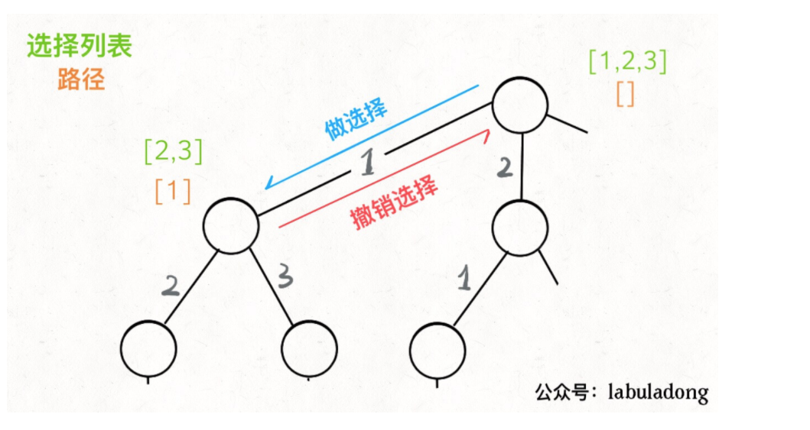

# 牛客的输入输出

总结：

+ cin通过空格和endl分割输入，连续输入可用空格或者换行分离
+ 根据是否提示输入数量
  + 提示输入组数，循环cin或者scanf，
  + 没有提示输入组数，使用getline+istringstream。
+ cin后加getline。数据getline会读出cin后的换行，导致错误。

具体实例

+ 输入一行字符串，空格分离

  + while循环输入：`while(cin>>str)`

  + for 循环输入：

    ```C++
    for(int i=0;i<n;i++)
        cin>>str;`
    ```

+ 输入多行字符串，空格或者逗号分离

  ```C++
  while(getline(cin,input))
  {
      istringstream iss(input);
      //str也可以是数字
      //空格分离
      while(iss>>str)
          vec_str.push_back(str);
      
      //逗号分离
      while(getline(iss,str,","))
          vec_str.push_back(str);
  }
  ```

  

+ 输入一行数字，空格分离

  ```C++
  cin>>a>>b;
  ```

+ 输入多行数字，空格分离

  ```C++
  //C实现
  while(scanf("%d %d",&a,&b)!=EOF)
  
  //C++实现
  while(cin>>a>>b)
  ```

+ 输出多行

  ```C++
  vector<string> str_vec(10);
  for(int i=0;i<len-1;i++)
  {
      cout<<str_vec[i]<<" ";
  }
  cout<<str_vex[len-1]<<endl;
  ```


# 1 剑指Offer

## 面试的三个环节

### 1 行为面试

**1 自我介绍**

30秒到1分钟时间介绍学习工作经历

**2 项目经验**

+ 项目背景：项目规模，软件功能，目标用户
+ 自己完成的任务：如何使用参与和负责
+ 行动：项目的完成做了哪些工作
  + 系统：解释系统架构特点
  + 软件开发：基于工具，平台，使用哪些技术
  + 测试：手工测试，还是自动化测试，白盒测试还是黑盒测试

**3 应聘者掌握的技能**

技术掌握程度：了解，熟悉，精通三者的区别

### 2 技术面试

#### **1 扎实的基础知识**

**1 编程语言**

**2 数据结构**

+ 链表，树，栈，队列，哈希表的操作

**3 算法**

+ 查找，排序算法：二分查找，归并排序，快速排序

#### 2 高质量的代码

问题：

+ 字符串转换为整数
  + 特殊字符：正负号，非数字字符
  + 最大整数和最小负整数，溢出问题
+ 链表中倒数第k个节点
  + k=0的问题
  + 空指针问题
  + 链表节点数量不足k个问题

代码的鲁棒性和完备性

+ 边界条件
+ 特殊输入（空指针，空字符串）
+ 错误处理

解决方式：

+ 编写代码前，先思考测试用例
+ 写完代码后，暂时先头脑运行，不用马上给面试官

#### 3 清晰思路

背景：

> 面试官提出较难问题，面试官并不期待在1小时内给出答案，而是观察应聘者是否有缜密的思路

解决：

+ 画图：使得抽象的问题形象化
+ 举例：使得抽象的问题具体化
+ 分解：使得复杂问题简单化

#### 4 优化效率的能力

优化时间复杂度和空间复杂度

+ 善于使用不同的数据结构解决问题
  + 哈希表
  + 红黑树
  + 最大堆
+ 善于使用不同的算法优化查找
  + 二分法
  + 动态规划
  + 分治法

#### 5 优秀的综合能力

+ 沟通能力

+ 学习能力

+ 知识迁移能力

  > 先问一个简单问题，然后问一个复杂问题，判断是否能够根据知识迁移能力找出解法

+ 抽象建模能力

  + 善于将生活中的例子使用数据结构表示，最终找到其中的规律

+ 发散思维的能力，打开思路从多角度分析问题

### 3 应聘者提问环节

暂时没想好问题

避雷：

+ 不要问与自身职位相差很大的问题

# 2 编程语言

+ 《Effective C++》C++的常见问题，适合面试前突击
+ 《深度探索C++对象模型》了解C++对象的内部
+ 《C++ primer》了解C++的语法
+ 《the C++ programing language》深入掌握C++


# 3 数据结构

## 1 寻找重复数字

> 找出数组中重复的数字。
>
>
> 在一个长度为 n 的数组 nums 里的所有数字都在 0～n-1 的范围内。数组中某些数字是重复的，但不知道有几个数字重复了，也不知道每个数字重复了几次。请找出数组中任意一个重复的数字。
>
> 示例 1：
>
> 输入：
> [2, 3, 1, 0, 2, 5, 3]
> 输出：2 或 3 

### 解法一：暴力求解

核心：双重遍历数组，找到相同数字

复杂度分析：

+ 时间复杂度：O(n^2)
+ 空间复杂度：O(1)

```C++
int findRepeatNumber(vector<int>& nums) {
        if(nums.size()<=0)
            return -1;
        
        for(int i=0;i<nums.size();i++)
        {
            for(int j=i+1;j<nums.size();j++)
            {
                if(nums[i]==nums[j])
                    return nums[i];
            }
        }
        return -1;
    }
```

### 排序解法：

分析：

+ 将原数组按照从小到大排序
+ 遍历原数组，查找相同元素

复杂度分析：

+ 时间复杂度：O(nlogn)
+ 空间复杂度：O(1)

```C++
class Solution {
public:
    int findRepeatNumber(vector<int>& nums) {
        if(nums.size()<=0)
            return -1;
        sort(nums.begin(),nums.end());
        for(int i=0;i<nums.size()-1;i++)
        {
            if(nums[i]==nums[i+1])
                return nums[i];
        }
        return -1;
    }
};
```

### 哈希查找

分析：

+ 针对暴力求解的方案，查找元素存在可改进为O(1)的复杂度。
+ 核心：**使用哈希表代替查找操作。空间交换时间**。

| 哈希表（unordered_map） | 使用                                                     |
| ----------------------- | -------------------------------------------------------- |
| 插入                    | hash["abc"]=5.45                                         |
| 查询                    | hash["abc"] 返回5.45                                     |
| 判断key是否存在         | hash.count("ABC") != 0 或 hash.find("ABC") != hash.end() |

```C++
int findRepeatNumber(vector<int>& nums) {
    if(nums.size()<=0)
        return -1;
    unordered_map<int,bool> n_map;
    //数组遍历
    for(int i=0;i<nums.size();i++)
    {
        if(n_map[nums[i]])
            return nums[i];
        n_map[nums[i]]=true;
    } 
    return -1;
}
```

复杂度分析：

+ 时间复杂度：O(n)
+ 空间复杂度：O(n)

### 数组代替哈希表,类似桶排序

分析：

+ 数组元素的大小范围在0-n-1内，因此，可以申请一个空间为n的数组。
+ 将i元素，放到下标为i的数组中，标识i元素在原数组中存在

```C++
int findRepeatNumber(vector<int>& nums) {
        if(nums.size()<=0)
            return -1;
        //使用桶做标记
        vector<int> new_nums(nums.size(),-1);
        for(int i=0;i<nums.size();i++)
        {
            if(new_nums[nums[i]]==1)
                return nums[i];
            new_nums[nums[i]]=1;
        }
        return -1;
    }
```

### 原地置换法

分析：

+ 数组中每一个元素num[i]，放到他在数组中下标为num[i]的位置，当出现冲突时，数字重复。

步骤：

+ 遍历数组 numsnums ，设索引初始值为 i = 0 :

  + 若 nums[i] = i ： 说明此数字已在对应索引位置，无需交换，因此跳过；
  + 假如：nums[nums[i]]==nums[i]，则找到一组重复值。
  + 否则： 交换索引为 ii 和 nums[i]nums[i] 的元素值，将此数字交换至对应索引位置。

+ 若遍历完毕尚未返回，则返回 -1−1 。

复杂度分析：

+ 时间复杂度：O(n)
+ 空间复杂度：O(1)

```C++
int findRepeatNumber(vector<int>& nums) {
    if(nums.size()<=0)
        return -1;
    int i=0;
    while(i<nums.size())
    {
        if(nums[i]==i)
        {
            i++;
            continue;
        }
        if(nums[nums[i]]==nums[i])
            return nums[i];
        else
            swap(nums[i],nums[nums[i]]);
    }
    return -1;
}
```

### 二分法（无交换，不需要辅助空间）

分析：

+ 统计元素[1,n]的数量，如果元素数量大于n，则元素出现重复。
+ 使用二分法不断缩小检索空间。

复杂度：

+ 时间复杂度：O(nlogn)，数量统计需要O(n)时间，然后该函数被调用O(logn)次

```C++
class Solution {
public:
    int findRepeatNumber(vector<int>& nums) {
        if(nums.size()<=0)
            return -1;
        
        int start=0;
        int end=nums.size()-1;
        //二分法开始
        while(start<=end)
        {
            int mid=((end-start)>>1)+start;
            int count=countRange(nums,start,mid);//计算start到end之间的数量
            if(start==end)//二分到最后一个数字
            {
                if(count>1)
                    return start;
                else
                    break;
            }
            if(count>(mid-start+1))
                end=mid;
            else
                start=mid+1;
        }
        return -1;
    }
    
    //计算数字范围在[start,end]在数组中出现的次数
    int countRange(const vector<int> &nums,int start,int end)
    {
        int count=0;
        for(int i=0;i<nums.size();i++)
        {
            if(nums[i]>=start&&nums[i]<=end)
                count++;
        }
        return count;
    }
};
```

## [ 2二维数组中的查找](https://leetcode-cn.com/problems/er-wei-shu-zu-zhong-de-cha-zhao-lcof/)

> 在一个 n * m 的二维数组中，每一行都按照从左到右递增的顺序排序，每一列都按照从上到下递增的顺序排序。请完成一个高效的函数，输入这样的一个二维数组和一个整数，判断数组中是否含有该整数。
>
> 示例:
>
> 现有矩阵 matrix 如下：
>
> [
>   [1,   4,  7, 11, 15],
>   [2,   5,  8, 12, 19],
>   [3,   6,  9, 16, 22],
>   [10, 13, 14, 17, 24],
>   [18, 21, 23, 26, 30]
> ]
> 给定 target = 5，返回 true。
>
> 给定 target = 20，返回 false。
>

### 暴力求解

分析：

+ 直接遍历整个矩阵

复杂度分析：

+ 时间复杂度：O(nm)
+ 空间复杂度O(1)

```C++
class Solution {
public:
    bool findNumberIn2DArray(vector<vector<int>>& matrix, int target) {
        if(matrix.size()==0||matrix[0].size()==0)
            return false;
        int n=matrix.size();
        int m=matrix[0].size();
        for(int i=0;i<n;i++)
        {
            for(int j=0;j<m;j++)
            {
                if(target==matrix[i][j])
                    return true;
            }
        }
        return false;    
    }
};
```

### 二叉搜索树

分析：根据矩阵的性质，从右上角开始，左下小，右下大。使用二叉搜索树进行搜索。

https://leetcode-cn.com/problems/er-wei-shu-zu-zhong-de-cha-zhao-lcof/solution/mian-shi-ti-04-er-wei-shu-zu-zhong-de-cha-zhao-zuo/

复杂度分析：

+ 时间复杂度：O(m+n)
+ 空间复杂度：O(1)

```C++
class Solution {
public:
    bool findNumberIn2DArray(vector<vector<int>>& matrix, int target) {
        if(matrix.size()==0||matrix[0].size()==0)
            return false;
        int n=matrix.size()-1;
        int m=matrix[0].size()-1;
        
        int row=0;
        int col=matrix[0].size()-1;
        //使用搜索树搜索
        while(col>=0&&row<=n)
        {
            if(target==matrix[row][col])
                return true;
            else if(target<matrix[row][col])
                col--;
            else
                row++;
        }
        return false;
    }
};
```

### 二分搜索

分析：

+ 为了加快搜索速度，使用二分查找对于每一行和每一列进行搜索
+ 迭代方向选用对角线的方向

复杂度分析：

+ 时间复杂度：O(k（log m+log n）)，k=,min(m,n)

  > k:迭代的次数最多为m和n的最小值需要k次迭代，
  >
  > logn+logm：每一次迭代需要（logn+logm）的复杂度，水平二分和垂直二分的总复杂度

+ 空间复杂度O(1)

```C++
class Solution {
public:
    bool findNumberIn2DArray(vector<vector<int>>& matrix, int target) {
        if(matrix.size()==0||matrix[0].size()==0)
            return false;
        int n=matrix.size();
        int m=matrix[0].size();
        int k=min(m,n);
        for(int i=0;i<k;i++)
        {
            if(vertical_search(matrix,target,i,i))
                return true;
            if(herizontal_search(matrix,target,i,i))
                return true;
        }
        return false;
       
    }
	//垂直搜索
    bool vertical_search(const vector<vector<int>> &matrix,int target,int row,int col)
    {   
        int m=matrix.size();
        int start=row;
        int end=m-1;
        while(start<=end)
        {
            int mid=((end-start)>1)+start;
            if(matrix[mid][col]==target)
                return true;
            else if(target<matrix[mid][col])
                end=mid-1;
            else
                start=mid+1;
        }
        return false;

    }
    //水平搜索
    bool herizontal_search(const vector<vector<int>> &matrix,int target,int row,int col)
    {
        int n=matrix[0].size();
        int start=col;
        int end=n-1;
        while(start<=end)
        {
            int mid=((end-start)>1)+start;
            if(matrix[row][mid]==target)
                return true;
            else if(target<matrix[row][mid])
                end=mid-1;
            else
                start=mid+1;
        }
        return false;
    }
};
```

### 递归

https://leetcode-cn.com/problems/er-wei-shu-zu-zhong-de-cha-zhao-lcof/solution/gao-su-jie-fa-qing-xi-tu-jie-by-ml-zimingmeng/

**矩阵中的元素的性质：**

+ 该元素左上角的元素比该元素小
+ 该元素有下角的元素比该元素大

关键点：找到一个元素`matrix[row][mid]`使得，`matrix[row-1][mid]<target<matrxi[row][mid]`

+ 当target>9时，可以排除9的左上侧
+ 当target<14时，可以排除14的右下侧
+ 因此，最终的寻找区间，变为，9的右上侧和14的左下侧。

其中，找到黄色点的方法如下：

1. 列索引 mid采用二分查找;
2. 行索引沿 mid列从上向下移动，并保持该位置元素小于 target。

**复杂度分析：**

+ 时间复杂度：O(nlogn)，

  > 递归需要logn次，然后每一次递归的时间为O(n)

+ 空间复杂度：O(logn)，递归时，栈需要存储每次递归的中间数据

```c++
class Solution {
public:
    bool findNumberIn2DArray(vector<vector<int>>& matrix, int target) {
        if(matrix.size()==0||matrix[0].size()==0)
            return false;
        int row=matrix.size();
        int col=matrix[0].size();
        return search_block(matrix,target,0,col-1,0,row-1);
       
    }
	//在矩形(left,right,up,down)中寻找对应元素
    bool search_block(const vector<vector<int>>& matrix,int target,int left,int right,int up, int down)
    {
        //边界条件分析
        if(left>right||up>down)
            return false;
        if(target<matrix[up][left]||target>matrix[down][right])
            return false;
		
        //寻找matrix[row][mid]的点
        int mid=left+((right-left)>>1);
        int row=up;
        while(row<=down&&target>=matrix[row][mid])
        {
            if(target==matrix[row][mid])
                return true;
            row++;
        }
        //返回对应块的结果
        return search_block(matrix,target,left,mid-1,row,down)||search_block(matrix,target,mid+1,right,up,row-1);
    }   
};
```

## 3[剑指 Offer 05. 替换空格](https://leetcode-cn.com/problems/ti-huan-kong-ge-lcof/)

> 请实现一个函数，把字符串 s 中的每个空格替换成"%20"。
>
> 示例 1：
>
> 输入：s = "We are happy."
> 输出："We%20are%20happy."

**分析：**

+ java和python中的字符串是不可变类型，必须新建字符串，进行字符串拼接
+ C++中字符串为可变类型，因此可以原地修改。

### 字符串拼接

分析：

+ 使用字符串重载的+号运算符，对字符串进行拼接处理

复杂度分析

+ 时间复杂度：O(N)
+ 空间复杂度：O(1)

```C++
class Solution {
public:
    string replaceSpace(string s) {
        if(s.size()==0)
            return s;
        string new_s;
        for(int i=0;i<s.size();i++)
        {
            if(s[i]==' ')
                new_s=new_s+"%20";
            else
                new_s=new_s+s[i];
        }
        return new_s;
    }
};
```

### 字符串扩充替换

分析：

+ 先将字符串扩充到合适大小，然后从尾到头进行遍历，将字符串替换

复杂度分析：

+ 时间复杂度：O(N)
+ 空间复杂度O(1)

```C++
class Solution {
public:
    string replaceSpace(string s) {
        if(s.size()==0)
            return s;
        //计算空格的数量
        int count=0;
        for(int i=0;i<s.length();i++)
        {
            if(s[i]==' ')
                count++;
        }
        int length=s.length();
        int new_length=s.length()+(count<<1);
        s.resize(new_length);//重新设置字符串的大小
        //从后向前遍历，替换空格
        for(int i=new_length-1,j=length-1;j>=0;i--,j--)
        {
            if(s[j]==' ')
            {
                s[i-2]='%';
                s[i-1]='2';
                s[i]='0';
                i=i-2;
            }
            else
                s[i]=s[j];          
        }
        return s;
    }
};
```

## 4 [剑指 Offer 06. 从尾到头打印链表](https://leetcode-cn.com/problems/cong-wei-dao-tou-da-yin-lian-biao-lcof/)

输入一个链表的头节点，从尾到头反过来返回每个节点的值（用数组返回）。

**示例 1：**

```
输入：head = [1,3,2]
输出：[2,3,1]
```

### 首尾双指针

分析：

+ 尾指针指向链表结尾，首指针遍历链表，记录尾指针上一个结点

复杂度分析：

+ 时间复杂度：O(N^2)  每存储一个元素，需要遍历链表一次
+ 空间复杂度:O(N)  需要一个vector数组

```C++
class Solution {
public:
    vector<int> reversePrint(ListNode* head) {
        vector<int> re_vec;
        if(head==NULL)
            return re_vec;
        ListNode *rp=head;
        while(rp->next!=NULL)
            rp=rp->next;
		//从尾指针不断插入结点
        ListNode *p=head;
        while(rp!=head)
        {
            while(p->next!=rp)
                p=p->next;
            re_vec.push_back(rp->val);
            rp=p;
            p=head;
        }
        //添加最后一个头结点
        re_vec.push_back(head->val);
        return re_vec;
        
    }
};
```

### vector 反转

分析：

+ 将链表元素遍历到数组中，然后将数组反转

复杂度分析：

+ 时间复杂度：O(n);

  > 遍历链表O(N)
  >
  > 数组反转O(N) 两者相加

+ 空间复杂度O(N)；需要一个vector数组

```C++
class Solution {
public:
    vector<int> reversePrint(ListNode* head) {
        vector<int> re_vec;
        if(head==NULL)
            return re_vec;
        //遍历
        for(ListNode *p=head;p!=NULL;p=p->next)
        {
            re_vec.push_back(p->val);
        }
        //反转
        reverse(re_vec.begin(),re_vec.end());
        return re_vec;     
    }
};
```

### 递归

分析：假设head->next已经插入，那么只要将head插入即可

+ 递推：将反转链表工作一直递推到最后一个节点
+ 回溯：由最后一个节点回归，将val插入vector中。

复杂度分析：

+ 时间复杂度；O(N)

  > 递归N次。时间复杂度O(N)
  >
  > 每次递归的操作时间复杂度为O(1),
  >
  > 总时间复杂度：`O(n)*O(1)=O(N)`

+ 空间复杂度：O(N)：递归将占用链表长度的栈空间

```C++
class Solution {
public:
    vector<int> re_vec;
    vector<int> reversePrint(ListNode* head) { 
        if(head==NULL)
            return re_vec;
        reversePrint(head->next);
        re_vec.push_back(head->val);
        return re_vec;
    }
};
```

### 利用栈

分析：

+ 利用堆栈先进后出的特点，先依次将元素压入堆栈中，然后将所有元素从堆栈中弹出，即可实现反转。

复杂度分析：

+ 时间复杂度：O(n)

  > push的时间复杂度O(n), pop的时间复杂度O(n)

+ 空间复杂度：O(n),使用额外的res和堆栈

```C++
class Solution {
public:
    vector<int> re_vec;
    stack<int> sta;
    vector<int> reversePrint(ListNode* head) { 
        if(head==NULL)
            return re_vec;
        ListNode* p=head;
        //入栈
        while(p!=NULL)
        {
            sta.push(p->val);
            p=p->next;
        }
        //出栈
        while(!sta.empty())
        {
            int top=sta.top();
            re_vec.push_back(top);
            sta.pop();
        }
        return re_vec;
    }
};
```

## [5 剑指 Offer 07. 重建二叉树](https://leetcode-cn.com/problems/zhong-jian-er-cha-shu-lcof/)

输入某二叉树的前序遍历和中序遍历的结果，请重建该二叉树。假设输入的前序遍历和中序遍历的结果中都不含重复的数字。

例如，给出

```
前序遍历 preorder = [3,9,20,15,7]
中序遍历 inorder = [9,3,15,20,7]
```

返回如下的二叉树：

```
    3
   / \
  9  20
    /  \
   15   7
```

### 递归（先序遍历）

+ preorder的头结点元素就是根节点
+ 然后找出左子树的先序序列和中序序列，找出有子树的先序序列和中序序列

类似二叉树的先序递归遍历，进行编码

+ 根节点的建立
+ 递归左子树
+ 递归有子树

复杂度分析：

+ 时间复杂度：O(n)，每一个节点作为根节点进行一次递归

  > 递归建立N个节点，每层递归中的节点建立、搜索操作占用 O(1) ，因此使用 O(N) 时间。

+ 空间复杂度：O(n)

  > O(n)=O(n)+O(h)；
  >
  > O(n)：存储哈希表需要的空间
  >
  > O(h)：h为树的高度。进行递归需要的递归栈需要的空间

```C++
class Solution {
private:
    unordered_map<int,int> index_mp;//哈希表存储索引
public: 
    TreeNode* buildTree(vector<int>& preorder, vector<int>& inorder) {
        //遍历中序序列，将中序序列的元素用哈希表存储索引
        int n=inorder.size();
        for(int i=0;i<n;i++)
        {
            index_mp[inorder[i]]=i;
        }
        TreeNode* root=recur_buildTree(preorder,inorder,0,n-1,0,n-1);
        return root;
    }
	//类型先序遍历建立递归树
    //（先序数组，中序数组，先序左端点，先序右端点，中序左端点，中序右端点）
    TreeNode* recur_buildTree(const vector<int> &preorder,const vector<int> &inorder,int pre_left_index,int pre_right_index,int in_left_index,int in_right_index)
    {
        if(pre_left_index>pre_right_index)
            return nullptr;
        
        int root_val=preorder[pre_left_index];
        int root_inorder_index=index_mp[root_val];
        TreeNode *root=new TreeNode(root_val);
        int left_length=root_inorder_index-in_left_index;
        
		//递归左子树
        root->left=recur_buildTree(preorder,inorder,pre_left_index+1,pre_left_index+left_length,
                                   in_left_index,root_inorder_index-1);
        //递归右子树
        root->right=recur_buildTree(preorder,inorder,pre_left_index+left_length+1,pre_right_index,
                                    root_inorder_index+1,in_right_index);
        return root;
    }
};
```

### 迭代

分析：

> 先序遍历中的规律：
>
> 对于先序遍历中的连续两个节点u，v。那么这两个节点有以下两种关系：
>
> + v是u的左儿子
> + u没有左儿子
>   + 有一种情况，v是u的右儿子
>   + 其他情况，u没有右儿子，那么向上回溯，v是u祖先节点的右儿子

关键点：

+ 栈：存储当前结点没有考虑右儿子的祖先节点。其中栈顶节点就是当前结点。
+ index：中序遍历的下标，对应的是当前节点不断向左达到的最终节点
+ node*:恢复树中的结点指针，指向所有当前结点

**算法流程：**

+ 我们用一个栈和一个指针辅助进行二叉树的构造。初始时栈中存放了根节点（前序遍历的第一个节点），index指向中序遍历的第一个节点；

+ 我们依次枚举前序遍历中除了第一个节点以外的每个节点。

  + 如果 index 恰好指向栈顶节点，那么我们不断地弹出栈顶节点并向右移动 index，并将当前节点作为最后一个弹出的节点的右儿子；

    > 当前结点已经到达最左，则需要判断插入节点是否为当前结点右儿子，
    >
    > + 对于当前结点来说，如果$中序_{next}=先序_{上个}$，那么当前结点没有右儿子
    > + 否则：$中序_{next}！=先序_{上个}$，那么当前结点有右儿子

  + 如果 index 和栈顶节点不同，我们将当前节点作为栈顶节点的左儿子；

+ 无论是哪一种情况，我们最后都将当前的节点入栈。

**复杂度分析：**

+ 时间复杂度：O(n)，其中n是树中结点的个数

+ 空间复杂度：O(N)

  > O(N)=O(h)+O(n)
  >
  > O(h):空间存储栈；h是树的高度
  >
  > O(n):申请n个树节点

```C++
/**
 * Definition for binary tree
 * struct TreeNode {
 *     int val;
 *     TreeNode *left;
 *     TreeNode *right;
 *     TreeNode(int x) : val(x), left(NULL), right(NULL) {}
 * };
 */
class Solution {
public:
    TreeNode* reConstructBinaryTree(vector<int> pre,vector<int> vin) {
        if(pre.size()==0)
            return nullptr;
        stack<TreeNode *> stk;
        TreeNode* root=new TreeNode(pre[0]);
        stk.push(root);
        int index=0;
        //依次遍历先序序列中的每一个节点
        for(int i=1;i<pre.size();i++){
            //获取当前已恢复树中的节点（当前结点）
            TreeNode* node=stk.top();
            int pre_val=pre[i];
            //插入节点是否是当前节点左节点
            if(node->val!=vin[index])
            {
                node->left=new TreeNode(pre_val);
                stk.push(node->left);
            }
            else{//插入节点是否是当前结点（或者其祖先节点）的右节点
                while(!stk.empty()&&stk.top()->val==vin[index])
                {
                    node=stk.top();
                    stk.pop();
                    index++;
                }
                //插入到右节点 插入节点入栈
                node->right=new TreeNode(pre_val);
                stk.push(node->right);
            }
        }
        return root;               
    }
};
```

## [6 剑指 Offer 09. 用两个栈实现队列](https://leetcode-cn.com/problems/yong-liang-ge-zhan-shi-xian-dui-lie-lcof/)

> 用两个栈实现一个队列。队列的声明如下，请实现它的两个函数 appendTail 和 deleteHead ，分别完成在队列尾部插入整数和在队列头部删除整数的功能。(若队列中没有元素，deleteHead 操作返回 -1 )
>
> 示例 1：
>
> 输入：
> ["CQueue","appendTail","deleteHead","deleteHead"]
> [[],[3],[],[]]
> 输出：[null,null,3,-1]

**分析：**

+ 维护两个栈，一个栈专门输入，一个栈专门负责输出

插入元素：

+ stack1直接插入元素

删除元素：

+ 如果栈2为空，则将栈1的所有元素放入栈2
+ 如果栈2为空则返回-1，否则返回栈顶元素，栈2出栈

复杂度分析：

+ 时间复杂度：对于插入和删除操作，时间复杂度均为 O(1)

  > 插入：O(1)时间复杂度
  >
  > 删除：表面来看，删除时O(n)的时间复杂度，但是每个元素只会入栈和出栈1次，因此平均下来，每一个元素删除的平均时间复杂度是O(1)

+ 空间复杂度：O(n),使用两个栈存储所有元素。

```C++
class CQueue {
private:
    stack<int> stack1;
    stack<int> stack2;
public:
    CQueue() {
        while(!stack1.empty())
        	stack1.pop();
        while(!stack2.empty())
            stack2.pop();
    }
    
    void appendTail(int value) {
        stack1.push(value);
    }
 
    int deleteHead() {
        //如果第二个栈为空，则将栈1的所有元素放入栈2
        if(stack2.empty())
        {
            while(!stack1.empty()){
                int temp=stack1.top();
                stack1.pop();
                stack2.push(temp);
            }
        }
        //此时栈2为空
        if(stack2.empty())
        {
            return -1;
        }
        else//返回栈顶元素
        {
            int temp=stack2.top();
            stack2.pop();
            return temp;
        }
    }
};
```

## [7 剑指 Offer 10- I. 斐波那契数列](https://leetcode-cn.com/problems/fei-bo-na-qi-shu-lie-lcof/)

写一个函数，输入 n ，求斐波那契（Fibonacci）数列的第 n 项（即 F(N)）。斐波那契数列的定义如下：

F(0) = 0,   F(1) = 1
F(N) = F(N - 1) + F(N - 2), 其中 N > 1.
斐波那契数列由 0 和 1 开始，之后的斐波那契数就是由之前的两数相加而得出。

答案需要取模 1e9+7（1000000007），如计算初始结果为：1000000008，请返回 1。

### **动态规划，递推**

分析：

+ 最简单的动态规划

**循环求余法：**

> **大数越界：** 随着 n*n* 增大, f(n)*f*(*n*) 会超过 `Int32` 甚至 `Int64` 的取值范围，导致最终的返回值错误。
>
> + 求余运算规则：（x+y）%p=(x%p+y%p)%p
> + 推出$Fn\%p=\{F_{n-1}\%p+F_{n-2}\%p\}\%p$从而每次计算$sum=(a+b)\%p$即可

**复杂度分析：**

+ 时间复杂度：O(n) 

  需要n次迭代

+ 空间复杂度 O(1)

```C++
class Solution {
public:
    int fib(int n) {
        if(n==0)
            return 0;
        if(n==1||n==2)
            return 1;
        long long n_1=1,n_2=0;
        long n_0=0;
        for(int i=2;i<=n;i++)
        {
            n_0=(n_1+n_2)%1000000007;
            n_2=n_1;
            n_1=n_0;
        }
        return n_0;
    }
};
```

### 递归解法，哈希表

**分析：**

+ 普通递归，将进行大量重复运算，其时间复杂度O(2^n)类似二叉树

**复杂度分析：**

+ 时间复杂度：O(N)，N次递归，每次递归O(1)
+ 空间复杂度：O(N)：需要一个哈希表

```c++
#include<unordered_map>
class Solution {
private:
    unordered_map<int, int> hashtable;
public:
    int Fibonacci(int n) {
        return dp(n);
    }
    int dp(int n){
        if(n==0)
            return 0;
        if(n==1)
            return 1;
        if(hashtable.count(n))
            return hashtable[n];
        hashtable[n]=dp(n-1)+dp(n-2);
        return hashtable[n];
    }
};
```

## [8 剑指 Offer 10- II. 青蛙跳台阶问题](https://leetcode-cn.com/problems/qing-wa-tiao-tai-jie-wen-ti-lcof/)

一只青蛙一次可以跳上1级台阶，也可以跳上2级台阶。求该青蛙跳上一个 n 级的台阶总共有多少种跳法。

答案需要取模 1e9+7（1000000007），如计算初始结果为：1000000008，请返回 1。

示例 1：

输入：n = 2
输出：2
示例 2：

输入：n = 7
输出：21
示例 3：

输入：n = 0
输出：1

**分析：**

https://leetcode-cn.com/problems/qing-wa-tiao-tai-jie-wen-ti-lcof/solution/mian-shi-ti-10-ii-qing-wa-tiao-tai-jie-wen-ti-dong/

**动态规划：**

+ 边界：

  > 青蛙跳台阶：f(0)=1,f(1)=1,f(2)=2
  >
  > 斐波那契问题：f(0)=0,f(1)=1,f(2)=2

+ 递推方程

  > 跳上n级有f(n)种跳法，那么青蛙最后一步有两种情况
  >
  > + 当为1级台阶：剩n-1台阶，此情况有f(n-1)种跳法
  > + 当为2级台阶：剩n-2台阶，此情况有f(n-2)跳法

**1 递归法**

+ **原理**：fn的问题分为fn-1和fn-2两个子问题，
+ **缺点：**出现大量重复子问题，时间复杂度O(n^2)

**2 记忆递归法**

+ 原理：在递归法基础上，添加一个哈希表，存储已经计算的fn，避免出现重复子问题
+ 缺点：需要O(n)的额外空间

**3 动态规划**

+ 仅仅使用两个变量存储前两个元素，类似斐波那契数列
+ 时间O(n)，空间O(1)最佳解法

```C++
class Solution {
public:
    int numWays(int n) {
        if(n==0||n==1)
            return 1;
        if(n==2)
            return 2;
        int f_2=1,f_1=2;
        for(int i=3;i<=n;i++)
        {
            int temp=(f_2+f_1)%1000000007;
            f_2=f_1;
            f_1=temp;
        }
        return f_1;
    }
};
```

## [9 剑指 Offer 11. 旋转数组的最小数字](https://leetcode-cn.com/problems/xuan-zhuan-shu-zu-de-zui-xiao-shu-zi-lcof/)

把一个数组最开始的若干个元素搬到数组的末尾，我们称之为数组的旋转。输入一个递增排序的数组的一个旋转，输出旋转数组的最小元素。例如，数组 [3,4,5,1,2] 为 [1,2,3,4,5] 的一个旋转，该数组的最小值为1。  

示例 1：

输入：[3,4,5,1,2]
输出：1

https://leetcode-cn.com/problems/xuan-zhuan-shu-zu-de-zui-xiao-shu-zi-lcof/solution/mian-shi-ti-11-xuan-zhuan-shu-zu-de-zui-xiao-shu-3/


### **右端点比较二分**

1. 初始化：将i，j指向数组的左右两端

2. 循环二分：将$m=(i+j)/2$作为二分的中点，因为`/`是向下取整，一定有$i<=m<j$;
   + A[m]<A[j],则m一定在右排序数组中，旋转点x在[i,m]区间内；
   + A[m]>A[j]，则m一定在左排序数组内，旋转点在[m+1,j]中；
   + A[m]=A[j]，无法判断m在左排序还是有排序，执行j-1方案，j-1确保，最小值仍然在[i,j]中，因为$i<=m<j$，最小值肯定在区间内。
3. 返回值：当i=j时，跳出二分循环，返回nums[i]。

**复杂度分析**

+ 时间复杂度：O(logn):特殊情况下，退化为O(N)比如：[1,1,1,1]
+ 空间复杂度：O(1);

```C++
class Solution {
public:
    int minArray(vector<int>& numbers) {
        if(numbers.size()==0)
            return 0;
        int left=0,right=numbers.size()-1;
        while(left<right){      
            int mid=left+((right-left)>>1);
            if(numbers[mid]>numbers[right])
                left=mid+1;
            else if(numbers[mid]<numbers[right])
                right=mid;
            else
                right-=1;
        }
        return numbers[left];
    }
};
```


### **左端点比较二分**

> 对于以下两示例，当 i = 0, j = 4, m = 2，i=0,j=4,m=2 时，有 nums[m] > nums[i] ，而结果不同。
> [1, 2, 3, 4 ,5][1,2,3,4,5] 旋转点 x = 0 ： m 在右排序数组（此示例只有右排序数组）；
> [3, 4, 5, 1 ,2][3,4,5,1,2] 旋转点 x = 3： m 在左排序数组。

**关键：对此，在循环前先对A[i]和A[j]进行判断，删除这种情况。**

```C++
class Solution {
public:
    int minArray(vector<int>& numbers) {
        if(numbers.size()==0)
            return 0;
        int left=0,right=numbers.size()-1;
        //退出时；left==right
        while(left<right){
            if(numbers[left]<numbers[right])
                return numbers[left];
            int mid=left+((right-left)>>1);
            if(numbers[mid]>numbers[left])
                left=mid+1;
            else if(numbers[mid]<numbers[left])
                right=mid;
            else
                left+=1;
        }
        return numbers[left];
    }
};
```

## [10 剑指 Offer 53 - I. 在排序数组中查找数字 I](https://leetcode-cn.com/problems/zai-pai-xu-shu-zu-zhong-cha-zhao-shu-zi-lcof/)

统计一个数字在排序数组中出现的次数。

**示例 1:**

```
输入: nums = [5,7,7,8,8,10], target = 8
输出: 2
```

分析：

**二分查找+顺序查找**

+ 先使用二分查找，寻找target，然后向左向右寻找

**二分查找，寻找左右端点**

+ 多次使用二分查找，寻找左右端点

复杂度分析：

+ 时间复杂度：O(logN)
  + O(logN)=O(logn)+O(logn)。

+ 空间复杂度：O(1)

```C++
class Solution {
public:
    int GetNumberOfK(vector<int> data ,int k) {
        if(data.size()==0)
            return 0;
        int left=search_left(data,k);
        int right=search_right(data, k);
        if(left==-1||right==-1)
            return 0;
        return right-left+1;
    }
    //寻找左端点
    int search_left(vector<int> &data,int k){
        int left=0,right=data.size()-1;
        while(left<=right){
            int mid=left+((right-left)>>1);
            if(data[mid]==k){
                right=mid-1;
            }
            else if(data[mid]<k)
            {
                left=mid+1;
            }
            else if(data[mid]>k)
            {
                right=mid-1;
            }            
        }
        if(left>=data.size()||data[left]!=k)
            return -1;
        return left;
    }
    //寻找右端点
    int search_right(vector<int> &data,int k){
        int left=0,right=data.size()-1;
        while(left<=right){
            int mid=left+((right-left)>>1);
            if(data[mid]==k){
                left=mid+1;
            }
            else if(data[mid]<k)
            {
                left=mid+1;
            }
            else if(data[mid]>k)
            {
                right=mid-1;
            }            
        }
        if(right<0||data[right]!=k)
            return -1;
        return right;
    }
};
```

## [10 剑指 Offer 53 - II. 0～n-1中缺失的数字](https://leetcode-cn.com/problems/que-shi-de-shu-zi-lcof/)

难度简单118

一个长度为n-1的递增排序数组中的所有数字都是唯一的，并且每个数字都在范围0～n-1之内。在范围0～n-1内的n个数字中有且只有一个数字不在该数组中，请找出这个数字。

**示例 1:**

```
输入: [0,1,3]
输出: 2
```

### 暴力解法

+ 按照顺序遍历，找到第一个下标和值不相等的位置

复杂度分析：

+ 时间复杂度：O(N)
+ 空间复杂度：O(1)

### 二分法

分析：

+ 将数组元素分为两部分

  + 左子数组：nums[i]=i
  + 右子数组：nums[i]!=i

+ 算法流程

  + 初始化，左闭右闭空间，i=0,j=length-1;
  + 循环二分：i<=j时循环，当i=j+1；退出循环
    1. 计算中点，mid，向下取整
    2. 若 nums[m] = m ，则 “右子数组的首位元素” 一定在闭区间 [m + 1, j][m+1,j] 中，因此执行 i = m + 1；
    3. 若 nums[m] ！=m ，则 “左子数组的末位元素” 一定在闭区间 [i, m - 1][i,m−1] 中，因此执行 j = m - 1；

  + **返回值：** 跳出时，变量 i 和 j 分别指向 “右子数组的首位元素” 和 “左子数组的末位元素” 。因此返回 i即可。

+ 复杂度分析：

  + 时间复杂度：O(logn)
  + 空间复杂度：O(n)

```C++
class Solution {
public:
    int missingNumber(vector<int>& nums) {
        if(nums.size()==0)
            return -1;
        int left=0,right=nums.size()-1;
        while(left<=right)
        {
            int mid=left+((right-left)>>1);
            if(nums[mid]==mid)
                left+=1;
            else if(nums[mid]!=mid)
                right-=1;
        }
        return left;
    }
};
```

## [11 剑指 Offer 12. 矩阵中的路径](https://leetcode-cn.com/problems/ju-zhen-zhong-de-lu-jing-lcof/)

分析：

https://leetcode-cn.com/problems/ju-zhen-zhong-de-lu-jing-lcof/solution/mian-shi-ti-12-ju-zhen-zhong-de-lu-jing-shen-du-yo/

### DFS+剪枝

+ 深度优先搜索（回溯）： 可以理解为暴力法遍历矩阵中所有字符串可能性。**DFS 通过递归，先朝一个方向搜到底，再回溯至上个节点，沿另一个方向搜索**，以此类推。
+ 剪枝： 在搜索中，**遇到 这条路不可能和目标字符串匹配成功 的情况**（例如：此矩阵元素和目标字符不同、此元素已被访问），则应立即返回，称之为 可行性剪枝 。

**算法流程：**

+ 递归参数：矩阵，字符串，矩阵中位置（i，j）,字符串位置k
+ 终止条件：
  + 返回false
    + 行列越界 
    + 矩阵当前元素(i,j)不等于字符串元素k
    + 矩阵元素访问过(合并到2中，通过将访问元素置空)
  + 返回true
    + k=len(word)-1，即字符串已经全部匹配
+ 递推工作
  + 标记当前矩阵元素为空'\0'，表示当前元素已经访问
  + 从上下左右四个方向搜索
  + 还原矩阵元素
+ 返回值：返回res,代表是否找到字符串

**复杂度分析**

+ 时间复杂度:$O(3^KMN)$*M*,*N* 分别为矩阵行列大小， K为字符串 `word` 长度。

  > $3^k$:
  >
  > + 有四个搜索方向，其中一个方向不用搜索，因此有3个搜索方向。
  > + 一共有k个字符需要搜索，因此复杂度为$3^k$
  >
  > MN：
  >
  > + 矩阵中一共有MN个起点，因此一共有MN种方案

+ 空间复杂度：O(K)
  
  + 递归的最大深度为K。

```C++
class Solution {
private:
    int row;
    int col;
public:
    bool exist(vector<vector<char>>& board, string word) {
        if(word.size()==0)
            return false;
        int m=board.size(),n=board[0].size();
        row=m;
        col=n;
        for(int i=0;i<m;i++)
        {
            for(int j=0;j<n;j++)
            {
                if(dfs(board,i,j,word,0))
                    return true;
            }
        }
        return false;
    }
    //DFS判断是否找到
    bool dfs(vector<vector<char>> &board,int i,int j,string word,int k)
    {
        if(i<0||i>=row||j<0||j>=col||board[i][j]!=word[k])
            return false;
        if(k==word.size()-1)
            return true;
        board[i][j]='\0';
        bool res=dfs(board,i+1,j,word,k+1)||dfs(board,i-1,j,word,k+1)||dfs(board,i,j+1,word,k+1)||dfs(board,i,j-1,word,k+1);
        board[i][j]=word[k];
        return res;
    }
};
```


# 算法

## 二分法总结

### 搜索单个节点

#### **左闭右开**

```C++
int binarySearch(int[] nums, int target) {
    int left = 0; 
    int right = nums.length; // 注意

    while(left < right) {
        int mid = left + (right - left) / 2;
        if(nums[mid] == target)
            return mid; 
        else if (nums[mid] < target)
            left = mid + 1; // 注意
        else if (nums[mid] > target)
            right = mid; // 注意
    }
    return -1;
}
```

特点：

+ 搜索空间：[left,right），左闭右开区间

+ 退出循环条件：while(left<right)

  > 对于[left,right）的空间
  >
  > + while(left<right),退出循环条件是，left==right，此时搜索空间为[left,left)，此时搜索空间已经为空，不用继续搜索

+ 搜索空间缩小：

  > left=mid+1;right=mid;
  >
  > 此时搜索闭空间，因此把数组分为三个部分，`[left,mid）[mid][mid+1,right）`

#### **左闭右闭**

```C++
int binarySearch(int[] nums, int target) {
    int left = 0; 
    int right = nums.length - 1; // 注意

    while(left <= right) {
        int mid = left + (right - left) / 2;
        if(nums[mid] == target)
            return mid; 
        else if (nums[mid] < target)
            left = mid + 1; // 注意
        else if (nums[mid] > target)
            right = mid - 1; // 注意
    }
    return -1;
}
```

特点：

+ 搜索空间：[left,right-1]，左闭右闭区间

+ 退出循环条件：while(left<=right)

  > 对于[left,right-1]的封闭空间
  >
  > + while(left<right),退出循环条件是，left==right，此时搜索空间为[left,left]，left这个元素并没有搜索
  > + while(left<=right)，退出循环的条件是，left=right+1,此时搜索空间是[a+1,a],此时区间为空，元素全部搜索

+ 搜索空间缩小：

  > left=mid+1;right=mid-1;
  >
  > 此时搜索闭空间，因此把数组分为三个部分，`[left,mid-1][mid][mid+1,right]`

**缺点：**

+ 只能搜索单个元素，无法搜索边界。

  > num=[1,2,2,2,3],target=2。运用此算法只能搜索到index=2，无法搜索到左边界1和右边界3.

**总结**

+ 不要使用else，每个条件全用elseif理出来
+ 搜索空间(左闭右开还是左开右闭)的选择，决定while中`<和<=`的选择，最终决定缩小空间时的区间分割。
  + 其中是进行空间搜小的时候不要漏掉元素

### 搜索左端点

#### 左闭右开

```C++
int left_bound(int[] nums, int target) {
    if (nums.length == 0) return -1;
    int left = 0;
    int right = nums.length; // 注意，开闭区间

    while (left < right) { // 注意
        int mid = (left + right) / 2;
        if (nums[mid] == target) {
            right = mid;//注意：不断缩小右边界
        } else if (nums[mid] < target) {
            left = mid + 1;
        } else if (nums[mid] > target) {
            right = mid; // 注意
        }
    }
    // target 比所有数都大,此时left越界
	if (left == nums.length) return -1;
	// 类似之前算法的处理方式
	return nums[left] == target ? left : -1;
}
```

特点：

+ 搜索空间：[left,right)，左闭右开区间

+ 退出循环条件：while(left<right)

+ 搜索空间缩小：

  > + 不相等时：left=mid+1;right=mid;
  >
  >   此时搜索闭空间，因此把数组分为三个部分，`[left,mid)[mid][mid+1,right)`
  >
  > + 相等时：right=mid,不断缩小右边界。

+ 搜索左边界范围：

  > 对于数组num=[2,3,5,7],target==1,或者2算法返回0.含义是：num中小于1的元素有0个
  >
  > 对于数组num=[2,3,5,7]，target==8 算法返回4，含义是num中小于8的元素有4个；
  >
  > **因此：left的取值范围是：[0,num.length]**

+ **index判定：**判定出界，判断target存在

  > num=[2,3,4,5]，left的下标实际上：**target插入到原数组的下标。**
  >
  > + left=0-3：
  >   + target应该置于left，判断left元素是否等于target。
  > + left=4:
  >   + 满足target>7的所有目标都将插入到下标length中。

+ 为什么返回left
  
  + 退出时left=right，因此返回left和返回right是一样的。

#### 左闭右闭

```C++
int left_bound(int[] nums, int target) {
    int left = 0, right = nums.length - 1;
    // 搜索区间为 [left, right]
    while (left <= right) {
        int mid = left + (right - left) / 2;
        if (nums[mid] < target) {
            // 搜索区间变为 [mid+1, right]
            left = mid + 1;
        } else if (nums[mid] > target) {
            // 搜索区间变为 [left, mid-1]
            right = mid - 1;
        } else if (nums[mid] == target) {
            // 收缩右侧边界
            right = mid - 1;
        }
    }
    // 检查出界情况
    if (left >= nums.length || nums[left] != target)
        return -1;
    return left;
}
```

+ 搜索空间：[left,right]，左闭右闭区间

+ 退出循环条件：while(left<=right)

  > 退出条件为：left=right+1,即退出的搜索空间为[a+1,a]。

+ 搜索空间缩小：

  > + 不相等时：left=mid+1;right=mid-1;
  >
  >   此时搜索闭空间，因此把数组分为三个部分，`[left,mid-1][mid][mid+1,right]`
  >
  > + 相等时：right=mid-1,不断缩小右边界。**mid已经搜索过了，由于闭空间，right需要减1.**

+ 搜索左边界范围：

  > 对于数组num=[2,3,5,7],target==1,或者2算法返回0.含义是：num中小于1的元素有0个
  >
  > 对于数组num=[2,3,5,7]，target==8 算法返回4，含义是num中小于8的元素有4个；
  >
  > **因此：left的取值范围是：[0,num.length]**

+ 为什么返回left

  > 根据条件：代码13-14行，mid相等的条件判断，此时mid=right+1。所以返回的元素应该是right+1;
  >
  > **由于退出循环，left=right+1,因此，可直接返回left**

+ **index判定**：出界判定，target存在判定

  > left范围[0,length]，
  >
  > + left==0那么插入位置下标0，此时target<=num[0]
  > + left==length，此时插入位置为下标length，此时target>num[length-1]

#### 总结

+ 最后均是返回left，left便是元素插入位置
+ 寻找左端点，均是不断压缩右边界。最终在退出条件上寻找插入位置
+ 要检查数组越界，和target不存在的情况

### 搜索右端点

#### 左闭右开

```C++
int right_bound(int[] nums, int target) {
    if (nums.length == 0) return -1;
    int left = 0, right = nums.length;

    while (left < right) {
        int mid = (left + right) / 2;
        if (nums[mid] == target) {
            left = mid + 1; // 注意此处
        } else if (nums[mid] < target) {
            left = mid + 1;
        } else if (nums[mid] > target) {
            right = mid;
        }
    }
    if (right == 0) return -1;
	return nums[right-1] == target ? (right-1) : -1;
}
```

+ 搜索空间：[left,right)左闭右开

+ 退出循环while(left<right)

  + 退出条件left=right

+ 缩小搜索空间

  > + 将分为三个部分[left,mid)[mid,mid+1)[mid+1,right)

+ 寻找有边界，不断缩小左边界

  > 第8行，令left不断加1，不断压缩左边界，从而寻找右边界

+ 返回left-1的原因，其实退出left==right，这里也可以换成right

  > left[0,length]
  >
  > + left=0：left-1将越界，target<所有元素
  > + left=length,此时target>=num[length-1]：
  >   + 要么length-1是右边界，
  >   + 要么target大于所有元素

#### 左闭右闭

```C++
int right_bound(int[] nums, int target) {
    int left = 0, right = nums.length - 1;
    while (left <= right) {
        int mid = left + (right - left) / 2;
        if (nums[mid] < target) {
            left = mid + 1;
        } else if (nums[mid] > target) {
            right = mid - 1;
        } else if (nums[mid] == target) {
            // 这里改成收缩左侧边界即可
            left = mid + 1;
        }
    }
    // 这里改为检查 right 越界的情况，见下图
    if (right < 0 || nums[right] != target)
        return -1;
    return right;
}
```

+ 返回right原因

  > 根据11行，此时mid=left-1.然而退出条件是left=right+1，所以mid=right。所以最终返回right
  >
  > right范围：[-1,length-1]
  >
  > 因此最后要防止越界。

### 总结：

综合以上三种情况，将所有情况变成左闭右闭情况

```C++
int binary_search(int[] nums, int target) {
    int left = 0, right = nums.length - 1; 
    while(left <= right) {
        int mid = left + (right - left) / 2;
        if (nums[mid] < target) {
            left = mid + 1;
        } else if (nums[mid] > target) {
            right = mid - 1; 
        } else if(nums[mid] == target) {
            // 直接返回
            return mid;
        }
    }
    // 直接返回
    return -1;
}

int left_bound(int[] nums, int target) {
    int left = 0, right = nums.length - 1;
    while (left <= right) {
        int mid = left + (right - left) / 2;
        if (nums[mid] < target) {
            left = mid + 1;
        } else if (nums[mid] > target) {
            right = mid - 1;
        } else if (nums[mid] == target) {
            // 别返回，锁定左侧边界
            right = mid - 1;
        }
    }
    // 最后要检查 left 越界的情况
    if (left >= nums.length || nums[left] != target)
        return -1;
    return left;
}


int right_bound(int[] nums, int target) {
    int left = 0, right = nums.length - 1;
    while (left <= right) {
        int mid = left + (right - left) / 2;
        if (nums[mid] < target) {
            left = mid + 1;
        } else if (nums[mid] > target) {
            right = mid - 1;
        } else if (nums[mid] == target) {
            // 别返回，锁定右侧边界
            left = mid + 1;
        }
    }
    // 最后要检查 right 越界的情况
    if (right < 0 || nums[right] != target)
        return -1;
    return right;
}
```

关键点：

+ 相等时，压缩左边界，和压缩右边界的处理。
  + 寻找左边界，压缩有边界
  + 寻找有边界压缩左边界
+ 返回值的处理
  + 寻找左边界，返回左值，范围[0,length]
  + 寻找右边界，返回右值：范围[-1,length-1]

**总结**

+ 如需定义左闭右开的「搜索区间」搜索左右边界，只要在 `nums[mid] == target` 时做修改即可，搜索右侧时需要减一。

+ 如果将「搜索区间」全都统一成两端都闭，好记，只要稍改 `nums[mid] == target` 条件处的代码和返回的逻辑即可

+ **寻找一个数的插入位置，建议使用左端点搜索。因为left返回为[0,length]，均为插入位置**

## 回溯算法

定义：**回溯算法就是DFS算法**

**回溯问题：决策树的遍历过程**

+ 路径：已经做出的选择
+ 选择列表：还可以做的选择
+ 结束条件：到达决策树底层，无法选择

### 核心框架：

```C++
result = []
def backtrack(路径, 选择列表):
    if 满足结束条件:
        result.add(路径)
        return

    for 选择 in 选择列表:
		//排除不合法选择
		if(！vilid())
            continue;
        做选择
        backtrack(路径, 选择列表)
        撤销选择
```



**循环内部：**

```C++
for 选择 in 选择列表:
	//排除不合法选择
	if(不合法)
        continue;

    //做选择
    (将该选择从选择列表移除)
    路径.add(选择)
    backtrack(路径, 选择列表)
    //撤销选择
    路径.remove(选择)
    (将该选择再加入选择列表)
```

+ **我们只要在递归之前做出选择，在递归之后撤销刚才的选择**，就能正确得到每个节点的选择列表和路径。
+ **前序遍历**的代码在进入某一个节点之前的那个时间点执行，**后序遍历**代码在离开某个节点之后的那个时间点执行

### 全排列问题

复杂度分析：

+ O(N!)：回溯框架的时间复杂度均不低于O(N！)

```C++
class Solution {
private:
    //记录所有路径
    vector<vector<int>> all_path;
public:
    vector<vector<int>> permute(vector<int>& nums) {
        if(nums.size()==0)
            return all_path;
        vector<int> track;
        dfs(nums,track,nums.size());
        return all_path;
    }
    //nums选择列表，track路径
    void dfs(vector<int> &nums,vector<int> &track,int n)
    {
        //触发结束条件
        if(track.size()==n)
        {
            all_path.push_back(track);
            return;
        }
		//进行选择
        for(int i=0;i<nums.size();i++)
        {
            //选择列表移除，添加路径
            int temp=nums[i];
            track.push_back(nums[i]);
            nums.erase(nums.begin()+i);
            
            dfs(nums,track,n);
            
            //删除路径，恢复选择列表
            track.pop_back();
            nums.insert(nums.begin()+i,temp);
        }
    }
};
```

### N皇后问题

**分析：找出N皇后的所有全排列**

+ 8皇后问题可类比全排列问题
  + 在棋盘上有8行，每一行有8种选择，构建决策树

使用回溯+剪枝；

+ 对所有情况进行回溯
+ 对不符合要求的情况进行剪枝

复杂度分析：

+ 时间复杂度：$O(N！)$
+ 空间复杂度：O(N)

```C++
class Solution {
private:
    vector<vector<string>> all_path;
public:
    vector<vector<string>> solveNQueens(int n) {
        vector<string> track(n,string(n,'.'));
        dfs(track,0);
        return all_path;
    }
    void dfs(vector<string> &track,int row)
    {
        //结束退出判断
        if(row==track.size())
        {
            all_path.push_back(track);
            return ;
        }
        int n=track[row].size();
        for(int i=0;i<n;i++)
        {
            //无效进行剪枝
            if(!isValid(track,row,i))
                continue;
            track[row][i]='Q';
            dfs(track,row+1);
            track[row][i]='.';
        }
    }
    //排除无效元素，剪枝
    bool isValid(const vector<string> &track,int row,int col)
    {
        //判断同一列
        int m=track.size(),n=track[0].size();
        for(int i=0;i<m;i++)
        {
            if(track[i][col]=='Q')
                return false;
        }
        //判断(row,col)的左上角
        for(int i=row-1,j=col-1;i>=0&&j>=0;i--,j--)
        {
            if(track[i][j]=='Q')
                return false;
        }
        //判断(row,col)的右下角
        for(int i=row-1,j=col+1;i>=0&&j<n;i--,j++)
        {
            if(track[i][j]=='Q')
                return false;
        }
        return true;
    }
};
```

**找出N皇后的一个全排列**

+ 直接在适当的位置返回Ture即可

```C++
// 函数找到一个答案后就返回 true
bool backtrack(vector<string>& board, int row) {
    // 触发结束条件
    if (row == board.size()) {
        res.push_back(board);
        return true;
    }
    ...
    for (int col = 0; col < n; col++) {
        ...
        board[row][col] = 'Q';

        if (backtrack(board, row + 1))
            return true;

        board[row][col] = '.';
    }

    return false;
}
```

## BFS 算法解题套路框架

**BFS：**

+ 宽度优先搜索算法，目的是决策树中找出两点间的最短路径。
+ **问题的本质就是让你在一幅「图」中找到从起点** **`start`** **到终点** **`target`** **的最近距离**

BFS和DFS的优缺点：

+ BFS可以快速找出最短距离，但是需要的空间复杂度高(队列可能变得很大)
+ DFS找出最短距离需要遍历过所有的结点。

### 框架

```C++
// 计算从起点 start 到终点 target 的最近距离
int BFS(Node start, Node target) {
    queue<Node> q; // 核心数据结构
    unordered_map<Node,int> visited; // 哈希表存储已访问元素

    q.push(start); // 将起点加入队列
    visited[start]=1;
    int step = 0; // 记录扩散的步数

    while (q not empty) {
        int sz = q.size();//<一定要先记录步数
        //遍历队列中的所有节点
        for (int i = 0; i < sz; i++) {
            Node cur = q.pop();
            //（对当前结点进行分析）判断是否到达终点
            if (cur is target)
                return step;
            /* 将 cur 的相邻节点加入队列 */
            for (Node x : cur.adj())
                if (visited.count(x)==0) {
                    q.push(x);
                    visited[x]=1;
                }
        }
        /* 划重点：更新步数在这里 */
        step++;
    }
}
```

**核心算法：**

+ 定义队列和哈希表
+ 头结点入队列，记录层数
+ 队列不为空，进入循环
  + 遍历队列中存在的元素
    + 队列头结点出队列
    + 对队列头进行分析。(是否到达目标结点，是否到达有误位置)
    + 循环将队列头的临接点，放入队列（需要判断是否被访问）
  + 更新步数


注意：

+ **11行：**一定要先记录队列内元素数量，因为队列的进出会改变队列的长度，
+ **哈希表存储已经访问的元素不是固定需要**：如果仅仅是二叉树的话，不需要存储已经访问的结点信息。

#### [111. 二叉树的最小深度](https://leetcode-cn.com/problems/minimum-depth-of-binary-tree/)

给定一个二叉树，找出其最小深度。

最小深度是从根节点到最近叶子节点的最短路径上的节点数量。

**说明：**叶子节点是指没有子节点的节点。

##### BFS解法

**分析：**

+ 使用bfs直接找出到叶子结点的最小路径

复杂度分析：

+ 时间复杂度：O(N)，对每一个节点访问一次
+ 空间复杂度：O(N)，取决于队列的开销，队列开销最大为结点个数

```C++
/**
 * Definition for a binary tree node.
 * struct TreeNode {
 *     int val;
 *     TreeNode *left;
 *     TreeNode *right;
 *     TreeNode() : val(0), left(nullptr), right(nullptr) {}
 *     TreeNode(int x) : val(x), left(nullptr), right(nullptr) {}
 *     TreeNode(int x, TreeNode *left, TreeNode *right) : val(x), left(left), right(right) {}
 * };
 */
class Solution {
public:
    int minDepth(TreeNode* root) {
        if(root==nullptr)
            return 0;
        return bfs(root);
    }

    int bfs(TreeNode* root)
    {
        queue<TreeNode*> q;
        q.push(root);
        int depth=1;
        //队列循环
        while(!q.empty())
        {
            int n=q.size();
            for(int i=0;i<n;i++)
            {
                TreeNode *cur=q.front();
                q.pop();
                if(cur->left==nullptr&&cur->right==nullptr)
                    return depth;
                if(cur->left!=nullptr)
                    q.push(cur->left);
                if(cur->right!=nullptr)
                    q.push(cur->right);
            }
            depth++;
        }
        return depth;
    }
};
```

##### DFS解法

分析：对树使用深度优先搜索，遍历整棵树，记录最小深度

+ 使用递归，知道每一颗子树的深度

复杂度分析：

+ 时间复杂度：O(N)；每一个节点访问一次
+ 空间复杂度：O(H)
  + 最坏情况：O(N)，链路呈现链状
  + 最好情况：树的高度和树呈现正相关，空间复杂度为O(logn)

```C++
/**
 * Definition for a binary tree node.
 * struct TreeNode {
 *     int val;
 *     TreeNode *left;
 *     TreeNode *right;
 *     TreeNode() : val(0), left(nullptr), right(nullptr) {}
 *     TreeNode(int x) : val(x), left(nullptr), right(nullptr) {}
 *     TreeNode(int x, TreeNode *left, TreeNode *right) : val(x), left(left), right(right) {}
 * };
 */
class Solution {
public:
    int minDepth(TreeNode* root) {
        if(root==nullptr)
            return 0;
        return dfs(root);
    }

    int dfs(TreeNode* root)
    {
        if(root==nullptr)
            return 0;
        if(root->left==nullptr&&root->right==nullptr)
            return 1;
        
        int MIN=INT_MAX;
        if(root->left!=nullptr)
            MIN=min(dfs(root->left),MIN);
        if(root->right!=nullptr)
            MIN=min(dfs(root->right),MIN);
        return MIN+1;
    }
};
```

#### [752. 打开转盘锁](https://leetcode-cn.com/problems/open-the-lock/)

你有一个带有四个圆形拨轮的转盘锁。每个拨轮都有10个数字： '0', '1', '2', '3', '4', '5', '6', '7', '8', '9' 。每个拨轮可以自由旋转：例如把 '9' 变为  '0'，'0' 变为 '9' 。每次旋转都只能旋转一个拨轮的一位数字。

锁的初始数字为 '0000' ，一个代表四个拨轮的数字的字符串。

列表 deadends 包含了一组死亡数字，一旦拨轮的数字和列表里的任何一个元素相同，这个锁将会被永久锁定，无法再被旋转。

**分析：**

+ 分析决策选择，每一个字符串“0000”一共有8种状态转换的方式。
+ 使用哈希表存储有问题的结点，遇到有问题结点不能继续遍历以下结点

综上：将整个决策树看为每个节点都有8个子节点的树。

复杂度分析：

+ 时间复杂度：$O(N*A^N)$

  + N表示状态个数，A^N代表所有节点

+ 空间复杂度：

  $A^N$为所有节点的个数

```C++
class Solution {
public:
    int openLock(vector<string>& deadends, string target) {
        if(target.size()==0)
            return -1;
        return bfs(deadends,target);
    }

    //BFS遍历决策树，找到最短路径
    int bfs(vector<string>& deadends,string target)
    {
        queue<string> q_str;
        unordered_map<string,int> visit_hash;
        unordered_map<string,int> dead_hash;
        for(int i=0;i<deadends.size();i++)
        {
            dead_hash[deadends[i]]=1;
        }

        q_str.push("0000");
        visit_hash["0000"]=1;
        int length=0;
        while(!q_str.empty())
        {
            int n_queue=q_str.size();
            for(int i=0;i<n_queue;i++)
            {
                string cur=q_str.front();
                q_str.pop();
                if(cur==target)
                    return length;
                if(dead_hash.count(cur)==1)
                    continue;

                for(int j=0;j<4;j++)
                {
                    string str_up=lock_up(cur,j);
                    if(visit_hash.count(str_up)==0)
                    {
                        q_str.push(str_up);
                        visit_hash[str_up]=1;
                    }
                    string str_down=lock_down(cur,j);
                    if(visit_hash.count(str_down)==0)
                    {
                        q_str.push(str_down);
                        visit_hash[str_down]=1;
                    }
                }
            }
            length++;
        }
        return -1;

    }
    //改变字符串，向上，向下拨动锁
    string lock_up(string lock_str,int index)
    {
        if(lock_str[index]<'9')
            lock_str[index]+=1;
        else
            lock_str[index]='0';
        return lock_str;
    }
    string lock_down(string lock_str,int index)
    {
        if(lock_str[index]>'0')
            lock_str[index]-=1;
        else
            lock_str[index]='9';
        return lock_str;
    }

};
```

## 双指针

### 快慢指针

#### [141. 环形链表](https://leetcode-cn.com/problems/linked-list-cycle/)

思想：龟兔赛跑，当有环时总会相遇

**快慢指针：**

+ 快指针由于走两步，判断是否为空需要注意指针是否存在
+ 循环，先走后判断

复杂度分析：

+ 时间复杂度：O(N)
+ 空间复杂度：O(1)

```C++
class Solution {
public:
    bool hasCycle(ListNode *head) {
        if(head==NULL)
            return false;
        ListNode *fast=head,*last=head;
        while(fast!=NULL&&fast->next!=NULL)
        {
            fast=fast->next->next;
            last=last->next;
            if(fast==last)
                return true;
        }
        return false;
    }
};
```

#### [142. 环形链表 II](https://leetcode-cn.com/problems/linked-list-cycle-ii/)

分析：

+ 相遇时，慢指针走K步，那么快指针一定走了2K步，假设李环点m步，那么快指针和慢指针同时走k-m步即可到达。
+ k-m的计算可通过再次相遇求得。

解法：**快慢指针，二次相遇**

复杂度分析：

+ 时间复杂度：O(N)
+ 空间复杂度：O(1)

算法：

+ 寻找一次相遇点
+ 环判断
+ 寻找二次相遇点

```C++
class Solution {
public:
    ListNode *detectCycle(ListNode *head) {
        if(head==NULL)
            return NULL;
        //寻找相遇点
        ListNode* fast=head,*slow=head;
        while(fast!=NULL&&fast->next!=NULL)
        {
            fast=fast->next->next;
            slow=slow->next;
            if(fast==slow)
                break;   
        }
        //判断是否有环
        if(fast==NULL||fast->next==NULL)
            return NULL;
        slow=head;
        //寻找二次相遇点
        while(fast!=slow)
        {
            fast=fast->next;
            slow=slow->next;
        }
        return slow;
    }
};
```

#### [876. 链表的中间结点](https://leetcode-cn.com/problems/middle-of-the-linked-list/)

分析：

+ 使用快慢指针，最后fast将位于null，或者最后一个元素。
  + 当链表为奇数时，slow位于mid位置
  + 链表为偶数时，slow'位于右mid元素

复杂度分析：

+ 时间复杂度：O(N)
+ 空间复杂度：O(1)

```C++
class Solution {
public:
    ListNode* middleNode(ListNode* head) {
        if(head==NULL)
            return NULL;
        ListNode* fast=head,*slow=head;
        while(fast!=NULL&&fast->next!=NULL)
        {
            fast=fast->next->next;
            slow=slow->next;
        }
        return slow;
    }
};
```

#### [19. 删除链表的倒数第 N 个结点](https://leetcode-cn.com/problems/remove-nth-node-from-end-of-list/)

分析：

+ 快慢指针；快指针先走n步，然后快慢指针同时走，最后慢指针指向倒数第n节点

算法：

+ 快指针先走n步
+ 判断是否到n
+ 判断快指针是否为空，为空直接删除第一个节点
+ 快慢指针同时走，直到快指针为最后一个节点。此时慢指针为倒数n+1个节点。删除慢指针后一个元素

复杂度分析：

+ 时间复杂度：O(N)
+ 空间复杂度：O(1)

```C++
/**
 * Definition for singly-linked list.
 * struct ListNode {
 *     int val;
 *     ListNode *next;
 *     ListNode() : val(0), next(nullptr) {}
 *     ListNode(int x) : val(x), next(nullptr) {}
 *     ListNode(int x, ListNode *next) : val(x), next(next) {}
 * };
 */
class Solution {
public:
    ListNode* removeNthFromEnd(ListNode* head, int n) {
        if(head==nullptr)
            return nullptr;
        ListNode* fast=head,*slow=head;
        int i=1;
        //快指针先跑N步
        while(fast!=nullptr&&i<=n)
        {
            fast=fast->next;
            i++;
        }
        if(i!=n+1)
            return nullptr;
        //判断是否删除头结点
        if(fast==nullptr&&i==n+1)
        {
            ListNode* p=head;
            head=head->next;
            delete p;
            p=nullptr;
            return head;
        }
        //快慢指针同时走，找到倒数N+i个元素
        while(fast->next!=nullptr)
        {
            fast=fast->next;
            slow=slow->next;
        }
        //删除N+1个元素
        ListNode* p=slow->next;
        slow->next=p->next;
        delete p;
        p=nullptr;
        return head;
    }
};
```

### 首尾指针

#### [167. 两数之和 II - 输入有序数组](https://leetcode-cn.com/problems/two-sum-ii-input-array-is-sorted/)

分析：

+ 有序数组，两数之和，使用二分

复杂度分析：

+ 时间复杂度：O(N)
+ 空间复杂度：O(1)

## 滑动窗口

### 模板总结

分析：

+ 通过维持一个滑动窗口，获得最优解

算法：

+ 初始化：need，window哈希表，valid值，left=right=0.构建一个左闭右开空间[left,right)

  + need:目标哈希
  + window，窗口哈希

+ 遍历right（right<s.size()）

  + 扩大窗口，更新窗口哈希和valid值

  + 循环：是否缩小窗口
    + 判断是否满足目标
    + 缩小窗口，更新窗口条件和valid值

要点：

+ window窗口是左闭右开[left,right)。
+ 缩小窗口的条件 
+ 目标的判断
+ 窗口值的更新

```C++
/* 滑动窗口算法框架 */
void slidingWindow(string s, string t) {
    unordered_map<char, int> need, window;
   //构建条件哈希
    for (char c : t) need[c]++;

    int left = 0, right = 0;
    int valid = 0; //存储满足条件个数
    while (right < s.size()) {
        // 右移窗口
        char c = s[right];
        right++;
        
        // 进行窗口内数据的一系列更新
        ...

        /*** debug 输出的位置 ***/
        printf("window: [%d, %d)\n", left, right);
        /********************/

        // 判断左侧窗口是否要收缩
        while (window needs shrink) {
            // 左移窗口
            char d = s[left];
            left++;
            // 进行窗口内数据的一系列更新
            ...
        }
    }
}
```

### [76. 最小覆盖子串](https://leetcode-cn.com/problems/minimum-window-substring/)

给你一个字符串 s 、一个字符串 t 。返回 s 中涵盖 t 所有字符的最小子串。如果 s 中不存在涵盖 t 所有字符的子串，则返回空字符串 "" 。

**示例 1：**

```
输入：s = "ADOBECODEBANC", t = "ABC"
输出："BANC"
```

分析：

+ 使用滑动窗口进行算法解决

**复杂度分析：**

+ 时间复杂度：O(S+T)
  + 有端点遍历S次，左端点遍历最多S-T次
+ 空间复杂度：O(|T|)

**核心：**

+ 扩大window窗口的代码，和缩小window窗口的代码是相反的。
  + 扩大窗口：先扩大窗口，然后判断是否符合条件。
  + 缩小窗口：先判断是否符合条件，然后缩小窗口。

```C++
class Solution {
public:
    string minWindow(string s, string t) {
        if(s.size()==0||t.size()==0)
            return "";
        if(s.size()<t.size())
            return "";
        int left=0,right=0;
        int len=INT_MAX;
        int valid=0;
        int start=0;
        //need哈希添加
        unordered_map<char,int> need,window;
        for(int i=0;i<t.size();i++)
        {
            need[t[i]]++;
        }
        //右端点遍历
        while(right<s.size())
        {
            //window扩大
            char r=s[right];
            right++;
            //更新window窗口
            if(need.count(r)!=0)
            {
                window[r]++;
                if(window[r]==need[r])
                    valid++;
            }
			
            //符合条件时，window收缩
            while(valid==need.size())
            {
                //更新可行解
                if(right-left<len)
                {
                    start=left;
                    len=right-left;
                }
                //window缩小
                char l=s[left];
                left++;
                //更新window内数据
                if(need.count(l)!=0)
                {
                    if(window[l]==need[l])
                        valid--;
                    window[l]--;
                }
            }
        }
        if(len==INT_MAX)
            return "";
        return s.substr(start,len);
    }
};
```

### [567. 字符串的排列](https://leetcode-cn.com/problems/permutation-in-string/)

给定两个字符串 s1 和 s2，写一个函数来判断 s2 是否包含 s1 的排列。

换句话说，第一个字符串的排列之一是第二个字符串的 子串 。

示例 1：

输入: s1 = "ab" s2 = "eidbaooo"
输出: True
解释: s2 包含 s1 的排列之一 ("ba").

**分析：**

+ 使用滑动窗口

复杂度分析：

+ 时间复杂度：O(S+T)
+ 空间复杂度：O(T+C)

```C++
class Solution {
public:
    bool checkInclusion(string s1, string s2) {
        if(s1.size()==0||s2.size()==0)
            return false;
        
        unordered_map<char,int> need,window;
        int left=0,right=0;
        int valid=0;
		//建立need哈希表
        for(int i=0;i<s1.size();i++)
        {
            need[s1[i]]++;
        }
        //遍历right
        while(right<s2.size())
        {
            //扩大窗口
            char r=s2[right];
            right++;
            //更新窗口数据
            if(need.count(r)!=0)
            {
                window[r]++;
                if(window[r]==need[r])
                    valid+=1;
            }
            //左窗口缩小条件
            while(right-left==s1.size())
            {
                //目标判断
                if(valid==need.size())
                    return true;
                //缩小左窗口
                char l=s2[left];
                left++;
                //更新窗口数据
                if(need.count(l)!=0)
                {
                    if(window[l]==need[l])
                        valid--;
                    window[l]--;
                }
            }
        }
        return false;
    }
};
```

### [438. 找到字符串中所有字母异位词](https://leetcode-cn.com/problems/find-all-anagrams-in-a-string/)

```C++
给定一个字符串 s 和一个非空字符串 p，找到 s 中所有是 p 的字母异位词的子串，返回这些子串的起始索引。
字符串只包含小写英文字母，并且字符串 s 和 p 的长度都不超过 20100。
说明：
字母异位词指字母相同，但排列不同的字符串。
不考虑答案输出的顺序。
示例 1:
输入:
s: "cbaebabacd" p: "abc"
输出:
[0, 6]
解释:
起始索引等于 0 的子串是 "cba", 它是 "abc" 的字母异位词。
起始索引等于 6 的子串是 "bac", 它是 "abc" 的字母异位词。
```

分析：

+ 核心找出所有目标子串
+ 套用模板，判断时将结果添加进数组

```C++
class Solution {
public:
    vector<int> findAnagrams(string s, string p) {
        if(s.size()==0&p.size()==0)
            return vector<int>();
        if(s.size()<p.size())
            return vector<int>();

        unordered_map<char,int> need,window;
        vector<int> res;
        for(int i=0;i<p.size();i++)
        {
            need[p[i]]++;
        }
        int left=0,right=0;
        int valid=0;
        while(right<s.size())
        {
            char r=s[right];
            right++;
            if(need.count(r)!=0)
            {
                window[r]++;
                if(window[r]==need[r])
                    valid++;
            }
            while(right-left>=p.size())
            {
                if(valid==need.size())
                    res.push_back(left);
                
                char l=s[left];
                left++;
                if(need.count(l)!=0)
                {
                    if(window[l]==need[l])
                        valid--;
                    window[l]--;
                }
            }
        }
        return res;
    }
};
```

### [3. 无重复字符的最长子串](https://leetcode-cn.com/problems/longest-substring-without-repeating-characters/)

给定一个字符串，请你找出其中不含有重复字符的 最长子串 的长度。

输入: s = "abcabcbb"
输出: 3 
解释: 因为无重复字符的最长子串是 "abc"，所以其长度为 3。

分析：

+ 使用滑动窗口，注意左边缩小条件

```C++
class Solution {
public:
    int lengthOfLongestSubstring(string s) {
        if(s.size()==0)
            return 0;
        unordered_map<char,int> window;

        int left=0,right=0;
        int len=0;
        while(right<s.size())
        {
            //增大窗口，更新窗口
            char r=s[right];
            right++;
            window[r]++;
            //判断是否缩小窗口
            while(window[r]>1)
            {
                //缩小窗口，更新窗口。
                char l=s[left];
                left++;
                window[l]--;
            }
            len=max(len,right-left);
        }
        return len;

    }
};
```

## 区间相关问题

### 区间覆盖问题

#### 1 排序+遍历

分析：

+ 将二维数组排序，排序方式为：
  + 第一个元素从小到大，
  + 第一个元素相同，第二个元素从大到小。**不排序会漏区间**
+ 遍历所有区间，根据以下三种情况删除空间
  + 相交，则合并区间
  + 相隔，则更新区间
  + 重叠，删除区间。

复杂度分析：

+ 时间复杂度：O(NlogN)
+ 空间复杂度：O(1)

```C++
class Solution {
public:
    int removeCoveredIntervals(vector<vector<int>>& intervals) {
        if(intervals.size()==0||intervals.size()==1)
            return intervals.size();
        //排序。
        sort(begin(intervals), end(intervals),[](const vector<int> &o1, const vector<int> &o2){
            return o1[0] == o2[0] ? o2[1] < o1[1] : o1[0] < o2[0];});
        int left=intervals[0][0];
        int right=intervals[0][1];
        int overlap=0;
        for(int i=1;i<intervals.size();)
        {
            //重叠
            if(intervals[i][0]>=left&&intervals[i][1]<=right)
            {
                overlap++;
                intervals.erase(intervals.begin()+i);
                continue;
            }
            //相交
            if(intervals[i][0]<=right&&intervals[i][1]>=right)
            {
                right=intervals[i][1];
                i++;
            }
            //相邻
            if(intervals[i][0]>right)
            {
                left=intervals[i][0];
                right=intervals[i][1];
                i++;
            }
        }
        return intervals.size();
    }
};
```

#### 贪心算法

核心思想：每一步都得到最优解

核心：覆盖条件：

+ 新增区间右端点，小于等于存在区间的右端点

+ 将区间按照start从小到大排序。
  + end1<end2:相交
  + end1>=end2:重叠
+ start相等时，将区间按照end从大到小排序
  + 对于end1<end2.此时end1区间重叠，但是无法分辨
  + end1>end2,可以快速判断重叠

复杂度分析：

+ 时间复杂度：O(NlogN)
+ 空间复杂度：O(1)

```C++
class Solution {
public:
    int removeCoveredIntervals(vector<vector<int>>& intervals) {
        if(intervals.size()==0||intervals.size()==1)
            return intervals.size();
        
        sort(begin(intervals), end(intervals),[](const vector<int> &o1, const vector<int> &o2){
            return o1[0] == o2[0] ? o2[1] < o1[1] : o1[0] < o2[0];});
        int end=0;
        int pre_end=0;
        int len=0;
        for(int i=0;i<intervals.size();i++)
        {
            end=intervals[i][1];
            if(end>pre_end)
            {
                len++;
                pre_end=intervals[i][1];
            }
        }
        return len;
    }
};
```

### 区间合并问题

算法：贪心思想（排序+遍历）

核心：根据新增区间的左端点和合并区间右端点的大小关系，判断是否合并

复杂度分析：

+ 时间复杂度：O(NLogN)：需要排序
+ 空间复杂度：O(1)

```C++
class Solution {
public:
    vector<vector<int>> merge(vector<vector<int>>& intervals) {
        if(intervals.size()==0)
            return {};

        //按照左端点排序
         sort(begin(intervals), end(intervals),[](const vector<int> &o1, const vector<int> &o2){
            return o1[0] == o2[0] ? o2[1] < o1[1] : o1[0] < o2[0];});
        
        vector<vector<int>> new_vec;
        new_vec.push_back(intervals[0]);
        for(int j=1;j<intervals.size();j++)
        {
            int len=new_vec.size();
            int L=intervals[j][0],R=intervals[j][1];
            if(new_vec[len-1][1]>=L)
            {
                int t=max(new_vec[len-1][1],R);
                new_vec[len-1][1]=t;
            }
            else
            {
                new_vec.push_back(intervals[j]);
            }
                
        }
        return new_vec;
    }
};
```

### 区间交集问题

#### [986. 区间列表的交集](https://leetcode-cn.com/problems/interval-list-intersections/)

难度中等141

给定两个由一些 **闭区间** 组成的列表，`firstList` 和 `secondList` ，其中 `firstList[i] = [starti, endi]` 而 `secondList[j] = [startj, endj]` 。每个区间列表都是成对 **不相交** 的，并且 **已经排序** 。

返回这 **两个区间列表的交集** 。

形式上，**闭区间** `[a, b]`（其中 `a <= b`）表示实数 `x` 的集合，而 `a <= x <= b` 。

两个闭区间的 **交集** 是一组实数，要么为空集，要么为闭区间。例如，`[1, 3]` 和 `[2, 4]` 的交集为 `[2, 3]` 。

输入：firstList = [[0,2],[5,10],[13,23],[24,25]], secondList = [[1,5],[8,12],[15,24],[25,26]]
输出：[[1,2],[5,5],[8,10],[15,23],[24,24],[25,25]]


分析：双指针同时遍历两个数组

算法：

+ 如何求交集

  > 无交集情况：A[1]<B[0] || A[0]>B[1]
  >
  > 无交集取反，便是有交集, A[1]>=B[0] && A[0]<=B[1]，相当于两者不断向两边拉
  >
  > 发现规律：交集[c1,c2]  c1=max[a0,b0] ,c2=min[a1,b1]

+ 如何遍历

  > i，j两个指针同时遍历，谁右端点小，谁++

```C++
class Solution {
public:
    vector<vector<int>> intervalIntersection(vector<vector<int>>& firstList, vector<vector<int>>& secondList) {
        if(firstList.size()==0||secondList.size()==0)
            return vector<vector<int>>();
        
        vector<vector<int>> ans;
        for(int i=0,j=0;i<firstList.size()&&j<secondList.size();)
        {
            //交集判断
            if(firstList[i][0]<=secondList[j][1]&&firstList[i][1]>=secondList[j][0])
            {
                int max_n=min(firstList[i][1],secondList[j][1]);
                int min_n=max(firstList[i][0],secondList[j][0]);
                vector<int> temp_vec={min_n,max_n};
                ans.push_back(temp_vec);
            }
            //指针增加
            if(firstList[i][1]<=secondList[j][1])
                i++;
            else
                j++;
        }
        return ans;

    }
};
```

### 总结：

+ 区间覆盖问题

  > 算法：贪心
  >
  > 排序：先要对区间按照左端点进行升序。**注意：右端点降序**
  >
  > 覆盖条件：B[1]<=A[1],   由于情况，A[0]=B[0],A[1]<B[1] 此时也为覆盖，因此要对右端点排序，删除该情况

+ 区间合并问题

  > 算法：贪心
  >
  > 排序：左端点升序，右端点可用可不用
  >
  > 合并条件：B[0]<=A[1], 有交集

+ 区间交集问题

  > 算法：贪心
  >
  > 排序：两端区按照大小排序
  >
  > 合并条件： 
  >
  > + 有交集，A[1]>=B[0] && A[0]<=B[1] 

## 一个函数秒杀 2Sum 3Sum 4Sum 问题

### 2 sum

找出数组中所有和为target的元素，不能包含重复元素

方法：

+ 排序+首尾双指针
+ 遍历+哈希表

#### **排序+双指针**

将元素排序，通过双指针遍历数组，遍历同时记得跳过重复元素。

复杂度分析：

+ 时间复杂度：O(NlogN)
+ 空间复杂度：O(N)

```C++
class Solution {
public:
    vector<int> twoSum(vector<int>& nums, int target) {
        if(nums.size()<=1)
            return vector<int>();
        vector<vector<int>> res;
        //排序
        sort(nums.begin(),nums.end());
        int left=0,right=nums.size()-1;
        while(left<right)
        {
            int l_val=nums[left],r_val=nums[right];
            //使用元素把当前左端点值和右端点值存储
            if(nums[left]+nums[right]<target)
            {
                while(left<right && l_val==nums[left])
                    left++;
            }
            else if(nums[left]+nums[right]>target)
            {
                while(left<right && r_val==nums[right])
                    right--;
            }
            else if(nums[left]+nums[right]==target)
            {
                vector<int> temp={nums[left],nums[right]}
                res.push_back(temp);
                //去除相同的元素
                while(left<right && l_val==nums[left])
                    left++;
                while(left<right && r_val==nums[right])
                    right--;
            }   
        }
        return res;
    }
};
```

#### 哈希表

分析：遍历元素，使用哈希表存储已经访问元素和下标

复杂度分析：

+ 时间复杂度：O(n)
+ 空间复杂度O(n)

```C++
class Solution {
public:
    vector<int> twoSum(vector<int>& nums, int target) {
        if(nums.size()<=1)
            return vector<int>();
        vector<int> res;
        unordered_map<int,int> hash;
        for(int i=0;i<nums.size();i++)
        {
            int temp=target-nums[i];
            if(hash.count(temp)!=0)
            {
                res.push_back(i);
                res.push_back(hash[temp]);
                break;
            }
            hash[nums[i]]=i;
        }
        return res;
    }
};
```

### 3 sum问题

分析：3 sum问题可以转换为：遍历+2sum和问题

算法：

+ 对nums进行排序
+ 遍历数组
  + 求剩下元素的twosum和
  + 跳过数组中重复元素

复杂度分析：

+ 时间复杂度：O(N^2+NlogN)

  > 排序需要O(NlogN），然后两层遍历需要O(N^2)

+ 空间复杂度：O(N)

```C++
class Solution {
public:
    vector<vector<int>> threeSum(vector<int>& nums) {
        if(nums.size()<3)
            return vector<vector<int>>();
       	//排序
        sort(nums.begin(),nums.end());
        return three_sum_target(nums,0);
    }
	//twosum和
    vector<vector<int>> two_sum(vector<int>& nums,int start,int target)
    {
        int l=start,r=nums.size()-1;
        vector<vector<int>> res;
        while(l<r)
        {
            int l_val=nums[l],r_val=nums[r];
            int sum_val=l_val+r_val;
            if(sum_val<target)
            {
                while(l<r&&l_val==nums[l])
                    l++;
            }
            else if(sum_val>target)
            {
                while(l<r&&r_val==nums[r])
                    r--;
            }
            else if(sum_val==target)
            {
                vector<int> temp;
                temp.push_back(l_val);
                temp.push_back(r_val);
                res.push_back(temp);
                while(l<r&&l_val==nums[l])
                    l++;
                while(l<r&&r_val==nums[r])
                    r--;
            }
        }
        return res;
    }
	//三sum和
    vector<vector<int>> three_sum_target(vector<int>& nums,int target)
    {
        vector<vector<int>> res;
        for(int i=0;i<nums.size();i++)
        {
            int temp_target=target-nums[i];
            vector<vector<int>> two_res=two_sum(nums,i+1,temp_target);
            for(int j=0;j<two_res.size();j++)
            {
                if(two_res[j].size()==2)
                {
                    two_res[j].push_back(nums[i]);
                }
                res.push_back(two_res[j]);
            } 
            while(i<nums.size()-1&&nums[i]==nums[i+1])
                i++;
        }
        return res;
    }
};
```

### 4 sum和问题

分析：

+ 使用2sum 和 3sum 的经验，使用递归，编写Nsum的程序

算法：

+ 先对整个数组进行排序
+ 排除n<2和n>len的情况。直接返回空res
+ 计算n=2情况；
+ 计算n>2 情况，使用递归

```C++
class Solution {
public:
    vector<vector<int>> threeSum(vector<int>& nums) {
        if(nums.size()<3)
            return vector<vector<int>>();
        sort(nums.begin(),nums.end());
        return n_sum(nums,3,0,0);
    }

    vector<vector<int>> n_sum(vector<int>& nums, int n,int start,int target)
    {
        vector<vector<int>> res;
        int len=nums.size();
        if(n<2||len<n)
            return res;
        if(n==2)
        {
            int l=start,r=nums.size()-1;
            while(l<r)
            {
                int l_val=nums[l],r_val=nums[r];
                int sum_val=l_val+r_val;
                if(sum_val<target)
                {
                    while(l<r&&l_val==nums[l])
                        l++;
                }
                else if(sum_val>target)
                {
                    while(l<r&&r_val==nums[r])
                        r--;
                }
                else if(sum_val==target)
                {
                    vector<int> temp;
                    temp.push_back(l_val);
                    temp.push_back(r_val);
                    res.push_back(temp);
                    while(l<r&&l_val==nums[l])
                        l++;
                    while(l<r&&r_val==nums[r])
                        r--;        
                }
            }
        }
        else
        {
            for(int i=start;i<len-1;i++)
            {
                int temp_target=target-nums[i];
                vector<vector<int>> n_1_res=n_sum(nums,n-1,i+1,temp_target);
                for(int j=0;j<n_1_res.size();j++)
                {
                    n_1_res[j].push_back(nums[i]);
                    res.push_back(n_1_res[j]);
                }
                while(i<len-2&&nums[i]==nums[i+1])
                    i++;
            }
        }
        return res;
    }
};
```

## 二叉树总结

### 总结

快速排序和归并排序

+ 快速排序：类似先序遍历，排好基准点然后，分别递归左边和右边
+ 归并排序：类似树的后序遍历，先左边排序，然后右边排序，最后归并。

### 226 翻转二叉树

分析：

+ 树的先序遍历：将当前结点翻转然后遍历左子树，和遍历右子树
+ 树的后序遍历：将左子树翻转，有子树翻转，然后将当前结点翻转。

```C++
class Solution {
public:
    TreeNode* invertTree(TreeNode* root) {
        if(root==nullptr)
            return root;
        
        //当前结点左子树和右子树换位置
        TreeNode* temp=root->left;
        root->left=root->right;
        root->right=temp;
		//左子树和右子树
        invertTree(root->left);
        invertTree(root->right);
        return root;
    }
};
```


### 116. 填充每个节点的下一个右侧节点指针

分析：

+ 方法1：使用递归，类似先序遍历
+ 方法2：使用队列，层次遍历

#### 方法1 递归

分析：类似先序遍历。

**为什么选双结点作为递归参数**

+ 单结点递归，只能将是同一个父节点的孩子结点之间相互连接，无法满足不是同一个结点的孩子结点的相互连接
+ 双结点递归：我们的做法就是增加函数参数，一个节点做不到，我们就给他安排两个节点，「将每一层二叉树节点连接起来」可以细化成「将每两个相邻节点都连接起来」：

算法：

+ 递归出界条件
+ 两节点连接
+ 连接左子树节点
+ 连接右子树节点
+ 将左子树和右子树连接

```C++
class Solution {
public:
    Node* connect(Node* root) {
        if (root==NULL)
            return NULL;
        connect_node(root->left,root->right);
        return root;
    }
    void connect_node(Node* node1,Node* node2)
    {
        if(node1==NULL||node2==NULL)
            return;
        node1->next=node2;

        connect_node(node1->left,node1->right);
        connect_node(node2->left,node2->right);
        connect_node(node1->right,node2->left);
    }
};
```

#### 2 层次遍历

分析：二叉树的层次遍历，使用队列，层次遍历，依次将元素连接。

```C++
class Solution {
public:
    Node* connect(Node* root) {
        if (root==NULL)
            return NULL;
        queue<Node*> que;
        que.push(root);
        while(!que.empty())
        {
            int q_size=que.size();
            Node* pre=que.front();
            for(int i=0;i<q_size;i++)
            {
                Node* cur=que.front();
                que.pop();

                if(cur!=pre)
                {
                    pre->next=cur;
                    pre=cur;
                }

                if(cur->left)
                    que.push(cur->left);
                if(cur->right)
                    que.push(cur->right);    
            }
        }
        return root;
    }
    
};
```

### [114. 二叉树展开为链表](https://leetcode-cn.com/problems/flatten-binary-tree-to-linked-list/)

给你二叉树的根结点 root ，请你将它展开为一个单链表：

+ 展开后的单链表应该同样使用 TreeNode ，其中 right 子指针指向链表中下一个结点，而左子指针始终为 null 。
+ 展开后的单链表应该与二叉树 先序遍历 顺序相同。

算法：

+ 前序遍历（递归）+数组
+ 先序遍历（非递归）+栈
+ 后序遍历（递归）
+ 原地解法

#### 递归，后序遍历

分析：

+ 类似后序遍历（分治法），递归进行展开

算法：

+ 左子树展开
+ 右子树展开
+ 将左子树放置于右子树

复杂度分析：

+ 时间复杂度：O(N)
+ 空间复杂度：O(N)

```C++
class Solution {
public:
    void flatten(TreeNode* root) {
        if(root==NULL)
            return;
        //左子树和右子树分别展开
        flatten(root->left);
        flatten(root->right);
        
		//将左子树放置于右子树
        TreeNode* left_tree=root->left;
        TreeNode* right_tree=root->right;
        root->left=NULL;
        root->right=left_tree;
        TreeNode *p=root;
        while(p->right!=NULL)
            p=p->right;
        p->right=right_tree;
        return ;

    }
};
```

#### 原地解法

算法：

+ 遍历节点右端点
  + 左端点不为空，进行如下操作
    + 寻找左端点的最右端点
    + 右子树，放置于最右端点
    + 左子树放置到右子树
    + 左子树为空。

复杂度分析：

+ 时间复杂度：O(N)
+ 空间复杂度：O(1)

```C++
class Solution {
public:
    void flatten(TreeNode* root) {
        if(root==NULL)
            return;
        
        TreeNode* p=root;
        while(p)
        {
            if(p->left!=NULL)
            {
                TreeNode* most_right=p->left;
                while(most_right->right!=NULL)
                    most_right=most_right->right;
                most_right->right=p->right;
                p->right=p->left;
                p->left=NULL;
            }
            p=p->right;
        }
    return ;
    }
};
```

## 链表

