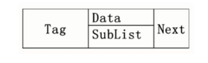
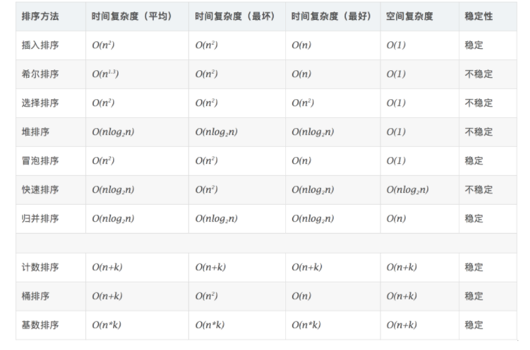
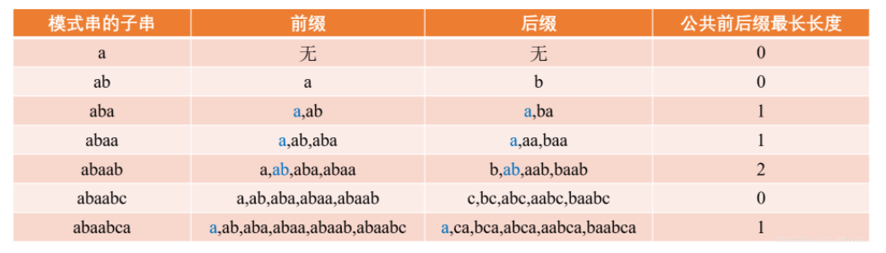
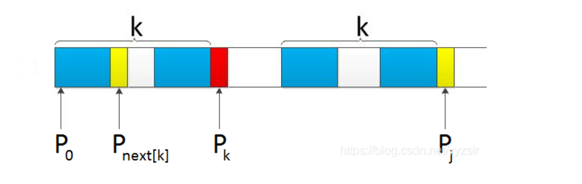

# 一 数据结构的基本概念

## 1 数据结构

**定义：**

1. 数据结构是抽象数据类型（ADT ：abstract data type）的物理实现。
2. 数据结构是计算机中，存储，组织数据的方式。

==官方定义：==

> 数据对象在计算机中的==组织方式==和对于数据对象的一==系列操作==

+ 数据对象在计算机中的组织方式
  + 逻辑结构
  + 物理存储结构
+ 附加在数据对象上的一系列操作

### **逻辑结构：**

数据之间的组织方式，是指数据元素之间的相互关系（面向问题）

+ 线性结构**（1:1）**：除第一个节点和最后一个节点，每一个节点只有一个前驱节点和一个后继节点

+ 非线性结构

  > + 树形结构**（1:n）**：除根节点外，每一个节点只有一个前驱节点，有零个或者多个后继节点
  > + 图形结构**（m:n）**：每一个节点可能有零个或者多个前驱节点和零个或者多个后继节点
  
+ 四种逻辑结构：

  > + 集合结构：集合之间的数据之间没有关系
  > + 线性结构
  > + 树形结构
  > + 图形结构

### **存储结构**：

数据在计算机中的存储方式（面向计算机）

+ 顺序存储结构：数据元素存储在一块连续的存储空间
+ 链式存储结构：数据元素存储在任意的存储空间（可以连续，可以非连续）通过指针将数据元素连接起来

总结：

+ 逻辑结构针对的是具体的问题，为了解决具体问题，在对问题的理解基础上，选择一个合适的数据结构表示元素之间的逻辑关系
+ 物理结构面向的是计算机，解决如何合理将数据的逻辑结构存储到计算机中

## 2 抽象数据类型

定义：包括数据类型和针对该数据类型的一组操作

+ 数据类型
  + 数据对象集
  + 数据操作集
+ 抽象：描述数据类型的方法不依赖于具体实现
  + 机器无关
  + 物理结构无关
  + 编程语言无关

关键：只涉及到数据对象集合操作集==是什么==，而不涉及到具体的实现

## 3 算法

==定义==：解决特定问题的一系列步骤，在计算机中表示为：**机器指令的有序序列**。

特性：

+ 输入：（0个或多个）
+ 输出：(1个或多个)
+ 有穷性：没有无限循环，有限步骤，步骤时间有限
+ 确定性：算法每一个步骤有确定含义，算法不会出现二义性
+ 可行性：算法的每一个步骤是有效执行的，不会出现异常和错误。可行性意味着算法可以转换为程序在计算机上正常运行而且能够的得到正确结果。

## 4 算法的复杂度

1. 空间复杂度S(n)：算法执行时占用空间的大小
2. 时间复杂度T(n)（常用）：算法在执行时占用时间的大小 

> - *T*(*n*)=*O*(*f*(*n*)) 是 T(n) 的某种**上界**
> - T(n)=Ω(g(n))  是 T(n) 的某种**下界**

==复杂度计算==

> - $T1(n)+T2(n)=max(O(f1(n)),O(f2(n)))$
> - $T1(n)×T2(n)=O(f1(n)×f2(n))$
> - 若 T*(*n*) 是关于 n 的 k 阶多项式，那么 $T(n)=\theta(n^k)$
> - for循环的复杂度：循环次数乘以循环体辅助度
> - if else 的复杂度 取决于（条件判断，两个分支）中三者的最大值

**复杂度大小比较：**

比较规则：判断一个算法的效率时，函数中的常数项和其他次要项可以忽略，只要关注最高阶项就行。

**两种复杂度：**

+ 最坏时间复杂度：运行时间的最坏保证，运行情况不会比这更坏了。提到的运行时间一般为最坏时间复杂度

+ 平均时间复杂度：运行时间的期望，在所有情况中最有意义的时间复杂度。

$C<O(n)<O(nlogn)<O(n^2)<O(n^3)<O(2^n)<O(n!)$

# 二 线性表

线性结构：除开第一个节点和最后一个节点，其他的节点只有一个前驱节点和一个后继节点。

线性表：由同类项数据元素构成的有序序列的线性结构

## 1 线性表的抽象数据类型描述

+ 类型名：List

+ 数据对象集：n个元素构成的有序序列

+ 操作集

  > + List MakeEmpty(): 初始化一个空线性表L;
  > + ElementType FindKth(int K, List L): 根据位序K,返回相应元素
  > +  int Find(ElementType X, List L): 在线性表L中查找X的第一次出现位置；
  > + void Insert(ElementType X, int i, List L): 在位序i前插入一个新元素X;
  > + void Delete(int i, List L): 删除指定位序i的元素；
  > + int Length(List L): 返回线性表L的长度n。

## 2 线性表 顺序存储实现

方式：通过使用数组的==连续存储空间==存储线性表的元素。(数组实现)

**实现方式：**

+ 静态数组

  > 定义：预先指定数组长度（必须为常数，不能是变量），定义后，数组长度无法改变
  >
  > int a[10]

+ 动态数组

  > 定义：由程序员自己创建，自己销毁，期间可以动态改变数组的长度。
  >
  > `int *a=(int *)malloc(sizeof(int)*10)`

**结构体定义**：

```c++
typedef struct LNode *List;
typedef struct LNode{
    ElementType Data[MAXSIZE];
    int Last;  // 代表线性表的最后一个元素
}LNode;
```

**相关操作：**

+ 插入节点

  > 复杂度：
  >
  > 插入一个元素需要移动的元素次数：$\frac{1}{n+1} \sum_{i=0}^n(n-i)=\frac{n}{2}$
  >
  > 注：插入位置n+1，移动次数有n到0

+ 删除节点

  > 复杂度：
  >
  > 删除一个元素需要移动的平均次数：$\frac{1}{n}\sum_{i=0}^{i=n-1}(n-i)=\frac{n-1}{2}$
  >
  > 注：删除位置n，移动次数0到n-1

**优缺点：**

优点：

+ 算法简单
+ 空间利用率高
+ 查找方便

缺点：

+ 需要预先指定大小（静态）
+ 插入删除复杂度较高

### 线性表 代码实现

```C++
/*
 * @Author: xt 
 * @Date: 2020-09-18 17:17:20 
 * @Last Modified by: xt
 * @Last Modified time: 2020-09-18 17:23:23
 */

// 顺序表的数组实现，包括的功能如下：
// + 创建空表
// + 寻找下标为i的元素
// + 在下标i上插入元素
// + 删除下标为i的元素
// + 寻找下标为k的元素
// + 求数组的长度

#include<iostream>
using namespace std;

//抽象数据类型定义
#define MaxSize 100
typedef int ElementType;
typedef struct LNode *List;
struct LNode
{
    ElementType Data[MaxSize]; //数组存放所有数据
    int Last;//存放数组中最后一个元素下标，初始为-1
};

List MakeEmptyList();//创建空表
int Find(ElementType x,List L); //寻找x 返回元素下标
void Insert(ElementType x,int i,List L); //在第i个下标插入元素x
void Delete(int i,List L); //删除下标为i的元素
ElementType FindKth(int k,List L); //寻找小标为k的元素
int length(List L); //求数组的长度


//创建空表
List MakeEmptyList()
{
    List ptrl;
    ptrl=(List) malloc(sizeof(struct LNode));
    ptrl->Last=-1;
    return ptrl;
}

//寻找x 返回元素下标
int Find(ElementType x,List L)
{
    int i=0;
    while(i<=L->Last&&L->Data[i]!=x)
    {
        i++;
    }
    if(i>L->Last)
        return -1;
    else
        return i;
}

//在第i个下标插入元素x
void Insert(ElementType x,int i,List L)
{
    //判断数组是否满
    if (L->Last+1==MaxSize) 
    {
        cout<<"数组已满"<<endl;
        return;
    }
    //判断插入位置是否合理
    if(i<0||i>L->Last+1)
    {
        cout<<"插入的位置不对"<<endl;
        return;
    }
    //将数组中下标j到i的元素全向后移动一位，
    //插入下标位于last+1 则跳过此操作
    for(int j=L->Last;j>=i;j--)
        L->Data[j+1]=L->Data[j];
    L->Data[i]=x;
    L->Last++;
    return;
}

//删除下标为i的元素
void Delete(int i,List L)
{
    //判断数组是否为空
    if(L->Last==-1)
    {
        cout<<"数组为空"<<endl;
        return;
    }
    //判断插入位置是否有误
    if(i<0||i>L->Last)
    {
        cout<<"有序表中没有该下标"<<endl;
        return;
    }
    //寻找插入位置
    for(int j=i;j<=L->Last;j++)
        L->Data[j]=L->Data[j+1];
    L->Last--;
    return;
}

//寻找下标为k的元素
ElementType FindKth(int k,List L)
{
    if(k<0||k>L->Last) 
    {
        cout<<"没有该下标"<<endl;
        return -1;
    }   
    return L->Data[k];
}

//求数组的长度
int length(List L)
{
    return L->Last+1;
}

//对所有的顺序表的功能进行测试
void test_linerlist()
{
    int i=0;
    List L=MakeEmptyList();
    cout<<"插入元素"<<endl;
    Insert(1,0,L);
    Insert(2,0,L);
    Insert(3,0,L);
    Insert(4,0,L);
    for (int j=0;j<length(L);j++)
        cout<<L->Data[j]<<" ";
    cout<<endl;
    cout<<"寻找下标为0的元素"<<FindKth(0,L)<<endl;
    cout<<"寻找下标为4的元素"<<FindKth(4,L)<<endl;
    cout<<"寻找值为1的元素下标"<<Find(1,L)<<endl;
    cout<<"寻找值为5的元素下标"<<Find(5,L)<<endl;
    cout<<"求出数组长度为"<<length(L)<<endl;

    cout<<"删除元素"<<endl;
    Delete(0,L);
    Delete(5,L);
    Delete(2,L);
    for (int j=0;j<length(L);j++)
        cout<<L->Data[j]<<" ";
    cout<<"测试结束"<<endl;
}

int main()
{
    test_linerlist();
}

```


## 3 线性表 链式存储实现 

### **背景**：

顺序表中，插入删除需要移动大量的元素，==通过使用链式结构使得插入删除变得方便。==

顺序表，需要指定空间大小，使用链表可以不用指定空间大小。

### **核心**：

通过使用链表，线性表不需要在物理位置上也相邻，通过链建立逻辑位置相邻关系。

### **结构体**：

```c++
typedef struct LNode *List;
struct LNode{
    ElementType Data;
    List Next;
};
```

### 头结点作用

**头结点：**链表中定义的第一个空节点，不存放数据，仅仅方便插入和删除操作。

**头指针：**链表中指向第一个节点的指针。链表的入口，若链表有头结点，头指针指向头结点

链表中可以没有头结点，但是一定有头指针

**头结点和不带头结点的区别**

参考链接：https://blog.csdn.net/qq_24118527/article/details/81317410

+ 在第一个节点的插入和删除更加方便

  > 使用头结点后，对第一个位置的操作都是基于p->next的操作，然后不需要对p本身进行操作。减少对第一个节点的特殊操作

+ 是否需要返回链表：

  > 不带头结点：需要返回链表，因为对第一个节点进行插入和删除时，需要对头指针p进行改变，因此需要返回链表
  >
  > 带头结点：头指针始终指向头结点，头指针始终不变，因此可以不返回头结点

+ 统一空表和非空表的处理

  > 若使用头结点，**无论表是否为空，头指针都指向头结点，也就是\*LNode类型**，对于空表和非空表的操作是一致的。
  >
  > 若不使用头结点，**当表非空时，头指针指向第1个结点的地址，即\*LNode类型，但是对于空表，头指针指向的是NULL**，此时空表和非空表的操作是不一致的。

### 带头结点的线性表 代码实现

```C++
/*
 * @Author: xt 
 * @Date: 2020-09-22 20:15:01 
 * @Last Modified by: xt
 * @Last Modified time: 2020-09-23 09:25:18
 */

// 带头结点的单链表的构造
#include<iostream>
using namespace std;
typedef int DataType;


// *************************************
// *********带头结点的单链表实现**********
// *************************************
typedef struct LNode
{
    DataType data;
    struct LNode* next;
}LNode;
typedef LNode* SinLinkList;


SinLinkList MakeEmpty(); //初始化链表 
int Length(SinLinkList L);  // 以遍历链表的方法求链表长度 
LNode* FindKth(int K,SinLinkList L);  // 按序号查找 第K个元素
LNode* Find(DataType X,SinLinkList L);  // 按值查找 
int Insert(DataType X,int i,SinLinkList L);  //将 X 插入到第 i-1(i>0) 个结点之后 
int Delete(int i,SinLinkList L); // 删除第 i(i>0) 个结点 
void Print(SinLinkList L); // 输出链表元素 

//初始化链表 
SinLinkList MakeEmpty()
{
    LNode* head=(SinLinkList)malloc(sizeof(LNode));
    head->data=0;
    head->next=NULL;
    return head;
}

// 以遍历链表的方法求链表长度 
int Length(SinLinkList L)
{
    LNode* p=L;
    int len=0;
    while (p->next!=NULL)
    {
        p=p->next;
        len++;
    }
    return len;
}

// 按序号查找 第K个元素
LNode* FindKth(int K,SinLinkList L)
{
    LNode* p=L->next;
    int i=1;
    //将K<=0的情况排除
    if(K<=0)
    {
        cout<<"没有找到第"<<K<<"个元素"<<endl;
        return NULL;
    }
    //循环判断，找到第k个位置
    while(p!=NULL && i<K)
    {
        p=p->next;
        i++;
    }
    if (p==NULL)
    {
        cout<<"没有找到第"<<K<<"个元素"<<endl;
        return NULL;
    }
    return p;
}

// 按值查找 
LNode* Find(DataType X,SinLinkList L)
{
    LNode *p=L->next;
    //循环判断，寻找X值
    while(p!=NULL && p->data!=X)
    {
        p=p->next;
    }
    if(p==NULL)
    {
        cout<<"没有找到值为"<<X<<"的节点"<<endl;
        return NULL;
    }
    return p;
}

//将 X 插入到第 i-1(i>0) 个结点之后
int Insert(DataType X,int i,SinLinkList L)
{
    LNode* p=L;
    int j=0;
    //寻找第i-1个元素
    while(p!=NULL&&j<i-1)
    {
        p=p->next;
        j++;
    }
    if(p==NULL)
    {
        cout<<"没有找到第"<<i<<"个节点"<<endl;
        return -1;
    }
    else
    {
        LNode* temp=(LNode *)malloc(sizeof(LNode));
        temp->data=X;
        temp->next=p->next;
        p->next=temp;
    }
    return 1;
}

// 删除第 i(i>0) 个结点 
int Delete(int i,SinLinkList L)
{
    LNode* p=L;
    int j=0;
    //寻找第i-1个元素
    while(p!=NULL && j<i-1)
    {
        p=p->next;
        j++;
    }
    if(p==NULL || p->next==NULL)
    {
        cout<<"没有找到第"<<i<<"个节点"<<endl;
        return -1;
    }
    else
    {
        LNode* temp=p->next;
        p->next=p->next->next;
        free(temp);
        return 1;
    }
}

//输出链表元素
void Print(SinLinkList L)
{
    LNode* p=L->next;
    cout<<"链表的元素为："<<endl;
    while(p!=NULL)
    {
        if(p->next==NULL)
            cout<<p->data<<endl;
        else
            cout<<p->data<<"->";
        p=p->next;
    }
}
    
void test()
{
    SinLinkList L=MakeEmpty();
    cout<<"链表长度"<<Length(L)<<endl;
    int i=0;
    i = Insert(11,1,L);
	i = Insert(25,1,L);
	i = Insert(33,2,L);
	i = Insert(77,3,L);
    for(int j=0;j<6;j++)
    {
        if(FindKth(j,L)!=NULL)
            cout<<FindKth(j,L)->data<<endl;
    }
    cout<<"输出链表"<<endl;
    Print(L);
    cout<<"链表长度"<<Length(L)<<endl;
    Find(22,L);
    cout<<Find(11,L)->data<<endl;
    cout<<FindKth(1,L)->data<<endl;
    FindKth(5,L);
    cout<<"删除第1个元素"<<endl;
    i = Delete(1,L);
    Print(L);
    cout<<"删除第3个元素"<<endl;
	i = Delete(3,L);
    Print(L);

    cout<<"测试结束"<<endl;
}


// *************************************
// *********带头结点的双向循环链表实现*****
// *************************************

typedef struct DLNode
{
    DataType data;
    DLNode* pre;
    DLNode* post;
}DLNode;
typedef DLNode* DLinkList;

DLinkList MakeEmptyDLinkList(); //初始化链表 
int Length(DLinkList L);  // 以遍历链表的方法求链表长度 
DLNode* FindKth(int K,DLinkList L);  // 按序号查找 第K个元素
DLNode* Find(DataType X,DLinkList L);  // 按值查找 
int Insert(DataType X,int i,DLinkList L);  //将 X 插入到第 i-1(i>0) 个结点之后 
int Delete(int i,DLinkList L); // 删除第 i(i>0) 个结点 
void Print(DLinkList L); // 输出链表元素 

//初始化链表
DLinkList MakeEmptyDLinkList()
{
    DLNode* head=(DLNode*)malloc(sizeof(DLNode));
    head->data=0;
    head->pre=NULL;
    head->post=NULL;
    return head;
}

// 以遍历链表的方法求链表长度
int Length(DLinkList L)
{
    DLNode *p=L;
    int len=0;
    while(p->post!=L)
    {
        p=p->post;
        len++;
    }
    return len;
}

// 按序号查找 第K个元素
DLNode* FindKth(int K,DLinkList L)
{
    DLNode *p=L;
    if(K<=0)
    {
        cout<<"没有第"<<K<<"个节点"<<endl;
        return NULL;
    }
    int j=0;
    while(p->post!=L && j<K)
    {
        p=p->post;
        j++;
    }
    if(j!=K)
    {
        cout<<"没有第"<<K<<"个节点"<<endl;
        return NULL;
    }
    return p;
}

// 按值查找 
DLNode* Find(DataType X,DLinkList L)
{
    DLNode* p=L->post;
    while(p!=L && p->data!=X)
        p=p->post;
    if(p==L)
    {
        cout<<"没有找到节点"<<X<<endl;
        return NULL;
    }
    return p;
}


int main()
{
    test();
    return 0;
}
```


### 不带头结点的线性表 代码实现

```C++
/*
 * @Author: xt 
 * @Date: 2020-09-19 16:33:50 
 * @Last Modified by: xt
 * @Last Modified time: 2021-03-12 10:07:55
 */

// 链表的实现：不带头结点的链表
// 功能如下：
// LinkList MakeEmpty(); //初始化链表 
// int Length(LinkList L);  // 以遍历链表的方法求链表长度 
// LinkList FindKth(int K,LinkList L);  // 按序号查找 
// LinkList Find(ElementType X,LinkList L);  // 按值查找 
// LinkList Insert(ElementType X,int i,LinkList L);  //将 X 插入到第 i-1(i>0) 个结点之后 
// LinkList Delete(int i,LinkList L); // 删除第 i(i>0) 个结点 
// void Print(LinkList L); // 输出链表元素 

#include<iostream>
using namespace std;
#include<string>

typedef struct LNode* LinkList; //*结构体的定义必须带上struct
typedef int ElementType;
typedef struct LNode{
    ElementType data;
    LinkList next;
}LNode;

LinkList MakeEmpty(); //初始化链表 
int Length(LinkList L);  // 以遍历链表的方法求链表长度 
LNode* FindKth(int K,LinkList L);  // 按序号查找 第K个元素
LNode* Find(ElementType X,LinkList L);  // 按值查找 
LinkList Insert(ElementType X,int i,LinkList L);  //将 X 插入到第 i-1(i>0) 个结点之后 
LinkList Delete(int i,LinkList L); // 删除第 i(i>0) 个结点 
void Print(LinkList L); // 输出链表元素 


//初始化链表
LinkList MakeEmpty()
{
    LinkList L=NULL;
    return L;
}

//求链表长度
int Length(LinkList L)
{
    int len=0;
    LinkList p=L;
    while (p!=NULL)
    {
        len++;
        p=p->next;
    }
    return len;
}

//查找第K个元素 返回元素对应的指针
LNode* FindKth(int k,LinkList L)
{
    LinkList p=L;
    int i=1;
    //同时遍历p和i，当p=NULL或者i=k跳出循环
    while (p!=NULL&& i<k)
    {
        /* code */
        p=p->next;
        i++;
    }
    //没找到第k个元素
    if(p==NULL)
    {
        cout<<"在链表中没有找到"<<k<<"元素"<<endl;
        return NULL;
    }
    //找到第k个元素
    else
    {
        return p;
    }
}

//寻找值为x的元素，返回元素指针
LNode* Find(ElementType X,LinkList L)
{
    LinkList p=L;
    //同时遍历链表p，当遍历完p=NULL或者找到X时结束循环
    while (p!=NULL && p->data!=X)
    {
        p=p->next;
    }
    //链表结束，未找到
    if(p==NULL)
    {
        cout<<"没有找到值为"<<X<<"的元素"<<endl;
        return NULL;
    }
    //找到X
    return p;  
}

//在第i个位置插入节点X
LinkList Insert(ElementType X,int i,LinkList L)
{
    LinkList p=L;
    LinkList temp=NULL;
    //未带头结点，插入第一个节点，需要对头指针进行操作
    if(i==1)
    {
        temp=(LinkList)malloc(sizeof(struct LNode));
        temp->next=p;
        temp->data=X;
        return temp; //返回新的头指针
    }
    //寻找第i-1个节点
    p=FindKth(i-1,L);
    if(p==NULL)
    {
        cout<<"插入的位置不存在"<<endl;
        return L;
    }
    else
    {
        temp=(LinkList)malloc(sizeof(struct LNode));
        temp->next=p->next;
        temp->data=X;
        p->next=temp;
        return L;  //指针未修改，考虑一致性，返回
    }
}

//删除第i个节点
LinkList Delete(int i,LinkList L) // 删除第 i(i>0) 个结点 
{
    LinkList p=L;
    LinkList temp=NULL;
    //第一个节点需要分开操作
    if(i==1)
    {
        temp=p;
        p=p->next;
        free(temp);
        return p;
    }
    //寻找前驱节点
    LinkList pre=FindKth(i-1,L);
    if(pre==NULL || pre->next==NULL )
    {
        cout<<"没有第i个节点"<<endl;
        return L;
    }//找到当前节点
    else
    {
        temp=pre->next;
        pre->next=temp->next;
        free(temp);
        return L;
    }   
}

//输出所有元素
void Print(LinkList L)
{
    LinkList p=L;
    while (p!=NULL)
    {
        if(p->next==NULL)
            cout<<p->data<<endl;
        else
            cout<<p->data<<"->";
        p=p->next;
    }
}

//测试所有的链表函数
void testSList()
{
    LinkList L=MakeEmpty();
    cout<<"链表长度"<<Length(L)<<endl;
    L = Insert(11,1,L);
	L = Insert(25,1,L);
	L = Insert(33,2,L);
	L = Insert(77,3,L);
    cout<<"输出链表"<<endl;
    Print(L);
    cout<<"链表长度"<<Length(L)<<endl;
    Find(22,L);
    cout<<Find(33,L)->data<<endl;
    cout<<FindKth(1,L)->data<<endl;
    FindKth(5,L);
    cout<<"删除第1个元素"<<endl;
    L = Delete(1,L);
    Print(L);
    cout<<"删除第3个元素"<<endl;
	L = Delete(3,L);
    Print(L);

    cout<<"测试结束"<<endl;
}
int main()
{
   testSList();
   return 0;
}

```


### 相关操作

+ 初始化操作

  > 两种方式
  >
  > + 在函数中申请空间，函数返回头结点指针
  >
  > + 在链表头指针的指针作为函数参数，返回成功与否
  >
  >   > 因为要修改头指针，所以参数需要传递链表头指针的指针

+ 插入操作和删除操作，不需要对第一个元素进行特殊处理。

**复杂度**：

> 插入：
>
> 插入一个元素的平均比较次数为：$\frac{1}{n+1} \sum_{i=0}^n(n-i)=\frac{n}{2}$
>
> 删除：
>
> 删除一个元素的平均比较次数为：$\frac{1}{n}\sum_{i=0}^{i=n-1}(n-i)=\frac{n-1}{2}$

优缺点：

**优点：**

> + 插入和删除操作不需要对元素进行移位，只需要进行比较
> + 可以动态的对线性表的元素进行增加

**缺点:**

> + 使用链路结构，对空间资源利用率不高，需要额外空间保存next
> + 查找困难。

### 单链表和顺序存储结构优缺点

+ 存储结构

  > 顺序结构：连续存储空间，静态空间，有限制
  >
  > 链式结构：一组任意的存储单元，动态空间，无限制

+ 查找

  > 顺序结构：O(1)
  >
  > 链式结构：O(n)

+ 插入和删除

  > 顺序结构O(n)
  >
  > 链式结构：找到指针后O(1)

### 静态链表

定义：用数组描述的链表

```C++
#define MaxSize 1000
typedef struct Node{
    int data;
    int next;
}Node,StaticLinkList[MaxSize];

```

**利弊**

针对顺序存储结构

+ 插入删除时不需要进行大量的元素移动。
+ 失去顺序存储的随机性特点

## 4 广义表

核心：广义表是线性表的推广

+ 线性表，n个元素都是基本的单元素
+ 广义表中，元素可以是单元素，也可以是另一个广义表

结构体：

```C++
typedef struct GNode *GList;
struct GNode{
    int Tag;  /*标志域：0表示结点是单元素，1表示结点是广义表*/
    union{    /*子表指针域Sublist与单元素数据域Data复用，即共有存储空间*/
        ElementType Data;
        GList SubList;
    }URegion;
    GList Next;  /*指向后继结点*/
};
```



# 三 排序

## 1 排序的相关概念

### 稳定性：

对于值相同的数据元素在排序前后的相对位置称为排序算法的稳定性，相对位置不变排序稳定，相对位置变化算法不稳定。

### 内排序和外排序

+ 内排序：在排序的过程中，将排序的所有内容全部放置在内存中
+ 外排序：元素内容太多无法同时放置在内存中，整个排序的过程元素需要在内外存中间进行多次交换

### 影响内排序算法性能的因素

+ 时间性能：算法的时间复杂度

  > 主要操作：比较和交换
  >
  > 高效的内排序算法需要尽可能少的**关键词比较次数**和**记录移动次数**

+ 空间性能：辅助空间

+ 算法的复杂性：

### 十大内排序算法

比较排序：

+ 简单排序：冒泡排序，插入排序，简单选择排序
+ 改进排序：希尔排序，堆排序，归并排序，快速排序

非比较排序：

+ 计数排序，桶排序，堆排序

### 排序分类

+ 比较类非线性时间排序

  > 交换类排序：快速排序，冒泡排序
  >
  > 插入类排序：简单插入排序，希尔排序
  >
  > 选择类排序：简单选择排序，堆排序
  >
  > 归并排序：二路归并排序和多路归并排序

+ 非比较类线性时间排序

  > 计数排序，基数排序，桶排序

## 排序总结

+ 冒泡排序

  > + 特点：内排序，交换类排序：稳定排序
  > + 思想：进行n-1次冒泡，每一轮冒泡通过两两交换找出第i个元素。
  > + 复杂度分析：
  >   + 时间复杂度：
  >     + **最好O(n)**(正序),
  >       + 比较次数 n-1
  >       + 移动次数 0
  >     + **最坏O(n^2)**(逆序)
  >       + 比较次数：$\sum_{i=2}^{n}(i-1)=1+2+3+....n-1=\frac{n(n-1)}{2}$,
  >       + 移动次数：相等
  >   + 空间复杂度：O(1)
  >     + 一个辅助空间
  > + 稳定性：算法稳定

+ 快速排序

  > 背景：在冒泡排序上进行改变，跨元素的交换排序。
  >
  > 核心思想：将一列待排序的数组分为两部分，左边小于关键字，右边大于关键字。然后分别对子序列进行排序。
  >
  > 复杂度分析：
  >
  > + 时间复杂度
  >
  >   > 和基准点的选取有关，
  >   >
  >   > + 最优：O(nlogn)，基准点每次选取度在中间
  >   > + 平均：O(nlogn)：
  >   >   + 选基准点：O(n)
  >   >   + 递归排序：O(logn)
  >   > + 最坏：(O(n^2)),序列基本有序，快速排序形成一个单边递归树，树的深度比较高导致效率低
  >   
  > + 空间复杂度：
  >
  >   + 最好：O(logn) 栈的深度
  >   + 最坏：O(n) 单边递归树
  >
  > 稳定性：跳跃式交换，不稳定
  >
  > 特点：快速排序是内排序中，平均时间复杂度最低的。

+ 简单选择排序

  > 背景：相对冒泡排序，减少元素交换次数，但比较次数固定
  >
  > 思想：每次选择出最小元素，进行交换
  >
  > 特点：内排序，稳定，选择类排序
  >
  > + 时间复杂度：
  >
  >   + 比较次数固定$\sum_{i=2}^{n}(i-1)=1+2+3+....n-1=\frac{n(n-1)}{2}$
  >
  >   + 最好（正序）：O(N^2)    移动次数0次，
  >   + 最坏（逆序）：O(N^2)    移动次数n-1次
  >
  > + 空间复杂度：O(N)
  >
  > 稳定性：不稳定
  >
  > + 跨元素比较，不稳定

+ 堆排序

  > 背景：类似简单选择排序，每次选择最小的元素，善用堆结构
  >
  > 思想：每次在堆中选出最大或者最小的元素，然后将剩余的元素建成一个堆，然后
  >
  > 特点：内排序，选择排序，不稳定算法。
  >
  > 方法：堆排序算法分为两个主要的部分
  >
  > + 堆建立：
  >
  >   > 从最后内部节点开始到根节点，从下至上，从右到左依次调整堆，使得以该内部节点的子树是一个堆
  >   >
  >   > 进行上溯操作
  >
  > + 堆调整
  >
  >   > 将堆根节点和尾节点互换，然后堆分离尾节点，对根节点进行调整。
  >   >
  >   > 进行下朔操作
  >
  > 复杂度分析：
  >
  > + 时间复杂度：堆建立O(N),堆调整O(nlogn)，每一次调整是logn，进行n次调整
  >   + $O(nlogn)=O(n)+O(nlogn)$
  > + 空间复杂度：O(1)
  >
  > 无论堆中的记录是处于正序还是逆序排列，**都不会使得堆处于最好或者最坏状态**。

+ 直接插入排序

  > 背景：模拟打牌，来一张牌，插入一个元素
  >
  > 特点：内排序，插入排序，稳定排序
  >
  > 思想：每插入一个元素，从i-1开始寻找插入位置
  >
  > 复杂度分析：
  >
  > + 时间复杂度：
  >   + 最好（顺序有序）：O(n)  比较次数：n-1，移动次数：0
  >   
  >   + 最坏（逆序有序）：O(n^2),
  >   
  >     + 比较$\sum_{i=2}^{n}(i)=2+3+....n=\frac{(n+2)(n-1)}{2}$，
  >   
  >     + 移动次数，$\sum_{i=2}^{n}(i+1)=3+....n+1=\frac{(n+4)(n-1)}{2}$
  > + 空间复杂度
  >   + O(1)
  >
  > 改进方法：顺序查找的查找速度太慢，使用折半插入排序

+ 希尔排序：

  > 背景：直接插入排序高效的两个基本条件
  >
  > + 记录数比较少
  > + 序列基本有序
  >
  > 解决：
  >
  > + **缩小增量**：通过设置增量使得序列分割为小序列，并且每次的排序的元素比较少
  > + **多遍插入排序**：通过缩小增量的方式使得序列基本有序，最后一次增量为1时，基本需要交换和比较的次数较少
  > + 最后必须进行一次增量为1的直接插入排序
  >
  > ==本质：关键不是分组后的根据子序列排序导致效率提升，而是通过增量实现元素的跳跃式移动。==
  >
  > 复杂度分析
  >
  > + 时间复杂度：$O(n^{1.25})-O(1.6n^{1.25})$
  > + 空间复杂度
  >
  > 特点：插入排序，不稳定排序，内排序
  >
  > 希尔排序优势：
  >
  > + 序列少
  > + 基本有序
  > + 跳跃式交换
  >
  > 特点：插入排序，不稳定排序，内排序
  
  

## 冒泡排序

+ 计数排序：

  > 思想：采用一种以空间换时间的方法，**基于非比较的排序算法**
  >
  > 算法：开辟一个大空间数组，将排序元素的存储在其对应的下标空间中，然后从数组中取出元素。
  >
  > 步骤：
  >
  > + 开辟一个数组空间，将所有元素按照下标给对应位置记上数量
  > + 将存储空间的元素依次填充到原数组空间中
  >
  > 复杂度分析：
  >
  > + 时间复杂度：O(n+k)，n元素个数，k数组下标的最大值
  >   + 需要对n个元素进行遍历，然后对K个位置的元素取出。
  > + 空间复杂度：O(n)
  >
  > 

+ 桶排序

  > 背景：计数排序的升级版，利用函数的映射关系，选择元素的存储位置，算法的效率取决映射函数(数组空间)
  >
  > 方法：
  >
  > + 元素入桶：先将所有元素存放到对应的桶里，
  > + 桶内排序：将桶内的元素按照其他的排序算法进行排序
  > + 将所有的元素重新拼接
  >
  > 复杂度分析：
  >
  > + 时间复杂度：
  >   + 最好：O(n)：桶数量够大，计数排序
  >   + 最坏：O(n^2)，一个桶，退化普通排序
  > + 空间复杂度：O(n)

+ 基数排序：

  > 思想：按照关键字的优先级排序（计数排序），比如普通数字，先按照低位排序，然后收集排序后元素，随即按照高位排序，然后再收集排序后元素。
  >
  > 复杂度分析：
  >
  > + 时间复杂度：O(k(n+m)) k 关键字类别，每一个关键字的取值范围，n数量
  > + 空间复杂度：O(n+m)
  >
  > 特点：稳定排序
  >
  > 应用：适合关键字一定的，比如年月日排序

+ 十种算法的总结：

  > 修改：快排的空间复杂度为O(logn)
  >
  > 排序选择：
  >
  > + 元素数量越小，选择简单排序适合，元素数量越大，选择改进排序较好。
  > + 稳定性：归并排序适合稳定性
  > + 空间大小：堆排序的空间要求最低
  > + 综合评价：快速排序最好



## 冒泡排序

方法：通过比较相邻的元素，不断将剩余序列中的最大元素置换到序列尾部。

性质：交换类排序，稳定排序

复杂度：

+ 最好O(n),序列基本有序，只需要进行n-1次比较，没有数据交换
+ 最坏$O(n^2)$,比较次数：$\sum_{i=2}^{n}(i-1)=1+2+3+....n-1=\frac{n(n-1)}{2}$,数据交换次数，相等

空间复杂度：

+ 一个辅助空间

算法优化，通过设置一个标识位表示判断算法是否有序，当算法有序时直接跳出循环，不进行无意义的比较。

```C++
#include<vector>
void bubble_sort(vector<int> &vec)
{
    int len=vec.size();
    bool flag=true;
    //进行len-1次排序
    for(int i=1;i<len;i++)
    {
        flag=true;//初始标志位，假定基本有序
        for(int j=0;j<len-i;j++)//每次排序范围为[0,len-i-1]
        {
            if(vec[j]>vec[j+1])
            {
                swap(vec[j],vec[j+1]);
                flag=false;
            }       
        }
        if(flag)//假如没有交换，直接退出
            break;
    }
}
```

> + 从前向后起泡，i=[0,size-2]，j=[0,size-i-2]，
> + 从后向前起泡，i=[0,size-2],j=[size-2,i]
>
> 最主要的是注意i和j的取值范围

## 快速排序

核心思想：将一列待排序的数组分为两部分，左边小于关键字，右边大于关键字。然后分别对子序列进行排序。

复杂度分析：

+ 时间复杂度

  > 和基准点的选取有关，
  >
  > + 最优：O(nlogn)，基准点每次选取度在中间
  > + 最坏：(O(nlogn)),序列基本有序，插入排序形成一个单边递归树，树的深度比较高导致效率低

稳定性：跳跃式交换，不稳定

```C++
//选取标准点，将标准点归位
int parttition(SqList *l,int low,int high)
{
    int pivotkey=l->list[low];
    while(low<high)
    {
        //将比标准点小的元素移到左边
        while(low<high&&l->list[high]>=pivotkey)
            high--;
        Swap(l,low,high);
        //将比标准点大的元素移到右边
        while(low<high&&l->list[low]<=pivotkey)
            low++;
        Swap(l,low,high);
    }
    
    return low;
}
void QSort(SqList *l,int low,int high)
{
    int povit;
    if (low<high)
    {
        //选取标准点
        povit=parttition(l,low,high);
        cout<<"povit"<<povit<<endl;
        //将标准点左侧递归
        QSort(l,low,povit-1);
        //将标准点右侧递归
        QSort(l,povit+1,high);
    }
}

int partition(vector<int> &vec,int low,int high)
{
    int pivotkey=vec[low];
    while(low<high)
    {
        while(low<high&&vec[high]>=pivotkey)
            high--;
        swap(vec[low],vec[high]);
        while(low<high&&vec[low]<=pivotkey)
            low++;
        swap(vec[low],vec[high]);
    }
    return low;
}
void quick_sort(vector<int> &vec,int low,int high)
{
    int povit;
    if(low<high)
    {
        povit=partition(vec,low,high);
        quick_sort(vec,low,povit-1);
        quick_sort(vec,povit+1,high);
    }
}
```

**复杂度分析**

+ 最坏情况，基本正序或者逆序，一次排序少一个元素，复杂度O(nlogn)
+ 最好情况，标准点选择为最中间，复杂度为O(nlogn)
+ 平均情况：复杂度为O(nlogn)

## 简单选择排序

方法，每次循环选择最小的元素，交换到指定位置。

性质：选择类排序，稳定排序

特点：相对冒泡排序，减少元素交换次数，但比较次数固定

复杂度分析：

> + 最好情况O(n^2)，比较次数：$\sum_{i=2}^{n}(i-1)=1+2+3+....n-1=\frac{n(n-1)}{2}$，交换次数0
> + 最坏情况O(n^2)，比较次数：$\sum_{i=2}^{n}(i-1)=1+2+3+....n-1=\frac{n(n-1)}{2}$，交换次数n-1.
>
> 空间复杂度：一个辅助空间
>
> 相比冒泡排序，其性能更加优秀一些。

```C++
//选择排序算法
void choice_sort(vector<int> &vec)
{
    for(int i=0;i<vec.size()-1;i++)
    {
        //记录最小元素
        int min=vec[i];
        int index=i;

        for(int j=i+1;j<vec.size();j++)
        {
            if(min>vec[j])
            {
                min=vec[j];
                index=j;
            }
        }
        //交换位置
        if(index!=i)
            swap(vec[i],vec[index]);
    }
}
```

## 堆排序

背景：在简单选择排序中，每一次寻找出当前序列最小的元素，其中包含n-1次比较，==但是其中比较的记录没有存储，导致进行多次无效的比较。==

堆：二叉完全树

+ 大顶堆：每一个节点的值大于孩子节点
+ 小顶堆：每一个节点的值小于孩子节点

堆排序：对简单选择排序进行改进，使得数据结构能够记录一些元素的大小关系

数据结构：使用数组存储堆，

>  其中根节点从下标1开始存储
>
> 左节点为2*i，右节点为2i+1

方法：堆排序算法分为两个主要的部分

+ 堆建立：

  > 从最后内部节点开始到根节点，从下至上，从右到左依次调整堆，使得以该内部节点的子树是一个堆，

+ 堆调整

  > 将堆根节点和尾节点互换，然后堆分离尾节点，对根节点进行调整。

```C++
//调整大顶堆m为堆根节点编号，n为堆尾部节点编号
void heapAdjust(SqList *l,int m,int n)
{
    //m一直指代二叉树的根节点，j指代二叉树的儿子节点，n指代堆的最后一个节点
    int temp=l->list[m];
    for (int j=m*2;j<=n;j*=2)
    {
        //选出子节点中较大元素，标记为j
        if(j<n&&l->list[j]<l->list[j+1])
            j++;
        //根节点比子节点大，跳出循环
        if(temp>=l->list[j])
            break;
        //否则，将根节点置为子节点较大元素
        l->list[m]=l->list[j];
        //根节点标记下移，继续判断
        m=j;
    }

    l->list[m]=temp;
}

//堆排序（新）
void HeapSort(SqList *l)
{
    //大顶堆的建立
    for (int i=l->length/2;i>=1;i--)
        heapAdjust(l,i,l->length);
    
    //大顶堆的调整
    for (int i=l->length;i>1;i--)
    {
        Swap(l,1,i);
        heapAdjust(l,1,i-1);
    }
}

void heap_adjust(vector<int> &vec,int m,int n)
{
    int temp=vec[m];
    for(int i=m*2+1;i<=n;i*=2)
    {
        //选择子节点较大元素,注意需要保存i<n，判断是否有两个子节点
        if(vec[i]<vec[i+1]&&i<n)
            i+=1;
        if(vec[i]<=temp)
            break;
        //将探索元素替换根元素
        vec[m]=vec[i];
        m=i;
    }
    vec[m]=temp;
}
void heap_sort(vector<int> &vec)
{
    int len=vec.size();
    //将所有叶子结点进行堆调整
    for(int i=(len-1)/2;i>=0;i--)
    {
        heap_adjust(vec,i,len-1);
    }

    //从后向前，不断交换元素，调整堆
    for(int i=len-1;i>=0;i--)
    {
        swap(vec[0],vec[i]);
        heap_adjust(vec,0,i-1);
    }
}
```

复杂度分析：o(nlogn)

+ 构建堆：从尾内部节点开始，交换和比较次数有限，复杂度为O(n)
+ 调整堆：需要对堆进行n-1次调整，取出每次调整需要时间为O(logn)，复杂度为O(nlogn)

性质：堆排序对元素的初始位置不敏感，因此最好时间复杂度，平均时间复杂度和最坏时间复杂度均是O(nlogn)

## 插入排序

### 直接插入排序

方法：类似打牌，每次选择一张牌，插入已经排好序列中。

性质：插入类排序，稳定排序

特点：平均移动和比较次数为$\frac{n^2}{4}$,综合比较性能优于冒泡排序和简单选择排序

复杂度分析

> 时间复杂度：
>
> + 最好情况：比较次数n-1，移动次数0
> + 最坏情况：比较次数$\sum_{i=2}^{n}(i)=2+3+....n=\frac{(n+2)(n-1)}{2}$,移动次数$\sum_{i=2}^{n}(i+1)=2+3+....n=\frac{(n+4)(n-1)}{2}$
>
> 空间复杂度：一个辅助空间

```C++
//直接插入排序算法
void direct_insert_sort(vector<int>& vec)
{
    int len=vec.size();
    for(int i=1;i<vec.size();i++)
    {
        if(vec[i]<vec[i-1])//判断第i个位置是否需要插入
        {
            int temp=vec[i];
            int j=i-1;
            for(;j>=0&&temp<vec[j];j--)//从i1个元素开始遍历，边判断，边调整位置。
                vec[j+1]=vec[j];
            vec[j+1]=temp;//最后插入的位置为j+1
        }
        
    }
}
```

### **折半插入排序法**

```C++
//折半插入排序
void half_insert_sort(vector<int> &vec)
{
    for(int i=1;i<vec.size();i++)
    {
        int low=0;
        int high=i-1;
        int temp=vec[i];
        //寻找插入位置
        while(low<=high)
        {
            int mid=(high+low)/2;
            if(vec[mid]>temp)
                high=mid-1;
            else if(vec[mid]<=temp)
                low=mid+1;
        }
        //元素替换
        for(int j=i-1;j>=low;j--)
        {
            vec[j+1]=vec[j];
        }
        vec[low]=temp;
    }
}
```

> 关键是二分法寻找插入位置需要注意。
>
> 1. 终止的条件
> 2. ==插入位置为low；由于C++除2时向下取整，使得最终mid的位置和low的位置是一样的。==

### **2路插入排序**

原理：在直接插入排序基础上进行改良，使用一个辅助的循环数组空间，当插入在最前时，不需要移动元素，减少数据移动的次数。

```C++
//2路插入排序
void path_2_insert_sort(SqList *l)
{
    int temparr[l->length]={};//使用一个循环数组空间
    int first=0;
    int last=0;
    int n=l->length;
    temparr[0]=l->list[0];
    for (int i=1;i<l->length;i++)
    {
        //当插入元素小于first的元素，插入到最前面
        if(l->list[i]<temparr[first])
        {
            first=(first-1+n)%n;
            temparr[first]=l->list[i];
            continue;
        }
        //当插入的元素大于last的元素，插入到最后
        if(l->list[i]>temparr[last])
        {
            last=(last+1)%n;
            temparr[last]=l->list[i];
            continue;
        }
        //当插入的元素在中间，则正常的直接插入排序
        int k=last;
        for (;temparr[k]>l->list[i];k=(k-1+n)%n)
        {
            temparr[(k+1+n)%n]=temparr[k];
        }
        temparr[(k+1)%n]=l->list[i];
        last=(last+1)%n;
    }
    //最后将结果复制到原来的数组中
    for (int i=0;i<l->length;i++)
    {
        l->list[i]=temparr[(first+i)%n];
    }
}
```

### 表插入排序

目的：从根本上解决排序算法中的数据移动的问题：使用链表存储，插入时不需要数据移动。

使用数组格式表示链表：http://c.biancheng.net/view/3442.html

表插入排序的过程类似链表插入元素的过程

**对链表进行再加工**

==关键：对链表的元素再加工，将链表中的 元素重新排序，具体做法为：遍历链表，将链表中第 i 个结点移动至数组的第 i 个下标位置中。==

```C++
//对数组链表进行重新排序
void arrange(List *l)
{
    int p=l->r[0].next;//指向有序链表的第i个元素的数组位置
    for (int i=1;i<l->length;i++)//i指代数组中的第i个位置
    {
        //成立表示数组元素已经移动过，是处于正确的位置，需要寻找原来该位置的元素
        while(p<i)
            p=l->r[p].next;
        
        //记录下链表的下一个位置
        int q=l->r[p].next;
        if(p!=i)
        {
            //交换数组元素，同时将i的下标更新
            Node t;
            t=l->r[p];
            l->r[p]=l->r[i];
            l->r[i]=t;
            l->r[i].next=p;
        }
        p=q;
    }
}
```

## 希尔排序

背景：插入排序算法虽然相对普通算法效率有了一定改进，但是其复杂度仍然是O(n^2)，在此基于插入排序算法，进行改进。

直接插入排序对插入的元素进行插入时，只能顺序比较，不能跳跃式比较。

思路：

直接插入排序高效的两个基本条件

+ 记录数比较少
+ 序列基本有序

解决：

+ 通过设置增量使得序列分割为小序列，并且每次的排序的元素比较少
+ 通过缩小增量的方式使得序列基本有序，最后一次增量为1时，基本需要交换和比较的次数较少
+ 最后必须进行一次增量为1的直接插入排序

复杂度分析

希尔排序的复杂度：$O(nlog(n))$

==本质：关键不是分组后的根据子序列排序导致效率提升，而是通过增量实现元素的跳跃式移动。==

比较不同分组方式，比如连续n个元素为一个字序列，间隔n个元素为一个子序列。前者和直接插入排序没有区别

```C++
//希尔排序
void shell_sort(vector<int> &vec)
{
    int increament=vec.size();
    while(increament>1)//增量大于1循环，等于1，执行一次退出
    {
        increament=increament/3+1;
        for(int i=increament;i<vec.size()-1;i++)//从increment 开始遍历元素，分组插入。
        {
            int temp=vec[i];
            int j=i-increament;
            for(;temp<vec[j]&&j>=0;j=j-increament)
            {
                vec[j+increament]=vec[j];
            }
            vec[increament+j]=temp;
        }
    }
}
```

总结：希尔排序就是多个量不为1的直接插入排序，通过增量可帮助元素跳跃式移动

## 归并排序

核心思想：

将数组元素一直递推为所有的单个元素，然后将所有单个元素两两归并，最终归并为一个数组。

### 递归排序

递归排序算法，类似二叉树的递归访问。

关键问题：如何利用辅助空间

```C++
void merge(vector<int> &S,vector<int> &T,int s,int m,int n)
{
    int i,j,k;
    //归并
    for(i=s,j=m+1,k=s;i<=m&&j<=n;k++)
    {
        if(S[i]<S[j])
            T[k]=S[i++];
        else
            T[k]=S[j++];
    }
    while(i<=m)
        T[k++]=S[i++];
    while(j<=n)
        T[k++]=S[j++];
    
    //将T中值转移到S中
    for(int o=s;o<=n;o++)
    {
        S[o]=T[o];
    }
    cout<<endl;
}
//temp是临时数组，把S中的元素，借助临时数组排序
void merge_sort(vector<int>& S,vector<int>& temp,int low,int high)
{
    //遍历到叶子结点直接退出
    if(low>=high)
        return;
    
    int mid=(low+high)/2;
    merge_sort(S,temp,low,mid);
    merge_sort(S,temp,mid+1,high);
    cout<<"序列"<<low<<" "<<mid<<" "<<high<<endl;
    merge(S,temp,low,mid,high);           
}
```

### 非递归排序

正常的非递归排序思想：将k长度子序列两两合并。

```C++
//将SR中的所有的序列按照s子序列两两合并到TR中，n为序列最后一个元素下标
void MergePass(int SR[],int TR[],int s,int n)
{
    int i=0;
    //i为序列起点，当剩余序列能满足完整的两个s子序列合并
    for(;i<=n-2*s+1;i=i+2*s)
        Merge(SR,TR,i,i+s-1,i+2*s-1);
    
    //当序列只满足一个s之序列和长度小于s子序列合并
    if(i<=n-s)
        Merge(SR,TR,i,i+s-1,n);
    else//当序列只满足一个s子序列合并
    {
        for(int j=i;j<=n;j++)
            TR[j]=SR[j];
    }
}

//非递归归并排序 主代码
void MergeSort2(SqList* l)
{
    int* TR=(int*)malloc(l->length*sizeof(int));
    //k为子序列长度，当子序列长度Wielength时，可跳出循环
    int k=1;
    while(k<l->length)
    {
        //将l->list两两归并到TR
        MergePass(l->list,TR,k,l->length-1);
        k=2*k;
        //不需要在此对k进行判断，因将最后元素放到l->list中。
        //将TR两两归并到l->list
        MergePass(TR,l->list,k,l->length-1);
        k=2*k;
    }
}
```

复杂度分析：

+ 时间复杂度

在二叉树的每一层需要对序列进行扫描需要O(n)时间复杂度，然后一共需要进行O(logn)次扫描，二叉树的深度。所以总复杂度为O(nlogn)

+ 空间复杂度

  需要与原始序列相同长度的序列n，和logn的栈空间。空间复杂度为O(n+logn)

稳定性：两两比较，不存在跳跃，稳定算法。

# 四 栈与队列

## 1 栈

### 1 栈定义

定义：栈是仅在表尾插入和删除的线性表

特点：

+ 线性表：表示仍然是线性表，每个元素只有一个前驱和一个后继
+ 操作受限，只能在链表尾进行插入和删除

### 2  栈类型

1 **顺序栈**

结构体

```C++
typedef struct SqStack{
    int data[MaxSize];
    int top;
}SqStack;
```

2 **共享栈**

核心思想：同一个数组空间，数组两端为栈底，数组中间为栈顶。

结构体

```C++
typedef struct SqStack{
    int data[MaxSize];
    int top1;
    int top2;
}SqStack;
```

特殊：

栈1空：top1=-1；栈2空 top2=max

栈满：top1+1=top2

3 **链栈**

通过链式结构保存栈

**特点**

+ 将链表头指针和栈顶指针合并
+ 删除链表头结点，插入均发生在头部，不需要头结点

结构体：

```C++
typedef struct StackNode
{
    int value;
    struct StackNode * next;
}StackNode;

typedef struct StackList
{
    StackNode * head;
    int length;
}StackList;
```


### 3 不同栈之间区别

顺序栈和链栈区别

空间大小：顺序栈有静态空间，长度有限，链栈空间无限

### 4 栈应用

#### **1 递归程序**

```C++
int fbi_recur(int num)
{
    if(num<=2)
        return num==1?0:1;
    return fbi_recur(num-1)+fbi_recur(num-2);
}
```

#### **2 表达式求解**

**后缀表达式（逆波兰表达式）**：运算符号在数字后面的表达式

**后缀表达式和中缀表达式的特点：**

+ 操作数：后缀表达式和中缀表达式的操作数，先后次序完全相同
+ 后缀表达式中没有括号，中缀表达式允许有括号

**中缀表达式求值方法**

+ 中缀转为后缀

  > 1. 运算数，直接输出
  > 2. 左括号：压入堆栈（相当于优先级最低）
  > 3. 右括号：将栈顶运算符弹出并输出，直到遇到左括号（出栈，不输出）（相当于优先级最低）
  > 4. 运算符
  >    + 优先级大于栈顶运算符，压栈
  >    + 若**优先级小于等于栈顶运算符**时，将**栈顶运算符弹出并输出**；再比较新的栈顶运算符，直到该运算符大于栈顶运算符优先级为止，然后将该**运算符压栈**
  > 5. 处理完毕，栈内运算符一一输出。

+ 后缀表达式求值

  > 从左向右读入后缀表达式的值
  >
  > 1. 运算数，入栈
  > 2. 运算符：从堆栈中弹出适当数量运算数，计算结果然后入栈
  > 3. 堆栈栈顶元素值便是表达式结果

```C++
#include <iostream>
#include "mystack.h"
using namespace std;

class Calcu
{
private:
	string expr;			//用于输入的字符串
	int num_1 = 0,num_2 = 0;//记录运算数
	char oper = 0;			//记录运算符
	Stack<int> numstack;	//数据栈
	Stack<char> operstack;	//运算符栈
	bool sign = false;		//第一次标记
	int strsize = 0;		//存储表达式的长度

	//判断运算符优先级函数
	inline int Priority(char oper)
	{
		switch (oper)
		{
		case '+':
		case '-':
			return 1;
		case '*':
		case '/':
		case '%':
			return 2;
		case '(':
		case ')':
			return 0;	//小括号优先级为0为程序必要
		case 0:
		default:
			return -1;	//程序必要
		}
	}

public:
	//计算主函数
	void Function()
	{
		//输入表达式
		cout << endl << "请输入要计算的表达式：(0不会参与运算)" << endl << endl;
		cin >> expr;

		//主循环
		strsize = expr.size();		//记录字符串的长度
		for (int i = 0; i < strsize; i++)
		{
			//转换数字必要
			num_1 = 0;
			num_2 = 0;

			//将一个或多个数字字符转换为一个数
			while (expr[i] >= '0' && expr[i] <= '9')
			{
				num_1 = expr[i] - '0';
				num_2 = num_2 * 10 + num_1;
				i++;
			}
			
			//将当前数入栈(0无法入栈)
			numstack.push(num_2);

			//如果符号栈为空，则符号直接入栈
			if (operstack.empty())
			{
				operstack.push(expr[i]);
				continue;
			}

			//如果当前运算符优先级高于栈顶元素的优先级(下标越界的不存在的运算符优先级为最低)，或为左括号，则将该符号入栈
			if (Priority(expr[i]) > Priority(operstack.gettop()) || expr[i] == '(')
			{
				operstack.push(expr[i]);
				continue;
			}
			
			//当前符号优先级小于等于栈顶运算符优先级执行运算循环
			while (Priority(expr[i]) <= Priority(operstack.gettop()))
			{
				//将栈中的两个数据取出
				num_1 = numstack.pop();
				num_2 = numstack.pop();

				//根据运算符号计算不同的算式
				switch (operstack.pop())	//运算符栈出栈，保存符号
				{
				case '+':
					num_2 += num_1; break;
				case '-':
					num_2 -= num_1;	break;
				case '*':
					num_2 *= num_1; break;
				case '/':
					num_2 /= num_1; break;
				case '%':
					num_2 %= num_1;
				}

				numstack.push(num_2);				//将计算结果压栈

				if (expr[i] == ')')					//字符位为)时 (出栈,i++
				{
					operstack.pop();				
					i++;
				}

				if (operstack.gettop() == '(')		//运算符栈顶为(时，入栈其他字符
					break;

				if(operstack.empty())				//当符号栈为空时退出循环
					break;
			}

			//不要忘记将数压入栈中后，还要将这个数后面的运算符也压入栈
			if (i < strsize)
				operstack.push(expr[i]);
		}

		//最后输出计算结果：
		//cout << num_2 << endl;
		cout << "结果：" << numstack.pop() << endl << endl;
	}

};

//主函数
int main()
{
	system("title 双栈计算器");          //设置标题

	while (true) Calcu().Function();    //计算函数

	return 0;
}
```

## 2 队列

定义：只允许在一端进行插入操作，在另一端进行删除操作的线性表。

队头：删除的一端，队尾插入的一端

### 顺序队列

定义:使用连续的顺序存储空间存储队列

+ 队列头下标0，队列尾：最后一个元素的下标
+ 队头元素出队后，其后元素全前移

缺陷：

+ 删除需要大量移动：通过使用队头指针和队尾指针对队列进行标记
+ 假溢出问题：表前部分有空余空间，然而队列尾指针已经指向表尾

### 循环队列

定义：普通队列的头尾相接，形成循环队列

使用头尾双指针对队列范围进行限定

问题：队列空和队列满的判断

> 背景：n个元素队列，双指针有n中状态，但是队列有n+1种情况，无法表示
>
> 解决：front指向队头，rear指向队尾后一个元素
>
> + 使用flag标志位判断队列空和队列满
>
>   > + front=rear flag=0 队列空
>   > + front=reat flag=1 队列满
>
> + 方法二：通用方法，保留一个元素空间
>
>   > + front=rear 时 队列为空
>   > + （rear+1）%size=front  队列满

### 链队列

定义：使用带头结点的链表表示队列

+ 队头指针，指向链表头结点，方便删除
+ 队尾指针，指向队尾结点，方便插入

**特点**

+ 队空判断：front和rear同时指向链表头结点

### 顺序队列和链队列区别

顺序队列扩展性差，链队列扩展性强

> 顺序队列有固定的存储空间，不方便队列的扩展。链队列空间无限

# 五 串

参考资料：https://blog.csdn.net/yyzsir/article/details/89462339

## 1 暴力的朴素串匹配算法

>分别对主串S和模式串T进行遍历，主串下标i，模式串下标j
>
>+ 字符匹配成功 S[i]=T[j] 则继续遍历
>+ 字符匹配不成功，主串回溯到下一个位置 i=i-j+1，目标串回溯到0，j=0；

```C++
//朴素的字符串匹配算法
int BF(char S[],char T[])
{
    int i=0;
    int j=0;
    while(S[i]!='\0'&&T[j]!='\0')
    {
        //主串回溯
        if(S[i]==T[j])
        {
            j++;
            i++;
        }
        else//目标串回溯
        {
            i=i-j+1;
            j=0;
        }  
    }
    if(T[j]=='\0')
        return i-j;
    return -1;   
```

问题：

+ 主串回溯，导致之前匹配无效，并没有被记录，导致复杂度提高

## KMP算法

背景：主串不进行回溯，利用已经得到的部分匹配的结果，将目标串向右滑动，继续匹配。

算法流程：i是主串下标，j是目标串下标

+ j=-1，则j++，i++，继续匹配，实际上主串i和目标串的所有j（所有公共前后缀）没有匹配成功，此时i+1，j=0
+ S[i]=T[i]则，i++，j++。继续匹配
+ j！=-1，S[i]！=T[i]，此时，匹配失效j=next[j]，主串不变，目标串右移动j-next[j]

```C++

//KMP算法详解
void GetNext(char T[],int next[])
{
    int j=0,k=-1;
    next[j]=k;
    while(T[j]!='\0')
    {
        if(k==-1||T[j]==T[k])
        {
            k++;
            j++;
            next[j]=k;
        }
        else
        {
            k=next[k];
        }  
    }
}

int KMP(int start,char S[],char T[])
{
    int i=start;
    int j=0;
    int len=sizeof(T)/sizeof(char);
    int next[len];
    GetNext(T,next);
    while(S[i]!='\0'&&T[j]!='\0')
    {
        //匹配成功，或者当前i无法匹配
        if((j==-1)||(S[i]==T[j]))
        {
            i++;
            j++;
        }
        else//继续寻找公共前后缀
        {
            j=next[j];
        } 
    }
    if(T[j]=='\0')
        return (i-j);
    else
        return -1;
}
```

问题：

### 1 next数组是啥

**最长公共前后缀**。假设有一个串P=“p0p1p2 …pj-1pj”。如果存在p0p1…pk-1pk = pj-kpj-k+1…pj-1pj，我们就说在P串中有一个最大长度为k+1的公共前后缀。

+ 前缀，要找除了最后一个字符的所有子串
+ 后缀，要找除了第一个字符的所有子串



**next 数组**的值是除当前字符外（注意不包括当前字符）的最长公共前后缀

| 字符                 | a    | b    | a    | a    | b    | c    | a    |
| -------------------- | ---- | ---- | ---- | ---- | ---- | ---- | ---- |
| 公共前后缀的最长长度 | 0    | 0    | 1    | 1    | 2    | 0    | 1    |

| 字符                 | a    | b    | a    | a    | b    | c    | a    |
| -------------------- | ---- | ---- | ---- | ---- | ---- | ---- | ---- |
| 公共前后缀的最长长度 | -1   | 0    | 0    | 1    | 1    | 2    | 0    |

next数组，相当于前表右移动一个位置，然后第一个字符为-1；

### 2 如何递推求得next数组

1. next[0]=-1,next[1]=0,这个是已知
2. 如果Pk=pJ, next[j + 1] = next[j] + 1 = k + 1,
3. 如果Pk！=Pj，如果我们能在p0p1…pk-1pk中不断递归索引k = next[k]，找到一个字符pk’，也是D的话，那么最大公共前后缀长度就为k’+1

**为什么递归前缀索引k = next[k]，就能找到长度更短的相同前缀后缀呢**？

+ pk！=pj，表示没有长度为k+1的前缀和后缀，此时只能找更短的公共前后缀，然后从K子串中寻找。相当于从K子串中寻找最大的公共前后缀。

# 树

应用：

+ 数据压缩
+ 数据存储
+ 表达式求值

**定义：**

+ 树是n个节点的有限集合
  + 当n=0时，此时树是空树
  + 当n>0时，
    + 有且只有一个特定的结点，称为根节点
    + 其余结点可分为m个互不相交的子集组成，其中每一个子集也是一颗树

## 树的表示方法

+ 双亲表示法：每个节点中包含一个指示器，指向其双亲节点的位置
+ 孩子兄弟表示法：每一个节点，左节点指向左儿子，右指针指向右兄弟
+ 孩子表示法：每个节点中，包含其所有孩子的指针。

## 二叉树的性质

**定义：**

+ 二叉树是有n个节点组成的有限集，
  + 要么为空
  + 要么，右一个根节点和两个左右子集组成，两个子集也是二叉树

特点：

+ 度最大为2；
+ 孩子节点有左右之分（和树最大的区别，因此二叉树不是树的特殊情况，**两者不是用一个概念**）

### 树的分类

+ 斜树：左斜树和右斜树，一种特殊的线性表
+ 满二叉树：所有的分支节点都有左儿子和有儿子，且所有的叶子在同一个层上。
+ 完成二叉树：将树的结点按照层次遍历编号，和满二叉树相同

### 树的性质

+ 二叉树的第i层有$2^{i-1}个节点$
+ 深度为k的二叉树至多有$2^k-1$个节点
+ 在二叉树中$n_0=n_2+1$

完全二叉树性质：

+ 具有n个节点的完全二叉树的深度：为$log_zn+1$向下取整
+ 完全二叉树编号（从1开始编号）,当前结点为i，左儿子为2i，右儿子为2i+1.

## 二叉树的存储结构

+ 二叉树顺序存储结构:使用线性表存储，按照二叉树层次遍历的顺序编号，且节点为空需要标记为nul

  > 缺点：二叉树的顺序存储只适合，存储满二叉树和完全二叉树

+ 二叉树的链式存储结构：使用二叉链表对二叉树进行存储

## 二叉树序列化

### 一般特性：

+ 已知先序遍历和中序遍历可以确定一颗二叉树
+ 已知中序遍历和后序遍历可以确定一颗二叉树n

### 二叉树的序列化和反序列化：

将二叉树按照遍历顺序序列化为字符串，或者将字符串反序列化为二叉树

+ 已知先序，中序后序，层次，遍历均可单独确定一个二叉树。
+ 前提，序列化的字符串的叶子结点要为#

### 线索二叉树

背景：孩子表示法中，出现大量未使用的空指针，出现大量的空间资源浪费

解决方法：线索二叉树，通过某一种遍历，给结点加上前驱标志和后继标志位。

+ 如果前驱后继标志位为1，则指针指向的前驱和后继
+ 如果前驱和后继标志为0，则指针指向的左孩子和右孩子

## 哈夫曼树

### 哈夫曼树

应用：哈夫曼树主要用于数据压缩

定义：

> 带权路径长度：带权叶子节点和其路径长度的乘积。
>
> 哈夫曼树：**带权路径长度最小**的**二叉树**便是哈夫曼树

哈夫曼树构造：

核心：贪心算法，权值越小的结点放到树底端。

+ 给定n个叶子结点，每个叶子结点当成唯一的一个根
+ 选取两个权值最小的结点，构造成一颗二叉树，根节点为左右两个节点的和
+ 删除两个合并的根节点，将新加入的树放入集合
+ 重复二三两个步骤，最终到只剩下一颗树

### 哈夫曼编码

核心思想：根据字符的使用频率不同，使用不同长度的二进制数，表示不同频率的数字，最终将总的编码长度压缩

最终结果：高频率的字母使用长度短的编码，低频率的字母使用长度长的编码

**编码方式：**

+ **定长编码**：大家的编码长度相同

+ **前缀编码：**设计长短不一的编码时，一个编码不能是另一个编码的前缀，这种编码称为前缀编码

**原理：**

+ 哈夫曼编码是前缀码，没有一片树叶是另一片树叶的祖先
+ 哈夫曼编码时最优前缀码，保证字符编码的总长度最短，因为哈夫曼树的带权路径长度最短，所以字符的总长度最短

算法：

+ 将编码的字符集，按照其出现频率赋予一个权值，根据权值构建哈夫曼树
+ 将哈夫曼树的左分支赋值为0，右分支赋值为1，最终路径上的编码便是叶子结点的编码规则。

## 二叉树，树，森林转换

+ 树转换为二叉树

  > 核心：将孩子表示法，转换为孩子兄弟表示法。
  >
  > 算法：
  >
  > + 将所有兄弟结点之间连线，
  > + 保留每个节点的第一个节点，其他连线删除
  > + 将二叉树的层次调整

+ 森林转换为二叉树

  > 算法：
  >
  > + 将每一个树先转换为二叉树
  > + 将第一课二叉树不动，其余二叉树成为最右节点的右节点

+ 二叉树转换为树

  > 算法：
  >
  > + 连线：将某结点的右子树的所有节点，和该节点的父节点连线
  > + 去线：删除二叉树中所有节点和其有孩子的结点连线
  > + 层次调整

+ 二叉树转换为森林

  > + 从根节点开始，不断将其右子树分离
  >
  > + 然后将分离的二叉树全转换为对应的树

# 图

## 图的定义和术语

+ 无向图：每一条边是无向的
+ 有向图：每一条边是有向的
+ 完全图：任意两个点都有一条边相连
  + 无向完全图；n个顶点，$\frac{n(n-1)}{2}$
  + 有向完全图：n个顶点：$n(n-1)$
+ 顶点的度：
  + 入度：所有以V为终点的有向边的条数
  + 出度：所有以V为起点的有向边的条数

+ 回路：起点和终点相同的路径
+ 简单回路：起点和终点相同，其他顶点均不同
+ 简单路径：起点和终点可以相同可以不同，其他顶点均不同

+ 连通图和强连通图
  + 连通图：无向图中，任意两个顶点之间存在路径
  + 强连通图：有向图中，任意两个顶点之间存在路径
+ 子图：$V1\in V and E1\in E$称为子图
+ 连通分量（极大连通子图）：无向图，一个图的所有极大连通子图，称为连通分量
  + 极大连通子图：包含连通图的所有顶点，所有边。将任何不在G的结点加入，则该图不再连通
+ 强连通分量（极大强连通子图）:有向图，子图G是图的强连通子图，将D的任何不在该节点加入，子图不在是连通
+ 极小连通子图：图是其连通子图，删除任何一条边，子图不再连通
  + n个节点，n-1条边
+ 生成树：包含所有节点的极小连通子图

## 图的存储方式

+ 邻接矩阵（稠密图，唯一）
  + 方法：使用矩阵存储所有顶点之间边与边之间的信息
  + 优点：适合完全图，方便度的计算，顶点之间是否存在边的判断。
  + 缺点：不便于删除，添加。相对于稀疏图，空间浪费大。
+ 邻接表：（稀疏图，不唯一(邻接表的边次序不一样)）
  + 方法：顶点表和临接表，边表存储与顶点相连的边的信息
  + 优点：
    + 节约空间，方便查找顶点的所有邻接点
    + 对于有向图：方便计算出度，不方便计算入度，对于无向图，方便计算度
  + 缺点：
    + 不方便检测顶点之间是否存在边。

## 最小生成树

**生成树**：包含图所有顶点，不存在回路的图

+ 一个图可能有多个生成树
+ 生成树顶点个数和图相同
+ 生成树是图的极小连通子图
+ n个顶点的生成树有n-1条边

**最小生成树**

应用：城市通信网

定义：**无向图中**，所有生成树中，权重之和最小的那颗生成树，称为最小生成树，

+ 最小生成树，可能不唯一

### prim算法

算法步骤:贪心思想（不断添加节点）

+ 初始化一个空集合U
+ 随机在集合U上添加一个节点，
+ 在剩下节点中，找到一条代价最小的边，添加进集合
+ 重复添加节点，最终找到最小生成树

### 克鲁斯卡尔算法

算法步骤：贪心思想，不断添加边

+ 将图中每一个顶点，各自成为一个连通分量
+ 在边集合E中，挑选权值最小的边，该边必须依附在T不同的连通分量上。
+ 不断添加边，直到所有的点都在连通分量上。

### 算法比较

| 普里姆算法 | 克鲁斯卡尔算法                           | 算法       |
| ---------- | ---------------------------------------- | ---------- |
| 选择点     | 选择边                                   | 思想       |
| O(N^2)     | O(eloge)添加每一条边，边的选择使用堆loge | 时间复杂度 |
| 稠密图     | 稀疏图                                   | 适应范围   |

## 最短路径

应用：交通问题，寻找两点间的最短路径问题

最短路径：在**有向图**中，在源点和终点之间存在多条路径，寻找一条权值和最小的路径，即最短路径

### 单源最短路径（点对点）

**迪杰斯特拉算法**：最短路径集合S,最短距离数组D[i].

+ 寻找该点到其他点，权重最小的点,添加到S中
+ 检查插入节点的邻居，判断更近距离，更新D[i],
+ 重复12过程，直到所有的结点均添加到S中

### 多源最短路径（多点对多点）

弗洛伊德算法：

+ 初始设置一个带权的领接矩阵，对角线元素为0，有边则赋权值，没边则无穷大
+ 逐步在原来领接矩阵中添加中间点，如果添加后路径变短则修改，否则维持原状

| 迪杰斯特拉           | 弗洛伊德                 | 算法     |
| -------------------- | ------------------------ | -------- |
| 权值非负，允许有回路 | 允许有负，但负不可有回路 | 注意事项 |
| O(n^2)               | O(n^3)                   | 复杂度   |

## 拓扑排序

AOV网：顶点表示活动的网路，顶点表示活动，边表示前后关系

topo排序：根据AOV网，得出有效序列，满足AOV网中的前后关系。

步骤：

+ DAG中选出入度为0的结点
+ 删除该结点和其对应边
+ 重复12过程。

## 关键路径

AOE网：边表示活动的网络，用顶点表示事件，边表示活动，边的权重表示活动持续的时间

**关键问题**（求关键路径）

+ 完成整个项目的最小持续时间
+ 影响活动进度的关键

**关键路径**：路径长度最长的路径。

关键量：

+ ve：事件的最早发生时间
+ Vl：事件的最迟发生时间
+ e：活动的最早发生时间
+ l：活动的最迟发生时间

**关键步骤：**

+ 求ve，和vl
  + 求最早则正着算,取最大,求最晚则反着算,取最小
+ 计算e和l
  + e=ve[e] l=vl[e]-we。
+ 计算e-l。取出所有等于0的便是关键活动。

关键路径特点

+ 减少关键路径上的活动便能够缩短工期

# 查找

## 顺序查找

## 折半查找

## 二叉排序树

## 平衡二叉树

## 散列表

## B树和B+树，红黑树

# 六 常用的STL库

## 1 vector

定义：

> 向量，变长数组（长度可以根据需求进行改变）

### 定义

`vector<typename> name` 定义普通vector

`vector<vector<typename> > name` 定义变长数组

`vector<typename> name[size]`  :定义一维度定长数组

注意：>>需要用空格分离，不然会被认为是移位符号

### 访问方式

+ 下标访问

  > 类似数组 name[index],下标范围【0，size-1】

+ 迭代器访问（指针访问）

  > *it访问
  >
  > *(it+i)访问，只有vector和string可以使用，其他容器无法使用
  >
  > it++和 it--

### 常用函数

| 函数              | 作用                                 | 复杂度 |
| ----------------- | ------------------------------------ | ------ |
| begin()           | 获取数组第一个元素迭代器             | O(1)   |
| end()             | 获取数组最后一个元素迭代器下一个位置 | O(1)   |
| push_back()       | 数组尾部插入元素                     | O(1)   |
| pop_back()        | 删除数组尾部元素                     | O(1)   |
| size()            | 获得数组元素个数，返回unsigned       | O(1)   |
| clear()           | 清空数组元素                         | O(N)   |
| insert(it,x)      | 在任意迭代器it上插入一个元素x        | O(N)   |
| erase(it)         | 删除迭代器it上的元素                 | O(N)   |
| erase(first,last) | 删除[first,last)内的元素，左闭右开   | O(N)   |

### 常见用途

1. 一些元素个数不确定的场景
2. 用邻接表存储图

## set的常见用法

### 定义

集合，内部自动有序（升序），不含重复元素的容器

### 访问方式

+ 只能使用迭代器访问：vector和string可以使用，其他容器无法使用

  > *it，单元素范围，不可使用跨元素访问
  >
  > it++，it--。

### 常用函数解析

| 函数              | 说明                                    | 复杂度        |
| ----------------- | --------------------------------------- | ------------- |
| insert()          | 插入到容器中，自动递增排序（去重）      | O(logn)       |
| find(value)       | 返回set中对应值为value的迭代器          | O(logn)       |
| erase(it)         | 删除单个元素：删除迭代器it元素          | O(1)          |
| erase(value)      | 删除单个元素：删除值为value的元素       | O(logn)       |
| erase(first,last) | 删除多个元素,删除范围[first,last)的元素 | O(last-first) |
| size()            | 获得set中元素的个数                     | O(1)          |
| clear()           | 清空set中的所有元素                     | O(N)          |

### 用途

+ 需要去重且自动升序，不太需要使用数组的情况

## string 的常见用法

定义：字符串类型，对字符数组进行包装

### 访问方式

+ 下标访问

+ 迭代器访问

  > 和vector一致，可以加上和减去某个数字访问

### 常用方式

| 操作                 | 函数                       | 解释                                                  | 复杂度                |
| -------------------- | -------------------------- | ----------------------------------------------------- | --------------------- |
| 输入输出             | cin,cout                   | 输入输出                                              |                       |
| printf输出           | printf("%s\n",str.c_str()) | 将字符串转换为c语言的字符数组                         |                       |
| 字符串拼接           | s1+s2                      | 将s1和s2相连接                                        |                       |
| 字符串比较           | >,<,==,!=                  | 两个字符串比较                                        |                       |
| 字符串长度           | length()和size()           | 字符串中存放的字符数                                  | O(1)                  |
| 插入单个元素         | insert(pos,string)         | 在pos(数字)的位置插入字符串string                     | O(N)                  |
| 插入多个元素         | insert(it,it1,it2)         | 在迭代器it位置插入以(it1,it2)迭代器的字符串           | O(N)                  |
| 删除单个元素         | erase(it)                  | 删除迭代器it位置的元素                                | O(N)                  |
| 删除多个元素         | erase(it1,it2)             | 删除迭代器[it1,it2)之间的元素                         | O(N)                  |
| 删除多个元素         | erase(pos,length)          | 删除以pos(数字)开始位置，长度为length的元素           | O(N)                  |
| 清空元素             | clear()                    | 清空string中的元素                                    | O(1)                  |
| 求子串               | substr(pos,len)            | 返回从pos号位置，长度为len的子串                      | O(len)                |
| 寻找子串             | find(str2)                 | 返回str2在str1中第一次出现的位置，没有返回string::npo | O(nm)nm为两个串的长度 |
| 寻找子串（固定位置） | find(str2,pos)             | 从pos开始匹配子串                                     | O(nm)                 |
| 替代                 | replace(pos,len,str2)      | 从pos位置开始，将长度len的子串用str2替代              |                       |
| 替代（迭代器）       | replace（it1，it2，str）   | 把迭代器【it1,it2)范围的子串用str替代                 |                       |

## map

定义：映射，普通数组是int-》其他类型的映射，map可以定义任意两个类型的映射。

特点：

+ map会按照键自动升序排序
+ map的键和值是唯一的，一对多映射用multimap映射

### 定义

`map<typename1,typename2> mp`

键必须为静态类型，string类型可以，但是char数组类型不可以

### 访问方式

+ 下标访问

  > mp[键]

+ 迭代器访问

  > it->first,访问键；it->second访问值

### 常用函数

| 操作                 | 函数              | 含义                              | 复杂度         |
| -------------------- | ----------------- | --------------------------------- | -------------- |
| 查找                 | find(key)         | 寻找键位key的迭代器               | O(logn)        |
| 删除单个元素(迭代器) | erase(it)         | 删除it迭代器的元素                | O(1)           |
| 删除单个元素(键)     | erase(key)        | 删除以key为键的元素               | O(logn）       |
| 删除区间元素         | erase(first,last) | 删除迭代器[first,last）之间的元素 | O(last-first） |
| 元素个数             | size()            | 求元素的个数                      | O(1)           |
| 清空容器             | clear()           | 清空元素                          | O(1)           |
|                      |                   |                                   |                |

### 用途

+ 建立字符与整数之间映射的题目，使用map减少代码量
+ 判断大整数和其他数据类型是否存在，用map当成bool数组用
+ 字符串和字符串之间的映射

## queue用法

定义：队列，实现一个先进先出的容器

| 操作             | 函数    | 解释              | 复杂度 |
| ---------------- | ------- | ----------------- | ------ |
| 访问队首         | front() | 访问队首元素      | O(1)   |
| 访问队尾         | back()  | 访问队尾元素      | O(1)   |
| 入队             | push()  | 将元素插入队尾    | O(1)   |
| 出队             | pop()   | 队尾元素出队      | O(1)   |
| 检测队列是否为空 | empty() |                   | O(1)   |
| 队列大小         | size()  | 返回queue元素个数 | O(1)   |

注意：

使用front()和pop()前必须使用empty()判断队列是否为空

### 优先队列

**定义：**底层使用堆实现，对首元素是优先级最高的元素

`priority_queue<typename> name`

| 操作         | 函数    | 解释                   | 复杂度  |
| ------------ | ------- | ---------------------- | ------- |
| 访问队首元素 | top()   | 没有front和back只有top | O(1)    |
| 入队         | push()  | 入队列                 | O(logn) |
| 出队         | pop()   | 出队列                 | O(logn) |
| 判空         | empty() | 检测优先队列是否为空   | O(1)    |
| 大小         | size()  | 返回优先队列的个数     | O(1)    |

使用top()前需要判空。

**用途**

+ 解决贪心问题
+ 对迪杰斯特拉算法进行优化

## stack详解

定义：是一个后进先出的容器

| 操作     | 函数    | 解释         | 复杂度 |
| -------- | ------- | ------------ | ------ |
| 访问栈顶 | top()   | 访问栈顶元素 | O(1)   |
| 入栈     | push()  |              | O(1)   |
| 出栈     | pop()   |              | O(1)   |
| 判空     | empty() |              | O(1)   |
| 求大小   | size()  |              | O(1)   |

**用途**

+ 模拟递归

## algorithm的常用函数

| 函数                                                       | 含义                                                         |
| ---------------------------------------------------------- | ------------------------------------------------------------ |
| max_element()min_element()abs()                            | 返回最大值，最小值，绝对值                                   |
| swap(x,y)                                                  | 交换xy的值                                                   |
| reverse[it1,it2]                                           | 将数组指针在[it1,it2)之间或者迭代器在[it1,it2)之间的元素反转 |
| sort(首元素地址，为元素地址下一个地址，比较函数（非必填）) | vector、string、deque可以使用sort，set和map底层是红黑树实现本身有序故，不可用sort排序 |

