文档版本号：v1.5

本文档最新版本：https://pan.baidu.com/s/1PPs4mCphXGu4d_878Uh1Kw

对应讲解视频：https://www.bilibili.com/video/av43466895/

（PDF文档请忽略）本文档使用markdown编写，推荐使用typora软件浏览，https://www.typora.io/

作者联系方式：`201822090506@std.uestc.edu.cn`

------

# 递归从入门到精通

## 递归入门

### 编写一个递归函数

- 这个递归函数的功能是什么，怎样调用这个函数，即设计好递归函数的返回值和参数列表
- 什么时候应该结束这个递归，它的边界条件（出口）是什么  （边界条件）
- 在非边界情况时，怎样从第n层转变成第n+1层  (递推公式)

### 计算阶乘(factorial)

$$
n!=\begin{cases}
1 & n=0 \\
n*(n-1)! & n>0
\end{cases}
$$


```cpp
#include <stdio.h>

int fact(int n){
    if (n == 0) return 1;
    return n * fact(n - 1);
}

int main(){
    int ans = fact(10); //调用（递归）函数
    printf("%d\n", ans);
    return 0;
}
```

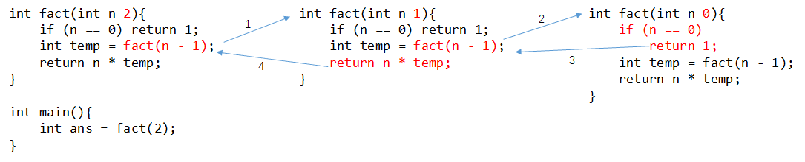

### 计算斐波那契数列

Fibonacci sequence：0, 1, 1, 2, 3, 5, 8, 13, 21, 34, ……
$$
f(n)=\begin{cases}
0 & n=0 \\
1 & n=1 \\
f(n-2)+f(n-1) & n>1
\end{cases}
$$


```cpp
#include <stdio.h>

int fib(int n) {
    if (n == 0) return 0;
    if (n == 1) return 1;
    return fib(n - 2) + fib(n - 1);
}

int main() {
    for (int i = 0; i < 10; i++) {
        printf("%d ", fib(i));
    }
    printf("\n");
    return 0;
}
```

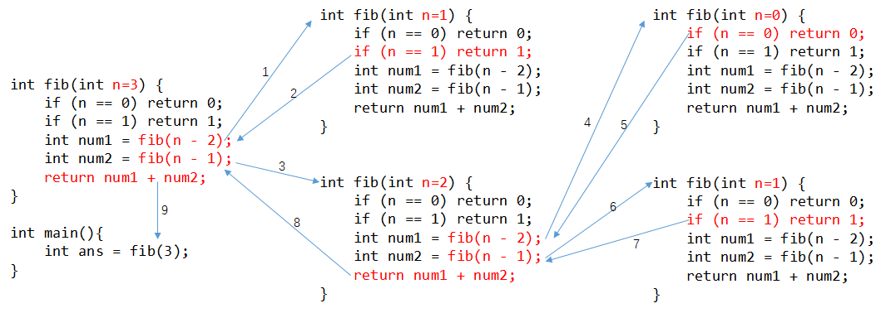


### 计算最大公约数(辗转相除法)

```
gcd(12, 32) = 4

gcd(a,   b)
gcd(32,  12)
gcd(12,  8)
gcd(8,   4)
gcd(4,   0)
```

$$
gcd(a,b)=\begin{cases}
a & b=0 \\
gcd(b,a \% b) & b\neq 0
\end{cases}
$$


```cpp
int gcd(int a, int b){
    if (b == 0) return a;
    return gcd(b, a % b);
}

int ans = gcd(12, 32);
```

### 分治算法

分治法的设计思想：

1. 分–将问题分解为规模更小的子问题；
2. 治–将这些规模更小的子问题逐个击破；
3. 合–将已解决的子问题合并，最终得出“母”问题的解；

- 减而治之（每次让问题的规模减1）
- 分而治之（每次让问题的规模减半）（归并排序的思想）

### 例题：走楼梯


```
题目描述：
一个台阶总共有n级，如果一次可以跳1级，也可以跳2级。求总共有多少总跳法。
第一行输入T，表示有多少个测试数据。接下来T行，每行输入一个数n，表示台阶的阶数。
输出时每一行对应一个输出。

样例输入：
3
5
8
10

样例输出：
8
34
89
```

解析：


$$
f(n)=\begin{cases}
1 & n=1 \\
2 & n=2 \\
f(n-1)+f(n-2) & n>2
\end{cases}
$$

两种方式走楼梯，可以转换为二叉树的思想，然后用递归。求路径数。

参考代码：

```cpp
#include <stdio.h>

int solve(int n) {
	if (n == 1) return 1;
	if (n == 2) return 2;
	return solve(n - 1) + solve(n - 2);
}

int main() {
	int T;
	scanf("%d", &T);
	while (T--) {
		int n;
		scanf("%d", &n);
		int ans = solve(n);
		printf("%d\n", ans);
	}
	return 0;
}
```


### 归并排序

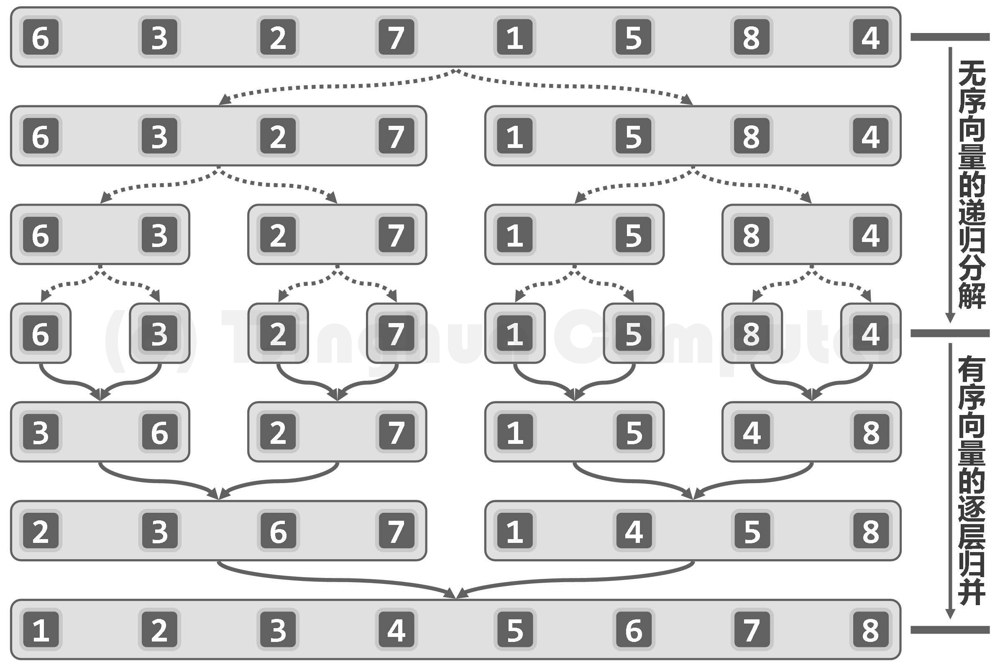


```cpp
void mergeSort(int A[], int lo, int hi) {
	if (lo >= hi) return;
	int mid = lo + (hi - lo) / 2;
	mergeSort(A, lo, mid);	//左半区间[lo, mid] 排好序
	mergeSort(A, mid + 1, hi);	//右半区间[mid + 1, hi] 排好序
	mergeArray(A, lo, mid, hi);	//进行合并
}
```

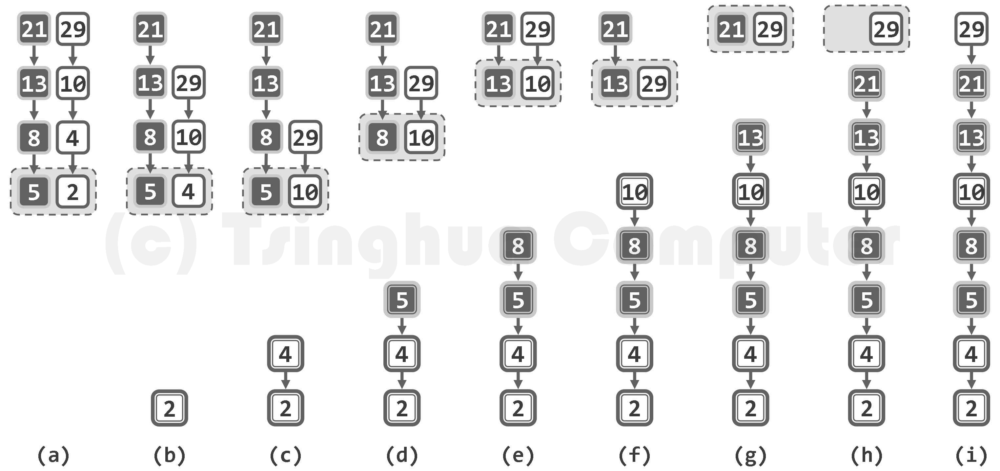

```cpp
#include <iostream>
using namespace std;

void mergeArray(int A[], int lo, int mid, int hi) {
	int* temp = new int[hi - lo + 1];
	int i = lo, j = mid + 1;
	int k = 0;

	while (i <= mid && j <= hi) {
		if (A[i] <= A[j]) temp[k++] = A[i++];
		else temp[k++] = A[j++];
	}
	while (i <= mid) temp[k++] = A[i++];
	while (j <= hi) temp[k++] = A[j++];

	for (int i = lo, k = 0; i <= hi; i++, k++) {
		A[i] = temp[k];
	}
	delete[] temp;
}

void mergeSort(int A[], int lo, int hi) {
	if (lo >= hi) return;
	int mid = lo + (hi - lo) / 2;
	mergeSort(A, lo, mid);	//左半区间[lo, mid] 排好序
	mergeSort(A, mid + 1, hi);	//右半区间[mid + 1, hi] 排好序
	mergeArray(A, lo, mid, hi);	//进行合并
}

int main() {
	int A[] = { 6, 1, 2, 9, 7, 3 };
	int N = sizeof(A) / sizeof(int);

	mergeSort(A, 0, N - 1);
	for (int x : A) {
		cout << x << " ";
	}
	cout << endl;
	return 0;
}
```


## 二叉树、树

### 二叉树的遍历

```cpp
struct Node {	//C++版本
	int data;
	Node *lchild, *rchild;

	Node(int x = 0) { data = x; lchild = rchild = NULL; }
};
```

#### 先序遍历

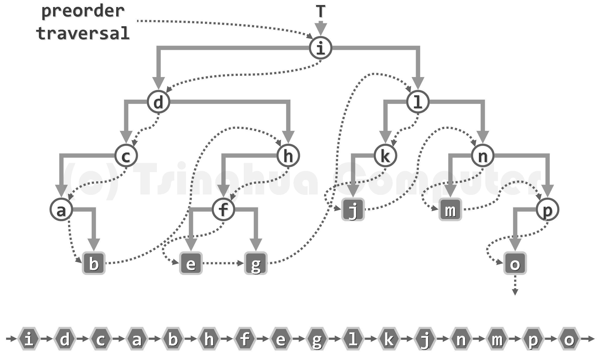


```cpp
void preorderTrav(Node* root) {	//先序遍历
	if (root == NULL) return;
	printf("%d ", root->data);	//最先访问根节点
	preorderTrav(root->lchild);
	preorderTrav(root->rchild);
}

void preorderTrav(Node* root) {	//写法2
    if (root != NULL) {
        printf("%d ", root->data);
        preorderTrav(root->lchild);
        preorderTrav(root->rchild);
    }
}

void preorderTrav(Node* root) {	//写法3
	//if (root == NULL) return;	//只要能保证这棵树不是空树，这行代码就可以省略
	printf("%d ", root->data);
	if (root->lchild != NULL) {
		preorderTrav(root->lchild);
	}
	if (root->rchild != NULL) {
		preorderTrav(root->rchild);
	}
}
```

#### 中序遍历

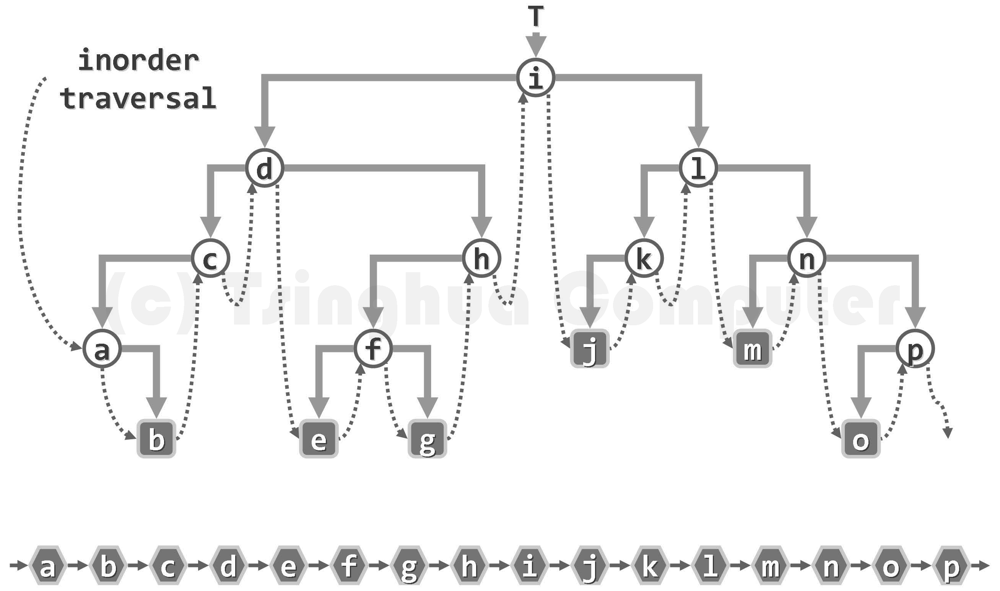


```cpp
void inorderTrav(Node* root) {	//中序遍历
	if (root == NULL) return;
	inorderTrav(root->lchild);
	printf("%d ", root->data);	//中间的时候访问根节点
	inorderTrav(root->rchild);
}
```

二叉树节点在水平方向上的投影顺序即为中序遍历的顺序。

#### 后序遍历

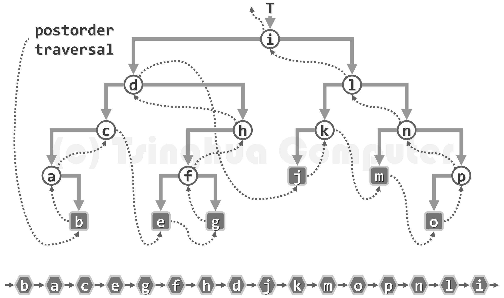


```cpp
void postorderTrav(Node* root) {	//后序遍历
	if (root == NULL) return;
	postorderTrav(root->lchild);
	postorderTrav(root->rchild);
	printf("%d ", root->data);	//最后访问根节点
}
```

#### 层次遍历

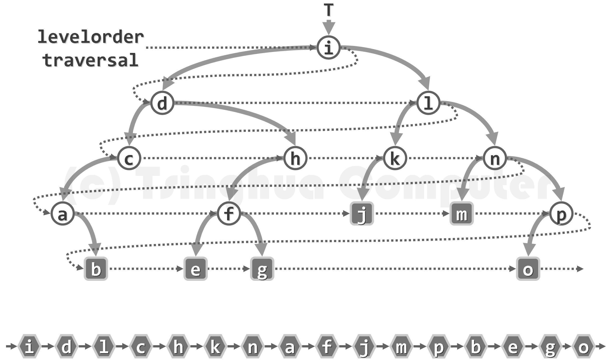

```cpp
void levelTrav(Node* root) {	//层次遍历
	if (root == NULL) return;
	queue<Node*> Q;
	Q.push(root);
	while (Q.empty() == false) {
		Node* t = Q.front();
		Q.pop();
		printf("%d ", t->data);
		if (t->lchild != NULL) Q.push(t->lchild);
		if (t->rchild != NULL) Q.push(t->rchild);
	}
	printf("\n");
}
```


#### 求二叉树的高度

```cpp
int getTreeHigh(Node* root) {
	if (root == NULL) return 0;
	int left_high = getTreeHigh(root->lchild);
	int right_high = getTreeHigh(root->rchild);
	return max(left_high, right_high) + 1;
}
```


#### 完整实现代码(C语言版)

```c
#include <stdio.h>
#include <stdlib.h>
#define MAXN 1000

typedef struct Node {
	int data;
	struct Node* lchild, * rchild;
}Node;

Node* createNode(int data) {
	Node* temp = (Node*)malloc(sizeof(Node));
	temp->data = data;
	temp->lchild = temp->rchild = NULL;
	return temp;
}

void setNodeChild(Node* root, Node* lchild, Node* rchild) {
	root->lchild = lchild;
	root->rchild = rchild;
}

void preorderTrav(Node* root) {	//先序遍历
	if (root == NULL) return;
	printf("%d ", root->data);	//最先访问根节点
	preorderTrav(root->lchild);
	preorderTrav(root->rchild);
}

void inorderTrav(Node * root) {	//中序遍历
	if (root == NULL) return;
	inorderTrav(root->lchild);
	printf("%d ", root->data);	//中间的时候访问根节点
	inorderTrav(root->rchild);
}

void postorderTrav(Node * root) {	//后序遍历
	if (root == NULL) return;
	postorderTrav(root->lchild);
	postorderTrav(root->rchild);
	printf("%d ", root->data);	//最后访问根节点
}

void levelTrav(Node * root) {	//层次遍历
	if (root == NULL) return;
	Node * Queue[MAXN];
	int front = 0, rear = 0;
	Queue[rear++] = root;	//根节点入队
	while (rear != front) {	//只要队列不为空
		Node* t = Queue[front++];	//出队
		printf("%d ", t->data);
		if (t->lchild != NULL) Queue[rear++] = t->lchild;	//入队
		if (t->rchild != NULL) Queue[rear++] = t->rchild;
	}
	printf("\n");
}

int getTreeHeight(Node * root) {
	if (root == NULL) return 0;
	int left_high = getTreeHeight(root->lchild);
	int right_high = getTreeHeight(root->rchild);
	return max(left_high, right_high) + 1;
}

int main() {
	Node* root = createNode(1);
	Node* node2 = createNode(2);
	Node* node3 = createNode(3);
	Node* node4 = createNode(4);
	Node* node5 = createNode(5);
	Node* node6 = createNode(6);
	Node* node7 = createNode(7);
	Node* node8 = createNode(8);

	setNodeChild(root, node2, node3);
	setNodeChild(node2, node4, node5);
	setNodeChild(node3, NULL, node7);
	setNodeChild(node5, node6, NULL);
	setNodeChild(node4, NULL, node8);

	preorderTrav(root);
	printf("\n");

	inorderTrav(root);
	printf("\n");

	postorderTrav(root);
	printf("\n");

	levelTrav(root);

	printf("Tree Height: %d\n", getTreeHeight(root));

	return 0;
}
```


#### 完整实现代码(C++版)

```cpp
#include <iostream>
#include <queue>
#include <algorithm>
using namespace std;

struct Node {
	int data;
	Node *lchild, *rchild;

	Node(int x = 0) { data = x; lchild = rchild = NULL; }

	void setChildNode(Node* l, Node* r) {
		lchild = l;
		rchild = r;
	}
};

void preorderTrav(Node* root) {	//先序遍历
	if (root == NULL) return;
	printf("%d ", root->data);	//最先访问根节点
	preorderTrav(root->lchild);
	preorderTrav(root->rchild);
}

void inorderTrav(Node* root) {	//中序遍历
	if (root == NULL) return;
	inorderTrav(root->lchild);
	printf("%d ", root->data);	//中间的时候访问根节点
	inorderTrav(root->rchild);
}

void postorderTrav(Node* root) {	//后序遍历
	if (root == NULL) return;
	postorderTrav(root->lchild);
	postorderTrav(root->rchild);
	printf("%d ", root->data);	//最后访问根节点
}

void levelTrav(Node* root) {	//层次遍历
	if (root == NULL) return;
	queue<Node*> Q;
	Q.push(root);
	while (Q.empty() == false) {
		Node* t = Q.front();
		Q.pop();
		printf("%d ", t->data);
		if (t->lchild != NULL) Q.push(t->lchild);
		if (t->rchild != NULL) Q.push(t->rchild);
	}
	printf("\n");
}

int getTreeHeight(Node* root) {
	if (root == NULL) return 0;
	int left_high = getTreeHeight(root->lchild);
	int right_high = getTreeHeight(root->rchild);
	return max(left_high, right_high) + 1;
}

int main() {
	//完全可以用一个 Node* nodes[100] 数组来存放这些节点
	Node* root = new Node(1);
	Node* node_2 = new Node(2);
	Node* node_3 = new Node(3);
	Node* node_4 = new Node(4);
	Node* node_5 = new Node(5);
	Node* node_6 = new Node(6);
	Node* node_7 = new Node(7);
	//Node* node_8 = new Node(8);

	//root->lchild = node_2;
	//root->rchild = node_3;
	root->setChildNode(node_2, node_3);

	node_2->setChildNode(node_4, node_5);
	node_3->setChildNode(NULL, node_7);
	node_5->setChildNode(node_6, NULL);
	node_4->rchild = new Node(8);

	preorderTrav(root);
	printf("\n");

	inorderTrav(root);
	printf("\n");

	postorderTrav(root);
	printf("\n");

	levelTrav(root);

	printf("Tree Height: %d\n", getTreeHeight(root));

	return 0;
}
```


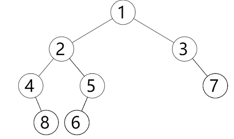

#### 表达式树的输出与求值

表达式树的特征：叶节点是运算数，非叶节点一定是运算符

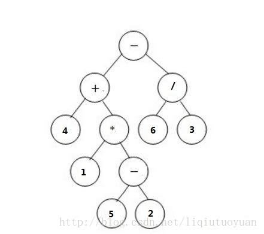


输入格式：

第一行给出节点的个数N，每个节点的编号为0 ~ N-1

接下来N行每行分别给出：

​         该节点的编号、该节点的操作数/操作符、该节点的左孩子编号、右孩子编号（-1表示NULL）

输出格式：

第一行输出该表达式树的中缀表达式，该用括号的地方需要用括号括起来。

第二行输出该表达式树的前缀表达式。

第二行输出该表达式树的后缀表达式。

第四行输出该表达式树的计算结果，保留两位小数。

样例输入：

```
11
0 - 1 2
1 + 3 4
2 / 5 6
3 4 -1 -1
4 * 7 8
5 6 -1 -1
6 3 -1 -1
7 1 -1 -1
8 - 9 10
9 5 -1 -1
10 2 -1 -1
```

样例输出：

```
(4+(1*(5-2)))-(6/3)
- + 4 * 1 - 5 2 / 6 3
4 1 5 2 - * + 6 3 / -
5.00
```

完整代码：

```cpp
#include <iostream>
using namespace std;

struct Node {
	char data;
	Node *lchild, *rchild;
};

void preOrder(Node* root) {				//前缀表达式
	if (root == NULL) return;
	printf("%c ", root->data);
	preOrder(root->lchild);
	preOrder(root->rchild);
}

void postOrder(Node* root) {			//后缀表达式
	if (root == NULL) return;
	postOrder(root->lchild);
	postOrder(root->rchild);
	printf("%c ", root->data);
}

void inOrder(Node* root, int layer) {	//中缀表达式
	if (root == NULL) return;
	if (root->lchild == NULL && root->rchild == NULL) {
		//叶结点是操作数，直接输出，不加括号
		printf("%c", root->data);
	} else {
		//非叶节点是操作符，需加括号（第0层根节点除外）
		if (layer > 0) printf("(");
		inOrder(root->lchild, layer + 1);
		printf("%c", root->data);
		inOrder(root->rchild, layer + 1);
		if (layer > 0) printf(")");
	}
}

double calc(double a, double b, char op) {
	switch (op) {
	case '+': return a + b;
	case '-': return a - b;
	case '*': return a * b;
	case '/': return a / b;
	}
}

double calculateExprTree(Node* root) {
	if (root == NULL) return 0;
	if (root->lchild == NULL && root->rchild == NULL) {
		//叶节点，节点存放的是 操作数
		return root->data - '0';
	}
	//非叶结点，节点存放的是 操作符
	double a = calculateExprTree(root->lchild);
	double b = calculateExprTree(root->rchild);
	return calc(a, b, root->data);
}

int main() {
	int N;
	scanf("%d\n", &N);
	Node* nodes = new Node[N];
	for (int i = 0; i < N; i++) {
		int index;
		char data;
		int l, r;
		scanf("%d %c %d %d", &index, &data, &l, &r);
		nodes[index].data = data;
		nodes[index].lchild = (l != -1 ? &nodes[l] : NULL);
		nodes[index].rchild = (r != -1 ? &nodes[r] : NULL);
	}
	Node* root = &nodes[0];

	inOrder(root, 0);
	printf("\n");

	preOrder(root);
	printf("\n");

	postOrder(root);
	printf("\n");

	double ans = calculateExprTree(root);
	printf("%.2f\n", ans);

	return 0;
}
```


```cpp
enum Operator { Add, Subtract, Multiply, Divide };

struct Node {
	double num;
	Operator op;
	int type;	//0-运算数，1-二元运算符
	Node *lchild, *rchild;
};
```


#### 求某节点到根节点的路径

对于如下二叉树，节点`7`位于第`4`层，其到跟节点的路径为`1 2 5 7`

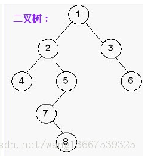


##### 求某节点所在层数

先把问题简化一下，求二叉树指定节点所在层数（假设根节点的层数为1）

为了记录当前访问节点的层号，对于层号，可以采用以下两种方式：

1. 使用全局变量

```cpp
int layer = 0;
bool flag1 = false;	//flag标记可用于提前快速结束递归的执行
void getNodeLayer(Node* root, int x) {
	if (root == NULL) return;
	if (flag1) return;
	layer++;
	if (root->data == x) {
		printf("%d\n", layer);
		flag1 = true;
		return;
	}
	getNodeLayer(root->lchild, x);
	getNodeLayer(root->rchild, x);
	layer--;
}

int main(){
    //......
    getNodeLayer(root, 7);
}
```

2. 使用函数传参（值传递）

```cpp
bool flag1 = false;	//flag标记可用于提前快速结束递归的执行
void getNodeLayer(Node* root, int x, int layer) {
	if (root == NULL) return;
	if (flag1) return;
	if (root->data == x) {
		printf("%d\n", layer);
		flag1 = true;
		return;
	}
	getNodeLayer(root->lchild, x, layer + 1);
	getNodeLayer(root->rchild, x, layer + 1);
}

int main(){
    //......
    getNodeLayer(root, 7, 1);
}
```

3. 使用函数传参（传指针/引用）

```cpp
bool flag1 = false;	//flag标记可用于提前快速结束递归的执行
void getNodeLayer(Node* root, int x, int &layer) {
	if (root == NULL) return;
	if (flag1) return;
	layer++;
	if (root->data == x) {
		printf("%d\n", layer);
		flag1 = true;
		return;
	}
	getNodeLayer(root->lchild, x, layer);
	getNodeLayer(root->rchild, x, layer);
	layer--;
}

int main() {
    //.......
	int layer = 0;
	getNodeLayer(root, 7, layer);
}
```

4. 将递归函数封装

```cpp
void getNodeLayer(Node* root, int x, int &layer, int &ans, bool &flag) {
	if (root == NULL) return;
	if (flag) return;
	layer++;
	if (root->data == x) {
		ans = layer;
		flag = true;
		return;
	}
	getNodeLayer(root->lchild, x, layer, ans, flag);
	getNodeLayer(root->rchild, x, layer, ans, flag);
	layer--;
}

int getNodeLayer(Node* root, int x) {
	int ans;
	int layer = 0;
	bool flag = false;
	getNodeLayer(root, x, layer, ans, flag);
	return ans;
}
```


##### 求节点路径


1. 使用全局数组

```cpp
vector<int> path;
bool flag2 = false;
void getNodePath(Node* root, int x) {
	if (root == NULL) return;
	if (flag2) return;
	path.push_back(root->data);
	if (root->data == x) {
		for (int x : path) {	//输出栈的内容
			printf("%d ", x);
		}
		flag2 = true;
		return;
	}
	getNodePath(root->lchild, x);
	getNodePath(root->rchild, x);
	path.pop_back();
}
```

```cpp
vector<int> vec {1,2,3,4,5,6,7,8,9,10};
for (int i = 0; i < vec.size(); i++）{
    printf("%d ", vec[i]);
}
//C++11特性：范围的For循环（range-based-for）
for (int x : vec) {	//这样写对于容器内的每个元素是只读的
    printf("%d ", x);
}
```

2. 使用函数传参（传指针/引用）

```cpp
bool flag = false;
void getNodePath(Node* root, int x, vector<int> &path) {
	if (root == NULL) return;
	if (flag) return;
	path.push_back(root->data);
	if (root->data == x) {
		for (int x : path) {	//输出栈path的内容
			printf("%d ", x);
		}
		flag = true;
		return;
	}
	getNodePath(root->lchild, x, path);
	getNodePath(root->rchild, x, path);
	path.pop_back();
}

int main() {
	//......
	int x = 7;
	vector<int> path;
	getNodePath(root, x, path);
}
```

3. 使用函数传参（值传递）

不推荐，每次递归调用时，都会对path数组进行复制，时间和空间效率都很低


```cpp
bool flag = false;
void getNodePath(Node* root, int x, vector<int> path) {
	if (root == NULL) return;
	if (flag) return;
	path.push_back(root->data);
	if (root->data == x) {
		for (int x : path) {	//输出栈path的内容
			printf("%d ", x);
		}
		flag = true;
		return;
	}
	getNodePath(root->lchild, x, path);
	getNodePath(root->rchild, x, path);
	//注意这里没有path.pop_back()
}

int main() {
	//......
	int x = 7;
	vector<int> path;
	getNodePath(root, x, path);
}
```


##### 完整代码

对于如下二叉树，节点`7`位于第`4`层，其到跟节点的路径为`1 2 5 7`


```cpp
#include <iostream>
#include <vector>
using namespace std;

struct Node {
	int data;
	Node *lchild, *rchild;

	Node(int x = 0) { data = x; lchild = rchild = NULL; }

	void setChildNode(Node* l, Node* r) {
		lchild = l;
		rchild = r;
	}
};

int layer = 0;
bool flag1 = false;	//flag标记可用于提前快速结束递归的执行
void getNodeLayer(Node* root, int x) {
	if (root == NULL) return;
	if (flag1) return;
	layer++;
	if (root->data == x) {
		printf("%d\n", layer);
		flag1 = true;
		return;
	}
	getNodeLayer(root->lchild, x);
	getNodeLayer(root->rchild, x);
	layer--;
}

vector<int> path;
bool flag2 = false;
void getNodePath(Node* root, int x) {
	if (root == NULL) return;
	if (flag2) return;
	path.push_back(root->data);
	if (root->data == x) {
		for (int x : path) {	//输出栈path的内容
			printf("%d ", x);
		}
		flag2 = true;
		return;
	}
	getNodePath(root->lchild, x);
	getNodePath(root->rchild, x);
	path.pop_back();
}

int main() {
    Node* root = new Node(1);
	Node* node_2 = new Node(2);
	Node* node_3 = new Node(3);
	Node* node_4 = new Node(4);
	Node* node_5 = new Node(5);
	Node* node_6 = new Node(6);
	Node* node_7 = new Node(7);
	Node* node_8 = new Node(8);

	root->setChildNode(node_2, node_3);
	node_2->setChildNode(node_4, node_5);
	node_3->setChildNode(NULL, node_6);
	node_5->setChildNode(node_7, NULL);
	node_7->setChildNode(NULL, node_8);

    int x = 7;
	getNodeLayer(root, x);
	getNodePath(root, x);
	printf("\n");
    
	return 0;
}
```


#### 普通树的遍历

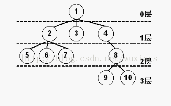

```cpp
#include <iostream>
#include <vector>
#include <queue>
#include <initializer_list>
using namespace std;

struct Node {
	int data;
	vector<Node*> child;

	Node(int x = 0) { data = x; }

	void setChildNode(initializer_list<Node*> il) {
		//C++11特性：initializer_list
		for (Node* x : il) {
			child.push_back(x);
		}
	}
};

void preOrder(Node* root) {
	if (root == NULL) return;
	printf("%d ", root->data);
	for (Node* x : root->child) {
		preOrder(x);
	}
}

void postOrder(Node* root) {
	if (root == NULL) return;
	for (Node* x : root->child) {
		postOrder(x);
	}
	printf("%d ", root->data);
}

void levelOrder(Node* root) {
	if (root == NULL) return;
	queue<Node*> Q;
	Q.push(root);
	while (Q.empty() == false) {
		Node* t = Q.front(); Q.pop();
		printf("%d ", t->data);
		for (Node* x : t->child) {
			Q.push(x);
		}
	}
	printf("\n");
}

int main() {
	Node* root = new Node(1);
	Node* node_2 = new Node(2);
	Node* node_3 = new Node(3);
	Node* node_4 = new Node(4);
	Node* node_5 = new Node(5);
	Node* node_6 = new Node(6);
	Node* node_7 = new Node(7);
	Node* node_8 = new Node(8);
	Node* node_9 = new Node(9);
	Node* node_10 = new Node(10);

	root->setChildNode({ node_2,node_3,node_4 });
	node_2->setChildNode({ node_5,node_6,node_7 });
	node_4->setChildNode({ node_8 });
	node_8->setChildNode({ node_9,node_10 });

	preOrder(root);
	printf("\n");

	postOrder(root);
	printf("\n");

	levelOrder(root);

	return 0;
}
```


## 递归调用原理

函数调用栈实例：主函数`main()`调用`funcA()`，`funcA()`调用`funcB()`，`funcB()`再自我调用（递归）

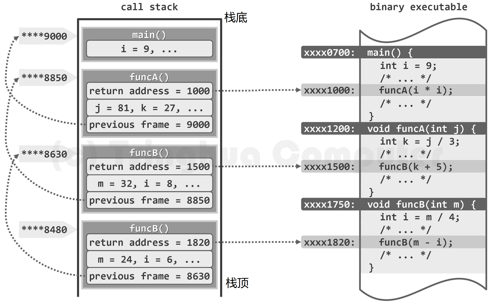

函数调用栈的基本单位是帧（frame）。每次函数调用时，都会相应地创建一帧， 记录该函数实例在二进制程序中的返回地址（return address），以及局部变量、传入参数等， 并将该帧压入调用栈。若在该函数返回之前又发生新的调用，则同样地要将与新函数对应的一帧压入栈中，成为新的栈顶。函数一旦运行完毕，对应的帧随即弹出，运行控制权将被交还给该函 数的上层调用函数，并按照该帧中记录的返回地址确定在二进制程序中继续执行的位置。

在任一时刻，调用栈中的各帧，依次对应于那些尚未返回的调用实例，亦即当时的活跃函数实例（active function instance）。特别地，位于栈底的那帧必然对应于入口主函数main()， 若它从调用栈中弹出，则意味着整个程序的运行结束，此后控制权将交还给操作系统。 

此外，调用栈中各帧还需存放其它内容。比如，因各帧规模不一，它们还需记录前一帧的起始地址，以保证其出栈之后前一帧能正确地恢复。

作为函数调用的特殊形式，递归也可借助上述调用栈得以实现。比如在上图中，对应于 `funcB()`的自我调用，也会新压入一帧。可见，同一函数可能同时拥有多个实例，并在调用栈中 各自占有一帧。这些帧的结构完全相同，但其中同名的参数或变量，都是独立的副本。比如在 `funcB()`的两个实例中，入口参数`m`和内部变量`i`各有一个副本。 

## DFS/回溯算法

如果某问题的解可以由多个步骤得到，而每个步骤都有若干种选择（这些候选方案集可能会依赖之前做出的选择），且可以用递归枚举法实现，则它的工作方式可以用解答树来描述。

### 全排列问题

输出数字1~N所能组成的所有全排列

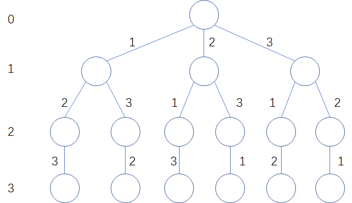


```cpp
#include <iostream>
#include <vector>
using namespace std;
const int MAXN = 10;

bool isUsed[MAXN];
vector<int> num;
int N;

void DFS(int index) {
	if (index >= N) {
		for (int x : num) {
			printf("%d ", x);
		}
		printf("\n");
		return;
	}
	for (int i = 1; i <= N; i++) {
		if (isUsed[i]) continue;
		num.push_back(i);
		isUsed[i] = true;
		DFS(index + 1);
		num.pop_back();
		isUsed[i] = false;
	}
}

int main() {
	N = 3;
	DFS(0);		//从第0层开始搜索
	return 0;
}
```

### 素数环问题

将1到n这n个整数围成一个圆环，若其中任意2个相邻的数字相加，结果均为素数，那么这个环就成为素数环。

例如数字1-6所组成的一个素数环，用数组表示是`[1, 4, 3, 2, 5, 6]`（第一位固定为1）

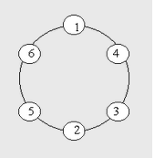

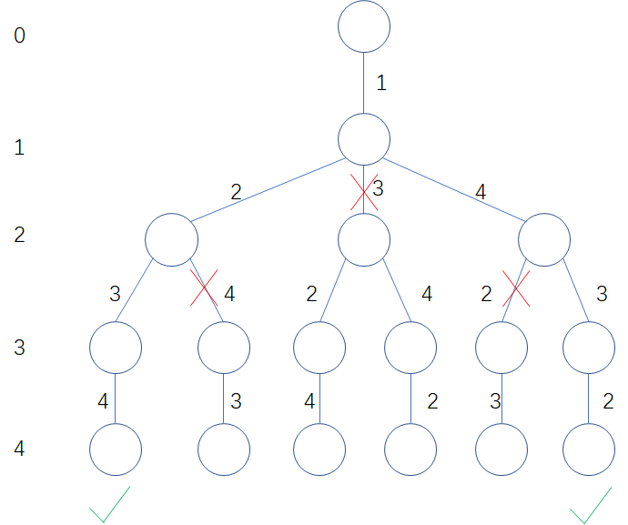


```cpp
#include <iostream>
#include <vector>
#include <algorithm>
using namespace std;
const int MAXN = 100;

bool isPrimeNum[MAXN];
vector<int> ans;
bool isUsed[MAXN];
int N;

void getPrimeTable() {	//筛选法求质数
	fill(isPrimeNum, isPrimeNum + MAXN, true);	//先假设都是素数
	isPrimeNum[0] = isPrimeNum[1] = false;
	for (int i = 2; i < MAXN; i++) {	//从2开始，因为2是最小的质素
		if (isPrimeNum[i]) {
			//把i的倍数全部设置成非质数
			//比如i=2，则把4、6、9...设置成非质数
			//若i=3，则把6、9、12、15...设置成非质数
			for (int j = 2 * i; j < MAXN; j += i) {	//注意该for循环的写法，容易出错
				isPrimeNum[j] = false;
			}
		}
	}
}

void DFS(int index) {
	if (index >= N) {
		int temp = ans[0] + ans[index - 1];	//判断第一个数和最后一个数相加后是否是质数
		if (isPrimeNum[temp] == false) return;
		for (int x : ans) {
			printf("%d ", x);
		}
		printf("\n");
		return;
	}
	for (int i = 2; i <= N; i++) {
		if (isUsed[i]) continue;
		int temp = ans[index - 1] + i;
		if (isPrimeNum[temp] == false) {
			continue;	//剪枝
		}
		ans.push_back(i);
		isUsed[i] = true;
		DFS(index + 1);
		ans.pop_back();
		isUsed[i] = false;
	}
}

int main() {
	getPrimeTable();

	N = 4;
	ans.push_back(1);	//素数环第一个数固定是1
	DFS(1);	//从第二个数开始搜索

	return 0;
}
```


### 八皇后问题

八皇后问题是一个以国际象棋为背景的问题：如何能够在8×8的国际象棋棋盘上放置八个皇后，使得任何一个皇后都无法直接吃掉其他的皇后？为了达到此目的，任两个皇后都不能处于同一条横行、纵行或斜线上。八皇后问题可以推广为更一般的n皇后摆放问题：这时棋盘的大小变为n×n，而皇后个数也变成n。当且仅当n = 1或n ≥ 4时问题有解。

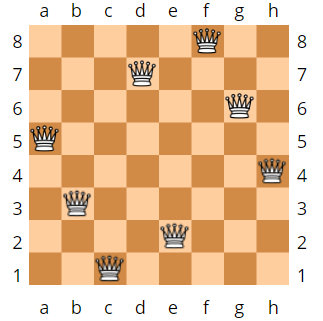

```cpp
#include <cstdio>
#include <algorithm>
using namespace std;

const int MAXN = 100;
int solution[MAXN];	//solution[i]=j 表示棋盘的第i行第j列放有皇后
int cnt;
int N;

char chessboard[MAXN][MAXN];
void printSolution() {
	fill(chessboard[0], chessboard[0] + MAXN * MAXN, '*');
	for (int i = 0; i < N; i++) {
		int j = solution[i];
		chessboard[i][j] = '#';
		chessboard[i][N] = '\0';
	}
	printf("solution #%d\n", cnt);
	for (int i = 0; i < N; i++) {
		printf("%s\n", chessboard[i]);
	}
	printf("\n");
}

bool judge(int row, int col) {
	for (int i = 0; i < row; i++) {
		int j = solution[i];
		if (j == col || row + col == i + j || row - col == i - j)
			return false;
	}
	return true;
}

void DFS(int row) {
	if (row >= N) {
		cnt++;
		printSolution();
		return;
	}
	for (int col = 0; col < N; col++) {
		if (judge(row, col) == false) continue;
		solution[row] = col;
		DFS(row + 1);
	}
}

int main() {
	N = 8;
	DFS(0);
	printf("N = %d, total solutions: %d\n", N, cnt);
	return 0;
}
```


