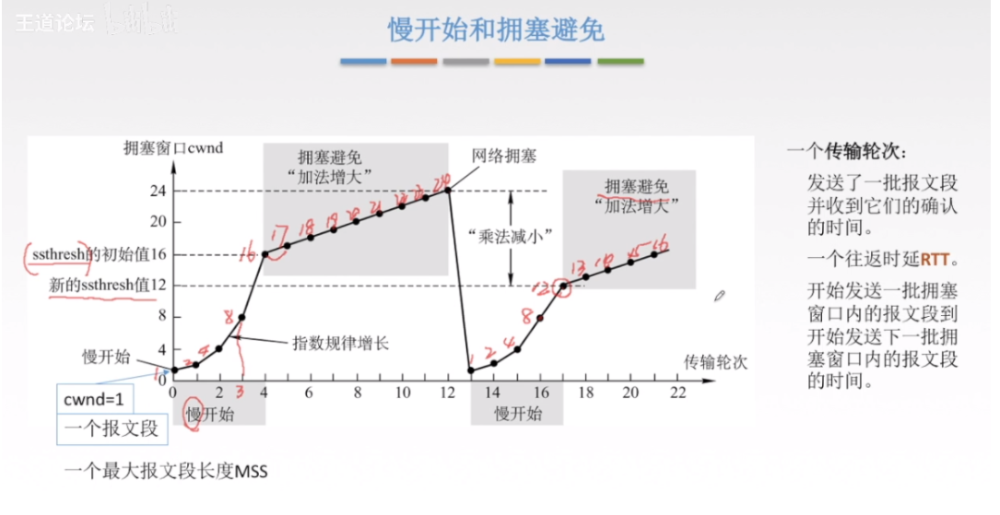

# 1 计算机网络概述

## 1.1 网络分类

+ 局域网：自己花钱购买设备， 带宽固定，自己维护，最远100m

  > 结构布局：多台计算机连接到接入层交换机 多台接入层交换机连接到汇聚层交换机。每一层星型结构
  >
  > + **接入层交换机**：接入口多
  > + **汇聚层交换机**：连接各个接入层交换机，端口带宽高

+ 广域网：花钱租带宽，距离远(>100m)

  > 结构布局：
  >
  > + 不同运营商构建机房，将网站置于机房。
  > + 运营商之间使用一条链路连接，因此跨运营商网络低。

+ internet：ISP（internet service producer，网络服务提供商），搭建机房提供网络服务

## 1.2 网站的访问流程

核心：数据帧在网络上，目标mac地址和源mac地址不断变化的过程。

### 1.2.1 数据请求：

+ **客户端向DNS发起域名解**析
+ 客户端获取网站ip后，直接向主机发送网站请求指令

### 1.2.2 数据返回：

+ 服务器端将网页分割为多个部分

+ 服务器端和客户端均维护一个缓存队列
  + 服务器端接收到客户端的接收指令，删除缓存片段
  + 客户端Mac地址冲突，2个一样的Mac地址同时访问缓存队列满，将拼接恢复网页。

## 1.3 OSI（开放系统互联模型）参考模型

### 1.3.1 相关概念

+ 实体：每一层成为实体
+ 协议：对等实体之间进行数据交换的规则标准和约定。
  + 语法：规定数据格式
  + 语义：规定完成功能
  + 同步：规定各种操作顺序
+ 接口（访问服务点SAP）：上层使用下层的服务入口。
+ 服务：下层为相邻上层提供的功能调用。低层向高层提供服务。

### 1.3.2 七层结构

+ 应用层——网络数据产生（程序）
+ 表示层——数据处理（加密 或 压缩） ，数据表示（二进制或ASCII码）（**比如乱码问题**）
+ 会话层——木马检测，维护网络通信连接（客户端，服务器）
+ 传输层——可靠传输，流量控制，不可靠传输(一个数据包即可，不需要建立会话，例如向DNS查询网站IP地址)
+ 网络层——路由选择，IP规划，==拥塞控制==  (ipv4和ipv6变化只会影响网络层)
+ 数据链路层——帧的开始和结束，透明传输，差错校验(纠错由传输层解决)
+ 物理层——网络设备接口标准，电气标准(电压)，如何在物理链路上传输的更快

### 1.3.3 分层的好处

+ 提高各层之间的独立性， 降低耦合，有利于提高网络稳定。

## 1.4 网络各层数据模型

| OSI参考模型 | 各层次的传输单元                                             |
| ----------- | ------------------------------------------------------------ |
| 应用层      | 报文                                                         |
| 传输层      | 报文段（TCP+数据）                                           |
| 网络层      | IP数据报，分组（如果IP数据报太大就切割成分组）（IP+TCP+数据） |
| 数据链路层  | 帧（MAC+IP+TCP+数据+FCS）                                    |
| 物理层      | 比特流                                                       |

## 1.5 网络故障分析

核心：OSI的下层为上层提供服务，因此网络检测要从下层（物理层）开始排查。

+ 物理层：查看网络连接，查看网络发送数据包数值。
+ 链路层
  + Mac地址冲突，2个一样的Mac地址同时访问
  + ADSL(非对称数字用户线路)欠费
  + 两端的接口网速没有协商一致
+ 网络层故障
  + IP地址配置错误
  + 子网掩码配置错误
  + 网关错误
+ 应用层故障：应用程序配置错误（浏览器配置错误代理）

## 1.6 基本的网络指标

+ 速率（实际网速）：主机在数字信道上传送数据位数的速率，简称比特率，单位是b/s, kb/s, Mb/s, Gb/s

  > 字节表示：B/s,KB/s,MB/s,TB/s     比特表示：b/s, kb/s, Mb/s, Gb/s     1B=8b
  >
  > 从网络服务提供商买的100M带宽

+ 带宽（理论网速，最大速率）：数据通信领域中，数字信道所能传送的最高数据），单位是b/s, kb/s, Mb/s, Gb/s。

  > 带宽不能无限增加：带宽无限增加导致模拟信号频率过高，调制解调器无法解读。

+ 吞吐量：在单位时间内通过某个网络的数据量，单位是b/s, Mb/s。

+ 时延：

  + 发送时延：数据从主机到信道上时延  $\frac{数据大小}{信道带宽}$：
  + 传播时延：数据在信道传播的时延（由传播介质决定）   $\frac{信道长度}{电磁波在信道的传输速率}$
  + 排队时延：数据在路由器队列中的排队时延
  + 处理时延：数据在路由器中处理需求的时延

+ **时延带宽积**：通信链路上时延$*$带宽   表示当前通信信道中的数据量

+ 往返时间：(RTT)，从发送方发送数据开始，到发送方收到接收方确认数据的时间。例如ping一下。

+ 利用率：

  + 信道利用率：$\frac{数据通过时间}{（有+无）数据通过时间}$
  + 网络利用率：信道利用率的加权平均
  + $D=\frac{D_0}{1-U}$ D:网络当前时延  ，D_0网络空闲时延 ， U信道利用率

  时延与利用率关系

  > 网络利用率高，网络时延急剧增大；类似高速公路，路上车多了，大家速度慢下来，时间增大。

# 2 物理层

## 2.1 物理层的标准

**解决的问题：**如何在链接各种计算机的传输媒体上传输数据比特流。而不是具体传输媒体

**主要任务**：确定传输媒体接口的特性`定义标准`

+ 机械特性：接口形状，大小，引线数量
+ 电气特性：例如规定电压范围(-5V-5V)
+ 功能特性：例如规定-5V上0，+5V是1
+ 过程特性：也称规程特性，规定建立连接时各个相关部件的工作步骤

## 2.2 数据通信基础

### 2.2.1 数据通信模型

### 2.2.2 数据不同格式

+ 数据：在计算机内存储的二进制文件
+ 信号：数据的电气或电磁的表现
  + 数字信号：普通网线中传输，代表信息的参数的取值是离散的
  + 模拟信号：电缆或者光纤中传输，代表信息的参数的取值是连续的

### 2.2.3 信道

含义：向一个方向传输信息的媒体。所以通信线路往往包含**一条发送信息的信道**和**一条接收信息的信道**

+ 单向通信(单工通信，一条信道)——只能有一个方向的通信，没有反向交互。`例如电视塔发送信号，单向通信`
+ 双向交替通信(半双工通信，两条信道)——通信的双方都可以发送信息，但是不能双方同时发送或接收。
+ 双向同时通信(全双工通信，两条信道)——通信的双发可以同时发送和接收。

### 2.2.4 基带信号和带通（宽带）信号

**背景：**信号是会衰减的，比如人说话，当距离较远之后，声音就会听不到

**载波调制**：把信号的频率搬到较高的频段，以便传输

+ 基带信号(**基本频率信号，数字信号**)——来自信源的信号，在数字信道进行传输，例如计算机输出的代表各种**文字或图像文件**。
+ 带通信号（**模拟信号**），把基带信号经过载波调制后，把信号的频率范围迁移到较高的频段以便在模拟信道中传输。

**区别：**

+ 传输距离较近时，使用基带信号传输。**近距离，信号衰减不大，信号内容不会变化。**
+ 传输距离比较远时，使用带通信号。**远距离，衰减大，即使信号变化大，最后也能过滤基带信号**。

### 2.2.5 数据编码

目的：将数据转换为数字信号

+ 数字发送器：将数字数据转换为数字信号
+ PCM编码器：将模拟数据转换为数字信号

### 2.2.6 数据调制

+ 调制器：将数字信号调制 为模拟信号

目的：为了使得信号远距离传输，

方法：从基带信号到带通信号，涉及到 调幅(AM)，调频(FM)，调相(PM)。

+ 调幅
+ 调频
+ 调相

### 2.2.7 奈氏准则（码元传输速率限制）

**奈氏准则：**在理想条件下(无噪声/干扰/失真)，**为了避免码间串扰（码元太短，无法识别高低电平）**，极限码元的传输速率
$$
理想低通信道下的极限数据传输率=2Wlog_2V
$$
结论：

+ **码元的传输速率是有上限的**。

+ **如果信道的频带越宽(信号高频分量越多)**，则用更高的速率传输码元也不会出现码间串扰。

### 2.2.8 信噪比和香农(Shannon)公式（信息传输速率限制）

香农公式：**带宽受限**且有**Gauss白噪声干扰时**的**信道极限且无差错**时的信息传输速率有上限值：
$$
C=Wlog_2(1+\frac{S}{N})
$$

+ C:信道的极限传输速率
+ W:信道带宽
+ S:信道的平均功率
+ N:信道的高斯白噪声功率

结论：

+ 信噪比$\frac{S}{N}$越大，则信息的极限传输速率C就越高
+ 要信息传输速率小于信道的极限传输速率C，就一定能实现某种无差错传输
+ 若带宽W或信噪比(S/N)没有上限，则极限传输速率C也没有上限(虽然不可能)
+ 实际信息传输率比香农定理低

**奈氏(Nyquist)准则和香农公式的应用范围**

+ 奈氏准则：模拟信号受到奈氏准则约束（两个调制解调器之间）
+ 香农公式：（数字信号和模拟信号）均受到香农公式约束（两个主机之间）

## 2.3 传输介质

### 2.3.1 导向传输媒体

导向传输媒体中，电磁波沿着固体媒体传播。

+ 双绞线：屏蔽/非屏蔽双绞线(STP/UTP)

+ 同轴电缆：

  + 基带同轴电缆（50欧姆）——用于数字传输，多用于基带传输
  + 宽带同轴电缆（75欧姆）——用于模拟传输，多用于带通传输

+ 光缆：

  + 网线：
    + 直通线（应用广，不同设备之间）：主机到交换机/集线器，路由器到交换机/集线器
    + 交叉线：(同类设备之间)

  + 光纤：
    + 单模光纤：只能传输一种电磁波；直径小；用于有线电视网络
    + 多模光纤；能传输多种电磁波；直径大

### 2.3.2 非导向传输媒体

非导向传输媒体指自由空间，其中的电磁波传输称为无线传输。

## 2.4 带宽接入技术

### 2.4.1 非对称数字用户链路ADSL

使用电话线上网。使用数字技术对现有的模拟电话用户线进行改造(xDSL)

+ 把0-4kHz留给传统电话使用
+ 把高频谱段留给用户上网使用。

+ 数字用户线接入复用器DSLAM(DSL Access Multiplexer)
+ 接入端单元(Access Termination Unit)
+ ATU-C(C表示端局Central Office)
+ ATU-R(R代表远端Remote)

### 2.4.2 光纤同轴混合网HFC(Hybrid Fiber Coax)

**HFC网**：

+ 是在目前覆盖范围很广的有**线电视网CATV基础**上开发的一种居民宽带接入网。除了可以传送CATV外，还可以提供**电话/数据/和其它宽带交互型业务**。

**CATV网**：

+ 是**树形拓扑结构的同轴电缆网络**，它采用 模拟技术的频分复用 对电视节目进行单向传输

### 2.4.3 FTT技术(光纤到XX技术)

+ 光纤到家技术(Fiber to the home):光纤一直铺设到用户家庭(155MB/s)。
+ 光纤到大楼技术(Fiber to the building):光纤进入大楼后就转为电信号，然后用电缆或双绞线分配到各用户。
+ 光纤到路边技术(Fiber to the curb):从路边到各用户可以使用星形结构的双绞线作为传输媒体(155MB/s)。

## 2.5 物理层设备

### 2.5.1 中继器

**背景**：线路存在损耗，线路上的传输功率逐渐衰减，会导致数据失真。

**中继器功能**： **对信号再生和还原**，放大衰减信号，保持数据相同，增加传输距离。

**中继器两端：**

+ 中继器两端是网段，不是子网，适用于完全相同两类网络互联，两个网段速率相同

### 2.5.2 集线器（多口中继器）

**背景**：在中继器基础上，增加接口变为集线器

**作用**：网络中只起到信号放大和重发作用，目的是扩大网络的传输范围，最大传输距离是100m。

**缺点**：

+ 集线器是一个大的冲突域(意思是某个时间点只能是2台设备进行通信)
+ 集线器每个接口平分带宽

# 3 数据链路层

## 3.1 基本概念

**主要作用：**

+ 加强物理层传输原始比特流的功能，**将不可靠的物理链路改造成为逻辑上无差错的数据链路**。

### 3.1.1 数据链路信道类型

+ 点对点信道：这种信道使用一对一的点对点通信方式
+ 广播信道：多个主机共享信道，需要专门的共享信道协议协调主机数据发送。

### 3.1.2物理链路与数字链路

+ 物理链路：无源点到点的物理线路，中间没有交换节点
+ 数据链路：物理链路+控制数据传输的协议的硬件和软件**（网卡）**
  + 一般适配器（网卡）包含数据链路层和物理层两层功能

## 3.2 数据链路解决的三个基本问题

### 3.2.1 封装成帧

+ 将网络层的数据报使用**帧头和帧尾**包装成数据帧。给帧设置边界
+ 帧开始符：SOH
+ 帧结束符：EOT

### 3.2.2透明传输

背景：为了防止**特殊的数据无法正常传输**的的情况的发生，数据报中可能出现帧控制字符“SOH”和“EOT”,此时无法确定帧的边界

**透明传输（含义）：**不管数据如何组合，都能够在链路上传输，**数据链路层看不见能妨碍传输的东西**

解法：字节填充

+ 在帧数据报中碰到（soh，eot，esc）均在其前面添加一个转义字符ESC

### 3.2.3 差错检验

**背景**：**信道内有随机噪声**，数据传输途中可能出现bit差错（0变成1,1变成0）。

**作用**：在不可靠的物理链路上实现可靠的传输。保证数据传输的可靠性**（实际上还是不可靠，网络层才可以保证可靠的数据传输）**。

**为什么在数据链路层进行差错检验：**

+ 物理层不可靠。

+ 早发现，早治疗，层级太高会导致网络资源浪费。

**方法**：循环冗余校验法

> 步骤：
>
> + 规定一个多项表达式，除数。如1101=》$x^3+x^2+1$
>
> + 被除数添加多项式最高幂个数的0
>
> + 将除数和被除数左模为2的除法
>
>   > + 进行异或操作
>   > + 商为被除数的首字母
>   > + 每次除完移位
>
> + **帧检验序列：FCS**，最后余数作为

**本质：**传输过程中，对（数据+FCS）进行CRC计算，与结果比较，商为0正确，反之错误。此时错误即可丢弃

+ CRC只能做到**无差错接受**(意思是传输过程没有差错，有差错的一律丢弃)；**要做到可靠传输，必须加上确认和重传机制**。
  + **无差错接收**：保证已经接收的帧，保证帧没有错误
  + **可靠传输**：需要加上确认和重传机制，考虑（帧重复，帧丢失，帧乱序）

### 3.2.4 流量控制和可靠传输

流量控制：传输过程中的发送速度和接受速度匹配，减少传输出错与资源浪费

可靠传输：发送端发送什么，接收端就要受到什么

#### 1 停止等待协议（ARQ自动请求重发）

背景：网络会出现丢包，为了实现流量控制和提高可靠性

前提：全双工通信模式，因为发送方和接收方可同时发送。

算法：

+ 发送方：
  + 正常：发送一个分组便停止发送（同时保存发送副本），等待确认，受到确认后，删除副本，发送下一个分组。
  + 超时重传：（ACK丢失，获取发送包丢失）启动超时重传
+ 接收方：接收到一个分组，返回ACK。收到重复分组，删除重复分组，返回ack

特点：

+ 简单
+ 信道利用率太低，大部分之间在路上

#### 2 后退N帧协议（GBN）=》连续ARQ协议

背景：ARQ协议，信道利用率太低，所以尝试采用GBN，发送连续多个数据帧，以增大信道利用率。

方法：连续发送，累计确认

+ 连续发送：发送方连续发送，发送窗口内的所有分组
+ **累计确认**：
  + 受到确认帧N，表示N之间的帧默认收到，
  + 没收到某个确认帧N，表示窗口内，N之后的信息全部重传

发送方：

+ 收到ACK N，则发送ACk N+1
+ 超时重传：迟迟没有收到ACk N 则 将N后的所有分组全部重传

接收方：

+ 连续收到 N 则返回ACK N
+ 断续收到N，(即表示，没有收到N-1，直接收到N)则返回ACK N-2，重复返回已经确认的帧。

特点：

+ 提高了信道利用率
+ 重传机制导致收到的数据强行丢弃，最终导致浪费

#### 3 选择重传协议（SR）

背景：GBN中，会重复传送已经发送的帧，造成浪费

方法：选择重传错误的帧，已经发送的帧不进行重传。

### 3.2.5 滑动窗口机制-》流量控制

流量控制：对已经发送，但没有确认的数据帧进行数量限制

+ 前沿指针：指向将要发送的数据帧
+ 后沿指针：指向将要被确认的数据帧

**三种协议比较：**

| 协议         | 发送窗口 | 接收窗口 |
| ------------ | -------- | -------- |
| 停止等待     | 1        | 1        |
| 后退N帧协议  | N        | 1        |
| 选择重传协议 | N        | N        |

## 3.3 两种场景的数据链路层

### 3.3.1 使用点对点信道的数据链路层(广域网)

**PPP协议**(point to point protocol)，是数据链路层协议，例如用户使用拨号上网。

应用：

+ 现在全世界使用得最多的数据链路层协议是**点对点协议** PPP (Point-to-Point Protocol).
+ **用户到 ISP 的链路使用 PPP 协议**
+ PPP仅支持全双工

作用：

+ 封装成帧；透明性；多种网络层协议；多种类型链路；差错检验；检测连接状态；最大传送单元；网络层地址协商；数据压缩协商；

组成部分：

+ **网络控制协议(NCP)**：允许在点到点连接上使用多种网络层协议
+ **LCP(链路控制协议)**：建立并维护数据链路连接，可以实现身份验证和欠费管理
+ 高级数据链路控制协议（HDCL）：

帧内容：

+ 标志字段F = 0x7E
+ 地址字段A = 0xFF，它并不起作用（点对点方向固定）
+ 控制字段C = 0x03

### 3.3.2 使用广播信道的数据链路层(局域网)

**局域网主要特点**：

+ 网络为一个单位所拥有，且地理范围和站点数目均有限
+ 局域网就有

拓扑结构：星型网，总线网，树形网，环形网

#### 1 早期以太网工作方式

1. 所有的主机连接在一根总线上，两端使用匹配电阻吸收信号。

2. 发送数据端，通过广播方式向所有的主机发送信号。

3. 接收端均通过和帧MAC地址匹配，决定是否接收数据

总结：广播方式不安全。

#### 2 随机访问：带冲突检测的载波监听多路访问（CSMA/CD）协议：总线型局域网

CSMA/CD：Carrier Sense Multiple Access with Collision Detection

+ 载波监听CS: 每一个站在发送数据前以及发送数据时，都要检测一下总线上是否有其他计算机发送数据

+ 多点接入MA：表示多个计算机以多点接入连接到一根总线上
+ 冲突检测CD：发生碰撞，需要检测是否碰撞。

**传播时延的影响**

在2t时间内，可能发生碰撞。

**争用期：**

+ 最先发送数据帧的站，在发送数据帧后至多经过时间**2t(2倍的端到端往返时延)**就可知道发送的数据帧是否发生了碰撞。
  经过争用期这段时间还没有检测到碰撞，就可以肯定不会发生碰撞；

  > 争用期（碰撞窗口，表示的是传播时延）：RTT，51.2微秒

**最短有效帧长**：64字节    $最小帧长=速率*RTT$

+ 10M的以太网，争用期期间可以发512b数据，为64字节。
+ 原因：一旦发生冲突，发送截止，因此无效帧的长度均小于64字节

**截断2进制指数规避算法**

+ 确定争用期为2r
+ 定义参数k，等于重传次数，K=min{重传次数，10}
+ 从离散的集合[0,1,$2^k-1$]中随机选择一个数n，重传时间为n*2r

**CSMA/CD特点：**

+ 使用CSMA/CD协议的以太网只能进行双向交替通信(半双工)，不能全双工。
+ 每个站在发送数据之后的一小段时间内，存在着遭遇碰撞的可能

#### 3 轮询访问：（令牌环网）

令牌传递协议

+ 节点没有发送需求时，令牌在结点间循环
+ 结点发送，获得令牌，令牌和帧结合，修改令牌状态
+ 不是目的节点，则略过，是目的节点收到信息并复制。
+ 发送节点对令牌进行检查，如果发现数据出错还要重新发一遍

缺点；

+ 令牌开销
+ 等待延迟
+ 单点故障

#### 4 以太网的组成

802 委员会就将局域网的数据链路层拆成两个子层：

+ 逻辑链路控制 **LLC** (Logical Link Control)子层：
+ 媒体接入控制 **MAC** (Medium Access Control)子层：与接入到传输媒体有关的内容都放在 MAC子层

总结：很多厂商生产的适配器上就**仅装有 MAC 协议**而没有 LLC 协议。

#### 5 以太网提供的服务

+ 以太网提供的服务是不可靠的交付，即尽**最大努力的交付**。
+ 当目的站收到有差错的数据帧时就丢弃此帧，其他什么也不做。差错的纠正由高层来决定。
+ 如果高层发现丢失了一些数据而进行重传，但以太网并不知道这是一个重传的帧，而是当作一个新的数据帧来发送。

## 3.4 MAC层

### 3.4.1 MAC层的地址

硬件地址 = 物理地址 = MAC地址（6个字节）

+ MAC地址前3个字节(24位)是厂家分配的地址字段，后3个字节(24位)是厂家自定义，称为扩展标识符；
+ MAC地址实际上是每一个站点的名字或标识符。

注意：世界上大部分设备的MAC地址不一样，即便MAC一样，出了局域网也不会有影响，MAC不能跨网关。Ip才能跨网关

### 3.4.2 适配器（网卡）检查MAC地址

适配器从网络上每收到一个MAC帧就要用硬件检查MAC帧中的MAC地址：

+ 如果是发往本站的帧就收下，然后进行其它处理；
+ 否则丢弃。

帧种类有：

+ 单播帧(unicast)(一对一)
+ 广播帧(broadcast)(一对全体)
+ 多播帧(multicast)(一对多)

### 3.4.3 MAC的格式

**IP**数据报长度[46,1500]字节  有效MAC帧长度在64-1518之间

+ **最短有效帧长为64字节**，然后6 + 6 + 2 + 46 + 4 =64 byte。因此最短要64字节

前8个字节的作用是实现比特同步

+ 第一个字段共7个字节，称为前同步码，作用是实现快速MAC帧的比特同步；
+ 第二个字段是帧开始定界符，表示后面的信息是MAC帧。

### 3.4.4 无效的MAC帧

+ 帧的长度不是整数字节
+ 帧的FCS检查错误
+ 数据字段长度不在46-1500字节内，有效MAC帧长度在64-1518之间。

## 3.5 以太网扩展

### 3.5.1 物理层扩展

+ 距离扩展

  使用一对光纤和调制解调器

+ 数量扩展

  集线器集联：

  优点：使网络中计算机增加，扩大了局域网覆盖的地理范围。

  缺点：变成一个大的冲突域，会造成效率降低。

### 3.5.2 数据链路层扩展

**冲突域和广播域**

+ 冲突域：类似半双工，同一时间内仅有一台主机能够发送数据
+ 广播域：在同一个局域网中，所有的结点都能接收到同一个结点发送的数据

**网桥和交换机**

背景：集线器出现使得局域网形成一个大冲突域。

+ 网桥：**帧的转发，过滤帧，隔绝冲突域，工作在数据链路层**（半双工）

  + 当网桥收到一个帧时，并不是向所有的接口转发此帧，而是现检查此帧的目的MAC地址，然后再确定将该帧转发到对应的接口。

  优点：

  + 过滤信息量，隔绝冲突域
  + 扩大物理范围

  缺点：

  + 存储转发增加了时延
  + 没有流量控制功能
  + 各自半双工：各个冲突域平分带宽

+ 交换机（多接口网桥）（全双工）（链路层）

  + 背景：网桥的接口增加，不够用，此时将网桥和集线器合并，出现交换机
  + 特点：**工作数据链路层**，全双工，端口带宽独享，存储转发
  + 工作方式：
    + 基于MAC地址转发
    + 学习构建MAC地址表
  + 优点：
    + 以太网每个接口与主机相连，工作全双工。
    + 每个接口独占带宽

# 4网络层

## 4.1数据交换方式

### 4.1.1 电路交换

应用：打电话

主要特点：

+ 连接期间独占资源
+ 链路支持多路复用

步骤：

+ 建立连接
+ 通信：
+ 释放连接

优缺点：

+ 优点：
  + 时延小
  + 有序传输
+ 缺点：
  + 线路独占，效率低
  + 建立连接时间长

### 4.1.2 报文交换

过程：

+ 将数据加上IP地址，MAC地址，通过物理层进行发送
+ 存储转发：交换机收到报文之后，先进行存储，等待链路空闲之后进行转发，但是转发的路径不是固定的，是比较随机的

优缺点：

+ 优点：
  + 不需要建立连接
  + 存储转发，动态链路
  + 利用率高
+ 缺点：
  + 有存储转发时延

### 4.1.3 分组交换

分组交换和报文交换类似，区别是：将报文切割之后再进行发送

好处：

+ 报文交换：数据量大，报文发送经过路由器时需要等到所有数据发送到链路上一起走，由于发送时延，拖短速度
+ 分组交换：数据量小，发送就走，不需要等待。、

## 4.2 分组传输的两种传输方式（两种服务）

背景：

+ 计算机网络领域，网络层需要向传输层提供怎样的服务，有连接还是无连接。
+ 实质：可靠交付是由网络层负责，还是由传输层负责。

两种服务：

+ 虚电路服务
+ 数据包服务

### 4.2.1 虚电路服务（有连接）

核心：首先为分组的传输确定传输路径，系列分组传输路径相同，传输结束后拆除连接

特点：

+ 网络层提供一个面向连接的通信方式。

方法：

+ （网络层之间）建立虚电路，保证双方通信的网络资源

  > 分组交换：虚电路是逻辑上的连接，分组按照这条逻辑链路以存储转发方式传送，而**并不是真正建立了一条物理连接**。
  >
  > 电路交换：电话通信是先建立了一条真正的连接。因此分组交换的虚连接和电路交换的连接只是类似，但并不完全一样

+ 使用可靠网络协议，此时保证分组无差错到达终点。

### 4.2.2 数据包服务（无连接）

**设计思路**：

+ 网络层只需要向上层提供简单的，**无连接的尽最大努力交付的数据报服务**

  > 网络层不提供服务质量的承诺。即所传送的分组可能出错、丢失、重复和失序（不按序到达终点），当然也不保证分组传送的时限

+ 分组发送，不需要建立连接，每一个分组独立发送，不同分组路径不同。且前后无关（不需要编号）

**尽最大努力交付的好处:**

+ **路由器简单**:网络不提供端到端的可靠传输服务，这就使网络中的路由器可以做得比较简单
+ **可靠性由传输层负责**:主机（即端系统）中的进程之间的通信需要是可靠的，那么就由网络的主机中的运输层负责（包括差错处理、流量控制等）。
+ 网络的造价大大降低，运行方式灵活，能够适应多种应用。

### 4.2.3 虚电路和数据包对比

| 方向                       | 虚电路                                         | 数据包                                             |
| -------------------------- | ---------------------------------------------- | -------------------------------------------------- |
| 思路                       | 可靠通信应当由网络来保证                       | 可靠通信应当由用户主机来保证                       |
| 连接的建立                 | 必须有                                         | 不需要                                             |
| 终点地址                   | 仅在连接建立阶段使用，每个分组使用短的虚电路号 | 每个分组都有终点的完整地址                         |
| 分组的转发                 | 属于同一条虚电路的分组均按照同一路由进行转发   | 属于同一条虚电路的分组均按照同一路由进行转发       |
| 当结点出故障时             | 所有通过出故障的结点的虚电路均不能工作         | 出故障的结点可能会丢失分组，一些路由可能会发生变化 |
| 分组的顺序                 | 总是按发送顺序到达终点                         | 到达终点时不一定按发送顺序                         |
| 端到端的差错处理和流量控制 | 可以由网络负责，也可以由用户主机负责           | 可以由网络负责，也可以由用户主机负责               |

## 4.3 数据的发送流程

**直接交付和间接交付:**

+ 分组在不同网络中传输均是间接交付,在局域网内才是直接交付

### 4.3.1 发送端

+ 应用层：准备传输的数据
+ 传输层：对文件进行**分段和编号**：产生数据段
+ 网络层：对数据段上添加源ip地址和目标ip地址；（数据包）
+ 数据链路层：为数据包添加MAC地址（两种情况）
  + 使用子网掩码，判断自己和目标地址是否在一个网段内，
    + 在一个网段：通过ARP协议广播的方式获取目标ip的mac地址，然后封装数据帧
    + 不在一个网段：以ARP广播的方式获取路由器（网关）的MAC地址
  + 广域网中，PPP协议，点对点通信没有主机，MAC是ff
+ 物理层，将数据帧变为数字信号

### 4.3.2 接收端

+ 物理层收到（bit流）数据链路层发现MAC地址是自己的，去掉MAC地址给它的网络层，网络层去掉IP地址给传输层，传输层把数据给应用层，应用层把各个数据拼接起来。

## 4.4 TCP IP协议线

## 4.5 ARP(*Address Resolution Protocol*)协议和RARP

**背景:**

+ 不管网络层是什么协议,，数据在链路层还是使用MAC地址传送数据帧，需要将ip转为MAC地址

### 4.5.1 目的：

已知ip地址，解析目标ip的MAC地址。**完成主机或者路由器IP地址到MAC地址的映射**

+ 同一个网段，解析目的ip的maC地址，
+ 不在同一个网段，解析网关MAC地址

两种广播地址：

+ MAC广播地址：FF-FF-FF-FF-FF-FF

+ IP广播地址：本网段得广播IP地址：192.168.1.255/255.255.255.0 全局广播地址：255.255.255.255

### 4.5.2 ARP高速缓存

+ 方式：每一个主机都设有一个 ARP 高速缓存(ARP cache)，里面有所在的局域网上的各主机和路由器的 IP 地址到硬件地址的映射表。
+ 作用：减少网络中数据的通信量

### 4.5.3 ARP流程

+ 检查ARP缓存表，查到直接发送到对方MAC中

+ 发送ARP广播报文，内容是：我的IP是xxx，我的mac是xxx，谁的IP是xxx，你的mac是？？？
+ 目的IP回应广播报文

### 4.5.4 ARP的使用场景

+ 主机=》同一个网络主机，直接获取对方MAC
+ 主机=》另一个网络主机，获取路由器网关的MAC
+ 路由器=》同一个网络主机，获取主机MAC
+ 路由器=》另一个网络主机，获取路由器网关MAC

### 4.5.5 RARP 逆地址解析协议

逆地址解析协议 RARP 使只知道自己硬件地址的主机能够知道其 IP 地址。

## 4.6 网际控制报文协议ICMP

目的：提高IP数据报交付成功的机会

方法：ICMP允许主机或者路由器**报告差错情况**和**提供异常情况报告**。

### 4.6.1 ICMP报文格式

ICMP 报文作为 IP 层数据报的数据，加上数据报的首部，组成 IP 数据报发送出去。

+ 前四个字节：类型，代码，检验和（所有ICMP报文相同）
+ 后四个字节：取决于ICMP的数据类型

两种报文：

+ ICMP差错报告报文
  + ：终点不可达 ，源点抑制(Source quench) ，时间超过 ，参数问题 ，改变路由（重定向）(Redirect)
+ ICMP询问报文：
  + 回送请求和回答报文，时间戳请求和回答报文

### 4.6.2 ping命令

**作用：**

+ 测试两个主机之间的连通性
+ PING 使用了 ICMP 回送请求与回送回答报文。
+ PING 是应用层直接使用网络层 ICMP 的例子，它没有通过运输层的 TCP 或UDP。

### 4.6.3 DHCP协议

动态主机配置协议（DHCP协议）：

+ 应用层协议，
+ 使用**客户/服务器**方式，以**广播方式**进行交互，**信息基于UDP**

步骤：

+ 主机广播**DHCP发现报文**：主机询问有没有DHCP服务器，试图找到网络中DHCP服务器，请求IP
+ DHCP服务器广播**DHCP提供报文**：服务器给主机分配一个Ip地址和相关配置，先到先得
+ 主机广播DCHP请求报文：“我用你给我的IP地址了”，主机向服务器接受提供IP地址。
+ DHCP服务器**广播DHCP确认报文**：“用吧”,正式将IP地址分给主机

## 4.7 IGMP协议与组播路由选择协议

### 4.7.1 IGMP协议（网络组管理协议）

作用：让路由器知道本局域网内是否有主机（的进程）参加或者退出某一个组播组

两个阶段：

+ 主机发送：
  + 主机要加入组播组，主机向组播地址发送一个IGMP报文，申明成为改组成员、
  + 组播路由器收到IGMP报文，利用路由选择协议将这组成员关系发给因特网上的其他组播路由器

+ 路由器周期性探测
  + 组播路由器周期性探测本地局域网上的主机，以便知道该组播组是否为活跃。
    + 有主机响应，组播组活跃，发送组成员关系给其他组播路由器
    + 没有主机响应，不发送成员信息

### 4.7.2 组播路由选择协议

目的：找到以源主机为根节点的组播转发树

## 4.8 IP组播

### 4.8.1 IP数据报的三种传输方式

单播：点对点的传输方式

广播：向广播域的所有设备发送数据，是一个点对多点的传输方式

组播：网络中某些用户需要特定的数据，发送者发送一次数据，借助组播路由协议为组播数据建立组播分发树，在距离用户近的地方进行复制和分发。是一种点对多点的传输方式。

组播好处：

+ 单播占用资源多，组播检减轻网络压力。
+ 组播提高数据传送速率，减少了主干网的网络拥塞。

特点：

+ 组播地址：地址范围：224.0.0.0到239.255.255.255.这是一个D类地址只能作用于目标地址
+ 组播数据时尽最大可能交付，不提供可靠交付，应用于UDP
+ 并非所有的D类地址均可作为组播地址。

## 4.9 IP协议

### 4.9.1 IP数据报结构

**大小：**IP数据报=IP数据报首部（固定+可变）+数据部分。整个**IP数据报大小[46,1500]字节**，每一行32位，共四个字节。

+ 首部固定部分20个字节，
+ 可变部分不确定，长度可变
+ 其后面Wie数据部分

**数据报分片：**

+ 由于IP数据报的大小范围为[46,1500]字节，因此数据段太大时需要分片传输

**内容：**

+ 版本：IPv4还是IPV6：IPV4有4个字节，IPV6有16个字节。

+ 首部长度：

+ 服务：确定传输优先级

+ 总长度；表面：16位，最多有2^16-1=65535字节。整个IP数据报大小[46,1500]字节

+ 标识：是一个计数器，用老产生数据报的标识，不是序号，每产生一个数据包，就增加1。

+ 标志：占3位，目前只有前两位有意义。标志字段的最低位是MF。 MF=1表示后面“还有分片”。MF=0表示最后一个分片。标志字段中间的一位是DF。 只有当DF=0时才允许分片。

+ 片偏移：偏移等于当前字节在数据部分的第几个再除以8.

+ 生存时间：**就是TTL（time to live）**，数据报在网络中可通过的路由器数的最大值，每过一个路由器就减1，最后变成0丢弃。8位二进制。**防止数据包在网络中循环**。

+ 协议：用协议号标识数据部分使用什么协议。

+ 首部检验和：16位，只检验数据报的首部，不检验数据部分。这里不是采用CRC检验码而是采用简单的计算方法。

  > 将16位检验和放置为0，首部反码算数运算求和。

+ 源地址和目的地址都是IP地址，32位，只符合IPv4。IPv6是128位。

+ 可变部分：IP 首部的可变部分就是一个选项字段，用来支持排错、测量以及安全等措施，内容很丰富。

## 4.10 路由选择算法

### 4.10.1 计算机中配置的三种路由：

#### 1 默认路由（默认网关）：

网关：网关（Gateway）就是一个网络连接到另一个网络的关口。一般是指路由器的接口。网关地址一般习惯使用本网段第一个地址或者最后一个地址

默认网关：默认网关的意思是一台主机如果找不到可用的网关，就把数据包发给默认指定的网关，由这个网关来处理数据包。现在主机使用的网关，一般指的是默认网关。

默认路由（默认网关）：默认路由是一种特殊的静态路由，指的是当路由表中与包的目的地址之间没有匹配的表项时路由器能够做出的选择。（默认情况下在路由表中直连路由优先级最高，静态路由优先级其次，下来为动态路由，默认路由最低！）如果没有默认路由，那么目的地址在路由表中没有匹配表项的包将被丢弃。

#### 2 静态路由（手动选择）

方式：管理员手工配置路由信息。

应用：：简单和开销较小，但不能及时适应网络状态的变化，适用于简单的小网络

#### 3 动态路由（自动配置）

方式：路由器间彼此交换信息，按照路由算法优化出路由表

应用：能较好地适应网络状态的变化。但实现起来较为复杂，开销比较大

### 4.10.2 路由选择协议

两大类：

+ **内部网关协议IGP**（Interior Gateway protocol）:也叫作**域内路由选择**，即在一个自治系统内部使用的路由选择协议，如RIP和OSPF协议。
+ **外部网关协议EGP**（External Gateway Protocol）：也叫作**域间路由选择**，若源主机和目的主机处在不同的自治系统中，当数据报传到一个自治系统的边界时，就需要使用一种协议将路由选择信息传递到另一个自治系统中。

#### 1 路由信息协议RIP（分散性）

性质：RIP是一种**分布式的基于距离向量的路由选择协议**。

特点：**每一个路由器都维护自己到其他每一个目的网络的唯一最佳距离记录**。

+ 路由表维护：每一个路由器和相邻路由器交换信息。

  + 交换信息：维护自己到其他每一个目的网络的路由表（距离跳数）

  + 包括到本自治网络的最短距离，
  + 以及到每个网络应经过的下一跳路由器。

+ 周期性：按照固定时间间隔交换路由信息。

优缺点：

+ 优点：
  + RIP 协议最大的优点就是实现简单，开销较小。
+ 缺点：
  + RIP 限制了网络的规模，它能使用的最大距离为 **15（16 表示不可达）**
  + RIP 存在的一个问题是当网络出现故障时，要经过比较长的时间才能将此信息传送到所有的路由器。

#### 2 开放最短路径优先OSPF（全局性）

性质：分布式链路状态协议

+ “开放”表明 OSPF 协议不是受某一家厂商控制，而是公开发表的。

+ “最短路径优先”是因为使用了 Dijkstra 提出的最短路径算法SPF

特点：

1. 多久交换：当链路状态发生变化时，路由器使用洪泛法向所有路由器发送**链路状态信息**

2. 交换信息：相邻所有路由器的链路状态

   > 链路状态”就是说明本路由器都和哪些路由器相邻，以及该链路的“度量”(metric)（费用，距离，时延，带宽）。

3. 和谁交换：洪泛法向自治系统内所有的路由器交换信息。（广播方式）

最终：所有路由器都能建立一个链路转态数据库，即全网拓扑图。

#### 3 边界网关协议（BGP协议）Border Gateway Protocol

+ 和谁交换：与其他AS的邻站BGP发言人
+ 交换什么：交换网络可达信息，到达某一个网络需要经历的AS
+ 多久交换，发生变化时更新变化部分

#### 4 三种协议的总结

| 协议     | RIP          | OSPF                   | BGP                                |
| -------- | ------------ | ---------------------- | ---------------------------------- |
| 类型     | 内部         | 内部                   | 外部                               |
| 路由算法 | 距离向量     | 链路状态               | 距离向量                           |
| 传输协议 | UDP          | IP                     | TCP                                |
| 路径选择 | 跳数最小     | 代价最低               | 较好，非最佳                       |
| 交换节点 | 相邻路由器   | 所有路由器             | 相邻路由器                         |
| 交换内容 | 自己的路由表 | 相邻的路由器的链路状态 | 首次：整个链路表，非首次，变化部分 |

## 4.11 IP分类

### 4.11.1 子网掩码

目的：帮助路由器判断主机是否在同一个网段中。

方法：将IP地址和子网掩码二进制表示，进行与操作，根据得出的结果是否为网段号判断是否处于同一个网段

### 4.11.2 ABCDE类网络地址

| 类型 | 掩码          | 范围                        | 固定开头 |
| ---- | ------------- | --------------------------- | -------- |
| A    | 255.0.0.0     | 网络号8位，$1-126.*.*.*$    | 0        |
| B    | 255.255.0.0   | 网络号16位，$128-191.*.*.*$ | 10       |
| C    | 255.255.255.0 | 网络号24位，$192-223.*.*.*$ | 110      |
| D    | 1110.多播地址 | 网络号24位，224-239         | 1110     |
| E    | 1111,保留使用 | 网络号24位，240-255         | 1111     |

### 4.11.3 特殊地址

| 网络号 | 主机号 | 用途         | 原地址 | 目的地址 |
| ------ | ------ | ------------ | ------ | -------- |
| 全0    | 特定值 | 网内特定主机 | 不可以 | 可以     |
| 全1    | 全1    | 本网广播地址 | 不可以 | 可以     |
| 特定值 | 全0    | 网络地址     | 不可以 | 不可以   |
| 特定值 | 全1    | 直接广播地址 | 不可以 | 可以     |
| 127    | 任何数 | 环回地址     | 可以   | 可以     |

### 4.11.4 私有Ip地址

| 地址类别 | 地址范围                    | 网段个数 |
| -------- | --------------------------- | -------- |
| A        | 10,0,0,0-10,255,255,255     | 1        |
| B        | 172.16.0.0-172.31.255.255   | 16个     |
| C        | 192.168.0.0-192.168.255.255 | 256      |

### 4.11.5 网络地址转换NAT

**作用：**连接内网和外网，找一内网的Ip代理，使用它的IP地址和外界进行数据通信

**网络地址转换（network address translation ）**：边界路由器上安装NAT软件，该路由器称为**NAT路由器**，它至少有一个外部全球IP地址。

**方式：**NAT需要构建**NAT转换表**，既要存广域网（WAN，外网）也要存局域网（LAN，内网）的**ip地址和端口号**

### 4.11.6 子网划分

背景：

+ IPV4的网络地址不够用
+ Ip利用率低

#### **方法：无类别域间路由(CIDR)Classless Inter-Domain Routing、*CIDR**

作用：消除ABC类地址和划分子网概念，融合子网地址和子网掩码进行子网划分

## 4.12 网络层设备

### 4.12.1 路由器构造

定义：路由器是一种具有多个输入端口和多个输出端口的专用计算机，其任务是**路由选择和存储转发**

**路由选择**：根据路由选择协议构建路由表，同时定期更新路由表。

**查表分组转发：**根据转发表对分组进行转发

+ 接收到RIP，OSPF分组，则将分组送给路由选择处理机
+ 接收到数据分组，则查找转发表转发

### 4.12.2 路由器输入输出

**数据丢包的原因：**

+ 路由器处理分组的速率赶不上路由器接收分组进入队列的数据，此时会导致缓存队列满，最终导致丢包。

### 4.12.3 集线器 网桥 路由器对比

+ 路由器：可以互联两个不同网络层协议的网段
+ 网桥：可以互联两个物理层和链路层不同的网段
+ 集线器：可以互联两个链路层不同的网段

| 设备                     | 隔离冲突域 | 隔离广播域 |
| ------------------------ | ---------- | ---------- |
| 物理层（中继器，集线器） | 否         | 否         |
| 链路层（网桥，交换机）   | 是         | 否         |
| 网络层（路由器）         | 是         | 是         |

### 4.12.4 路由表和转发表

**路由表**：根据路由选择算法给出，主要用途路由选择，使用软件实现

**转发表：**由路由表得来，包含所有转发信息，每一行为：目的网络IP端口到MAC地址的映射

# 传输层

## 概述

### 传输层意义

+ 网络层从主机到主机建立连接（通过ip）

  作用范围：端到端，端到端之间的逻辑通信

+ 传输层从进程和进程之间建立连接（通过ip+端口号）

  作用范围：进程到进程，进程到进程之间的；逻辑通信

### 传输层功能

+ 提供进程和进程之间的逻辑通信
+ 复用和分用
+ 差错检验

### 传输层两个协议

**TCP协议**

+ 面向连接，传送数据前需要建立连接，传送数据后释放连接
+ 提供可靠的数据传输服务
+ 不提供组播和多播服务

应用：文件很大，需要将要传输的文件分段传输时；就需要TCP协议来建立会话实现可靠传输；同时也有流量控制功能。(例如QQ传文件)

+ 可靠，面向连接，时延大，适用于大文件，

**UDP协议**

+ 不面向连接，
+ 提供不可靠服务

应用：一个数据包就能完成数据通信；不需要建立会话和流量控制；多播/广播；是一种不可靠传输。(例如QQ聊天，屏幕广播)

+ 不可靠，无连接，时延小，适用于小文件

### 传输层寻址和端口

**复用和分用**

复用：应用层所有的应用进程均可通过传输层到达网络层

分用：传输层从网络层接收到数据交付于指定的应用进程

**端口号：**传输层使用端口号标识应用层协议，展示传输层和应用层关系

+ 16个bit，表示65536个同端口号

端口分类：

+ 客户端：49152-65535.客户进程运行时才动态选择
+ 服务器端
  + 熟知端口：0-1023 主要给tcpip最重要的一些应用程序
  + 登记端口：1024-49151，为没有一般应用程序使用。

**套接字**

+ socket=ip+端口号。套接字标识了主机和它上面的一个进程

## UDP协议（用户数据包协议）

### UDP特点

背景：UDP协议在IP数据报服务撒花姑娘增加少量功能：**复用分用和差错检验**功能。

主要特点：

+ UDP无连接，减少建立连接时延。适合实时应用

+ UDP尽最大努力交付，即不可靠交付，

+ UDP面向报文，适合一次性传输少量数据应用

  > 将应用层的报文，既不合并也不拆分，保留报文边界。

+ UDP无拥塞控制，适合实时应用

+ UDP支持一对一，一对多，多对一，多对多的通信

### UDP格式

UDP首部：8个字节

+ 前四个字节：源端口号，和目的端口号
+ 后四个字节：UDP数据段长度，和UDP检验和

### UDP的校验位构成

总体思路：将12字节的伪IP首部加上8字节的UDP首部，构成20字节数据，然后4字节一行进行二进制反码求和运算

发送端：

+ 填上伪首部
+ 检验和全为0
+ 伪首部+首部+数据部分采用二进制反码求和运算
+ 将结果填入检验字段

接收端：

+ 填上伪首部
+ 伪首部，首部，数据部分，采用二进制反码求和
+ 全为1，则无差错，否则出错

## TCP协议（传输控制协议）

特点：

+ 面向连接的传输层协议。传输数据前先建立连接，传输数据后断开连接；类似打电话，需要先拨号，然后语言，最后断开。
+ TCP连接时点对点的连接
+ 提供可靠服务：无差错，不丢失，不重复，按序到达
+ 提供全双工通信：（需要进行流量控制，需要收到确认）
  + 发送缓存：准备发送数据，已发送未确认数据
  + 接收缓存：按序到达但未接收数据，未按序到达数据
+ （面向字节流）TCP将应用层数据看成一连串的无结构字节流。TCP传输数据随机切割

### TCP的数据段格式

内容：一个20个字节的固定首部

+ 序号：TCP将数据随机切割，加上TCP头传输。tcp连接中传送的直接流中每一个字节按序编号，该字段百世本报文发送的**第一个字节的序号。**
+ 确认号：代表该确认号之前的数据均收到，**期望收到的下一个数据就是确认号数据**。如果确认号为N，则表明序号N-1所有数据都已经正确收到

+ 数据偏移：标记TCP数据开始位置，实际上就是TCP数据**头部的长度**
+ 窗口：发送本报文段一方的接收窗口大小。
+ 检验和：检验首部+数据
+ 紧急指针：UGR=1有意义，指出报文段中紧急数据的字节数

### 六个控制位

+ 紧急位URG：（优先发送）
  + 特点：让数据插队：表明该数据段有紧急数据，是高优先级数据，不需要在缓存排队，尽快传输
  + URG=1的数据段会被提前到第一个传输
+ 确认位：ACK（确认建立会话）
  + ACK=1，表示确认号有效，**在连接建立后**，所有的传送报文段需要将ACK=1.
+ 推送位PSH（优先读取）
  + PSH=1时，**接收方需要尽快将数据交付**到应用进程不需要缓存满后再交付（）
+ 复位RST（重新连接）
  + RST=1，表明TCP连接出现严重差错，需要释放连接，**重新连接**
+ 同步位SYN（发起会话）
  + **AB之间建立连接**，A向B发送SYN=1的报文，B回复一个SYN=1的报文，表示接收连接
+ 终止位：FIN（终止会话）
  + FIN=1时，表示此报文端发送方数据已经发送完，**要求释放连接**

## TCP连接管理

### TCP三次握手（连接建立）

三次握手流程：

+ 第一次握手：客户端发送连接 **请求报文段**
  + SYN=1：表示同步位，表示连接请求
  + seq=x（随机）：发送数据段的序号
+ 第二次握手：服务器为TCP连接**分配缓存和变量**，服务器端返回**确认报文段**，允许连接，无应用层数据
  + SYN=1：同步位表示连接建立
  + seq=y；序号为y
  + ACK=1：连接建立后，确认号有效
  + ack=x+1；表示期望收到x+1
+ 第三次握手：客户端为**TCP连接分配缓存和变量**，并**向服务器端返回确认的确认**，可以携带数据
  + seq=x+1;表示第x+1个数据段
  + ACk=1：连接建立后，表示确认号有效
  + ack=y+1；表示期望收到y+1数据。

**三次握手导致的洪泛攻击**

SYN洪泛攻击发生在传输层，攻击者利用TCP三次握手的特性对目标服务器进行攻击。

原理：

+ 攻击者向服务器发送大量连接请求。
+ 服务针对连接请求，返回确认报文ACk，此时攻击者不确认，这个TCP连接处于挂起状态（半连接状态），服务器无法收到客户端确认将会继续发送确认报文段，这样将浪费服务器资源（CPU和内存）。

### TCP四次挥手（连接释放）

TCp连接的双方都有资格终止连接，连接结束后，主机的资源（**缓存和变量**）将被释放：

+ 第一次挥手：客户端向服务器端主动发送**连接释放报文段**，停止发送数据，主动关闭tcp连接。
  + FIN=1，终值位，表示连接终止报文
  + seq=u，报文序号为u
+ 第二次挥手：服务器返回一个**确认报文段**，表示**客户到服务器的连接释放**，--半关闭状态。
  + ACk=1，确认有效，连接建立了，之后的ACK必须都置为1
  + seq=v, 报文序号为v
  + ack=u+1，希望收到u+1号报文
+ 第三次挥手：服务器发完数据，发出**连接释放报文段**，主动关闭TCP连接
  + FIN=1，终止位，表示连接释放
  + ACK=1，表示确认有效，连接建立了，之后的ACK必须都置为1
  + seq=w，表示序号为w
  + ack=u+1，表示期望收到u+1序号段
+ 第四次挥手：客户端发送 确认报文段，再等待等待计时器2MSL时间，连接关闭
  + ACK=1，确认报文段，连接建立了，之后的ACK必须都置为1
  + seq=u+1，第u+1个报文
  + ack=w+1，表示希望收到w+1个报文。

**为啥要等待2MSL时间：**

+ 保证B可以收到A的终止报文段进而进入关闭状态
  + 假如第三次挥手，报文丢失，等待MSL后，B重传第三次报文，花费小于1MSL后，A再收到第三段报文，之后便可继续发送第四段报文进行提示B关闭连接

## TCP可靠传输

**可靠传输**：保证接收从进程中读出的字节流和发送方发出的字节流滑丝一致的

可靠传输保证：

+ 传输层：使用TCP提供可靠传输
+ 网络层：提供最大可能交付，不可靠传输

可靠传输的方式：（校验，序号，确认，重传）

+ 校验：增加伪首部，求校验位，二进制反码求和

+ 序号：TCP根据数据链路层的MTU（最大传输单元），将数据切割且编号

+ 确认：**累计确认机制**，**停止等待协议，自动重传请求（ARQ），连续ARQ**

  > 发送方每发送一个数据都需要接收方进行确认。
  >
  > 如果456,丢失，78到达，那么仍然请求序号4报文。

+ 重传

  > **超时重传**：TCP的发送方在规定的时间内没有收到确认，就需要重传已经发送的报文段。
  >
  > **自适应算法**，动态改变重传时间RTTS（**加权平均往返时延**），以应对复杂多变的网络环境
  >
  > **冗余确认，快速重传**：
  >
  > + 发送方发送1,2,3,4,5，报文段
  > + 接收方收到1，返回1的确认，（确认号为2）
  > + 接收方收到3，返回1的确认，确认号为2
  > + 接收方收到4，返回1的确认，确认号为2
  > + 当发送方收到连续3个相同的冗余ACK时，认为报文丢失，重传该报文段

#### 关键技术

+ **以字节为单位的滑动窗口机制**

  通过维护一个滑动窗口，保证数据的可靠传输

+ **超时时间的设定**（自适应算法）

  TCP发送一个报文段，对该报文段设置计时器，时间到了重传数据

  RTTs(new) = (1 - alpha) x (RTTs(old)) + alpha x (new RTT样本),

  根据网络情况实时挑战往返时间

## TCP流量控制

**窗口：**

+ 接收窗口：
+ 发送窗口：
+ 拥塞窗口：

背景：解决发送端和接收端速率不一致问题，

方式：TCP使用**调整滑动窗口大小**方式实现流量控制。

+ 接收方主动调整接收窗口大小。
+ 发送方根据，接收方的接收窗口和拥塞窗口大小，动态挑战发送窗口大小
  + 即，接收方设置确认报文段的窗口字段，将自身rwnd通知给发送方，发送窗口大小=MIN{接收窗口rwnd，拥塞窗口cwnd}

## TCP拥塞控制

背景：网络中许多资源供应不足，网络性能变坏，网络吞吐量随着负荷增大而下降

拥塞控制：防止过多的数据注入到网络中。全局性

**拥塞控制和流量控制对比**

+ 流量控制是针对一对SD流而言，对一对SD流的数据进行管控
+ 拥塞控制是针对多对SD流而言，对多对SD流管控，是一个全局的调整，涉及所有主机，所有路由器

**发送窗口**swnd(send window)：MIN{接收方的接收窗口rwnd，拥塞窗口cwnd}

**接收窗口**rwnd(receive window)：接收方根据接收缓存的值，并且告知发送方

**拥塞窗口**cwnd(congestion window)：发送方根据估算网络拥塞程度设置的窗口值，反应当前网络容量

**拥塞控制四种算法：**

+ 慢开始
+ 拥塞避免
+ 快重传
+ 快恢复

### 慢开始和拥塞避免

ssthresh的初始值：拥塞窗口门限

+ 慢开始：拥塞窗口大小=1，开始是拥塞窗口呈**指数增长**。

+ 拥塞避免：当拥塞窗口到达门限值时，拥塞窗口线性增大，每次增加1。
+ 网络拥塞：当检测到网络拥塞，拥塞窗口变为1，ssthresh门限值变为（最大拥塞窗口）二分之一
+ 然后重新回到慢开始和拥塞避免阶段。

### 快重传和快恢复

+ 慢开始：拥塞窗口大小=1，开始是拥塞窗口呈**指数增长**。

+ 拥塞避免：当拥塞窗口到达门限值时，拥塞窗口线性增大，每次增加1。
+ 快重传：收到3个重复的ACK，执行快重传，
+ 快恢复：设置新的ssthresh为原来二分之一，拥塞窗口为(最大拥塞窗口）二分之一，进入拥塞避免，线性增大。

# 应用层

## 1 概述

作用：**应用层对应用程序的通信提供服务**

主要功能：

+ 文件传输，访问和管理   FTP
+ 电子邮件  SMTP，POP3
+ 虚拟终端   HTTP
+ 查询服务和远程作业服务   DNS

### 两种常用的网络应用模型

#### 客户/服务器模型（CS）

**服务器：**提供计算服务的设备

+ 永久提供服务
+ 永久提供访问地址，域名

**客户机**：请求计算服务的主机

+ 与服务器通信，使用服务器提供的服务
+ 间接性接入网络
+ 不与其他客户机**直接通信**

应用：Web，文件传输FTP，远程登录，电子邮件，

### p2p模型(Peer-to-Peer)

多个主机设备直接相连

特点：

+ 不存在永远在线的服务器，每个节点间歇性接入
+ 每个主机可以提供服务，也可以请求服务
+ 网络健壮性好。网络健壮性：网络模型不容易损坏，即使一个节点坏了，也可以用其他节点代替

## 域名系统协议DNS（Domain Name System）

### 域名

**域名**：管理认证机构给服务器的唯一标识。

完全限定域名：主机名+域名（全球唯一）格式：www.51cto.com

+ www  主机名
+ 51ctu.com  域名

**分类**

+ 根
+ 顶级域名
  + 国家顶级域名：cn、us、uk
  + 通用顶级域名：com、net、org、
+ 二级域名
  + 类别域名 ac、com、edu
  + 行政区域名，用于我国省，自治区，直辖市
+ 三级域名
+ 四级域名

### 域名服务器

域名服务器：DNS负责将域名解析为IP地址。

**层次结构**

+ 根域名服务器：全球13个域名
+ 顶级域名服务器：管理该顶级域名服务器的所有二级域名
+ 权限域名服务器：负责一个区的域名服务器
+ 本地域名服务器（不算层次结构内）特点是离主机比较近。

### 域名解析过程

#### 递归查询（靠别人）

+ 主机先向本地域名服务器发送请求
+ （没查到）本地域名服务器向根域名服务器发出请求
+ （没查到）根服务器向顶级域名服务器发出请求
+ （没查到）顶级域名服务器向权限域名服务器发出请求。然后依次回溯。

核心：本地服务器自己不去查询，依靠其他服务器递归查询

#### 迭代查询（靠自己）

+ 主机向本地域名服务器发出请求
+ （查不到）本地向根服务器发出请求（返回对应ip）
+ （查不到）本地向顶级域名服务器发出请求
+ （查不到）本地向权限服务器发出请求

## DHCP动态主机配置协议

**静态地址和动态地址**

+ 静态地址
  + ip地址不需要经常更改的设备使用静态地址，比如台式机
+ 动态地址
  + 无线设备一般使用动态地址

**DHCP地址租约生成过程**

+ DHCP探索，客户端发送DHCPcover的广播信息到网络，寻找一台能提供IP地址的服务器
+ DHCP提供：DHCP服务器收到信息后，从IP地址池中，挑选IP，利用广播方式传送DHCP客户端
+ DHCP请求：客户端挑选好第一个收到的DHCPOFFER信息后，利用广播方式传送给DHCP客户端
+ DHCP响应：DHCP收到请求后，回复一个确认信息，同意使用

## 文件传输协议（FTP）（TFTP）

### 概述

FTP：文件传输协议

+ 提供不同种类主机系统（软硬件体系可以不同）之间的文件传输的能力。（上传，下载）

TETP：简单文件传输协议

+ 轻量级，比较容易实现，面对小文件，UDP的文件传输协议

### FTP的服务端和客户端

FTP工作原理：

特点：需要建立两个TCP连接，一个用于传输FTP命令，一个用于传输数据。

+ 客户端和服务器端先建立TCP连接，端口21，称为**控制连接**。控制连接在数据传输期间始终保持
+ 数据连接
  + 主动连接：服务器主动发送请求和客户端建立连接，此时端口号固定20
  + 被动连接：客户端发送请求和服务器建立数据连接，端口号不确定，两者协商
+ 传输结束：数据连接断开，控制连接保持，两端发送断开请求后连接算开。

**FTP的传输模式**

+ 文本模式，ASCII，以文本序列传输数据
+ 二进制模式：Binary模式，以二进制序列传输数据

## 电子邮件

注意：

+ 邮件服务器既可以是用户端，也可以是服务器端，使用C/S方式
+ 发邮件使用SMTP/MIME协议
+ 收邮件使用POP3或者IMAP协议
+ 传输层使用TCP连接

### 发送 SMTP

（简单邮件传输协议）Simple Mail Transfer Protocol

SMTP特点：

+ SMTP规定了两个相互通信的SMTP进程之间如何交换信息
+ 负责发送邮件的SMTP进程就是SMTP客户，负责接收邮件进程的就是SMTP服务器。
+ TCP连接，端口号25，C/S模式

SMTP缺点：

+ SMTP不能传送可执行文件或者其他二进制对象
+ SMTP仅限于传送7位ASCII码，不能传送其他编码
+ SMTP会拒绝超过一定长度的邮件

### 发送 *MIME*

(Multipurpose Internet Mail Extensions)多用途互联网邮件扩展类型

特点：

+ 传输类型丰富，支持声音。图像。视频、多种国家语言

### 接收 POP3邮局协议

特点：

+ 服务器是，邮件服务器，接收端是客户端。
+ 下载自动删除
+ TCP连接，端口号110，CS架构

### 接收 IMAP协议

*IMAP*（Internet Message Access Protocol）称作网络邮件访问协议

### 基于万维网的电子邮件

不同点：

+ 基于万维网的电子邮件的邮件服务器端可以不同
+ 发送邮件使用的SMTP/MIME和收邮件时的POP3/IMAP协议都**换成了HTTP协议**

## 万维网

WWW（World Wide Web）

**万维网**：万维网是一个大规模的、联机式的资料空间，是无数个网络站点和网页的集合。

+ 万维网使用C/S架构工作，浏览器是万维网的客户程序，文件资源在服务器。

**统一资源定位符**（URL：Uniform Resource Locator）：是资源的唯一标识

+ <协议>://<主机>：端口/路径   http://www.pku.edu.cn
+ URL不区分大小写

超文本传输协议（http）：网络资源通过http传输

超文本标记语言(HTML)： 万维网使用超文本标记语言显示网页。

### HTTP协议

**http：**http定义了浏览器如何向万维网服务器请求万维网文档，以及服务器怎样将文档传输给浏览器。

特点

+ http是面向文本的，因此在报文中，每一个字段都是一些ASCII码串。

步骤：

+ 浏览器分析URL
+ 浏览器向DNS请求解析IP地址
+ DNS返回IP地址
+ 浏览器和服务器建立TCP连接
+ 浏览器发出http请求报文
+ 服务器返回http响应报文
+ 释放TCP连接
+ 浏览器显示

### HTTP连接方式

HTTP采用TCP作为传输层协议，但是HTTP协议本身无连接

两种连接方式：

+ 持久连接
+ 非持久连接

#### 持久连接（HTTP1.1）

步骤：

+ 发生于TCP连接的第三次握手时，
+ 将HTTP请求作为第三次握手的数据部分发给服务器，服务器收到请求后将HTTP响应报文传输给用户，
+ 之后发送信息不要重新建立连接

持久连接两种工作模式

+ 非流水线：类似ARQ协议
+ 流水线：类似连续ARQ协议

#### 非持久连接（HTTP1.0）

步骤：

+ 发生与TCP的第三次握手
+ 将HTTP请求作为第三次握手的数据部分发给服务器，服务器收到请求后将HTTP响应报文传输给用户，
+ 之后要发送信息，需要重新建立TCP连接

### HTTP报文结构

HTTP请求报文：

+ 开始行：（请求行）方法+URL+版本
+ 首部行：说明浏览器，服务器和报文主体的一些信息
+ 主体行通常不用

HTTP响应报文：

+ 开始行：（状态行）版本+状态码+短语
+ 首部行
+ 实体部分

**状态行**

+ 1xx：表示通知信息，请求收到或者正在处理
+ 2xx：表示成功
+ 3xx：表示重定向，完成请求还需要进一步行动
+ 4xx：表示客户的差错，请求语法有误
+ 5xx：服务器差错、服务器无法响应。

**方法**

+ get：浏览器使用get方式请求网页
+ post：要求服务器接收负在请求后面的数据，常用于提交表单，向服务器提交信息，发帖，登录。

### COOKIE

背景：http是一种无状态协议，服务器无法从网络连接上确认客户身份，服务器给客户端**发送通行证**，访问的客户端需要带上通行证才可以访问服务器。